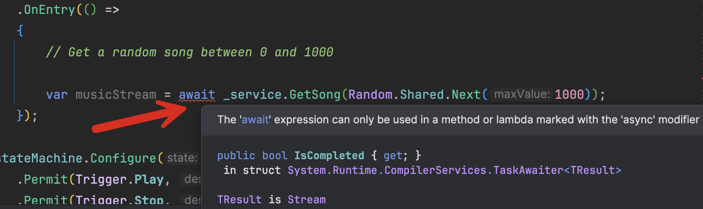
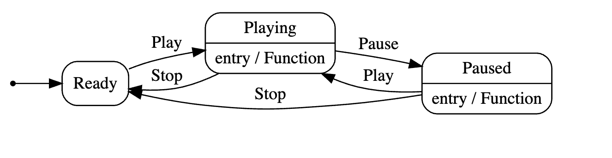

This is Part 9 of a series on using State Machines to express complex logic.

- [Using State Machines In .NET  - Part 1 - Introduction]()
- [Using State Machines In .NET  - Part 2 - Basic Usage]()
- [Using State Machines In .NET  - Part 3 - Setting Initial State]()
- [Using State Machines In .NET  - Part 4 - Using Multiple Triggers]()
- [Using State Machines In .NET - Part 5 - Using Complex & Nested States]()
- [Using State Machines In .NET - Part 6 - Firing Events On State Change]()
- [Using State Machines In .NET - Part 7 - Conditional State Transitions]()
- [Using State Machines In .NET - Part 8 - Firing Events Before State Change]()
- **Using State Machines In .NET - Part 9 - Calling Asynchronous Methods (This Post)**
- [Using State Machines In .NET - Part 10 - Generating State Diagrams]()
- [Using State Machines In .NET - Part 11 - Logic Based On How A State Was Transitioned]()

In our [last post in the series](), we looked at how to fire events **before** state change.

In this post, we will look at how to handle situations where our code is calling [asynchronous](https://learn.microsoft.com/en-us/dotnet/csharp/asynchronous-programming/async-scenarios) methods.

Let us take an example of a [jukebox](https://en.wikipedia.org/wiki/Jukebox).

It has two buttons. 

- **Play / Pause**
    1. Starts a song if one was not started
    2. Pauses a song if it was playing
- **Stop**
    1. Stops playing the current song, whether playing or paused.

We can model this as follows:

First, our statuses:

```c#
public enum Status
{
    Playing,
    Ready,
    Paused
}
```

Next, our triggers:

```c#
public enum Trigger
{
    Play,
    Pause,
    Stop
}
```

In the days of yore, a jukebox had its media contained within.

But our 2025 jukebox allows us to wire in a media service responsible for fetching random music, that it returns as a stream.

This is it's interface:

```c#
public interface IMediaService
{
    public Task<Stream> GetSong(int songNumber);
}
```

We then implement a dummy service like so:

```c#
public class MediaService : IMediaService
{
    public async Task<Stream> GetSong(int songNumber)
    {
        // Simulate latency
        await Task.Delay(TimeSpan.FromSeconds(5));
        // Return dummy stream of music
        return new MemoryStream([1, 2, 3, 4, 5, 6, 7, 8, 9, 10, 11, 12, 13, 14, 15]);
    }
}
```

We then need something to actually **play** the song.

This is it's contract:

```c#
public interface IMediaPlayer
{
    void Play(Stream song);
    void Pause();
}
```

And this is it's implementation:

```c#
public class MediaPlayer : IMediaPlayer
{
    public void Play(Stream song)
    {
        // Play the song 
        Log.Information("Playing the song");
    }

    public void Pause()
    {
        // Pause the song
        Log.Information("Pausing the song");
    }
}
```

Finally, our `Jukebox` class:

```c#
public sealed class Jukebox
{
    public Status CurrentStatus => _stateMachine.State;

    // State machine
    private readonly StateMachine<Status, Trigger> _stateMachine;

    public Jukebox(IMediaService service)
    {
        _stateMachine = new StateMachine<Status, Trigger>(Status.Ready);
        var mediaPlayer = new MediaPlayer();

        //
        // Configure state machine
        //
        _stateMachine.Configure(Status.Ready)
            .Permit(Trigger.Play, Status.Playing);

        _stateMachine.Configure(Status.Playing)
            .Permit(Trigger.Stop, Status.Ready)
            .Permit(Trigger.Pause, Status.Paused);

        _stateMachine.Configure(Status.Paused)
            .Permit(Trigger.Play, Status.Playing)
            .Permit(Trigger.Stop, Status.Ready);
    }

    public void Play()
    {
        _stateMachine.Fire(Trigger.Play);
    }

    public void Pause()
    {
        _stateMachine.Fire(Trigger.Pause);
    }

    public void Stop()
    {
        _stateMachine.Fire(Trigger.Stop);
    }
}
```

We then write some **tests** to make sure everything works correctly.

```c#
[Fact]
public void Jukebox_Initializes_To_Ready()
{
    var service = new MediaService();
    var jb = new Jukebox(service);
    jb.CurrentStatus.Should().Be(Status.Ready);
}

[Fact]
public void Jukebox_Transitions_To_Playing_After_Ready_When_Played()
{
    var service = new MediaService();
    var jb = new Jukebox(service);
    jb.Play();
    jb.CurrentStatus.Should().Be(Status.Playing);
}

[Fact]
public void Jukebox_Transitions_To_Paused_After_Playing_When_Paused()
{
    var service = new MediaService();
    var jb = new Jukebox(service);
    jb.Play();
    jb.Pause();
    jb.CurrentStatus.Should().Be(Status.Paused);
}

[Fact]
public void Jukebox_Transitions_To_Ready_After_Playing_When_Stopped()
{
    var service = new MediaService();
    var jb = new Jukebox(service);
    jb.Play();
    jb.Stop();
    jb.CurrentStatus.Should().Be(Status.Ready);
}

[Fact]
public void Jukebox_Transitions_To_Ready_After_Paused_When_Stopped()
{
    var service = new MediaService();
    var jb = new Jukebox(service);
    jb.Play();
    jb.Pause();
    jb.Stop();
    jb.CurrentStatus.Should().Be(Status.Ready);
}

[Fact]
public void Jukebox_Does_Not_Transition_When_Stopped_After_Initialization()
{
    var service = new MediaService();
    var jb = new Jukebox(service);
    var ex = Record.Exception(() => jb.Stop());
    ex.Should().BeOfType<InvalidOperationException>();
}
```

Now we are ready to wire in our logic.

When we transition to play, we retrieve a [stream](https://learn.microsoft.com/en-us/dotnet/api/system.io.stream?view=net-9.0) of our song from the media service. 

A good place to put this logic is the `OnEntry()` method.

```c#
_stateMachine.Configure(Status.Playing)
          .Permit(Trigger.Stop, Status.Ready)
          .Permit(Trigger.Pause, Status.Paused)
          .OnEntry(() =>
          {
              // Retrieve our music here
          });
```

Let us proceed to do just that:



The IDE is complaining that we are invoking an `async` method within a method that isn't.

We can force it by immediately retrieving the `Result`:

```c#
.OnEntry(() =>
{
    // Get a random song between 0 and 1000

    var musicStream = _service.GetSong(Random.Shared.Next(1000)).Result;
});
```

But forcing `sync` behaviour from `async` code is [not a good practice](https://devblogs.microsoft.com/dotnet/should-i-expose-synchronous-wrappers-for-asynchronous-methods/).

Luckily, `Stateless` has solved this problem in a very elegant way.

All the methods we have talked about in this series have **async counterparts**.

The solution is, therefore, to use the `OnEntryAsync()` method.

```c#
_stateMachine.Configure(Status.Playing)
  .Permit(Trigger.Stop, Status.Ready)
  .Permit(Trigger.Pause, Status.Paused)
  .OnEntryAsync(async () =>
  {
      // Get a random song between 0 and 1000
      var musicStream = await service.GetSong(Random.Shared.Next(1000));
  });
```

Unfortunately, we are not done yet.

Once you make **any** code in your system **asynchronous**, it **propagates all the way up the chain**.

We now have to use `FireAsync()` to trigger, rather than just `Fire()`.

We also have to make the **methods that call the trigger async too**.

Our jukebox now looks like this:

```c#
public sealed class Jukebox
{
    public Status CurrentStatus => _stateMachine.State;

    // State machine
    private readonly StateMachine<Status, Trigger> _stateMachine;

    public Jukebox(IMediaService service)
    {
        _stateMachine = new StateMachine<Status, Trigger>(Status.Ready);
        var mediaPlayer = new MediaPlayer();

        //
        // Configure state machine
        //
        _stateMachine.Configure(Status.Ready)
            .Permit(Trigger.Play, Status.Playing)
            .Permit(Trigger.Pause, Status.Paused);

        _stateMachine.Configure(Status.Playing)
            .Permit(Trigger.Stop, Status.Ready)
            .Permit(Trigger.Pause, Status.Paused)
            .OnEntryAsync(async () =>
            {
                // Get a random song between 0 and 1000
                var musicStream = await service.GetSong(Random.Shared.Next(1000));
                // Play the music
                mediaPlayer.Play(musicStream);
            });

        _stateMachine.Configure(Status.Paused)
            .Permit(Trigger.Play, Status.Playing)
            .Permit(Trigger.Stop, Status.Ready)
            .OnEntry(() =>
            {
                // Pause the music
                mediaPlayer.Pause();
            });
    }

    public async Task Play()
    {
        await _stateMachine.FireAsync(Trigger.Play);
    }

    public void Pause()
    {
        _stateMachine.Fire(Trigger.Pause);
    }

    public void Stop()
    {
        _stateMachine.Fire(Trigger.Stop);
    }
}
```

The final state diagram for the Jukebox is as follows:



### TLDR

**`Stateless` has async methods that can be used when your state transitions require *async* logic.**

The code is in my [GitHub](https://github.com/conradakunga/BlogCode/tree/master/2025-05-05%20-%20State%20Machines%20Part%209).

Happy hacking!
