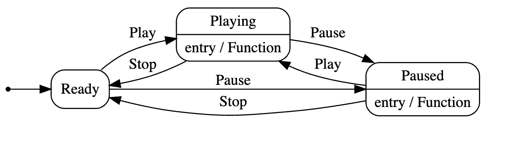
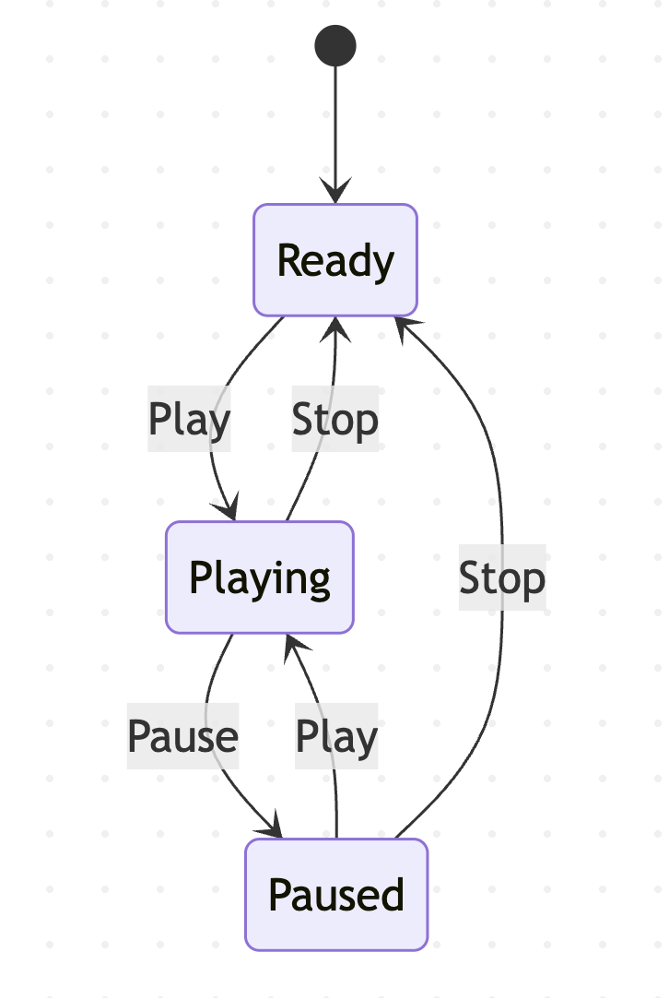

This is Part 10 of a series on using State Machines to express complex logic.

- [Using State Machines In .NET  - Part 1 - Introduction]()
- [Using State Machines In .NET  - Part 2 - Basic Usage]()
- [Using State Machines In .NET  - Part 3 - Setting Initial State]()
- [Using State Machines In .NET  - Part 4 - Using Multiple Triggers]()
- [Using State Machines In .NET - Part 5 - Using Complex & Nested States]()
- [Using State Machines In .NET - Part 6 - Firing Events On State Change]()
- [Using State Machines In .NET - Part 7 - Conditional State Transitions]()
- [Using State Machines In .NET - Part 8 - Firing Events Before State Change]()
- [Using State Machines In .NET - Part 9 - Calling Asynchronous Methods]()
- **Using State Machines In .NET - Part 10 - Generating State Diagrams (This Post)**

In our [last post in the series](), we looked at how to call **asynchronous methods** when transitioning between states.

This post will look at how to **visualize state machines** using state diagrams.

The type we will use is our `Jukebox`.

```c#
public sealed class Jukebox
{
    public Status CurrentStatus => _stateMachine.State;

    // State machine
    private readonly StateMachine<Status, Trigger> _stateMachine;

    public Jukebox(IMediaService service)
    {
        _stateMachine = new StateMachine<Status, Trigger>(Status.Ready);
        var mediaPlayer = new MediaPlayer();

        //
        // Configure state machine
        //
        _stateMachine.Configure(Status.Ready)
            .Permit(Trigger.Play, Status.Playing)
            .Permit(Trigger.Pause, Status.Paused);

        _stateMachine.Configure(Status.Playing)
            .Permit(Trigger.Stop, Status.Ready)
            .Permit(Trigger.Pause, Status.Paused)
            .OnEntryAsync(async () =>
            {
                // Get a random song between 0 and 1000
                var musicStream = await service.GetSong(Random.Shared.Next(1000));
                // Play the music
                mediaPlayer.Play(musicStream);
            });

        _stateMachine.Configure(Status.Paused)
            .Permit(Trigger.Play, Status.Playing)
            .Permit(Trigger.Stop, Status.Ready)
            .OnEntry(() =>
            {
                // Pause the music
                mediaPlayer.Pause();
            });
    }

    public async Task Play()
    {
        await _stateMachine.FireAsync(Trigger.Play);
    }

    public void Pause()
    {
        _stateMachine.Fire(Trigger.Pause);
    }

    public void Stop()
    {
        _stateMachine.Fire(Trigger.Stop);
    }
}
```

The state machine can output its representation in various formats:

1. [DOTGraph](https://graphviz.org/doc/info/lang.html)
2. [Mermaid](https://mermaid.js.org/intro/)

To get the `DOTGraph` implementation, we add a property to the `Jukebox` as follows:

```c#
 public string ToDotGraph => UmlDotGraph.Format(_stateMachine.GetInfo());
```

If we get the value of this property, we get the following output:

```plaintext
digraph {
compound=true;
node [shape=Mrecord]
rankdir="LR"
"Ready" [label="Ready"];
"Playing" [label="Playing|entry / Function"];
"Paused" [label="Paused|entry / Function"];

"Ready" -> "Playing" [style="solid", label="Play"];
"Ready" -> "Paused" [style="solid", label="Pause"];
"Playing" -> "Ready" [style="solid", label="Stop"];
"Playing" -> "Paused" [style="solid", label="Pause"];
"Paused" -> "Playing" [style="solid", label="Play"];
"Paused" -> "Ready" [style="solid", label="Stop"];
 init [label="", shape=point];
 init -> "Ready"[style = "solid"]
}
```

This can be visualized using a tool like [WebGraphviz](http://www.webgraphviz.com/)



To get the `Mermaid` implementation, we add the following property to the `Jukebox`:

```c#
 public string ToMermaid => MermaidGraph.Format(_stateMachine.GetInfo());
```

If we get the value of this property, we get the following output:

```plaintext
stateDiagram-v2
	Ready --> Playing : Play
	Ready --> Paused : Pause
	Playing --> Ready : Stop
	Playing --> Paused : Pause
	Paused --> Playing : Play
	Paused --> Ready : Stop
[*] --> Ready

```

This can be visualized using a tool like [Mermaid Live](https://mermaid.live/)



`Mermaid` is also natively supported by tools like [GitHub](https://github.com).

Thus, we can always get a visual representation of our state machine to ensure that it is configured correctly.

### TLDR

**The `Stateless` library can output the state transition diagrams in `Mermaid` or `DOTGraph` format.**

The code is in my GitHub.

Happy hacking!

