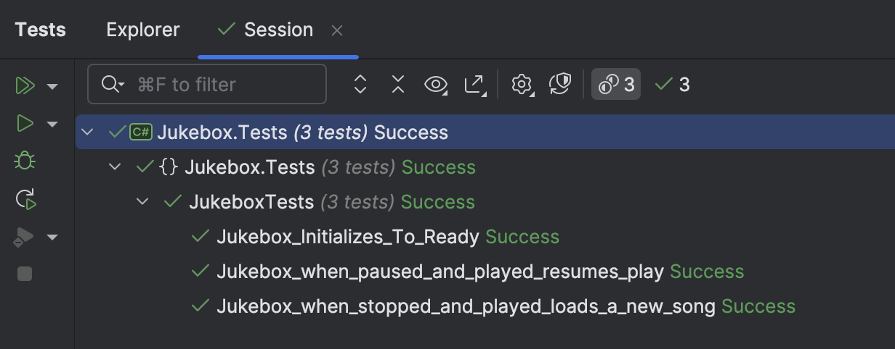

This is Part 11 of a series on using State Machines to express complex logic.

- [Using State Machines In .NET  - Part 1 - Introduction]()
- [Using State Machines In .NET  - Part 2 - Basic Usage]()
- [Using State Machines In .NET  - Part 3 - Setting Initial State]()
- [Using State Machines In .NET  - Part 4 - Using Multiple Triggers]()
- [Using State Machines In .NET - Part 5 - Using Complex & Nested States]()
- [Using State Machines In .NET - Part 6 - Firing Events On State Change]()
- [Using State Machines In .NET - Part 7 - Conditional State Transitions]()
- [Using State Machines In .NET - Part 8 - Firing Events Before State Change]()
- [Using State Machines In .NET - Part 9 - Calling Asynchronous Methods]()
- [Using State Machines In .NET - Part 10 - Generating State Diagrams]()
- **Using State Machines In .NET - Part 11 - Logic Based On How A State Was Transitioned (This Post)**
- [Using State Machines In .NET - Part 12 - State Activation & Entry]()

Several posts in this series looked at how to **invoke logic when a state changes**.

[This post]() in particular, while technically correct, actually had a bug:

```c#
_stateMachine.Configure(Status.Playing)
  .Permit(Trigger.Stop, Status.Ready)
  .Permit(Trigger.Pause, Status.Paused)
  .OnEntryAsync(async () =>
  {
      // Get a random song between 0 and 1000
      var musicStream = await service.GetSong(Random.Shared.Next(1000));
      // Play the music
      mediaPlayer.Play(musicStream);
  });
```

Can you spot the problem?

The issue is that when the status is stopped, and somebody presses the play button, the music service is invoked to retrieve a song, which is then played.

**The same thing will happen if the status is paused and somebody presses play**.

This is not what we want because **it matters which state we transitioned from**. Or, put another way, **it matters which trigger was fired** to transition the state.

To fix this, we can make the following changes:

First, we add a new state to **resume** play after **pausing**.

```c#
public enum Trigger
{
    Play,
    Pause,
    Resume,
    Stop
}
```

Next, we improve our `MediaPlayer` contract and implementation.

```c#
public interface IMediaPlayer
{
    void Play(Stream song);
    void Pause();
    void Resume();
}

public class MediaPlayer : IMediaPlayer
{
    public void Play(Stream song)
    {
        // Play the song 
        Log.Information("Playing the song");
    }

    public void Pause()
    {
        // Pause the song
        Log.Information("Pausing the song");
    }

    public void Resume()
    {
        // Resuming the song play
        Log.Information("Resuming play");
    }
}
```

We then update our `statemachine` to use the new trigger and write code for the `OnEntryFromAsync()` and `OnEntryFrom()` events.

```c#
public Jukebox(IMediaService service)
{
_stateMachine = new StateMachine<Status, Trigger>(Status.Ready);
var mediaPlayer = new MediaPlayer();

//
// Configure state machine
//
_stateMachine.Configure(Status.Ready)
    .Permit(Trigger.Play, Status.Playing);

_stateMachine.Configure(Status.Playing)
    .Permit(Trigger.Stop, Status.Ready)
    .Permit(Trigger.Pause, Status.Paused)
    .OnEntryFromAsync(Trigger.Play, async () =>
    {
        // We are transitioning from stopped.
        // Get a new song and play it

        // Get a random song between 0 and 1000
        var musicStream = await service.GetSong(Random.Shared.Next(1000));
        // Play the music
        mediaPlayer.Play(musicStream);
    }).OnEntryFrom(Trigger.Resume, () =>
    {
        // We are transitioning from pause.

        //Resume the player
        mediaPlayer.Resume();
    });

_stateMachine.Configure(Status.Paused)
    .Permit(Trigger.Resume, Status.Playing)
    .Permit(Trigger.Stop, Status.Ready)
    .OnEntry(() =>
    {
        // Pause the music
        mediaPlayer.Pause();
    });
}
```

Finally, some tests to make sure it functions as we expect.

```c#
[Fact]
public async Task Jukebox_when_stopped_and_played_loads_a_new_song()
{
    var service = new MediaService();
    var jb = new Jukebox(service);
    await jb.Play();
    _output.Output.Should().EndWith("Playing the song\n");
    jb.CurrentStatus.Should().Be(Status.Playing);
}
[Fact]
public async Task Jukebox_when_paused_and_played_resumes_play()
{
    var service = new MediaService();
    var jb = new Jukebox(service);
    await jb.Play();
    jb.Pause();
    jb.CurrentStatus.Should().Be(Status.Paused);
    jb.Resume();
    _output.Output.Should().EndWith("Resuming play\n");
    jb.CurrentStatus.Should().Be(Status.Playing);
}
```

The tests run successfully.



Thus, we can control **HOW** the state **transitioned into** and have logic appropriate for each.

### TLDR

**`Stateless` offers the `OnEntryFromAsync` and `OnEntryFrom` to have code conditional on which trigger transitioned the state.**

The code is in my [GitHub](https://github.com/conradakunga/BlogCode/tree/master/2025-04-07%20-%20State%20Machines%20Part%2011).

Happy hacking!
