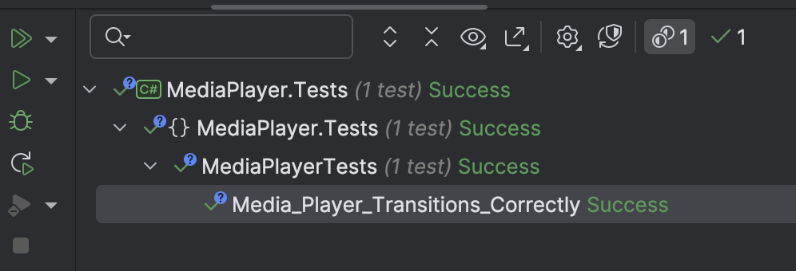

This is Part 12 of a series on using State Machines to express complex logic.

- [Using State Machines In .NET  - Part 1 - Introduction]()
- [Using State Machines In .NET  - Part 2 - Basic Usage]()
- [Using State Machines In .NET  - Part 3 - Setting Initial State]()
- [Using State Machines In .NET  - Part 4 - Using Multiple Triggers]()
- [Using State Machines In .NET - Part 5 - Using Complex & Nested States]()
- [Using State Machines In .NET - Part 6 - Firing Events On State Change]()
- [Using State Machines In .NET - Part 7 - Conditional State Transitions]()
- [Using State Machines In .NET - Part 8 - Firing Events Before State Change]()
- [Using State Machines In .NET - Part 9 - Calling Asynchronous Methods]()
- [Using State Machines In .NET - Part 10 - Generating State Diagrams]()
- [Using State Machines In .NET - Part 11 - Logic Based On How A State Was Transitioned]()
- **Using State Machines In .NET - Part 12 - State Activation & Entry (This Post)**

In our last post, we looked at how to have conditional logic based on **how** a state was transitioned into, using the context of the invoked `Trigger`.

In this post, we shall look at the nuances between a state **entry** and a state **activation**.

For this example, we will use a MediaPlayer that has the following interface defining it's contract:

```c#
public interface IMediaPlayer
{
    Task Startup();
    Task ShutDown();
    Task Play();
    Task Stop();
    Task Pause();
    Task Resume();
}
```

The following are the allowed `States`:

```c#
public enum State
{
    Initializing,
    Ready,
    Playing,
    Paused
}
```

The following are the defined `Triggers`:

```c#
public enum Trigger
{
    Play,
    Stop,
    Pause,
    Resume,
    Initialize
}
```

Here is the problem:

1. When we **shut down** the media player, we need to **save its state**.
2. When transitioning to the `Ready` state when **powering on**, we need to **load the state from storage**. And this should **only** happen when powering on.
3. When **stopping**/**pausing** and **resuming**, the loading from the state should **not** be carried out.

In other words, we want our code to behave in a particular way **when transitioning to ready after powering on and only when powering on**.

Remember that the code for `OnEntry()` always fires when the transition occurs, which will not solve this problem.

We can introduce a different `Trigger`, but that is overly complex.

The solution to this problem is to use the `Activate()` method of the state machine.

When this method is called, a method called `OnActivate` (or its async equivalent `OnActivateAsyc`()) fires.

We can use this to have code run **only** when the `MediaPlayer` transitions to the `Ready` state after powering on.

The class looks like this:

```c#
using Serilog;
using Stateless;
using Stateless.Graph;

namespace MediaPlayer;

public class MediaPlayer : IMediaPlayer
{
    private int _position = 0;
    private readonly StateMachine<State, Trigger> _stateMachine;
    public State CurrentState => _stateMachine.State;

    public MediaPlayer()
    {
        _stateMachine = new StateMachine<State, Trigger>(State.Initializing);

        _stateMachine.Configure(State.Initializing)
            .Permit(Trigger.Initialize, State.Ready);

        _stateMachine.Configure(State.Ready)
            .Permit(Trigger.Play, State.Playing)
            .OnEntryAsync(async () =>
            {
                // This awways fires on transition
                await Task.Delay(TimeSpan.FromSeconds(1));
                Log.Information("Ready...");
            })
            .OnActivateAsync(async () =>
            {
                // This only fires when invoked from Startup
                await Task.Delay(TimeSpan.FromSeconds(1));
                Log.Information("Loading media & position...");
            });

        _stateMachine.Configure(State.Playing)
            .Permit(Trigger.Pause, State.Paused)
            .Permit(Trigger.Stop, State.Ready)
            .OnEntry(() =>
            {
                // Play media
                Log.Information("Playing..");
                _position++;
            });

        _stateMachine.Configure(State.Paused)
            .Permit(Trigger.Resume, State.Playing)
            .Permit(Trigger.Stop, State.Ready)
            .OnEntry(() =>
            {
                // Pause
                Log.Information("Pause...");
            });
    }

    public async Task Startup()
    {
        await _stateMachine.FireAsync(Trigger.Initialize);
        await _stateMachine.ActivateAsync();
    }

    public async Task ShutDown()
    {
        await Task.Delay(TimeSpan.FromSeconds(1));
        Log.Information("Saving position {Position} to storage ...", _position);
    }

    public async Task Play()
    {
        await _stateMachine.FireAsync(Trigger.Play);
    }

    public async Task Stop()
    {
        await _stateMachine.FireAsync(Trigger.Stop);
    }

    public async Task Pause()
    {
        await _stateMachine.FireAsync(Trigger.Pause);
    }

    public async Task Resume()
    {
        await _stateMachine.FireAsync(Trigger.Resume);
    }
}
```

Finally a test to make sure everything runs correctly:

```c#
[Fact]
public async Task Media_Player_Transitions_Correctly()
{
    var mediaPlayer = new MediaPlayer();
    mediaPlayer.CurrentState.Should().Be(State.Initializing);
    await mediaPlayer.Startup();
    _output.Output.Should().EndWith("Loading media & position...\n");
    mediaPlayer.CurrentState.Should().Be(State.Ready);
    await mediaPlayer.Play();
    mediaPlayer.CurrentState.Should().Be(State.Playing);
    await mediaPlayer.Pause();
    mediaPlayer.CurrentState.Should().Be(State.Paused);
    await mediaPlayer.Resume();
    mediaPlayer.CurrentState.Should().Be(State.Playing);
    await mediaPlayer.Stop();
    mediaPlayer.CurrentState.Should().Be(State.Ready);
    _output.Output.Should().EndWith("Ready...\n");
}
```

The tests pass, as expected.



**Activation** is very useful for scenarios like this, where the state can be **persisted** and **loaded** later, and you want the logic around loading the state to be **separate** from the actual logic.

### TLDR

**The `OnActivate()` and `OnActivateAsync()` can be used to control logic on state transition when invoked by calling the Activate() method of the state machine.**

The code is in my [GitHub](https://github.com/conradakunga/BlogCode/tree/master/2025-05-09%20-%20State%20Machines%20Part%2012).

Happy hacking!
