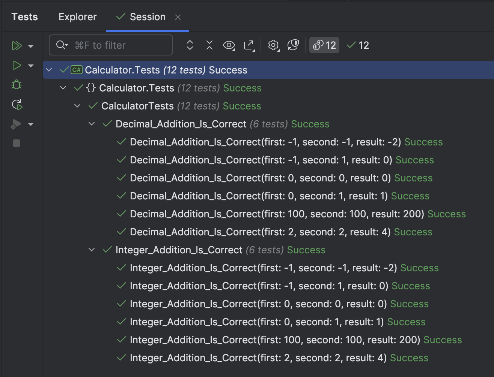
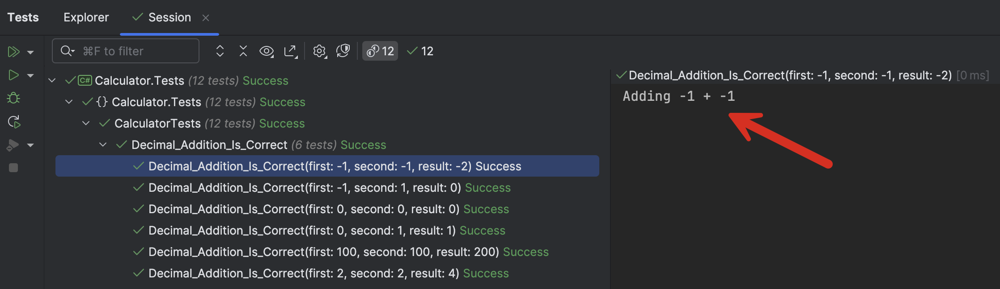

This is Part 1 of a series on using Serilog & structured logging In testing

- **Using Serilog & Structured Logging In Testing - Part 1 - Introduction (This Post)**

[Testing](https://en.wikipedia.org/wiki/Software_testing) is a **vital** part of software development, and the complexity of this grows as the software gets more **complicated** and the **number of team members** working on the software grows.

This introduces some nuanced **problems** that this series of posts will attempt to address.

Let us take a simple `Calculator` class.

The following is the contract, implemented as an interface.

```c#
public interface ICalculator<T> where T : INumber<T>
{
    T Add(T a, T b);
    T Subtract(T a, T b);
    T Multiply(T a, T b);
    T Divide(T a, T b);
}
```

We are using the [INumber](https://learn.microsoft.com/en-us/dotnet/api/system.numerics.inumber-1?view=net-9.0) interface so our class works with any **numeric type**.

The following is the implementation:

```c#
public class Calculator<T> : ICalculator<T> where T : INumber<T>
{
    public T Add(T a, T b)
    {
        return a + b;
    }

    public T Subtract(T a, T b)
    {
        return a - b;
    }

    public T Multiply(T a, T b)
    {
        return a * b;
    }

    public T Divide(T a, T b)
    {
        return a / b;
    }
}
```

Finally, we add some **tests**.

I am, as usual, using [xUnit](https://xunit.net/) as the testing framework with ~~FluentAssertions~~ [AwesomeAssertions](https://awesomeassertions.org/).

To make it easier to share test data, we will use the [ClassData](https://andrewlock.net/creating-parameterised-tests-in-xunit-with-inlinedata-classdata-and-memberdata/) attribute for testing and create a class responsible for **providing** addition **data**. To keep this example **simple**, I will only write tests for addition of `integers` and `decimals`.

The test class, `AdditionTestData`, looks like this:

```c#
public class AdditionTestData : IEnumerable<object[]>
{
    public IEnumerator<object[]> GetEnumerator()
    {
        yield return new object[] { 0, 0, 0 };
        yield return new object[] { 0, 1, 1 };
        yield return new object[] { 2, 2, 4 };
        yield return new object[] { -1, -1, -2 };
        yield return new object[] { -1, 1, 0 };
        yield return new object[] { 100, 100, 200 };
    }

    IEnumerator IEnumerable.GetEnumerator() => GetEnumerator();
}
```

The tests themselves look like this:

```c#
[Theory]
[ClassData(typeof(AdditionTestData))]
public void Integer_Addition_Is_Correct(int first, int second, int result)
{
    var calc = new Calculator<int>();
    calc.Add(first, second).Should().Be(result);
}

[Theory]
[ClassData(typeof(AdditionTestData))]
public void Decimal_Addition_Is_Correct(decimal first, decimal second, decimal result)
{
    var calc = new Calculator<decimal>();
    calc.Add(first, second).Should().Be(result);
}
```

The tests should pass successfully.



Now, suppose within the context of a test, we want to log to the console what the calculator is doing.

We can update the tests as follows, to add writing to the console:

```c#
public class CalculatorTests
{
    [Theory]
    [ClassData(typeof(AdditionTestData))]
    public void Integer_Addition_Is_Correct(int first, int second, int result)
    {
        var calc = new Calculator<int>();
        Console.WriteLine($"Adding {first} + {second}");
        calc.Add(first, second).Should().Be(result);
    }

    [Theory]
    [ClassData(typeof(AdditionTestData))]
    public void Decimal_Addition_Is_Correct(decimal first, decimal second, decimal result)
    {
        var calc = new Calculator<decimal>();
        Console.WriteLine($"Adding {first} + {second}");
        calc.Add(first, second).Should().Be(result);
    }
}
```

If you run the tests you will see ... **nothing**. Writing to the console does not output anything, because there **isn't, technically, a console**.

To output to the test runner console, we do the following:

1. Inject via the constructor a `ITestOutputHelper`
2. Set this to a private **field** in the form
3. Use this field to write to the test output.

```c#
public class CalculatorTests
{
    private readonly ITestOutputHelper _testOutputHelper;

    public CalculatorTests(ITestOutputHelper testOutputHelper)
    {
        _testOutputHelper = testOutputHelper;
    }

    [Theory]
    [ClassData(typeof(AdditionTestData))]
    public void Integer_Addition_Is_Correct(int first, int second, int result)
    {
        var calc = new Calculator<int>();
        _testOutputHelper.WriteLine($"Adding {first} + {second}");
        calc.Add(first, second).Should().Be(result);
    }

    [Theory]
    [ClassData(typeof(AdditionTestData))]
    public void Decimal_Addition_Is_Correct(decimal first, decimal second, decimal result)
    {
        var calc = new Calculator<decimal>();
        _testOutputHelper.WriteLine($"Adding {first} + {second}");
        calc.Add(first, second).Should().Be(result);
    }
}
```

In the code the `_testOutputHelper` is what we use to access the test runners output.

Now, if we click on any test we can see its logged output.



This is well and good if you are running the tests **locally** and you happen to be **seated looking at the test runner**.

What if you have **no access to the test runner** but want to access your custom output? Or you want to see output from **previously ran tests**?

We will look at that in our next post.

### TLDR

**Testing can quickly get complicated, and one of the first steps in managing this is custom outputting to the test runner.**

The code is in my GitHub.

Happy hacking! 
