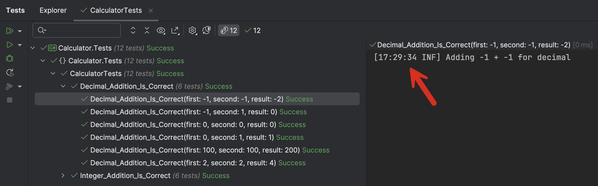

This is Part 2 of a series on using Serilog & structured logging in testing

- [Using Serilog & Structured Logging In Testing - Part 1 - Introduction]()
- **Using Serilog & Structured Logging In Testing - Part 2 - Configuring Logging Destinations (This post)**
- [Using Serilog & Structured Logging In Testing - Part 3 - Testing Log Messages]()

Our [last post]() looked at how to control logging to the test runner.

In this post, we will look at how to output logs to various destinations.

In our last post, we concluded with the challenge that writing to the `ITestOutputHelper` has one **drawback** - you need to have access to the test runner to view the logs.

This is not always possible—perhaps you are not the one running the tests, or the tests are being run on a build server. In this case, we will need to set up a log destination to store our logs.

For this scenario, my recommendation is as follows:

1. If you are developing and testing **locally**, i.e., on a single machine, use [Seq](https://datalust.co/seq)
2. If you are part of a team or want the logs to be accessed **remotely**, use [ElasticSearch](https://www.elastic.co/elasticsearch) and [Kibana](https://www.elastic.co/kibana)

For this example, I will use `Seq`.

`Seq` is **simpler** to set up, run, and use. However, the **free** version of `Serilog` can only log to **localhost** and can only be accessed from the **localhost** URL.

For infrastructure such as this, I typically use [Docker](https://www.docker.com/), though you can [install it directly](https://datalust.co/download) if you want to.

Create the following `docker-compose.yaml` file:

```yaml
services:
  seq:
    image: datalust/seq:preview
    container_name: seq
    restart: unless-stopped
    environment:
      - ACCEPT_EULA=Y
      - TZ=Africa/Nairobi
    ports:
      - 81:80
      - 5341:5341
```

A couple of things to note:

1. I am using the **preview** version. If you want the latest version, use `datalust/seq`. 
2. I have set the **timezone to where I am** to make it easier to correlate the log timestamps with my current locale. Get into the habit of doing this for your docker containers. You can pick yours from [here](https://en.wikipedia.org/wiki/List_of_tz_database_time_zones) (the TZ identifier column)
3. I have mapped the admin interface to port `81` from the default `80` but left the logging interface to `5431`

From the folder `docker-compose.yaml` file is in, run the following command:

```bash
docker-compose up -d --build
```

We have discussed the [shortcut to quickly upgrade containers]() in a previous post.

You should be able to access `Seq` from the URL [http://localhost:81/](http://localhost:81/)


The next thing to do is to add some packages to our test project.

1. [Serilog.Sinks.Xunit](https://www.nuget.org/packages/Serilog.Sinks.XUnit) - For interfacing with `Serilog` for structured logging
2. [Serilog.Sinks.Seq](https://www.nuget.org/packages/Serilog.Sinks.Seq) - For interfacing with `Seq`
3. [SerilogAnalyzers](https://www.nuget.org/packages/SerilogAnalyzer) - for design time help to fix common bad logging practices.

Then, in our tests, we write a constructor like this:

```c#
public CalculatorTests(ITestOutputHelper testOutputHelper)
{
    Log.Logger = new LoggerConfiguration()
      // Wire in the test output helper
      .WriteTo.TestOutput(testOutputHelper)
      // Wire in seq
      .WriteTo.Seq("http://localhost:5341")
      .CreateLogger();
}
```

Finally, we add proper logging to the tests.

```c#
[Theory]
[ClassData(typeof(AdditionTestData))]
public void Integer_Addition_Is_Correct(int first, int second, int result)
{
  var calc = new Calculator<int>();
  Log.Information("Adding {First} + {Second} for integer", first, second);
  calc.Add(first, second).Should().Be(result);
}

[Theory]
[ClassData(typeof(AdditionTestData))]
public void Decimal_Addition_Is_Correct(decimal first, decimal second, decimal result)
{
  var calc = new Calculator<decimal>();
  Log.Information("Adding {First} + {Second} for decimal", first, second);
  calc.Add(first, second).Should().Be(result);
}
```

If we run the tests, we will see the following in the test runner console:



In addition to our log message, we also get a time stamp.

If we switch to `Seq` we will see the following:


We can expand one entry by clicking to see the passed values:


To make this more useful, we can add additional properties to the logs

1. The machine name
2. The logged-on user
3. Some custom property

We can achieve this using [Serilog Enrichers](https://github.com/serilog/serilog/wiki/Enrichment).

The [Nuget](https://learn.microsoft.com/en-us/nuget/) package with the enrichers for machine name, logged-on user, and other environment variables is [Serilog.Enrichers.Environment](https://www.nuget.org/packages/Serilog.Enrichers.Environment)

Once installed we update our constructor as follows:

```c#
public CalculatorTests(ITestOutputHelper testOutputHelper)
{
Log.Logger = new LoggerConfiguration()
    // Add the machine name to the logged properties
    .Enrich.WithMachineName()
    // Add the logged-in username to the logged properties
    .Enrich.WithEnvironmentUserName()
    // Add a custom property
    .Enrich.WithProperty("Codename", "Bond")
    // Wire in the test output helper
    .WriteTo.TestOutput(testOutputHelper)
    // Wire in seq
    .WriteTo.Seq("http://localhost:5341")
    .CreateLogger();
}
```

Once we re-run our tests, an expanded entry looks like this:


The value of these properties is that they can be used to **sort**, **search**, and **filter**.


In this fashion, we can not only store our logs in custom destinations, but we can also **enrich** them with additional properties.

To log into `ElasticSearch`, you only need to do the following:

1. Install the sink for `ElasticSearch` - [Elastic.Serilog.Sinks](https://www.nuget.org/packages/Elastic.Serilog.Sinks)
2. Update the code to write to `ElasticSearch`

The code will be as follows:


```c#
public CalculatorTests(ITestOutputHelper testOutputHelper)
{
    Log.Logger = new LoggerConfiguration()
        // Add the machine name to the logged properties
        .Enrich.WithMachineName()
        // Add the logged-in username to the logged properties
        .Enrich.WithEnvironmentUserName()
        // Add a custom property
        .Enrich.WithProperty("Codename", "Bond")
        // Wire in the test output helper
        .WriteTo.TestOutput(testOutputHelper)
        // Wire in seq
        .WriteTo.Seq("http://localhost:5341")
        // Wire in ElasticSearch
        .WriteTo.Elasticsearch([new Uri("http://localhost:9200")], opts =>
        {
            opts.DataStream = new DataStreamName("logs", "Innova", applicationName.Replace(" ", ""));
            opts.BootstrapMethod = BootstrapMethod.Silent;
            opts.ConfigureChannel = channelOpts => { channelOpts.BufferOptions = new BufferOptions(); };
        }, transport =>
        {
            // transport.Authentication(new BasicAuthentication(username, password)); // Basic Auth
            // transport.Authentication(new ApiKey(base64EncodedApiKey)); // ApiKey
        })
        .CreateLogger();
}
```

In our next post, we will examine how to [test log messages]().

### TLDR

**We can leverage the power of structured logging to store enriched logs from test runs in central storage like `Seq` or `ElasticSearch`.**

The code is in my [GitHub](https://github.com/conradakunga/BlogCode/tree/master/2025-05-13%20-%20Structured%20Logging%20%26%20Testing%20Part%202).

Happy hacking!
