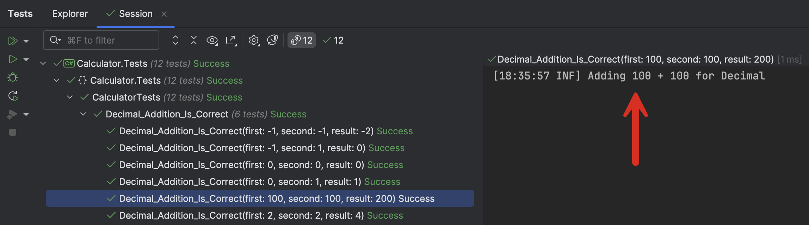
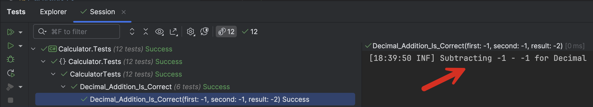
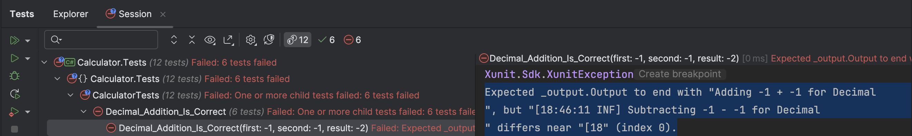
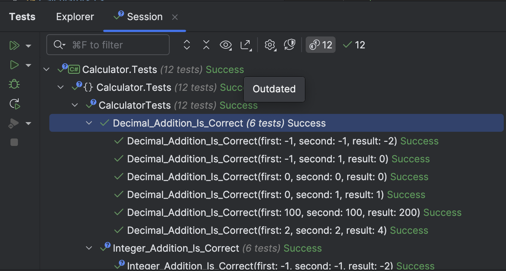

This is Part 3 of a series on using Serilog & structured logging in testing

- [Using Serilog & Structured Logging In Testing - Part 1 - Introduction]()
- [Using Serilog & Structured Logging In Testing - Part 2 - Configuring Logging Destinations]()
- **Using Serilog & Structured Logging In Testing - Part 3 - Testing Log Messages (This post)**

In our last post, we looked at how to log into `Seq` and `Elastic` search from our tests.

In this post, we will look at how to **test our logging.**

At this point, you might ask - **why should we test our logging**?

There are a number of reasons:

1. To **confirm** that you are logging at all
2. That you are logging **what you think you are logging**
3. You are logging **where you think you are logging**.

Suppose we want to improve our `Calculator` by adding **logging** support. We want it to be able to **log data as it is in use**, with the consuming application deciding whether or not to display those log messages.

This is generally a good habit to make it **easier to troubleshoot**, whether during development or in production.

The first step is to add logging support using the [Serilog](https://www.nuget.org/packages/Serilog/4.2.0) package. Note that we are adding the logging support itself, not the **sinks**, which should be added by the **consuming application**.

Once we have added the package, we update our library code to bake in the logging there.

```c#
public class Calculator<T> : ICalculator<T> where T : INumber<T>
{
    public T Add(T a, T b)
    {
        Log.Information("Adding {First} + {Second} for {Type}", a, b, typeof(T).Name);
        return a + b;
    }

    public T Subtract(T a, T b)
    {
        Log.Information("Subtracting {First} - {Second} for {Type}", a, b, typeof(T).Name);
        return a - b;
    }

    public T Multiply(T a, T b)
    {
        Log.Information("Multiplying {First} * {Second} for {Type}", a, b, typeof(T).Name);
        return a * b;
    }

    public T Divide(T a, T b)
    {
        Log.Information("Dividing {First} / {Second} for {Type}", a, b, typeof(T).Name);
        return a / b;
    }
}
```

Given that our **library itself** is logging its operations, we can update our tests to **remove** that logging.

They now will look like this:

```c#
public class CalculatorTests
{
    public CalculatorTests(ITestOutputHelper testOutputHelper)
    {
        Log.Logger = new LoggerConfiguration()
            // Add the machine name to the logged properties
            .Enrich.WithMachineName()
            // Add the logged-in username to the logged properties
            .Enrich.WithEnvironmentUserName()
            // Add a custom property
            .Enrich.WithProperty("Codename", "Bond")
            // Wire in the test output helper
            .WriteTo.TestOutput(testOutputHelper)
            // Wire in seq
            .WriteTo.Seq("http://localhost:5341")
            .CreateLogger();
    }

    [Theory]
    [ClassData(typeof(AdditionTestData))]
    public void Integer_Addition_Is_Correct(int first, int second, int result)
    {
        var calc = new Calculator<int>();
        calc.Add(first, second).Should().Be(result);
    }

    [Theory]
    [ClassData(typeof(AdditionTestData))]
    public void Decimal_Addition_Is_Correct(decimal first, decimal second, decimal result)
    {
        var calc = new Calculator<decimal>();
        calc.Add(first, second).Should().Be(result);
    }
}
```

We should still see the log messages in the test runner console if we run our tests.



Suppose a team member **transposes the log messages for addition and subtraction** by mistake or malice.

```c#
public T Add(T a, T b)
{
    Log.Information("Subtracting {First} - {Second} for {Type}", a, b, typeof(T).Name);
    return a + b;
}

public T Subtract(T a, T b)
{
    Log.Information("Adding {First} + {Second} for {Type}", a, b, typeof(T).Name);
    return a - b;
}
```

Our tests will still run, but the log messages will be deceptive.



This is why we need to test our logging.

The first step is to cast our injected `ITestOutputHelper` to it's concrete type, so that we can access its `Output` property

```c#
private readonly TestOutputHelper _output;

public CalculatorTests(ITestOutputHelper testOutputHelper)
{
    // Cast the injected testOutputHelper to a concrete type
    _output = (TestOutputHelper)testOutputHelper;
    Log.Logger = new LoggerConfiguration()
        // Add the machine name to the logged properties
        .Enrich.WithMachineName()
        // Add the logged-in username to the logged properties
        .Enrich.WithEnvironmentUserName()
        // Add a custom property
        .Enrich.WithProperty("Codename", "Bond")
        // Wire in the test output helper
        .WriteTo.TestOutput(testOutputHelper)
        // Wire in seq
        .WriteTo.Seq("http://localhost:5341")
        .CreateLogger();
}
```

Next we add tests to verify that the latest message in the log matches what we expect.

```c#
[Theory]
[ClassData(typeof(AdditionTestData))]
public void Integer_Addition_Is_Correct(int first, int second, int result)
{
    var calc = new Calculator<int>();
    calc.Add(first, second).Should().Be(result);
    // Validate the logged message
    _output.Output.Should().EndWith($"Adding {first} + {second} for Int32\n");
}

[Theory]
[ClassData(typeof(AdditionTestData))]
public void Decimal_Addition_Is_Correct(decimal first, decimal second, decimal result)
{
    var calc = new Calculator<decimal>();
    calc.Add(first, second).Should().Be(result);
    _output.Output.Should().EndWith($"Adding {first} + {second} for Decimal\n");
}
```

If we run our tests, they now fail, 



The message tells us the problem:

```text
Expected _output.Output to end with "Adding -1 + -1 for Decimal
", but "[18:46:11 INF] Subtracting -1 - -1 for Decimal
" differs near "[18" (index 0).
```

Why are we using [EndsWith](https://learn.microsoft.com/en-us/dotnet/api/system.string.endswith?view=net-9.0) in our assertion? Because `Serilog` injects the **timestamp** into the log message, which can be anything.

The actual log message is as follows:

```plaintext
[18:46:11 INF] Subtracting -1 - -1 for Decimal
```

If we correct our code:



If we **deleted the logging** in our library code , the tests would **fail** as well.

If we wanted to **update the logged message**, perhaps to make it richer, our tests would **fail**, **forcing us to update our tests** as well.

In this fashion we can test our **logging** as well as our **business logic**.

In this sample, we have used the `Information` level to log. This is not a good practice if you are logging from the library. The application's logs would be very noisy.

There are a [number of levels](https://code-maze.com/csharp-different-log-levels-in-serilog/) that we can use.

We can drop to `Debug` level as follows:

```c#
public T Add(T a, T b)
{
    Log.Debug("Adding {First} + {Second} for {Type}", a, b, typeof(T).Name);
    return a + b;
}
```

Our tests will now fail, as by default, anything below `Information` would not typically be logged.

You have to update your logging context to indicate you want `Debug` messages:

```c#
public CalculatorTests(ITestOutputHelper testOutputHelper)
{
  // Cast the injected testOutputHelper to a concrete type
  _output = (TestOutputHelper)testOutputHelper;
  Log.Logger = new LoggerConfiguration()
      // Add the machine name to the logged properties
      .Enrich.WithMachineName()
      // Add the logged-in username to the logged properties
      .Enrich.WithEnvironmentUserName()
      // Add a custom property
      .Enrich.WithProperty("Codename", "Bond")
      // Wire in the test output helper
      .WriteTo.TestOutput(testOutputHelper)
      // Wire in seq
      .WriteTo.Seq("http://localhost:5341")
      // Indicate we want debug log messages as minimum 
      .MinimumLevel.Debug()
      .CreateLogger();
}
```

If `Debug` is still too noisy, for example the library is being consumed by a **third party outside the organization**, you can drop to `Debug` or `Verbose`.

### TLDR

**The `TestOutputHelper` has an `Output` property that we can use to access and interrogate whatever has been written to the logging pipeline.**

The code is in my [GitHub](https://github.com/conradakunga/BlogCode/tree/master/2025-05-13%20-%20Structured%20Logging%20%26%20Testing%20Part%203).

Happy hacking!
