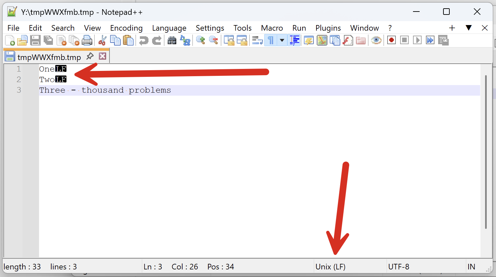
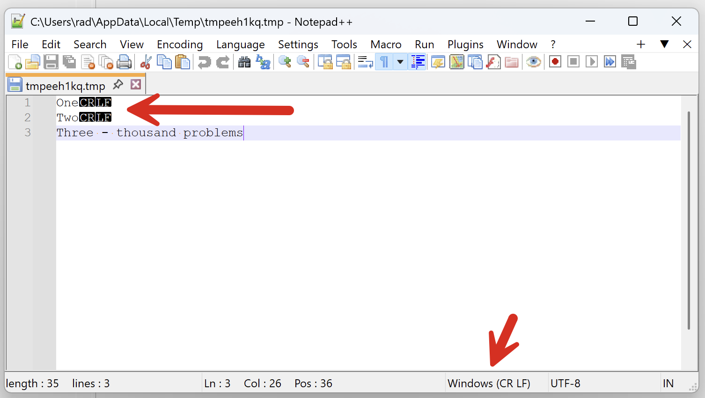
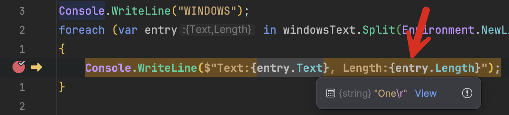

You have undoubtedly worked with **text files** during your programming journey—either reading or writing them, or both.

You will also no doubt know that different operating systems use different ways of indicating a [newline](https://en.wikipedia.org/wiki/Newline):

- [Linux](https://en.wikipedia.org/wiki/Linux) and [Unix](https://en.wikipedia.org/wiki/Unix) (including [MacOS](https://en.wikipedia.org/wiki/MacOS)) use the newline, `\n`
- [Windows](https://en.wikipedia.org/wiki/Microsoft_Windows) uses the carriage return and newline, `\r\n`
- Classic MacOS used the carriage return, `\r`

This is important because suppose you needed to write the following text to a file

```plaintext
One
Two 
Three - thousand problems
```

You would do it like this in **OSX**:

```c#
void Main()
{
  var filePath = Path.GetTempFileName();
  File.WriteAllText(filePath, "One\nTwo\nThree - thousand problems");
  File.ReadAllText(filePath);
}

```

And like this in **Windows**:

```c#
void Main()
{
  var filePath = Path.GetTempFileName();
  File.WriteAllText(filePath, "One\r\nTwo\r\nThree - thousand problems");
  File.ReadAllText(filePath);
}

```

Next, let us open both files with a proper text editor, like [NotePad++](https://notepad-plus-plus.org/)

The **Unix** one looks like this:



And the Windows one looks like this:



Mercifully, in this modern day and age, **proper editors have no problem opening and reading files written in other operating systems**. If they are changed in any operating system, they will be correctly saved.

But when writing the code yourself, the question arises - do you need to remember these delimiters?

The answer is no. We can use the constant [Environment, NewLine](https://learn.microsoft.com/en-us/dotnet/api/system.environment.newline?view=net-9.0) to take care of this.

Our code will look like this:

```c#
void Main()
{
  var filePath = Path.GetTempFileName();
  File.WriteAllText(filePath, $"One{Environment.NewLine}Two{Environment.NewLine}Three - thousand problems");
  File.ReadAllText(filePath);
}

```

Problem solved?

**Yes** and **no**.

Let us rewrite the program that creates the file with some modifications.

For OSX:

```c#
var osx = "/Users/rad/OSX.txt";
var text = $"One{Environment.NewLine}Two{Environment.NewLine}Three - thousand problems";
var bytes = Encoding.Default.GetBytes(text);
File.WriteAllBytes(osx, bytes);
Console.WriteLine($"{bytes.Length} bytes written");
```

For Windows:

```c#
var osx = @"Y:\Windows.txt";
var text = $"One{Environment.NewLine}Two{Environment.NewLine}Three - thousand problems";
var bytes = Encoding.Default.GetBytes(text);
File.WriteAllBytes(osx, bytes);
Console.WriteLine($"{bytes.Length} bytes written");
```

In my case, they are writing to the same location, a shared folder.

My **Windows** application prints the following:

```plaintext
35 bytes written
```

And the **OSX** one prints the following:

```plaintext
33 bytes written
```

Now, let us write code that opens each file and **splits** the text using the **newline**.

```c#
const string windows = "/Users/rad/WindowsShare/Windows.txt";
const string osx = "/Users/rad/WindowsShare/OSX.txt";

var windowsText = File.ReadAllText(windows);
var osxText = File.ReadAllText(osx);

// Print all the lines from Windows
Console.WriteLine("WINDOWS");
foreach (var entry in windowsText.Split(Environment.NewLine))
{
    Console.WriteLine(entry);
}

// Print all the lines from Windows
Console.WriteLine("OSX");
foreach (var entry in osxText.Split(Environment.NewLine))
{
    Console.WriteLine(entry);
}
```

This will print the following:

```plaintext
WINDOWS
One
Two
Three - thousand problems
OSX
One
Two
Three - thousand problems

```

Which seems OK. So what is the problem?

Rather than just printing the **text** for each row, let us get the **length** of the text as well.

```c#
// Print all the lines from Windows
Console.WriteLine("WINDOWS");
foreach (var entry in windowsText.Split(Environment.NewLine).Select(x => new { Text = x.Trim(), Length = x.Length }))
{
    Console.WriteLine($"Text:{entry.Text}, Length:{entry.Length}");
}

// Print all the lines from Windows
Console.WriteLine("OSX");
foreach (var entry in osxText.Split(Environment.NewLine).Select(x => new { Text = x.Trim(), Length = x.Length }))
{
    Console.WriteLine($"Text:{entry.Text}, Length:{entry.Length}");
}
```

This will print the following:

```plaintext
WINDOWS
Text:One, Length:4
Text:Two, Length:4
Text:Three - thousand problems, Length:25
OSX
Text:One, Length:3
Text:Two, Length:3
Text:Three - thousand problems, Length:25
```

You will note that the **lengths** for the first two entries for the Windows file are **4**, not **3**.

If we view in the debugger:



This is why I ran [Trim()](https://learn.microsoft.com/en-us/dotnet/api/system.string.trim?view=net-9.0) when extracting the text - the carriage return throws off the printing to the console.

Thus, we can see that it is **not the same thing**! This might have implications if you **write to a database** or perform **hashing** and **verification**.

You can probably avoid this problem by using the [File.ReadAllLines()](https://learn.microsoft.com/en-us/dotnet/api/system.io.file.readalllines?view=net-9.0) method and leave the runtime to solve the problem for you, but it is good to know what to expect should you, for whatever reason, want to parse the file yourself.

### TLDR

**There are nuances in dealing with end-of-line delimiters across operating systems that are not magically solved by using `Environment.NewLine`.**

The code is in my [GitHub](https://github.com/conradakunga/BlogCode/tree/master/2025-04-14%20-%20Newlines).

Happy hacking!
