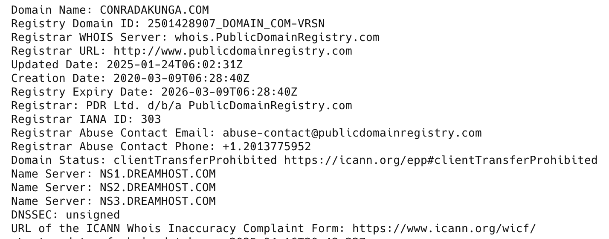

I recently needed to know the **IP Address** of a domain.

The goto is the trusty command line:

```bash
ping conradakunga.com
```

This returns the following result:

```plaintext
PING conradakunga.com (69.163.186.112): 56 data bytes
64 bytes from 69.163.186.112: icmp_seq=0 ttl=45 time=391.369 ms
64 bytes from 69.163.186.112: icmp_seq=1 ttl=45 time=443.522 ms
64 bytes from 69.163.186.112: icmp_seq=2 ttl=45 time=381.710 ms
```

Unsurprisingly, you can do this directly from your code using the [Dns](https://learn.microsoft.com/en-us/dotnet/api/system.net.dns?view=net-9.0) class, which offers a [GetHostAddressesAsync](https://learn.microsoft.com/en-us/dotnet/api/system.net.dns.gethostaddresses?view=net-9.0#system-net-dns-gethostaddresses(system-string)) method for this purpose.

You can retrieve the [IPAddress](https://learn.microsoft.com/en-us/dotnet/api/system.net.ipaddress?view=net-9.0) given a domain name as follows:

```c#
using System.Net;

// Get the IPAddresses for the domain
var result = await Dns.GetHostAddressesAsync("conradakunga.com");
Console.WriteLine($"There were {result.Length} address(es) found");
// Cycle through and print the results
foreach (var address in result)
  Console.WriteLine(address);
```

This will print the following:

```plaintext
There were 1 address(es) found
69.163.186.112
```

It is entirely possible for a domain to have **more than one** IP address:

If we run the code for **google.com**

```plaintexts
There were 2 address(es) found
172.217.170.174
2a00:1450:401a:800::200e
```

The second is in IPv6 address.

Is it possible to go the other way?

The best you can do is get the domain **host**.

The `Dns` class has a corresponding method to go the other way - [GetHostEntryAsync](https://learn.microsoft.com/en-us/dotnet/api/system.net.dns.gethostentryasync?view=net-9.0)

If I run it for my `IPAddress`:

```c#
var domain = await Dns.GetHostEntryAsync("69.163.186.112");
Console.WriteLine($"The host for this domain is {domain.HostName}");
```

It will print the following:

```plaintext
The host for this domain is apache2-twiddle.pdx1-shared-a2-12.dreamhost.com
```

You might wonder why we did not get back **conradakunga.com**? I would imagine it is because the same server on an IP address can host multiple sites.

If you want to get the actual domain name, you have to do a little work and use the [WHOIS](https://en.wikipedia.org/wiki/WHOIS) database.

The following code will retrieve this information for us:

```c#
const string whoisServer = "whois.verisign-grs.com";

using (var client = new TcpClient(whoisServer, 43))
await using (var stream = client.GetStream())
await using (var writer = new StreamWriter(stream))
using (var reader = new StreamReader(stream))
{
    await writer.WriteLineAsync("conradakunga.com");
    await writer.FlushAsync();

    // Read only the first line from the response.
    string response = (await reader.ReadLineAsync())!;
    Console.WriteLine(response);
}
```

This will print the following:

```plaintext
   Domain Name: CONRADAKUNGA.COM
```

Why the first line? Because a whois response looks like this:



### TLDR

**The `Dns` class has methods that allow you to retrieve an `IPAddress` from a domain, and a host from an `IPAddress`.**

The code is in my [GitHub](https://github.com/conradakunga/BlogCode/tree/master/2025-04-16%20-%20DNS).

Happy hacking!
