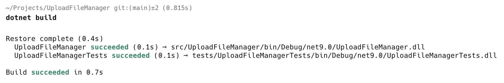

This is Part 3 of a series on Designing, Building & Packaging A Scalable, Testable .NET Open Source Component.

- [Designing, Building & Packaging A Scalable, Testable .NET Open Source Component - Part 1 - Introduction]()
- [Designing, Building & Packaging A Scalable, Testable .NET Open Source Component - Part 2 - Basic Requirements]()
- **Designing, Building & Packaging A Scalable, Testable .NET Open Source Component - Part 3 - Project Setup (This Post)**
- [Designing, Building & Packaging A Scalable, Testable .NET Open Source Component - Part 4 - Types & Contracts]()
- [Designing, Building & Packaging A Scalable, Testable .NET Open Source Component - Part 5 - Component Implementation]()
- [Designing, Building & Packaging A Scalable, Testable .NET Open Source Component - Part 6 - Mocking & Behaviour Tests]()
- [Designing, Building & Packaging A Scalable, Testable .NET Open Source Component - Part 7 - Sequence Verification With Moq]()
- [Designing, Building & Packaging A Scalable, Testable .NET Open Source Component - Part 8 - Compressor Implementation]()
- [Designing, Building & Packaging A Scalable, Testable .NET Open Source Component - Part 9 - Encryptor Implementation]()
- [Designing, Building & Packaging A Scalable, Testable .NET Open Source Component - Part 10 - In Memory Storage]()
- [Designing, Building & Packaging A Scalable, Testable .NET Open Source Component - Part 11 - SQL Server Storage]()
- [Designing, Building & Packaging A Scalable, Testable .NET Open Source Component - Part 11 - PostgreSQL Storage]()
- [Designing, Building & Packaging A Scalable, Testable .NET Open Source Component - Part 13 - Database Configuration]()

In our [last post]() we outlined the basic requirements.

In this post we will setup our project.

**NOTE: You do not carry out the steps outlined in this post yourself - you can just check out the code from [GitHub](https://github.com/conradakunga/UploadFileManager) like so:**

```bash
git clone https://github.com/conradakunga/UploadFileManager.git
```

**The rest of this post is if you want to learn to setup a project yourself, via command line.** Almost everything done here  around project creation can be accomplished using an IDE like [JetBrains Rider](https://www.jetbrains.com/rider/) or [Microosft Visual Studio](https://visualstudio.microsoft.com/).

First, we will create an empty directory to store our projects.

```bash
mkdir UploadFileManager/
```

We will also create a solution file in the new folder

```bash
dotnet new sln
```

Next we will turn our attention to a common problem that can inadvertently trip you up.

If you have **multiple projects** in a solution, each project has its **own build configuration** and **installed packages**. What happens when these are out of sync inadvertently? **Project A is .NET 8 and B is .NET 9** and A depends on B? Or **A is using version 1** of a package and **B is using version 2**?

[Central package management](https://devblogs.microsoft.com/dotnet/introducing-central-package-management/) is the solution to this problem.

First, we run the following command to create the file that stores centrally the packages used in our component.

```bash
dotnet new packagesprops
```

This will create a file named  `Directory.Packages.props` with the following contents:

```xml
<Project>
  <PropertyGroup>
    <!-- Enable central package management, https://learn.microsoft.com/en-us/nuget/consume-packages/Central-Package-Management -->
    <ManagePackageVersionsCentrally>true</ManagePackageVersionsCentrally>
  </PropertyGroup>
  <ItemGroup>
  </ItemGroup>
</Project>

```

Next run the following command:

```bash
dotnet new buildprops
```

This will create a file named `Directory.Build.props` in the folder.

It will have the following contents:

```xml
<Project>
  <!-- See https://aka.ms/dotnet/msbuild/customize for more details on customizing your build -->
  <PropertyGroup>


  </PropertyGroup>
</Project>

```

Next we will create the projects for our component.

First is the project for the component itself, a [class library](https://learn.microsoft.com/en-us/dotnet/standard/class-libraries).

```bash
dotnet new classlib -o src/UploadFileManager
```

This will create two folders - `src`, and within that, `UploadFileManger`. In this folder it will create the project and its files.

Next, we create the project for the tests.

```bash
dotnet new xunit -o tests/UploadFileManagerTests
```

This will create two folders - `tests`, and within that `UploadFileManagerTests`. In this folder it will create the xUnit test project and its files.

Finally we add these projects to the solution.

```bash
dotnet sln add tests/UploadFileManagerTests/
dotnet sln add src/UploadFileManager/
```

Our file structure should be as follows:


Let us now try to build the solution.

```basg
dotnet build
```

We get the following error:

```plaintext
  /Users/rad/Projects/UploadFileManager/tests/UploadFileManagerTests/UploadFileManagerTests.csproj : error NU1008: Projects that use central package version management should not define the version on the PackageReference items but on the PackageVersion items: coverlet.collector;Microsoft.NET.Test.Sdk;xunit;xunit.runner.visualstudio.
```

This is because we have configured central package management but the generated project files directly specify the **versions**.

We need to update the test `.csproj` file.

Currently it is like this:

```xml
<Project Sdk="Microsoft.NET.Sdk">

  <PropertyGroup>
    <TargetFramework>net9.0</TargetFramework>
    <ImplicitUsings>enable</ImplicitUsings>
    <Nullable>enable</Nullable>
    <IsPackable>false</IsPackable>
  </PropertyGroup>

  <ItemGroup>
    <PackageReference Include="coverlet.collector" Version="6.0.2" />
    <PackageReference Include="Microsoft.NET.Test.Sdk" Version="17.12.0" />
    <PackageReference Include="xunit" Version="2.9.2" />
    <PackageReference Include="xunit.runner.visualstudio" Version="2.8.2" />
  </ItemGroup>

  <ItemGroup>
    <Using Include="Xunit" />
  </ItemGroup>

</Project>
```

The simplest way is to **delete** all the `PackageReferences` and add them again afresh via command line.

```bash
dotnet add package coverlet.collector
dotnet add package Microsoft.NET.Test.Sdk
dotnet add package xunit
dotnet add package xunit.runner.visualstudio
```

The file now will look like this:

```xml
<Project Sdk="Microsoft.NET.Sdk">

  <PropertyGroup>
    <TargetFramework>net9.0</TargetFramework>
    <ImplicitUsings>enable</ImplicitUsings>
    <Nullable>enable</Nullable>
    <IsPackable>false</IsPackable>
  </PropertyGroup>

  <ItemGroup>
    <Using Include="Xunit" />
  </ItemGroup>

  <ItemGroup>
    <PackageReference Include="coverlet.collector">
      <IncludeAssets>runtime; build; native; contentfiles; analyzers; buildtransitive</IncludeAssets>
      <PrivateAssets>all</PrivateAssets>
    </PackageReference>
    <PackageReference Include="Microsoft.NET.Test.Sdk" />
    <PackageReference Include="xUnit" />
    <PackageReference Include="xunit.runner.visualstudio">
      <IncludeAssets>runtime; build; native; contentfiles; analyzers; buildtransitive</IncludeAssets>
      <PrivateAssets>all</PrivateAssets>
    </PackageReference>
  </ItemGroup>

</Project>

```

Not that there are no version numbers here, unlike before.

The file `Directory.Packages.props` now looks like this:

```xml
<Project>
  <PropertyGroup>
    <!-- Enable central package management, https://learn.microsoft.com/en-us/nuget/consume-packages/Central-Package-Management -->
    <ManagePackageVersionsCentrally>true</ManagePackageVersionsCentrally>
  </PropertyGroup>
  <ItemGroup>
  </ItemGroup>
  <ItemGroup>
    <PackageVersion Include="coverlet.collector" Version="6.0.4">
      <IncludeAssets>runtime; build; native; contentfiles; analyzers; buildtransitive</IncludeAssets>
      <PrivateAssets>all</PrivateAssets>
    </PackageVersion>
    <PackageVersion Include="Microsoft.NET.Test.Sdk" Version="17.13.0" />
    <PackageVersion Include="xUnit" Version="2.9.3" />
    <PackageVersion Include="xunit.runner.visualstudio" Version="3.0.2">
      <IncludeAssets>runtime; build; native; contentfiles; analyzers; buildtransitive</IncludeAssets>
      <PrivateAssets>all</PrivateAssets>
    </PackageVersion>
  </ItemGroup>
</Project>
```

Not that this file now **has the version numbers**, so if any project uses any of these packages, that is the version that will get used.

If we now build, it will succeed.



There are a couple of other packages we need to add to the test project:

1. [AwesomeAssertions](https://awesomeassertions.org/) - for writing easy to read test assertions
2. [Moq](https://github.com/devlooped/moq) - for writing mocks

```bash
dotnet add package AwesomeAssertions
dotnet add package Moq
```

Finally, we need to centralize some of the project properties.

Here is an excerpt of the **test** project:

```xml
  <PropertyGroup>
    <TargetFramework>net9.0</TargetFramework>
    <ImplicitUsings>enable</ImplicitUsings>
    <Nullable>enable</Nullable>
    <IsPackable>false</IsPackable>
  </PropertyGroup>
```

And this is of the **UploadManager** project:

```xml
<PropertyGroup>
    <TargetFramework>net9.0</TargetFramework>
    <ImplicitUsings>enable</ImplicitUsings>
    <Nullable>enable</Nullable>
  </PropertyGroup>
```

We can extract the common elements to the `Directory.Build.props` file.

It now will look like this:

```xml
<Project>
  <!-- See https://aka.ms/dotnet/msbuild/customize for more details on customizing your build -->
  <PropertyGroup>
      <TargetFramework>net9.0</TargetFramework>
      <ImplicitUsings>enable</ImplicitUsings>
      <Nullable>enable</Nullable>
  </PropertyGroup>
</Project>

```

Our test `.csproj` now looks like this:

```xml
<Project Sdk="Microsoft.NET.Sdk">

  <PropertyGroup>
    <IsPackable>false</IsPackable>
  </PropertyGroup>

  <ItemGroup>
    <Using Include="Xunit" />
  </ItemGroup>

  <ItemGroup>
    <PackageReference Include="AwesomeAssertions" />
    <PackageReference Include="AwesomeAssertions.Analyzers">
      <PrivateAssets>all</PrivateAssets>
      <IncludeAssets>runtime; build; native; contentfiles; analyzers; buildtransitive</IncludeAssets>
    </PackageReference>
    <PackageReference Include="coverlet.collector">
      <IncludeAssets>runtime; build; native; contentfiles; analyzers; buildtransitive</IncludeAssets>
      <PrivateAssets>all</PrivateAssets>
    </PackageReference>
    <PackageReference Include="Microsoft.NET.Test.Sdk" />
    <PackageReference Include="Moq" />
    <PackageReference Include="xUnit" />
    <PackageReference Include="xunit.runner.visualstudio">
      <IncludeAssets>runtime; build; native; contentfiles; analyzers; buildtransitive</IncludeAssets>
      <PrivateAssets>all</PrivateAssets>
    </PackageReference>
  </ItemGroup>

</Project>

```

And our **UploadFileManager** `.csproj` now looks like this:

```xml
</Project>
</Project>
```

Finally, we can add the requirements captured on our last post as a [markdown](https://www.markdownguide.org/) file, `Readme.md`.

The last step in the journey is to create a **Github** repository for our project.

Go to the [GitHub](https://github.com/) site and click the following button:


Next we provide some **information** about the repository.

For now, I have chosen the [MIT](https://opensource.org/license/mit) license but to be honest, I haven't thought all that much about it.

The new repository will look like this:


Next is a bunch of commands to setup the local repository to push to the remote

```bash
# Add the remote
git remote add origin https://github.com/conradakunga/UploadFileManager.git
# Set the local branches to mirror the upstream ones
git branch --set-upstream-to=origin/main main
# Set the repository to merge by default
git config pull.rebase false
# Pull & merge the latest chanages
git pull
# Push the code
git push
```

The final repo will look like this, with all our code pushed.


In our [next post](), we shall begin to implement some types and contracts.

### TLDR

**This post sets up the project in readiness for the implementation.**

The code is in my [GitHub](https://github.com/conradakunga/UploadFileManager).

Happy hacking!
