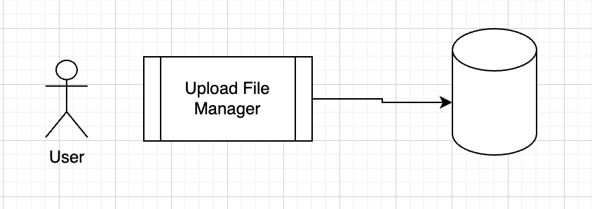
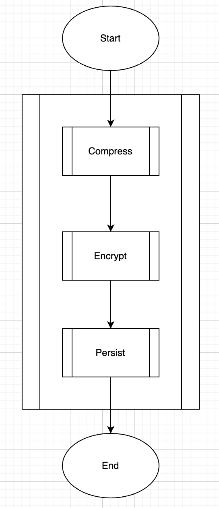

This is Part 4 of a series on Designing, Building & Packaging A Scalable, Testable .NET Open Source Component.

- [Designing, Building & Packaging A Scalable, Testable .NET Open Source Component - Part 1 - Introduction]()
- [Designing, Building & Packaging A Scalable, Testable .NET Open Source Component - Part 2 - Basic Requirements]()
- [Designing, Building & Packaging A Scalable, Testable .NET Open Source Component - Part 3 - Project Setup]()
- **Designing, Building & Packaging A Scalable, Testable .NET Open Source Component - Part 4 - Types & Contracts (This Post)**
- [Designing, Building & Packaging A Scalable, Testable .NET Open Source Component - Part 5 - Component Implementation]()
- [Designing, Building & Packaging A Scalable, Testable .NET Open Source Component - Part 6 - Mocking & Behaviour Tests]()
- [Designing, Building & Packaging A Scalable, Testable .NET Open Source Component - Part 7 - Sequence Verification With Moq]()
- [Designing, Building & Packaging A Scalable, Testable .NET Open Source Component - Part 8 - Compressor Implementation]()
- [Designing, Building & Packaging A Scalable, Testable .NET Open Source Component - Part 9 - Encryptor Implementation]()
- [Designing, Building & Packaging A Scalable, Testable .NET Open Source Component - Part 10 - In Memory Storage]()
- [Designing, Building & Packaging A Scalable, Testable .NET Open Source Component - Part 11 - SQL Server Storage]()
- [Designing, Building & Packaging A Scalable, Testable .NET Open Source Component - Part 12 - PostgreSQL Storage]()
- [Designing, Building & Packaging A Scalable, Testable .NET Open Source Component - Part 13 - Database Configuration]()
- [Designing, Building & Packaging A Scalable, Testable .NET Open Source Component - Part 14 - Virtualizing Infrastructure]()
- [Designing, Building & Packaging A Scalable, Testable .NET Open Source Component - Part 15 - Test Organization]()
- [Designing, Building & Packaging A Scalable, Testable .NET Open Source Component - Part 16 - Large File Consideration]()
- [Designing, Building & Packaging A Scalable, Testable .NET Open Source Component - Part 17 - Large File Consideration On PostgreSQL]()
- [Designing, Building & Packaging A Scalable, Testable .NET Open Source Component - Part 18 - Azure Blob Storage]()
- [Designing, Building & Packaging A Scalable, Testable .NET Open Source Component - Part 19 - Testing Azure Blob Storage Locally]()
- [Designing, Building & Packaging A Scalable, Testable .NET Open Source Component - Part 20 - Amazon S3 Storage]()
- [Designing, Building & Packaging A Scalable, Testable .NET Open Source Component - Part 21 - Testing Amazon S3 Storage Locally]() 
- [Designing, Building & Packaging A Scalable, Testable .NET Open Source Component - Part 22 - Refactoring Azure Storage Engine For Initialization]()
- [Designing, Building & Packaging A Scalable, Testable .NET Open Source Component - Part 23 - Refactoring Amazon Storage Engine For Initialization]()
- [Designing, Building & Packaging A Scalable, Testable .NET Open Source Component - Part 24 - Google Cloud Storage]()

In our [last post](), we set up our project structures.

In this post, we shall start implementing some **types** and **contracts**.

The requirements for the file **metadata** were as follows:

> This metadata will include:
>
> 1. File **name**
> 2. File **size** (in bytes)
> 3. **Extension** (Will need this to know how to render the file if being viewed by the browser)
> 4. **Date Uploaded**
> 5. File **Hash** (Hash to detect changes to the file (for whatever reason). Also to tell if this file has been uploaded before)

Given we are also adding support for **encryption** and **compression**, we will need to store those with the metadata.

Let us add the two [enums](https://learn.microsoft.com/en-us/dotnet/csharp/language-reference/builtin-types/enum), starting with the `EncryptionAlgorithm`:

```c#
namespace UploadFileManager;
/// <summary>
/// Algorithm to use for encryption
/// </summary>
public enum EncryptionAlgorithm
{
    /// <summary>
    /// No encryption
    /// </summary>
    None = 0,
    /// <summary>
    ///  AES encryption
    /// </summary>
    Aes = 1,
}
```

Then the `CompressionAlgorithm`:

```c#
namespace UploadFileManager;
/// <summary>
/// Algorithm to use for compressopm
/// </summary>
public enum CompressionAlgorithm
{
    /// <summary>
    /// No compression
    /// </summary>
    None = 0,
    /// <summary>
    /// ZIP compression
    /// </summary>
    Zip = 1
}
```

Next we define the `FileMetadata`

```c#
namespace UploadFileManager;

/// <summary>
/// Metadata of store files
/// </summary>
public sealed record FileMetadata
{
    /// <summary>
    /// File identifier
    /// </summary>
    public required Guid FileId { get; init; }
  
    /// <summary>
    /// Full file name
    /// </summary>
    public required string Name { get; init; }

    /// <summary>
    /// File extension
    /// </summary>
    public required string Extension { get; init; }

    /// <summary>
    ///  Date and time of storage
    /// </summary>
    public required DateTime DateUploaded { get; init; }

    /// <summary>
    /// Original file size
    /// </summary>
    public required int OriginalSize { get; init; }

    /// <summary>
    /// Compressed file size
    /// </summary>
    public required int CompressedSize { get; init; }

    /// <summary>
    /// Compression algorithm used to compress file
    /// </summary>
    public required CompressionAlgorithm CompressionAlgorithm { get; init; }

    /// <summary>
    /// Encryption algorithm used to encrypt file
    /// </summary>
    public required EncryptionAlgorithm EncryptionAlgorithm { get; init; }

    /// <summary>
    /// SHA256 hash of the file
    /// </summary>
    public required byte[] Hash { get; set; }
}
```

Now, let us turn our attention to the contract for the component.

A couple of things to consider:

1. Given this is a file manager, the core functionality will essentially be [I/O operations](I/O)
2. For (potentially) I/O heavy operations, we should probably implement the methods [asychronously](https://learn.microsoft.com/en-us/dotnet/csharp/asynchronous-programming/async-scenarios)
3. `Async` methods generally support [cancellation tokens](https://learn.microsoft.com/en-us/dotnet/standard/threading/cancellation-in-managed-threads). So should our component, where applicable.
4. This component should be **thread-safe**, so we should avoid as much as possible any shared state
5. Given files could potentially be very large, it might be best to use [Streams](https://learn.microsoft.com/en-us/dotnet/api/system.io.stream?view=net-9.0) rather than byte arrays to access  the file data.
6. Probably also a good idea to add a method to check if a FileID **exists**

The first implementation looks like this:

```c#
public interface IFileManager
{
    Task<FileMetadata> StoreFileAsync(string fileName, string extension, Stream data,
        CancellationToken cancellationToken = default);
    Task<FileMetadata> GetMetadataAsync(Guid fileId, CancellationToken cancellationToken = default);
    Task<Stream> GetFileAsync(Guid fileId, CancellationToken cancellationToken = default);
    Task<Stream> DeleteFileAsync(Guid fileId, CancellationToken cancellationToken = default);
    Task<bool> FileExistsAsync(Guid fileId, CancellationToken cancellationToken = default);
}
```

But in the spec we have said we will **compress** and **encrypt** the file. This means that the `StoreFileAsync` will be doing other things within to support this functionality, and so will the `GetFileAsync`. We need to [separate concerns](https://medium.com/@okay.tonka/what-is-separation-of-concern-b6715b2e0f75) so that each service does one thing. That makes maintenance and improvement easier.



We can redesign this as follows:

1. The "Manager" will be a service that hosts a number of **injectable services**
2. The first will **compress** the data
3. The second will **encrypt** the data
4. The third will **persist** the data

Thus, there is a pipeline that will process the incoming data.

The **order of the pipeline matters** - if we encrypt first, we will get poor compression.

The component internally will look like this:



Let us define the following contracts:

- `IFileCompressor`
- `IFileEncryptor`
- `IFilePersister`

The `IFileCompressor` will look like this:

`````C#
namespace UploadFileManager;

/// <summary>
/// File compression & decompression contract
/// </summary>
public interface IFileCompressor
{
    /// <summary>
    /// Compression algorithm to use
    /// </summary>
    public CompressionAlgorithm CompressionAlgorithm { get; }

    /// <summary>
    /// Compress stream
    /// </summary>
    /// <param name="data"></param>
    /// <returns></returns>
    public Stream Compress(Stream data);

    /// <summary>
    /// De-compress the stream
    /// </summary>
    /// <param name="data"></param>
    /// <returns></returns>
    public Stream DeCompress(Stream data);
}
`````

The `IFileEncryptor` will look like this:

```c#
namespace UploadFileManager;

/// <summary>
/// File encryption & decryption contract
/// </summary>
public interface IFileEncryptor
{
    /// <summary>
    /// Compression algorithm to use
    /// </summary>
    EncryptionAlgorithm EncryptionAlgorithm { get; }

    /// <summary>
    /// Encrypt the stream
    /// </summary>
    /// <param name="data"></param>
    /// <returns></returns>
    public Stream Encrypt(Stream data);

    /// <summary>
    /// Decrypt the stream
    /// </summary>
    /// <param name="data"></param>
    /// <returns></returns>
    public Stream Decrypt(Stream data);
}
```

The `IFilePersistor` will closely mirror the original API surface:

```c#
public interface IFilePersistor
{
    Task<FileMetadata> StoreFileAsync(string fileName, string extension, Stream data,
        CancellationToken cancellationToken = default);

    Task<FileMetadata> GetMetadataAsync(Guid fileId, CancellationToken cancellationToken = default);
    Task<Stream> GetFileAsync(Guid fileId, CancellationToken cancellationToken = default);
    Task<Stream> DeleteFilesAsync(Guid fileId, CancellationToken cancellationToken = default);
    Task<bool> FileExistsAsync(Guid fileId, CancellationToken cancellationToken = default);
}
```

To avoid confusion, we will sligtly refactor the method names from the original `IFileManager`

```c#
namespace UploadFileManager;

public interface IFileManager
{
    Task<FileMetadata> UploadFileAsync(string fileName, string extension, Stream data,
        CancellationToken cancellationToken = default);

    Task<FileMetadata> FetchMetadataAsync(Guid fileId, CancellationToken cancellationToken = default);
    Task<Stream> DownloadFileAsync(Guid fileId, CancellationToken cancellationToken = default);
    Task<Stream> DeleteFileAsync(Guid fileId, CancellationToken cancellationToken = default);
    Task<bool> FileExistsAsync(Guid fileId, CancellationToken cancellationToken = default);
}
```

We have defined here that the `IFileManager` will require the three services we have just designed to be stitched together to carry out the required work.

In our next post, we will tie the types we have implemented together and write tests to validate our assumptions and functionality.

### TLDR

**This post creates preliminary versions of some of the types and contracts we will use.**

The code is in my [GitHub](https://github.com/conradakunga/UploadFileManager/).

Happy hacking!
