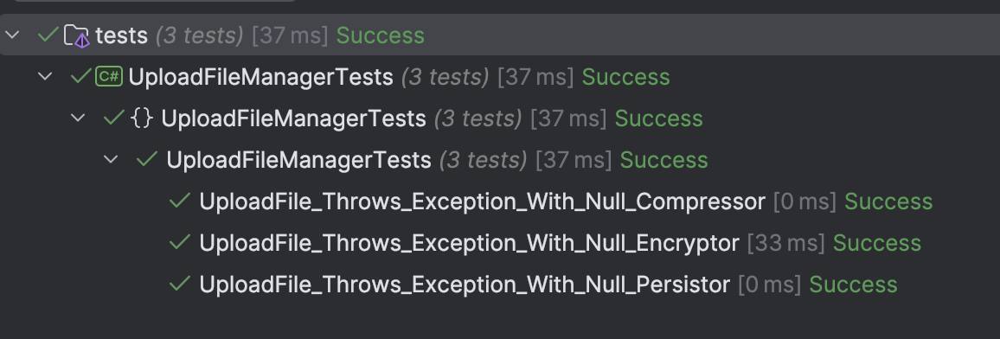

This is Part 6 of a series on Designing, Building & Packaging A Scalable, Testable .NET Open Source Component.

- [Designing, Building & Packaging A Scalable, Testable .NET Open Source Component - Part 1 - Introduction]()
- [Designing, Building & Packaging A Scalable, Testable .NET Open Source Component - Part 2 - Basic Requirements]()
- [Designing, Building & Packaging A Scalable, Testable .NET Open Source Component - Part 3 - Project Setup]()
- [Designing, Building & Packaging A Scalable, Testable .NET Open Source Component - Part 4 - Types & Contracts]()
- [Designing, Building & Packaging A Scalable, Testable .NET Open Source Component - Part 5 - Component Implementation]()
- **Designing, Building & Packaging A Scalable, Testable .NET Open Source Component - Part 6 - Mocking & Behaviour Tests (This Post)**
- [Designing, Building & Packaging A Scalable, Testable .NET Open Source Component - Part 7 - Sequence Verification With Moq]()
- [Designing, Building & Packaging A Scalable, Testable .NET Open Source Component - Part 8 - Compressor Implementation]()
- [Designing, Building & Packaging A Scalable, Testable .NET Open Source Component - Part 9 - Encryptor Implementation]()
- [Designing, Building & Packaging A Scalable, Testable .NET Open Source Component - Part 10 - In Memory Storage]()
- [Designing, Building & Packaging A Scalable, Testable .NET Open Source Component - Part 11 - SQL Server Storage]()
- [Designing, Building & Packaging A Scalable, Testable .NET Open Source Component - Part 12 - PostgreSQL Storage]()
- [Designing, Building & Packaging A Scalable, Testable .NET Open Source Component - Part 13 - Database Configuration]()
- [Designing, Building & Packaging A Scalable, Testable .NET Open Source Component - Part 14 - Virtualizing Infrastructure]()
- [Designing, Building & Packaging A Scalable, Testable .NET Open Source Component - Part 15 - Test Organization]()
- [Designing, Building & Packaging A Scalable, Testable .NET Open Source Component - Part 16 - Large File Consideration]()
- [Designing, Building & Packaging A Scalable, Testable .NET Open Source Component - Part 17 - Large File Consideration On PostgreSQL]()
- [Designing, Building & Packaging A Scalable, Testable .NET Open Source Component - Part 18 - Azure Blob Storage]()
- [Designing, Building & Packaging A Scalable, Testable .NET Open Source Component - Part 19 - Testing Azure Blob Storage Locally]()
- [Designing, Building & Packaging A Scalable, Testable .NET Open Source Component - Part 20 - Amazon S3 Storage]()
- [Designing, Building & Packaging A Scalable, Testable .NET Open Source Component - Part 21 - Testing Amazon S3 Storage Locally]() 
- [Designing, Building & Packaging A Scalable, Testable .NET Open Source Component - Part 22 - Refactoring Azure Storage Engine For Initializationinitialization]()
- [Designing, Building & Packaging A Scalable, Testable .NET Open Source Component - Part 23 - Refactoring Amazon Storage Engine For Initialization]()

In our [last post](), we implemented the functionality of our component.

This post will look at how to **test our component without worrying about the actual implementation**.

This is through a technique called **mocking** in the context of a practice called behaviour-driven design.

**At this point, let me pause to observe that there are a lot of schools of thought about this practice and whether or not it adds value. There are a lot of strong opinions on either side.**

**My suggestion, as always, is pragmatism. I personally find there is a lot of value, and if you don't after reading this post, that's OK.**

Back to the post.

A **mock** is a **representation** of a service that is used to **verify one or more interactions** have taken place.

Mocking support can be realized using the [Moq](https://github.com/devlooped/moq) library. You can also use the [NSubtitute](https://nsubstitute.github.io/) package, which is also a popular choice.

I prefer **Moq** because it splits the setup from the assertion, unlike **NSubstitute** which does both.

Let us create some tests to ensure that our passed services are **validated**.

As a reminder the [constructor](https://learn.microsoft.com/en-us/dotnet/csharp/programming-guide/classes-and-structs/constructors) performs the following validations:

```c#
public UploadFileManager(IFilePersistor filePersistor, IFileEncryptor fileEncryptor, IFileCompressor fileCompressor,
        TimeProvider timeProvider)
    {
        // Check that the injected services are valid
        ArgumentNullException.ThrowIfNull(filePersistor);
        ArgumentNullException.ThrowIfNull(fileEncryptor);
        ArgumentNullException.ThrowIfNull(fileCompressor);
        ArgumentNullException.ThrowIfNull(timeProvider);

        _filePersistor = filePersistor;
        _fileEncryptor = fileEncryptor;
        _fileCompressor = fileCompressor;
        _timeProvider = timeProvider;
    }
```

We want to **verify** if this is in fact the case, for each of the services.

Now given we don't have any **implementations** of these services, we will mock them using the **Moq** library.

```c#
[Fact]
public void UploadFile_Throws_Exception_With_Null_Compressor()
{
    var encryptor = new Mock<IFileEncryptor>(MockBehavior.Strict);
    var persistor = new Mock<IFilePersistor>(MockBehavior.Strict);
    IFileCompressor compressor = null;
    var fakeTimeProvider = new FakeTimeProvider();
    fakeTimeProvider.SetUtcNow(new DateTimeOffset(2025, 1, 1, 0, 0, 0, TimeSpan.Zero));
    var ex = Record.Exception(() =>
        new UploadFileManager(persistor.Object, encryptor.Object, compressor, fakeTimeProvider));
    ex.Should().NotBeNull().And.BeOfType<ArgumentNullException>();
}

[Fact]
public void UploadFile_Throws_Exception_With_Null_Persistor()
{
    var encryptor = new Mock<IFileEncryptor>(MockBehavior.Strict);
    var compressor = new Mock<IFileCompressor>(MockBehavior.Strict);
    IFilePersistor persistor = null;
    var fakeTimeProvider = new FakeTimeProvider();
    fakeTimeProvider.SetUtcNow(new DateTimeOffset(2025, 1, 1, 0, 0, 0, TimeSpan.Zero));
    var ex = Record.Exception(() =>
        new UploadFileManager(persistor, encryptor.Object, compressor.Object, fakeTimeProvider));
    ex.Should().NotBeNull().And.BeOfType<ArgumentNullException>();
}

[Fact]
public void UploadFile_Throws_Exception_With_Null_Encryptor()
{
    var compressor = new Mock<IFileCompressor>(MockBehavior.Strict);
    var persistor = new Mock<IFilePersistor>(MockBehavior.Strict);
    IFileEncryptor encryptor = null;
    var fakeTimeProvider = new FakeTimeProvider();
    fakeTimeProvider.SetUtcNow(new DateTimeOffset(2025, 1, 1, 0, 0, 0, TimeSpan.Zero));
    var ex = Record.Exception(() =>
        new UploadFileManager(persistor.Object, encryptor, compressor.Object, fakeTimeProvider));
    ex.Should().NotBeNull().And.BeOfType<ArgumentNullException>();
}
```

The following line creates a mock implementation of the provided interface.

```c#
 var compressor = new Mock<IFileCompressor>(MockBehavior.Strict);
```

Then we try and create a `UploadFileManger` for all the scenarios where the expected service is passed as a `null`, for which we capture the exception and verify that it is not `null`, and is of the type [ArgumentNullExeception](https://learn.microsoft.com/en-us/dotnet/api/system.argumentnullexception?view=net-9.0).

Our test should pass.



The next thing we want to test is that our component actually calls the service.

Here there are two things to verify:

1. Was the service actually **called**? It may have been commented out or deleted by accident.
2. Was it called with the right **parameters**?

Let us write some tests for our `UploadFileAsync` method.

This method does a couple of things:

1. **Compresses** the file
2. **Encrypts** the file
3. **Saves** it to disk

We want to verify that the services were called.

This is a complex operation, given there aren't any concrete implementations to peek into.

The process of mocking is as follows:

1. **Create** the mock

2. **Setup** the mock - instruct it how to behave when a method or property of the interface is invoked. In cases where services pass data to each other, set this up as well

3. **Invoke** the mock

4. Ask the mock to **verify** that the methods were called, and how many times. 


This is done as follows:

```c#
[Fact]
public async Task UploadFileAsync_Invokes_All_Services_Correctly()
{
    // Setup our sample data
    byte[] originalBytes = [0, 0, 0, 0, 0, 0, 0, 0];
    byte[] compressedBytes = [1, 1, 1, 1];
    byte[] encryptedBytes = [2, 2, 2, 2];

    const string fileName = "Test";
    const string extension = ".doc";

    var metaData = new FileMetadata
    {
        FileId = Guid.Empty,
        Name = fileName,
        Extension = extension,
        DateUploaded = new DateTime(2025, 1, 1, 0, 0, 0),
        OriginalSize = originalBytes.Length,
        PersistedSize = encryptedBytes.Length,
        CompressionAlgorithm = CompressionAlgorithm.None,
        EncryptionAlgorithm = EncryptionAlgorithm.None,
        Hash = [0, 1, 2, 3]
    };

    // Setup our mocks
    var encryptor = new Mock<IFileEncryptor>(MockBehavior.Strict);
    var persistor = new Mock<IFilePersistor>(MockBehavior.Strict);
    var compressor = new Mock<IFileCompressor>(MockBehavior.Strict);

    // Configure the behaviour for methods called and properties

    encryptor.Setup(x => x.Encrypt(It.IsAny<Stream>()))
        .Returns(new MemoryStream(encryptedBytes));
    encryptor.Setup(x => x.EncryptionAlgorithm)
        .Returns(EncryptionAlgorithm.Aes);

    persistor.Setup(x =>
            x.StoreFileAsync(It.IsAny<string>(), It.IsAny<string>(), It.IsAny<Stream>(), CancellationToken.None))
        .ReturnsAsync(metaData);

    compressor.Setup(x => x.Compress(It.IsAny<Stream>()))
        .Returns(new MemoryStream(compressedBytes));
    compressor.Setup(x => x.CompressionAlgorithm)
        .Returns(CompressionAlgorithm.Zip);

    // Setup the time provider
    var fakeTimeProvider = new FakeTimeProvider();
    fakeTimeProvider.SetUtcNow(new DateTimeOffset(2025, 1, 1, 0, 0, 0, TimeSpan.Zero));
    var manager = new UploadFileManager(persistor.Object, encryptor.Object, compressor.Object, fakeTimeProvider);

    // Invoke the method, discarding the return as validating it is not useful
    _ = await manager.UploadFileAsync(fileName, extension, new MemoryStream(originalBytes), CancellationToken.None);

    // Check that the compressor's Compress method was called once
    compressor.Verify(x => x.Compress(new MemoryStream(originalBytes)), Times.Once);
    // Check that the encryptor's Encrypt method was called once
    encryptor.Verify(x => x.Encrypt(new MemoryStream(compressedBytes)), Times.Once);
    // Check that the persistor's StoreFileAsync method was called once
    persistor.Verify(
        x => x.StoreFileAsync(fileName, extension, new MemoryStream(encryptedBytes),
            CancellationToken.None),
        Times.Once);
}
```

One of the schools of thought says that there is no point of testing the **internals** of the system - it is sufficient to put data into a system, pull it out and then verify what you pulled out is what you put in.

This is technically correct, but potentially misleading. How, for instance, will you tell if the data was **encrypted** and **compressed**? The test would still pass, but it matters what took place within the service.

With our mock here we can verify that the methods were called, and can therefore infer that the underlying implementations carried out those functions.

When we build the implementations, they will need their own **unit tests** to verify that they are carrying out the actual implementations.

If you comment out, or otherwise remove any of the service invocations, the test will **fail** because the check for the **number** of invocations (one) as asserted by `Times.Once` will fail.

Finally, we can refactor the validation of `FileName` and `Extension`, which is currently this:

```c#
// Verify the fileName has valid characters
var invalidCharacters = Path.GetInvalidFileNameChars();
if (invalidCharacters.Any(fileName.Contains))
    throw new ArgumentException($"The file name '{fileName}' contains invalid characters");

// Verify the extension has valid characters
if (invalidCharacters.Any(extension.Contains))
    throw new ArgumentException($"The extension '{extension}' contains invalid characters");

// Validate the regex for the extension
if (!Regex.IsMatch(extension, @"^\.\w+$"))
    throw new ArgumentException($"The extension {extension}' does not conform to the expected format: .xxx");
```

These can be extracted into dedicated classes, to make testing easier.

First, the `FileNameValidator`:

```c#
public static class FileNameValidator
{
    public static void Validate(string fileName)
    {
        ArgumentException.ThrowIfNullOrWhiteSpace(fileName);
        // Verify the fileName has valid characters
        char[] customInvalidChars = ['\\', '/'];
        var invalidCharacters = Path.GetInvalidFileNameChars().Union(customInvalidChars).ToArray();
        if (invalidCharacters.Any(fileName.Contains))
            throw new ArgumentException($"The file name '{fileName}' contains invalid characters");
    }
}
```

Then the `ExtensionValidator`:

```c#
public static partial class ExtensionValidator
{
    public static void Validate(string extension)
    {
        ArgumentException.ThrowIfNullOrWhiteSpace(extension);
        
        // Verify the fileName has valid characters
        char[] customInvalidChars = ['\\', '/'];
        var invalidCharacters = Path.GetInvalidFileNameChars().Union(customInvalidChars).ToArray();

        // Verify the extension has valid characters
        if (invalidCharacters.Any(extension.Contains))
            throw new ArgumentException($"The extension '{extension}' contains invalid characters");

        // Validate the regex for the extension
        if (!ExtensionValidationRegex().IsMatch(extension))
            throw new ArgumentException($"The extension {extension}' does not conform to the expected format: .xxx");
    }

    [GeneratedRegex(@"^\.\w+$")]
    private static partial Regex ExtensionValidationRegex();
}
```

In the `ExtensionValidator` we are now using a [source generated regex](https://learn.microsoft.com/en-us/dotnet/standard/base-types/regular-expression-source-generators).

Finally, we can write tests to verify when a file is uploaded, the `FileName` is validated:ß

```c#
public class FileNameValidatorTests
{
    [Theory]
    [InlineData("")]
    [InlineData("  ")]
    [InlineData("/")]
    public void FileNameValidator_Throws_Exception_If_Name_Is_Not_Valid(string name)
    {
        var ex = Record.Exception(() => FileNameValidator.Validate(name));
        ex.Should().BeOfType<ArgumentException>();
    }

    [Theory]
    [InlineData(null)]
    public void FileNameValidator_Throws_Exception_If_Name_Is_Null(string name)
    {
        var ex = Record.Exception(() => FileNameValidator.Validate(name));
        ex.Should().BeOfType<ArgumentNullException>();
    }

    [Theory]
    [InlineData(@"\Name")]
    [InlineData("/Name")]
    public void FileNameValidator_Throws_Exception_If_Name_Has_Invalid_Character(string name)
    {
        var ex = Record.Exception(() => FileNameValidator.Validate(name));
        ex.Should().BeOfType<ArgumentException>();
    }
}
```

And so is the `Extension`:

```c#
public class ExtensionValidatorTests
{
    [Theory]
    [InlineData("")]
    [InlineData("  ")]
    [InlineData("/")]
    public void ExtensionValidator_Throws_Exception_If_Name_Is_Not_Valid(string name)
    {
        var ex = Record.Exception(() => ExtensionValidator.Validate(name));
        ex.Should().BeOfType<ArgumentException>();
    }

    [Theory]
    [InlineData(null)]
    public void ExtensionValidator_Throws_Exception_If_Name_Is_Null(string name)
    {
        var ex = Record.Exception(() => ExtensionValidator.Validate(name));
        ex.Should().BeOfType<ArgumentNullException>();
    }

    [Theory]
    [InlineData(@".\Name")]
    [InlineData("./Name")]
    public void ExtensionValidator_Throws_Exception_If_Name_Has_Invalid_Character(string name)
    {
        var ex = Record.Exception(() => ExtensionValidator.Validate(name));
        ex.Should().BeOfType<ArgumentException>();
    }

    [Theory]
    [InlineData(@".doc.")]
    [InlineData("..doc")]
    public void ExtensionValidator_Throws_Exception_If_Name_Has_Invalid_Format(string name)
    {
        var ex = Record.Exception(() => ExtensionValidator.Validate(name));
        ex.Should().BeOfType<ArgumentException>();
    }
}
```

In our [next post](), we will make some final improvements to the testing through mocking, as well as some cleanup.

### TLDR

**Mocking allows us to quite comprehensively achieve the following:**

1. **Test the behaviour of the system**
2. **Verify calling of service methods**
3. **Assert number of times methods were called**
4. **Articulate the functionality of the system**
5. **Create templates for unit testing the implementations**

The code is in my [GitHub](https://github.com/conradakunga/UploadFileManager).

Happy hacking
