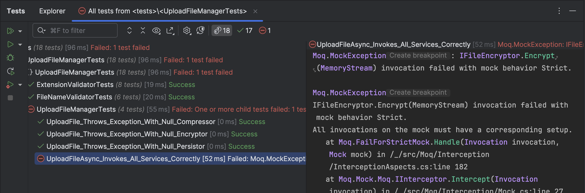

This is Part 7 of a series on Designing, Building & Packaging A Scalable, Testable .NET Open Source Component.

- [Designing, Building & Packaging A Scalable, Testable .NET Open Source Component - Part 1 - Introduction]()
- [Designing, Building & Packaging A Scalable, Testable .NET Open Source Component - Part 2 - Basic Requirements]()
- [Designing, Building & Packaging A Scalable, Testable .NET Open Source Component - Part 3 - Project Setup]()
- [Designing, Building & Packaging A Scalable, Testable .NET Open Source Component - Part 4 - Types & Contracts]()
- [Designing, Building & Packaging A Scalable, Testable .NET Open Source Component - Part 5 - Component Implementation]()
- [Designing, Building & Packaging A Scalable, Testable .NET Open Source Component - Part 6 - Mocking & Behaviour Tests]()
- **Designing, Building & Packaging A Scalable, Testable .NET Open Source Component - Part 7 - Sequence Verification With Moq (This Post)**
- [Designing, Building & Packaging A Scalable, Testable .NET Open Source Component - Part 8 - Compressor Implementation]()
- [Designing, Building & Packaging A Scalable, Testable .NET Open Source Component - Part 9 - Encryptor Implementation]()

Our last post explored how to write **behaviour tests** via **mocking** using [Moq](https://github.com/devlooped/moq).

This post will look at additional **improvements to verify** that our component behaves correctly.

In our code, the following takes place:

1. **Compression**
2. **Encryption** 
3. **Storage**

These have to take place in the **correct order**. How do we verify the correct order?

As a reminder, the signatures are as follows:

```c#
// Compress the data
var compressed = _fileCompressor.Compress(data);
// Encrypt the data
var encrypted = _fileEncryptor.Encrypt(compressed);
//
// Snipped out code
//
// Persist the file data
await _filePersistor.StoreFileAsync(fileName, extension, encrypted, cancellationToken);
        return metadata;
```

One way would be to assert that the **specific arguments were called**, given that we have set them up.

```c#
// Check that the compressor's Compress method was called once
compressor.Verify(x => x.Compress(new MemoryStream(originalBytes)), Times.Once);
// Check that the encryptor's Encrypt method was called once
encryptor.Verify(x => x.Encrypt(new MemoryStream(compressedBytes)), Times.Once);
// Check that the persistor's StoreFileAsync method was called once
persistor.Verify(
    x => x.StoreFileAsync(fileName, extension, new MemoryStream(encryptedBytes),
        CancellationToken.None),
    Times.Once);
```

This, however, does not work as a [Stream](https://learn.microsoft.com/en-us/dotnet/api/system.io.stream?view=net-9.0) is a reference type, and therefore the **Moq** engine cannot determine **equality** out of the box without some extra work.

Luckily, a better solution exists: **Moq** supports a construct - the `MockSequence`. This can be used to set up the **order in which methods are expected to be called**.

This is implemented as follows:

```c#
// Create a sequence to track invocation order
var sequence = new MockSequence();

// Configure the behaviour for methods called and properties, specifying the sequence
compressor.InSequence(sequence).Setup(x => x.Compress(It.IsAny<Stream>()))
    .Returns(new MemoryStream(compressedBytes));
compressor.Setup(x => x.CompressionAlgorithm)
    .Returns(CompressionAlgorithm.Zip);

encryptor.InSequence(sequence).Setup(x => x.Encrypt(It.IsAny<Stream>()))
    .Returns(new MemoryStream(encryptedBytes));
encryptor.Setup(x => x.EncryptionAlgorithm)
    .Returns(EncryptionAlgorithm.Aes);

persistor.InSequence(sequence).Setup(x =>
        x.StoreFileAsync(It.IsAny<string>(), It.IsAny<string>(), It.IsAny<Stream>(),
            CancellationToken.None))
    .ReturnsAsync(metaData)
```

**Note that I have reorderd the setup to conform to the sequence, as now it matters.**

The magic is taking place in this call:

```c#
Service.InSequence(sequence).Setup
```

Each time we pass in the `sequence` object, the **mock** is instructed on the expected order.

If we run our code now, our tests will pass.

To verify that the order is enforced, try modifying this code in the `UploadFileManager` to **swap** the order.

```c#
// Compress the data
var compressed = _fileCompressor.Compress(data);
// Encrypt the data
var encrypted = _fileEncryptor.Encrypt(compressed);
//
// Snipped out code
//
// Persist the file data
      await _filePersistor.StoreFileAsync(fileName, extension, encrypted, cancellationToken);
      return metadata;
```

To look like this;

```c#
// Encrypt the data
var encrypted = _fileEncryptor.Encrypt(compressed);
// Compress
var compressed = _fileCompressor.Compress(data);
//
// Snipped out code
//
// Persist the file data
      await _filePersistor.StoreFileAsync(fileName, extension, compressed, cancellationToken);
      return metadata;
```

Upon running, the test now **fails**.



The error message, though, is not very **helpful** for troubleshooting.

```plaintext
Moq.MockException: IFileEncryptor.Encrypt(MemoryStream) invocation failed with mock behavior Strict.

Moq.MockException
IFileEncryptor.Encrypt(MemoryStream) invocation failed with mock behavior Strict.
All invocations on the mock must have a corresponding setup.
   at Moq.FailForStrictMock.Handle(Invocation invocation, Mock mock) in /_/src/Moq/Interception/InterceptionAspects.cs:line 182
```

In our [next post](), we will start to implement the concrete implementations of the services.

### TLDR

**Using the `MockSequence`, `Moq` allows us to verify the sequence in which methods are called.**

The code is in my [GitHub](https://github.com/conradakunga/UploadFileManager).

Happy hacking!
