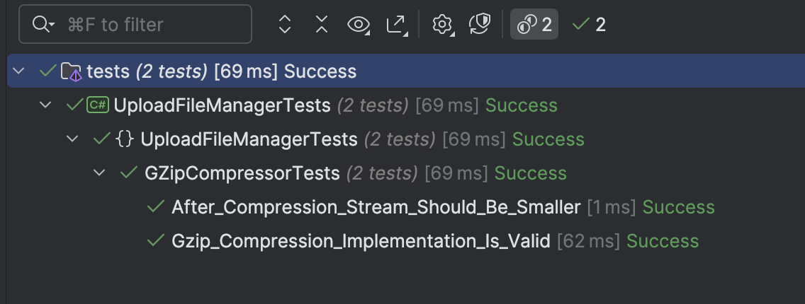

This is Part 8 of a series on Designing, Building & Packaging A Scalable, Testable .NET Open Source Component.

- [Designing, Building & Packaging A Scalable, Testable .NET Open Source Component - Part 1 - Introduction]()
- [Designing, Building & Packaging A Scalable, Testable .NET Open Source Component - Part 2 - Basic Requirements]()
- [Designing, Building & Packaging A Scalable, Testable .NET Open Source Component - Part 3 - Project Setup]()
- [Designing, Building & Packaging A Scalable, Testable .NET Open Source Component - Part 4 - Types & Contracts]()
- [Designing, Building & Packaging A Scalable, Testable .NET Open Source Component - Part 5 - Component Implementation]()
- [Designing, Building & Packaging A Scalable, Testable .NET Open Source Component - Part 6 - Mocking & Behaviour Tests]()
- [Designing, Building & Packaging A Scalable, Testable .NET Open Source Component - Part 7 - Sequence Verification With Moq]()
- **Designing, Building & Packaging A Scalable, Testable .NET Open Source Component - Part 8 - Compressor Implementation (This Post)**
- [Designing, Building & Packaging A Scalable, Testable .NET Open Source Component - Part 9 - Encryptor Implementation]()
- [Designing, Building & Packaging A Scalable, Testable .NET Open Source Component - Part 10 - In Memory Storage]()
- [Designing, Building & Packaging A Scalable, Testable .NET Open Source Component - Part 11 - SQL Server Storage]()
- [Designing, Building & Packaging A Scalable, Testable .NET Open Source Component - Part 12 - PostgreSQL Storage]()
- [Designing, Building & Packaging A Scalable, Testable .NET Open Source Component - Part 13 - Database Configuration]()
- [Designing, Building & Packaging A Scalable, Testable .NET Open Source Component - Part 14 - Virtualizing Infrastructure]()
- [Designing, Building & Packaging A Scalable, Testable .NET Open Source Component - Part 15 - Test Organization]()
- [Designing, Building & Packaging A Scalable, Testable .NET Open Source Component - Part 16 - Large File Consideration]()
- [Designing, Building & Packaging A Scalable, Testable .NET Open Source Component - Part 17 - Large File Consideration On PostgreSQL]()
- [Designing, Building & Packaging A Scalable, Testable .NET Open Source Component - Part 18 - Azure Blob Storage]()

Our [last post]() looked at **verifying the sequencing** of the services we are calling to assert our **expected behaviour**.

This post will look at the first of the **concrete implementations** - the `ZipCompressor`.

As a reminder, this is the interface of the `ICompressor`

```c#
public interface IFileCompressor
{
    /// <summary>
    /// Compression algorithm to use
    /// </summary>
    public CompressionAlgorithm CompressionAlgorithm { get; }

    /// <summary>
    /// Compress stream
    /// </summary>
    /// <param name="data"></param>
    /// <returns></returns>
    public Stream Compress(Stream data);

    /// <summary>
    /// De-compress the stream
    /// </summary>
    /// <param name="data"></param>
    /// <returns></returns>
    public Stream Decompress(Stream data);

```

We will need to implement two methods - `Compress` and `Decompress`, as well as a read-only property, `CompressionAlgorithm`.

The concrete implementation of the `GZipCompressor` is as follows:

```c#
/// <summary>
/// Component that zips and unzips streams
/// </summary>
public sealed class GZipCompressor : IFileCompressor
{
    /// <summary>
    /// Return the compression algorithm in use - Zip
    /// </summary>
    public CompressionAlgorithm CompressionAlgorithm => CompressionAlgorithm.Zip;

    /// <inheritdoc />
    public Stream Compress(Stream data)
    {
        // Ensure the stream is positioned at start
        data.Position = 0;

        // Create a memory stream to hold the compressed data
        var compressedStream = new MemoryStream();

        // Use GZipStream to compress the data. Leave open so that
        // the downstream components can use it
        using (var gzipStream = new GZipStream(compressedStream, CompressionMode.Compress, leaveOpen: true))
        {
            // Copy the input stream into the GZip stream
            data.CopyTo(gzipStream);
        }

        // Set the position of the compressed stream to the beginning
        compressedStream.Position = 0;

        return compressedStream;
    }

    /// <inheritdoc />
    public Stream Decompress(Stream data)
    {
        // Ensure the stream is positioned at start
        data.Position = 0;

        // Create a memory stream to hold the decompressed data
        var decompressedStream = new MemoryStream();

        // Use GZipStream to decompress the data. Leave open so that
        // the downstream components can use it
        using (var gzipStream = new GZipStream(data, CompressionMode.Decompress))
        {
            // Copy the decompressed data into the memory stream
            gzipStream.CopyTo(decompressedStream);
        }

        // Set the position of the decompressed stream to the beginning
        decompressedStream.Position = 0;

        return decompressedStream;
    }
}
```

The next order of business is to **test** this.

At this point, we need to ask ourselves, **what are we testing?**

Two things:

1. That the **compression** took place, i.e., the stream is smaller.
2. That the compressed stream is a **valid** [Gzip](https://en.wikipedia.org/wiki/Gzip)

If you are wondering why **GZip** and not **Zip**? **Gzip** supports compression of a **single file**. **Zip** allows compression of **one or more files**, plus additional options such as setting a **passwords\**

The first is relatively straightforward -- we can **get the size** of the input `stream`, **compress** it, **get the size** of the compressed `stream`, **decompress** it, and then **validate that the final `stream` is the same as the original `stream`**. It is not sufficient to check the stream size after compression - for all you know, the code might have **corrupted** the `stream`.

The following test will achieve this:

```c#
public class GZipCompressorTests
{
    private readonly GZipCompressor _gzipCompressor;

    public GZipCompressorTests()
    {
        _gzipCompressor = new GZipCompressor();
    }

    [Fact]
    public void After_Compression_Stream_Should_Be_Smaller()
    {
        // Arrange

        var faker = new Faker();
        var originalData = faker.Lorem.Sentences(10);
        var streamToCompress = new MemoryStream(Encoding.Default.GetBytes(originalData));
        var originalStreamSize = streamToCompress.Length;

        // Act

        var compressedStream = _gzipCompressor.Compress(streamToCompress);
        var compressedStreamSize = compressedStream.Length;
        var decompressedStream = _gzipCompressor.Decompress(compressedStream);

        var decompressedData = Encoding.Default.GetString(decompressedStream.GetBytes());

        // Assert

        // Check that the size is smaller, or at worst, equal
        compressedStreamSize.Should().BeLessThanOrEqualTo(originalStreamSize);
        // Check that the decompression was successful
        originalData.Should().Be(decompressedData);
        // Check the compression mode
        _gzipCompressor.CompressionAlgorithm.Should().Be(CompressionAlgorithm.Zip);
    }
}
```

A couple of things to note:

1. The **constructor** for the test is constructing an instance of the `GZipCompressor` that is used throughout the tests.
2. I am using the [Bogus](https://github.com/bchavez/Bogus) package to generate some random sentences (10) using the `Lorem.Sentences()` method in the `Faker`.
3. I then use the [GetBytes](https://learn.microsoft.com/en-us/dotnet/api/system.text.encoding.getbytes?view=net-9.0) method of the [Encoding](https://learn.microsoft.com/en-us/dotnet/api/system.text.encoding?view=net-9.0) to transform the string into an array of bytes, which I then use to construct a MemoryStream.
4. I have created an extension method to assist with converting a [MemoryStream](https://learn.microsoft.com/en-us/dotnet/api/system.io.memorystream?view=net-9.0) to a `byte` array.

```c#
public static class StreamExtensions
{
    /// <summary>
    /// Given a stream, get a byte array
    /// </summary>
    /// <param name="stream"></param>
    /// <returns></returns>
    public static byte[] GetBytes(this Stream stream)
    {
        using (var memoryStream = new MemoryStream())
        {
            stream.CopyTo(memoryStream);
            return memoryStream.ToArray();
        }
    }
}
```

Next, we want to test whether the `Gzip` algorithm is accurate in its implementation in `System compression`.

The best way to do this is to get a **different component** to test with, and we will use [DotNetZip.Original](https://www.nuget.org/packages/DotNetZip.Original/)

The test will be as follows:

1. **Compress** data using both our component and **DotNetZip.**
2. **Decompress** using both our component and **DotNetZip**.
3. Verify that our original data is the same for both cases.

If they are identical, then we can be (reasonably) confident that the file is being **GZipped** correctly.

```c#
[Fact]
public void Gzip_Compression_Implementation_Is_Valid()
{
    var faker = new Faker();
    var originalData = faker.Lorem.Sentences(10);
    var originalDataBytes = Encoding.Default.GetBytes(originalData);
    var streamToCompress = new MemoryStream(originalDataBytes);

    // Create a memory stream to hold the compressed data
    var compressedStream = new MemoryStream();

    // Use DotNetZip's GZipStream to compress
    using (var gzipStream = new Ionic.Zlib.GZipStream(compressedStream, Ionic.Zlib.CompressionMode.Compress,
               leaveOpen: true))
    {
        streamToCompress.CopyTo(gzipStream);
    }

    compressedStream.Position = 0;

    // Decompress using GZipStream
    var decompressedStream = new MemoryStream();
    using (var gzipStream = new Ionic.Zlib.GZipStream(compressedStream, Ionic.Zlib.CompressionMode.Decompress))
    {
        gzipStream.CopyTo(decompressedStream);
    }

    // Reset the position of the decompressed stream to the beginning
    decompressedStream.Position = 0;

    var originalFromDotNetZip = decompressedStream.ToArray();

    // Now compress and decompress using our component
    var originalFromComponent = _gzipCompressor.Decompress(_gzipCompressor.Compress(streamToCompress)).GetBytes();
    originalFromDotNetZip.Should().BeEquivalentTo(originalFromComponent);
}
```

If we run our tests, we should see the following:



**Success!**

In our [next post](), we will create a **concrete implementation** of the `IFileEncryptor`.

### TLDR

**In this post, we created a concrete implementation of the `IFileCompressor` interface and wrote tests to verify that it performs as expected.**

The code is in my [GitHub](https://github.com/conradakunga/UploadFileManager).

Happy Hacking!
