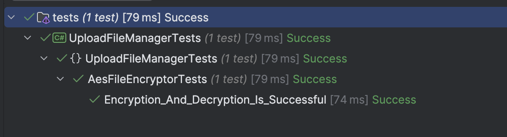

This is Part 9 of a series on Designing, Building & Packaging A Scalable, Testable .NET Open Source Component.

- [Designing, Building & Packaging A Scalable, Testable .NET Open Source Component - Part 1 - Introduction]()
- [Designing, Building & Packaging A Scalable, Testable .NET Open Source Component - Part 2 - Basic Requirements]()
- [Designing, Building & Packaging A Scalable, Testable .NET Open Source Component - Part 3 - Project Setup]()
- [Designing, Building & Packaging A Scalable, Testable .NET Open Source Component - Part 4 - Types & Contracts]()
- [Designing, Building & Packaging A Scalable, Testable .NET Open Source Component - Part 5 - Component Implementation]()
- [Designing, Building & Packaging A Scalable, Testable .NET Open Source Component - Part 6 - Mocking & Behaviour Tests]()
- [Designing, Building & Packaging A Scalable, Testable .NET Open Source Component - Part 7 - Sequence Verification With Moq]()
- [Designing, Building & Packaging A Scalable, Testable .NET Open Source Component - Part 8 - Compressor Implementation]()
- **Designing, Building & Packaging A Scalable, Testable .NET Open Source Component - Part 9 - Encryptor Implementation (This Post)**
- [Designing, Building & Packaging A Scalable, Testable .NET Open Source Component - Part 10 - In Memory Storage]()
- [Designing, Building & Packaging A Scalable, Testable .NET Open Source Component - Part 11 - SQL Server Storage]()
- [Designing, Building & Packaging A Scalable, Testable .NET Open Source Component - Part 11 - PostgreSQL Storage]()

In our [last post](), we implemented the `IFileCompressor` interface via the `GzipFileCompressor` implementation.

In this post, we shall implement the next service - the `IFileEncryptor`.

The interface looks like this:

```c#
/// <summary>
/// File encryption & decryption contract
/// </summary>
public interface IFileEncryptor
{
    /// <summary>
    /// Compression algorithm to use
    /// </summary>
    EncryptionAlgorithm EncryptionAlgorithm { get; }

    /// <summary>
    /// Encrypt the stream
    /// </summary>
    /// <param name="data"></param>
    /// <returns></returns>
    public Stream Encrypt(Stream data);

    /// <summary>
    /// Decrypt the stream
    /// </summary>
    /// <param name="data"></param>
    /// <returns></returns>
    public Stream Decrypt(Stream data);
}
```

The [AES standard for encryption](https://en.wikipedia.org/wiki/Advanced_Encryption_Standard) requires two parameters - an [initialization key](https://learn.microsoft.com/en-us/dotnet/api/system.security.cryptography.symmetricalgorithm.key?view=net-9.0) and an [initialization vector](https://learn.microsoft.com/en-us/dotnet/api/system.security.cryptography.symmetricalgorithm.iv?view=net-9.0#system-security-cryptography-symmetricalgorithm-iv).

These must be provided to the service to carry out the encryption and decryption. To simplify it, we will have overloaded **constructors** that accept these parameters as `byte` arrays or `strings`.

These values will be **stored and managed by the host application** and passed to the component at runtime.

The implementation will look like this:

```c#
/// <summary>
/// Component to use Aes to encrypt streams
/// </summary>
public sealed class AesFileEncryptor : IFileEncryptor
{
    /// <inheritdoc />
    public EncryptionAlgorithm EncryptionAlgorithm => EncryptionAlgorithm.Aes;

    private readonly byte[] _key;
    private readonly byte[] _iv;

    /// <summary>
    /// Constructor that takes AES parameters as string
    /// </summary>
    /// <param name="key"></param>
    /// <param name="iv"></param>
    public AesFileEncryptor(string key, string iv)
    {
        _key = Encoding.Default.GetBytes(key);
        _iv = Encoding.Default.GetBytes(iv);
    }

    /// <summary>
    /// Constructor that takes AES parameters as byte arrays 
    /// </summary>
    /// <param name="key"></param>
    /// <param name="iv"></param>
    public AesFileEncryptor(byte[] key, byte[] iv)
    {
        _key = key;
        _iv = iv;
    }

    /// <inheritdoc />
    public Stream Encrypt(Stream data)
    {
        // Create Aes object & initialize
        using var aes = Aes.Create();
        aes.Key = _key;
        aes.IV = _iv;
        aes.Mode = CipherMode.CBC;
        aes.Padding = PaddingMode.PKCS7;

        var outputStream = new MemoryStream();

        // Encrypt
        using (var cryptoStream =
               new CryptoStream(outputStream, aes.CreateEncryptor(), CryptoStreamMode.Write, leaveOpen: true))
        {
            data.CopyTo(cryptoStream);
            cryptoStream.FlushFinalBlock();
        }

        outputStream.Position = 0;
        return outputStream;
    }

    /// <inheritdoc />
    public Stream Decrypt(Stream data)
    {
        // Create Aes object & initialize
        using var aes = Aes.Create();
        aes.Key = _key;
        aes.IV = _iv;
        aes.Mode = CipherMode.CBC;
        aes.Padding = PaddingMode.PKCS7;

        var outputStream = new MemoryStream();

        // Decrypt
        using (var cryptoStream = new CryptoStream(data, aes.CreateDecryptor(), CryptoStreamMode.Read, leaveOpen: true))
        {
            cryptoStream.CopyTo(outputStream);
        }

        outputStream.Position = 0;
        return outputStream;
    }
}
```

Next, we turn our attention to testing.

Again, we must ask - what are we testing?

1. That a payload that is **encrypted** and **decrypted** must **match** the original
2. The **encrypted** payload must be **different** from the decrypted payload.

The test will look like this:

```c#
public class AesFileEncryptorTests
{
    private readonly byte[] _key;
    private readonly byte[] _iv;

    public AesFileEncryptorTests()
    {
        using var aes = Aes.Create();
        aes.KeySize = 256;
        aes.GenerateKey();
        aes.GenerateIV();

        _key = aes.Key;
        _iv = aes.IV;
    }

    [Fact]
    public void Encryption_And_Decryption_Is_Successful()
    {
        var faker = new Faker();
        var originalData = faker.Lorem.Sentences(10);
        var dataToCompress = Encoding.UTF8.GetBytes(originalData);
        var streamToCompress = new MemoryStream(dataToCompress);
        var encryptor = new AesFileEncryptor(_key, _iv);

        // Encrypt the stream and fetch data
        using (var encryptedStream = encryptor.Encrypt(streamToCompress))
        {
            var encryptedData = encryptedStream.GetBytes();

            using (var decryptedStream = encryptor.Decrypt(encryptedStream))
            {
                var decryptedData = decryptedStream.GetBytes();

                // Check encryption actually changed the data
                encryptedData.Should().NotBeEquivalentTo(originalData);
                // Check decompressed data matches original data
                decryptedData.Should().BeEquivalentTo(dataToCompress);
            }
        }
    }
}
```

If we run this test:



And with this, our service for **encryption** and **decryption** is complete.

In our next post, we will implement the `IFilePersistor` interface to actually store the file.

### TLDR

**In this post, we created an `AesFileEncryptor` component that implemented the `IFileEncryptor` interface and wrote tests to verify its functionality.**

The code is in my [GitHub](https://github.com/conradakunga/UploadFileManager).

Happy hacking!
