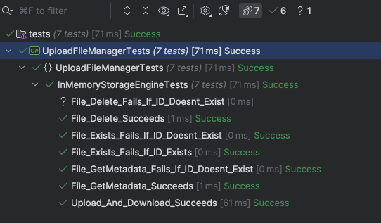

This is Part 10 of a series on Designing, Building & Packaging A Scalable, Testable .NET Open Source Component.

- [Designing, Building & Packaging A Scalable, Testable .NET Open Source Component - Part 1 - Introduction]()
- [Designing, Building & Packaging A Scalable, Testable .NET Open Source Component - Part 2 - Basic Requirements]()
- [Designing, Building & Packaging A Scalable, Testable .NET Open Source Component - Part 3 - Project Setup]()
- [Designing, Building & Packaging A Scalable, Testable .NET Open Source Component - Part 4 - Types & Contracts]()
- [Designing, Building & Packaging A Scalable, Testable .NET Open Source Component - Part 5 - Component Implementation]()
- [Designing, Building & Packaging A Scalable, Testable .NET Open Source Component - Part 6 - Mocking & Behaviour Tests]()
- [Designing, Building & Packaging A Scalable, Testable .NET Open Source Component - Part 7 - Sequence Verification With Moq]()
- [Designing, Building & Packaging A Scalable, Testable .NET Open Source Component - Part 8 - Compressor Implementation]()
- [Designing, Building & Packaging A Scalable, Testable .NET Open Source Component - Part 9 - Encryptor Implementation]()
- **Designing, Building & Packaging A Scalable, Testable .NET Open Source Component - Part 10 - In Memory Storage (This Post)**
- [Designing, Building & Packaging A Scalable, Testable .NET Open Source Component - Part 11 - SQL Server Storage]()
- [Designing, Building & Packaging A Scalable, Testable .NET Open Source Component - Part 12 - PostgreSQL Storage]()
- [Designing, Building & Packaging A Scalable, Testable .NET Open Source Component - Part 13 - Database Configuration]()
- [Designing, Building & Packaging A Scalable, Testable .NET Open Source Component - Part 14 - Virtualizing Infrastructure]()
- [Designing, Building & Packaging A Scalable, Testable .NET Open Source Component - Part 15 - Test Organization]()
- [Designing, Building & Packaging A Scalable, Testable .NET Open Source Component - Part 16 - Large File Consideration]()
- [Designing, Building & Packaging A Scalable, Testable .NET Open Source Component - Part 17 - Large File Consideration On PostgreSQL]()
- [Designing, Building & Packaging A Scalable, Testable .NET Open Source Component - Part 18 - Azure Blob Storage]()
- [Designing, Building & Packaging A Scalable, Testable .NET Open Source Component - Part 19 - Testing Azure Blob Storage Locally]()
- [Designing, Building & Packaging A Scalable, Testable .NET Open Source Component - Part 20 - Amazon S3 Storage]()
- [Designing, Building & Packaging A Scalable, Testable .NET Open Source Component - Part 21 - Testing Amazon S3 Storage Locally]() 

In our [last post](), we implemented the `IFileEncryptor` interface into a concrete implementation - the `AesFileEncryptor`.

In this post, we will start working on the **storage engines**.

Having thought about it some more, here are the engines we will implement:

1. **In Memory** - the files are stored in memory.
2. **File System** - the files are stored on disk in a folder.
3. **SQL Server** - the files are stored in a SQL Server database.
4. **PostgreSQL** - the files are stored in a PostgreSQL database.
5. **Azure** object storage.
6. **Amazon** object storage.

We shall start with the **In Memory** storage.

The use case for this is for quick and dirty **prototyping and testing**, where you want to verify that your application works.

Off the top of my head, here are a few things to consider

1. As it is in memory, we will need a data structure to store the **ID** and the **data**, probably a dictionary.
2. The structure will need to be **thread-safe**.
3. Again, as it is in memory, the **data is lost when the host application stops**.

We will begin by renaming the `IFilePersistor` interface to the `IStorageEngine` to reflect its intentions better.

The interface is now as follows:

```c#
/// <summary>
/// The contract for storage engine implementation
/// </summary>
public interface IStorageEngine
{
    /// <summary>
    /// Persist the file
    /// </summary>
    /// <param name="fileName"></param>
    /// <param name="extension"></param>
    /// <param name="data"></param>
    /// <param name="cancellationToken"></param>
    /// <returns></returns>
    Task<FileMetadata> StoreFileAsync(string fileName, string extension, Stream data,
        CancellationToken cancellationToken = default);

    /// <summary>
    /// Get the file metadata
    /// </summary>
    /// <param name="fileId"></param>
    /// <param name="cancellationToken"></param>
    /// <returns></returns>
    Task<FileMetadata> GetMetadataAsync(Guid fileId, CancellationToken cancellationToken = default);

    /// <summary>
    /// Get the file
    /// </summary>
    /// <param name="fileId"></param>
    /// <param name="cancellationToken"></param>
    /// <returns></returns>
    Task<Stream> GetFileAsync(Guid fileId, CancellationToken cancellationToken = default);

    /// <summary>
    /// Delete the file
    /// </summary>
    /// <param name="fileId"></param>
    /// <param name="cancellationToken"></param>
    /// <returns></returns>
    Task DeleteFileAsync(Guid fileId, CancellationToken cancellationToken = default);

    /// <summary>
    /// Check if the file exists
    /// </summary>
    /// <param name="fileId"></param>
    /// <param name="cancellationToken"></param>
    /// <returns></returns>
    Task<bool> FileExistsAsync(Guid fileId, CancellationToken cancellationToken = default);
}
```

`Let` us now implement it.

For storage, we will use a `ConcurrentDictionary`, and use the `fileId` as the key with the value being a [Tuple](https://learn.microsoft.com/en-us/dotnet/api/system.tuple?view=net-9.0) of `FileMetadata` and `MemoryStream`.

Again, we are using `Streams` in case we need to deal with large files.

```c#
public class InMemoryStorageEngine : IStorageEngine
{
    // In-memory store for files and metadata
    private readonly ConcurrentDictionary<Guid, (FileMetadata MetaData, MemoryStream Stream)> _files;

    /// <summary>
    /// Constructor
    /// </summary>
    public InMemoryStorageEngine()
    {
        // Initialize the dictionary
        _files = new ConcurrentDictionary<Guid, (FileMetadata, MemoryStream)>();
    }
}
```

Now we can implement the members.

First is `FileExistsAsync`, which checks if the file **exists**.

```c#
/// <inheritdoc />
public Task<bool> FileExistsAsync(Guid fileId, CancellationToken cancellationToken = default)
{
    // Check if key is in the dictionary
    return Task.FromResult(_files.ContainsKey(fileId));
}
```

Next is `DeleteFileAsync`, which **deletes** the file.

```c#
/// <inheritdoc />
public Task DeleteFileAsync(Guid fileId, CancellationToken cancellationToken = default)
{
    // Remove file. Whether the ID is there or not
    _files.Remove(fileId, out _);
    return Task.CompletedTask;
}
```

Next is `GetFileAsync`, which **gets** the file as a `Stream`.

```c#
/// <inheritdoc />
public Task<Stream> GetFileAsync(Guid fileId, CancellationToken cancellationToken = default)
{
    // Try to fetch the file
    if (_files.TryGetValue(fileId, out var file))
    {
        return Task.FromResult<Stream>(file.Stream);
    }

    throw new FileNotFoundException();
}
```

Next is `GetMetadataAsync`, which gets the `FileMetadata`.

```c#
/// <inheritdoc />
public Task<FileMetadata> GetMetadataAsync(Guid fileId, CancellationToken cancellationToken = default)
{
    // Try to fetch the file metadata 
    if (_files.TryGetValue(fileId, out var file))
    {
        return Task.FromResult(file.MetaData);
    }

    throw new FileNotFoundException();
}
```

Finally, `StoreFileAsync`, which persists the file.

While examining the interface, I realized that there is an **improvement** we can make.

Currently, the `IFileStorageEngine` `StoreFileAsync()` looks like this:

```c#
Task<FileMetadata> StoreFileAsync(string fileName, string extension, Stream data,
      CancellationToken cancellationToken = default);
```

Given that the `UploadFileManager` generates the `FileMetadata`, we can pass that **directly** to the storage engine - no need to pass the `fileName` and the `extension`, as they are already in the `FileMetadata`.

We therefore change the contract like so:

```c#
Task<FileMetadata> StoreFileAsync(FileMetadata metaData, Stream data,
      CancellationToken cancellationToken = default)
```

The `StoreFileAsync` now looks like this:

```c#
/// <inheritdoc />
public Task<FileMetadata> StoreFileAsync(FileMetadata metaData, Stream data,
    CancellationToken cancellationToken = default)
{
    // Copy to a memory stream for storage
    var memoryStream = new MemoryStream();
    data.CopyTo(memoryStream);
    memoryStream.Position = 0;

    // Store the stream
    _files[metaData.FileId] = (metaData, memoryStream);
    return Task.FromResult(metaData);
}
```

We can now write some **tests** to verify that our component works.

```c#
public class InMemoryStorageEngineTests
{
    private readonly UploadFileManager _manager;

    public InMemoryStorageEngineTests()
    {
        // Create a file compressor
        var compressor = new GZipCompressor();
        //
        // Create an encryptor
        //

        // Create Aes object
        var aes = Aes.Create();
        // Create the encryptor
        var encryptor = new AesFileEncryptor(aes.Key, aes.IV);

        // Create the storage engine
        var storageEngine = new InMemoryStorageEngine();

        // Create the time provider
        var timeProvider = new FakeTimeProvider();
        timeProvider.SetUtcNow(new DateTimeOffset(2025, 1, 1, 0, 0, 0, TimeSpan.Zero));

        // Create the file manager
        _manager = new UploadFileManager(storageEngine, encryptor, compressor, timeProvider);
    }

    private static MemoryStream GetFile()
    {
        var faker = new Faker();
        var dataToStore = faker.Lorem.Sentences(20);
        var dataToStoreStream = new MemoryStream(Encoding.UTF8.GetBytes(dataToStore));
        return dataToStoreStream;
    }

    private async Task<FileMetadata> Upload(MemoryStream data)
    {
        return await _manager.UploadFileAsync("Test.txt", ".txt", data, CancellationToken.None);
    }

    [Fact]
    public async Task Upload_And_Download_Succeeds()
    {
        // Get the data
        var data = GetFile();
        // Upload a file
        var uploadMetadata = await Upload(data);
        // Check the metadata
        uploadMetadata.Should().NotBeNull();
        uploadMetadata.FileId.Should().NotBeEmpty();
        // Download the file
        var download = await _manager.DownloadFileAsync(uploadMetadata.FileId);
        download.GetBytes().Should().BeEquivalentTo(data.GetBytes());
    }

    [Fact]
    public async Task File_Exists_Fails_If_ID_Doesnt_Exist()
    {
        // Check if the file exists
        var result = await _manager.FileExistsAsync(Guid.Empty);
        result.Should().BeFalse();
    }

    [Fact]
    public async Task File_Exists_Fails_If_ID_Exists()
    {
        // Get the data
        var data = GetFile();
        // Upload a file
        var uploadMetadata = await Upload(data);
        // Check if the file exists by ID
        var result = await _manager.FileExistsAsync(uploadMetadata.FileId);
        result.Should().BeTrue();
    }

    [Fact]
    public async Task File_Delete_Succeeds()
    {
        // Get the data
        var data = GetFile();
        // Upload a file
        var uploadMetadata = await Upload(data);
        // Check if the file exists
        var result = await _manager.FileExistsAsync(uploadMetadata.FileId);
        result.Should().BeTrue();
        // Delete the file
        await _manager.DeleteFileAsync(uploadMetadata.FileId);
        // Check again if the file exists
        result = await _manager.FileExistsAsync(uploadMetadata.FileId);
        result.Should().BeFalse();
    }

    [Fact]
    public async Task File_GetMetadata_Succeeds()
    {
        // Get the data
        var data = GetFile();
        // Upload a file
        var uploadMetadata = await Upload(data);
        // Get the metadata from the ID
        var storedMetadata = await _manager.FetchMetadataAsync(uploadMetadata.FileId);
        storedMetadata.Should().NotBeNull();
        storedMetadata.Should().Be(uploadMetadata);
    }
    
    [Fact]
    public async Task File_GetMetadata_Fails_If_ID_Doesnt_Exist()
    {
        // Fetch metadata for non-existent ID
        var ex = await Record.ExceptionAsync(() => _manager.FetchMetadataAsync(Guid.Empty));
        ex.Should().BeOfType<FileNotFoundException>();
    }

    [Fact]
    public async Task File_Delete_Fails_If_ID_Doesnt_Exist()
    {
        // Delete a non-existent file id
        var ex = await Record.ExceptionAsync(() => _manager.DeleteFileAsync(Guid.Empty));
        ex.Should().BeOfType<FileNotFoundException>();
    }
}
```

Our tests should pass successfully.



With that, we have a working component capable of **receiving**, **compressing**, **decrypting**, and **storing** files (in memory), as well as **retrieving** them, **retrieving** their **metadata**, checking whether they **exist**, and **deleting** them.

In our [next post](), we will implement the SQL Server storage engine.

### TLDR

**In this post, we have implemented a working In-Memory storage engine, the `InMemoryStorageEngine`**

The code is in my [GitHub](https://github.com/conradakunga/UploadFileManager).

Happy hacking
