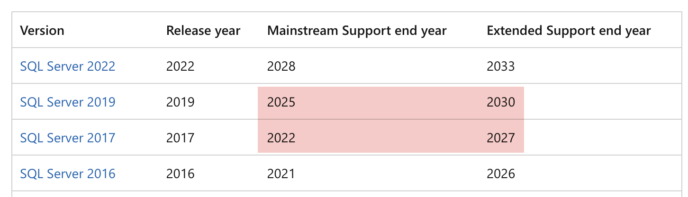
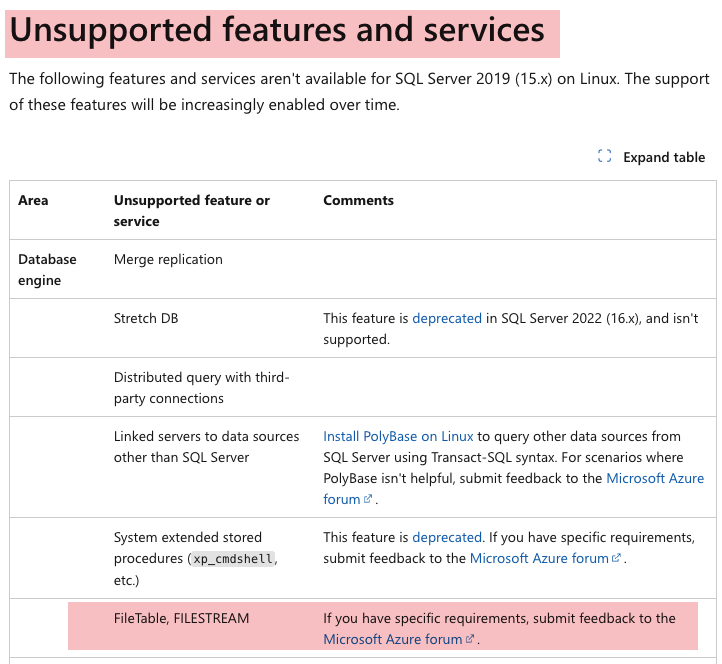
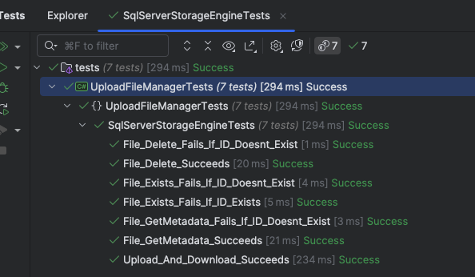

This is Part 11 of a series on Designing, Building & Packaging A Scalable, Testable .NET Open Source Component.

- [Designing, Building & Packaging A Scalable, Testable .NET Open Source Component - Part 1 - Introduction]()
- [Designing, Building & Packaging A Scalable, Testable .NET Open Source Component - Part 2 - Basic Requirements]()
- [Designing, Building & Packaging A Scalable, Testable .NET Open Source Component - Part 3 - Project Setup]()
- [Designing, Building & Packaging A Scalable, Testable .NET Open Source Component - Part 4 - Types & Contracts]()
- [Designing, Building & Packaging A Scalable, Testable .NET Open Source Component - Part 5 - Component Implementation]()
- [Designing, Building & Packaging A Scalable, Testable .NET Open Source Component - Part 6 - Mocking & Behaviour Tests]()
- [Designing, Building & Packaging A Scalable, Testable .NET Open Source Component - Part 7 - Sequence Verification With Moq]()
- [Designing, Building & Packaging A Scalable, Testable .NET Open Source Component - Part 8 - Compressor Implementation]()
- [Designing, Building & Packaging A Scalable, Testable .NET Open Source Component - Part 9 - Encryptor Implementation]()
- [Designing, Building & Packaging A Scalable, Testable .NET Open Source Component - Part 10 - In Memory Storage]()
- **Designing, Building & Packaging A Scalable, Testable .NET Open Source Component - Part 11 - SQL Server Storage (This Post)**

In our [last post](), we implemented the `InMemory` storage engine that stores files in **memory**.

In this post, we shall write an engine that uses [SQL Server](https://www.microsoft.com/en-us/sql-server) storage.

Before we implement there are a number of things to think about:

1. What **versions** of SQL Server are we going to support
2. What **expectations** do we have, and what **assumptions** are we going to make about the **setup**, **configuration** and **features** of the SQL Server instance?

### SQL Server Versions

In terms of versions we can look at this in two ways.

The first is the **product version**.

This table lists the most recent ones:

| Version Name     | Release Year |
|------------------|--------------|
| SQL Server 2012  | 2012         |
| SQL Server 2014  | 2014         |
| SQL Server 2016  | 2016         |
| SQL Server 2017  | 2017         |
| SQL Server 2019  | 2019         |
| SQL Server 2022  | 2022         |

Then there is the question of supported operating systems.

Up until SQL 2017, SQL Server was only available for **Windows**.

We want our component to be **cross-platform** so we can eliminate 2016 going backwards.

And since we are in 2025, it is reasonable to assume most folks are on **SQL Server 2019** and **SQL Server 2022**, maybe a few on **SQL Server 2017**.

From the [Microsoft SQL Server End Of Support options page](https://learn.microsoft.com/en-us/sql/sql-server/end-of-support/sql-server-end-of-support-overview?view=sql-server-ver16), **SQL Server 2017** is out of mainstream support, and **SQL Server 2019** is going into that this year.



Thus, we can say we will support the following, for Windows and Linux.

| Version Name    | Release Year |
| --------------- | ------------ |
| SQL Server 2017 | 2017         |
| SQL Server 2019 | 2019         |
| SQL Server 2022 | 2022         |

### SQL Server Configuration And Features

The problem of storing **large binary data in a database** is not a new one, and SQL Server has a novel solution to this - [filestreams](https://learn.microsoft.com/en-us/sql/relational-databases/blob/filestream-sql-server?view=sql-server-ver16). This, however, is only supported on Windows.



This means we cannot use this feature, and have to store the data in a traditional table.

As a reminder, the `IStorageEngine` contract looks like this:

```c#
public interface IStorageEngine
{
    /// <summary>
    /// Persist the file
    /// </summary>
    /// <param name="metaData"></param>
    /// <param name="data"></param>
    /// <param name="cancellationToken"></param>
    /// <returns></returns>
    Task<FileMetadata> StoreFileAsync(FileMetadata metaData, Stream data,
        CancellationToken cancellationToken = default);

    /// <summary>
    /// Get the file metadata
    /// </summary>
    /// <param name="fileId"></param>
    /// <param name="cancellationToken"></param>
    /// <returns></returns>
    Task<FileMetadata> GetMetadataAsync(Guid fileId, CancellationToken cancellationToken = default);

    /// <summary>
    /// Get the file
    /// </summary>
    /// <param name="fileId"></param>
    /// <param name="cancellationToken"></param>
    /// <returns></returns>
    Task<Stream> GetFileAsync(Guid fileId, CancellationToken cancellationToken = default);

    /// <summary>
    /// Delete the file
    /// </summary>
    /// <param name="fileId"></param>
    /// <param name="cancellationToken"></param>
    /// <returns></returns>
    Task DeleteFileAsync(Guid fileId, CancellationToken cancellationToken = default);

    /// <summary>
    /// Check if the file exists
    /// </summary>
    /// <param name="fileId"></param>
    /// <param name="cancellationToken"></param>
    /// <returns></returns>
    Task<bool> FileExistsAsync(Guid fileId, CancellationToken cancellationToken = default);
}
```

In terms of interfacing with SQL Server we have two options:

1. [Entity Framework Core](https://learn.microsoft.com/en-us/ef/core/)
2. [ADO.NET](https://learn.microsoft.com/en-us/dotnet/framework/data/adonet/ado-net-overview) (using [Dapper](https://github.com/DapperLib/Dapper))

We can rule out **Entity Framework Core** because our use case is very straightforward, and there is little need to add the overhead of **Entity Framework Core** libraries to our package.

The first order of business is setting up the **table** in which we will store our data.

```sql
create table Files
(
    FileID               uniqueidentifier primary key not null,
    Name                 nvarchar(500)                not null,
    Extension            nvarchar(10)                 not null,
    DateUploaded         DATETIME2                    not null,
    OriginalSize         int                          not null,
    PersistedSize        int                          not null,
    CompressionAlgorithm tinyint                      not null,
    EncryptionAlgorithm  tinyint                      not null,
    Hash                 binary(32)               not null,
    Data                 varbinary(MAX)
)
```

Next we create an index to make querying metadata faster.

```sql
CREATE NONCLUSTERED INDEX IX_Files_Metadata
    ON Files (FileID)
    INCLUDE (
             Name,
             Extension,
             DateUploaded,
             OriginalSize,
             PersistedSize,
             CompressionAlgorithm,
             EncryptionAlgorithm,
             Hash
        );
```

The thinking here is that the component needs to initialize the database, probably at the application startup.

Thus we need to have the T-SQL code within the component ready for running.

We will also need to pass the component the connection string.

We start by installing [Dapper](https://www.nuget.org/packages/Dapper) to the project.

```bash
dotnet add package Dapper
```

Then we add the new [Microsoft SqlServer](https://www.nuget.org/packages/microsoft.data.sqlclient) provider

```bash
dotnet add package Microsoft.Data.SqlClient
```

Now we can start implementing the `SqlServerStorageEngine`.

```c#
namespace Rad.UploadFileManager;
/// <summary>
/// Sql Server Storage Engine
/// </summary>
public sealed class SqlServerStorageEngine : IStorageEngine
{
    private readonly string _connectionString;

    /// <summary>
    /// Constructor, taking the connection string
    /// </summary>
    /// <param name="connectionString"></param>
    public SqlServerStorageEngine(string connectionString)
    {
        _connectionString = connectionString;
    }
}
```

We start with the `FileExistsAsync` method:

```c#
/// <inheritdoc />
public async Task<bool> FileExistsAsync(Guid fileId, CancellationToken cancellationToken = default)
{
    // Query to check for file existence
    const string sql = "SELECT 1 FROM Files where FileId = @FileId";
    // Create and initialize command
    var command = new CommandDefinition(sql, new { FileId = fileId }, cancellationToken: cancellationToken);
    await using (var cn = new SqlConnection(_connectionString))
    {
        return await cn.QuerySingleOrDefaultAsync<int?>(command) != null;
    }
}
```

Next, `DeleteFileAsync`

```c#
/// <inheritdoc />
public async Task DeleteFileAsync(Guid fileId, CancellationToken cancellationToken = default)
{
    // Query to delete file
    const string sql = "DELETE FROM Files where FileId = @FileId";
    // Create and initialize command
    var command = new CommandDefinition(sql, new { FileId = fileId }, cancellationToken: cancellationToken);
    await using (var cn = new SqlConnection(_connectionString))
    {
        await cn.ExecuteAsync(command);
    }
}
```

Next, `GetFileAsync`

```c#
/// <inheritdoc />
public async Task<Stream> GetFileAsync(Guid fileId, CancellationToken cancellationToken = default)
{
    // Query to fetch file
    const string sql = "SELECT Data FROM Files where FileId = @FileId";
    // Create and initialize command
    var command = new CommandDefinition(sql, new { FileId = fileId }, cancellationToken: cancellationToken);
    await using (var cn = new SqlConnection(_connectionString))
    {
        var result = await cn.QuerySingleAsync<byte[]>(command);
        return new MemoryStream(result);
    }
}
```

Next, `GetMetadataAsync`

```c#
/// <inheritdoc />
public async Task<FileMetadata> GetMetadataAsync(Guid fileId, CancellationToken cancellationToken = default)
{
    // Query to fetch file metadata
    const string sql =
        "SELECT FileID, Name, Extension, DateUploaded, OriginalSize, PersistedSize, CompressionAlgorithm, EncryptionAlgorithm, Hash FROM Files where FileId = @FileId";
    // Create and initialize command
    var command = new CommandDefinition(sql, new { FileId = fileId }, cancellationToken: cancellationToken);
    await using (var cn = new SqlConnection(_connectionString))
    {
        return await cn.QuerySingleAsync<FileMetadata>(command);
    }
}
```

Finally, `StoreFileAsync`

```c#
/// <inheritdoc />
public async Task<FileMetadata> StoreFileAsync(FileMetadata metaData, Stream data,
    CancellationToken cancellationToken = default)
{
    // Query to fetch file metadata
    const string sql = """
                       INSERT INTO Files (
                                  FileID, Name, Extension, DateUploaded,
                                  OriginalSize, PersistedSize, CompressionAlgorithm,
                                  EncryptionAlgorithm, Hash, Data
                              ) VALUES (
                                  @FileID, @Name, @Extension, @DateUploaded,
                                  @OriginalSize, @PersistedSize, @CompressionAlgorithm,
                                  @EncryptionAlgorithm, @Hash, @Data
                              )
                       """;
    // Create and initialize command
    var param = new DynamicParameters();
    param.Add("FileID", metaData.FileId, DbType.Guid);
    param.Add("Name", metaData.Name, DbType.String, size: 500);
    param.Add("Extension", metaData.Extension, DbType.String, size: 10);
    param.Add("DateUploaded", metaData.DateUploaded, DbType.DateTime2);
    param.Add("OriginalSize", metaData.OriginalSize, DbType.Int32);
    param.Add("PersistedSize", metaData.PersistedSize, DbType.Int32);
    param.Add("CompressionAlgorithm", metaData.CompressionAlgorithm, DbType.Byte);
    param.Add("EncryptionAlgorithm", metaData.EncryptionAlgorithm, DbType.Byte);
    param.Add("Hash", metaData.Hash, dbType: DbType.Binary, size: 32);
    param.Add("Data", data, DbType.Binary, size: -1);
    var command = new CommandDefinition(sql, param, cancellationToken: cancellationToken);
    await using (var cn = new SqlConnection(_connectionString))
    {
        await cn.ExecuteAsync(command);
    }

    return metaData;
}
```

A couple of comments:

1. I am passing the [CancellatonToken](https://learn.microsoft.com/en-us/dotnet/api/system.threading.cancellationtoken?view=net-9.0) to the methods, via the Dapper `CommandDefinition` object.
2. What happens if there is an error on the database side? I allow the [SqlException](https://learn.microsoft.com/en-us/dotnet/api/microsoft.data.sqlclient.sqlexception?view=sqlclient-dotnet-standard-5.2) to **bubble up** and he handled by the client.

Finally, tests for the `SqlServerStorageEngine`.

```c#
public class SqlServerStorageEngineTests
{
    private readonly UploadFileManagerBehaviour _managerBehaviour;

    public SqlServerStorageEngineTests()
    {
        // Create a file compressor
        var compressor = new GZipCompressor();
        //
        // Create an encryptor
        //

        // Create Aes object
        var aes = Aes.Create();
        // Create the encryptor
        var encryptor = new AesFileEncryptor(aes.Key, aes.IV);

        // Create the storage engine
        var storageEngine =
            new SqlServerStorageEngine("data source=localhost;uid=sa;pwd=YourStrongPassword123;Database=FileStore;TrustServerCertificate=True;");

        // Create the time provider
        var timeProvider = new FakeTimeProvider();
        timeProvider.SetUtcNow(new DateTimeOffset(2025, 1, 1, 0, 0, 0, TimeSpan.Zero));

        // Create the file manager
        _managerBehaviour = new UploadFileManagerBehaviour(storageEngine, encryptor, compressor, timeProvider);
    }

    private static MemoryStream GetFile()
    {
        var faker = new Faker();
        var dataToStore = faker.Lorem.Sentences(20);
        var dataToStoreStream = new MemoryStream(Encoding.UTF8.GetBytes(dataToStore));
        return dataToStoreStream;
    }

    private async Task<FileMetadata> Upload(MemoryStream data)
    {
        return await _managerBehaviour.UploadFileAsync("Test.txt", ".txt", data, CancellationToken.None);
    }

    [Fact]
    public async Task Upload_And_Download_Succeeds()
    {
        // Get the data
        var data = GetFile();
        // Upload a file
        var uploadMetadata = await Upload(data);
        // Check the metadata
        uploadMetadata.Should().NotBeNull();
        uploadMetadata.FileId.Should().NotBeEmpty();
        // Download the file
        var download = await _managerBehaviour.DownloadFileAsync(uploadMetadata.FileId);
        download.GetBytes().Should().BeEquivalentTo(data.GetBytes());
    }

    [Fact]
    public async Task File_Exists_Fails_If_ID_Doesnt_Exist()
    {
        // Check if the file exists
        var result = await _managerBehaviour.FileExistsAsync(Guid.Empty);
        result.Should().BeFalse();
    }

    [Fact]
    public async Task File_Exists_Fails_If_ID_Exists()
    {
        // Get the data
        var data = GetFile();
        // Upload a file
        var uploadMetadata = await Upload(data);
        // Check if the file exists by ID
        var result = await _managerBehaviour.FileExistsAsync(uploadMetadata.FileId);
        result.Should().BeTrue();
    }

    [Fact]
    public async Task File_Delete_Succeeds()
    {
        // Get the data
        var data = GetFile();
        // Upload a file
        var uploadMetadata = await Upload(data);
        // Check if the file exists
        var result = await _managerBehaviour.FileExistsAsync(uploadMetadata.FileId);
        result.Should().BeTrue();
        // Delete the file
        await _managerBehaviour.DeleteFileAsync(uploadMetadata.FileId);
        // Check again if the file exists
        result = await _managerBehaviour.FileExistsAsync(uploadMetadata.FileId);
        result.Should().BeFalse();
    }

    [Fact]
    public async Task File_GetMetadata_Succeeds()
    {
        // Get the data
        var data = GetFile();
        // Upload a file
        var uploadMetadata = await Upload(data);
        // Get the metadata from the ID
        var storedMetadata = await _managerBehaviour.FetchMetadataAsync(uploadMetadata.FileId);
        storedMetadata.Should().NotBeNull();
        storedMetadata.Should().BeEquivalentTo(uploadMetadata);
    }

    [Fact]
    public async Task File_GetMetadata_Fails_If_ID_Doesnt_Exist()
    {
        // Fetch metadata for non-existent ID
        var ex = await Record.ExceptionAsync(() => _managerBehaviour.FetchMetadataAsync(Guid.Empty));
        ex.Should().BeOfType<FileNotFoundException>();
    }

    [Fact]
    public async Task File_Delete_Fails_If_ID_Doesnt_Exist()
    {
        // Delete a non-existent file id
        var ex = await Record.ExceptionAsync(() => _managerBehaviour.DeleteFileAsync(Guid.Empty));
        ex.Should().BeOfType<FileNotFoundException>();
    }
}
```

Our tests should pass successfully:



In our next post we will implement the PostgreSQL storage engine.

### TLDR

**In this post, we implemented the `SqlServerStorage` engine to persist our files to a SQL Server Database.**

The code is in my GitHub.

Happy hacking!
