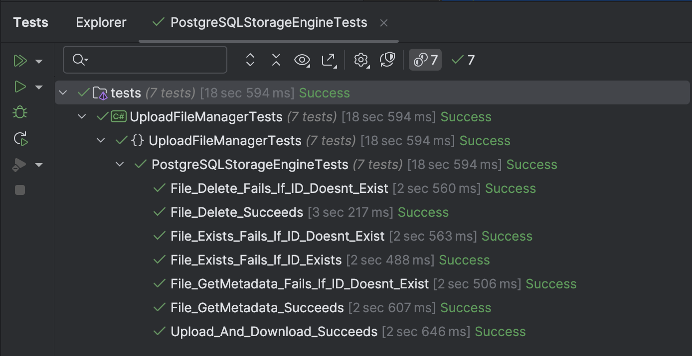

This is Part 12 of a series on Designing, Building & Packaging A Scalable, Testable .NET Open Source Component.

- [Designing, Building & Packaging A Scalable, Testable .NET Open Source Component - Part 1 - Introduction]()
- [Designing, Building & Packaging A Scalable, Testable .NET Open Source Component - Part 2 - Basic Requirements]()
- [Designing, Building & Packaging A Scalable, Testable .NET Open Source Component - Part 3 - Project Setup]()
- [Designing, Building & Packaging A Scalable, Testable .NET Open Source Component - Part 4 - Types & Contracts]()
- [Designing, Building & Packaging A Scalable, Testable .NET Open Source Component - Part 5 - Component Implementation]()
- [Designing, Building & Packaging A Scalable, Testable .NET Open Source Component - Part 6 - Mocking & Behaviour Tests]()
- [Designing, Building & Packaging A Scalable, Testable .NET Open Source Component - Part 7 - Sequence Verification With Moq]()
- [Designing, Building & Packaging A Scalable, Testable .NET Open Source Component - Part 8 - Compressor Implementation]()
- [Designing, Building & Packaging A Scalable, Testable .NET Open Source Component - Part 9 - Encryptor Implementation]()
- [Designing, Building & Packaging A Scalable, Testable .NET Open Source Component - Part 10 - In Memory Storage]()
- [Designing, Building & Packaging A Scalable, Testable .NET Open Source Component - Part 11 - SQL Server Storage]()
- **Designing, Building & Packaging A Scalable, Testable .NET Open Source Component - Part 11 - PostgreSQL Storage (This Post)**
- [Designing, Building & Packaging A Scalable, Testable .NET Open Source Component - Part 13 - Database Configuration]()
- [Designing, Building & Packaging A Scalable, Testable .NET Open Source Component - Part 14 - Virtualizing Infrastructure]()
- [Designing, Building & Packaging A Scalable, Testable .NET Open Source Component - Part 15 - Test Organization]()

In our last post, we implemented the [SQL Server](https://www.microsoft.com/en-us/sql-server) storage engine.

In this post, we shall implement a storage engine for [PostgreSQL](https://www.postgresql.org/).

The most recent versions are as follows:

| Version  | Release Year |
|----------|-------------|
| 17       | 2024        |
| 16       | 2023        |
| 15       | 2022        |

We can start with targeting these versions.

With regards to functionality, there are two options

1. `Byte` arrays, as we implemented with the `SqlServerStorageEngine`
2. [Large Object Storage](https://www.postgresql.org/docs/current/largeobjects.html)

For this first iteration we will use `byte` arrays.

We will also use [Dapper](https://github.com/DapperLib/Dapper) as the data access library.

The first thing to do is to write a script that creates the **table** and **indexes**.

```sql
CREATE DATABASE filestore

-- Connect to the 'filestore' database
\c filestore;

-- Table creation
CREATE TABLE IF NOT EXISTS public.files
(
    fileid               UUID PRIMARY KEY NOT NULL,
    name                 VARCHAR(500)     NOT NULL,
    extension            VARCHAR(10)      NOT NULL,
    dateuploaded         TIMESTAMPTZ      NOT NULL,
    originalsize         INT              NOT NULL,
    persistedsize        INT              NOT NULL,
    compressionalgorithm SMALLINT         NOT NULL,
    encryptionalgorithm  SMALLINT         NOT NULL,
    hash                 BYTEA            NOT NULL,
    data                 BYTEA
);

-- Index creation
CREATE INDEX IF NOT EXISTS ix_files_metadata
    ON public.files (fileid)
    INCLUDE (name, extension, dateuploaded, originalsize, persistedsize, compressionalgorithm, encryptionalgorithm, hash);
```

The `IStorageEngine` interface, as a reminder, looks like this

```c#
/// <summary>
/// The contract for storage engine implementation
/// </summary>
public interface IStorageEngine
{
    /// <summary>
    /// Persist the file
    /// </summary>
    /// <param name="metaData"></param>
    /// <param name="data"></param>
    /// <param name="cancellationToken"></param>
    /// <returns></returns>
    Task<FileMetadata> StoreFileAsync(FileMetadata metaData, Stream data,
        CancellationToken cancellationToken = default);

    /// <summary>
    /// Get the file metadata
    /// </summary>
    /// <param name="fileId"></param>
    /// <param name="cancellationToken"></param>
    /// <returns></returns>
    Task<FileMetadata> GetMetadataAsync(Guid fileId, CancellationToken cancellationToken = default);

    /// <summary>
    /// Get the file
    /// </summary>
    /// <param name="fileId"></param>
    /// <param name="cancellationToken"></param>
    /// <returns></returns>
    Task<Stream> GetFileAsync(Guid fileId, CancellationToken cancellationToken = default);

    /// <summary>
    /// Delete the file
    /// </summary>
    /// <param name="fileId"></param>
    /// <param name="cancellationToken"></param>
    /// <returns></returns>
    Task DeleteFileAsync(Guid fileId, CancellationToken cancellationToken = default);

    /// <summary>
    /// Check if the file exists
    /// </summary>
    /// <param name="fileId"></param>
    /// <param name="cancellationToken"></param>
    /// <returns></returns>
    Task<bool> FileExistsAsync(Guid fileId, CancellationToken cancellationToken = default);
}
```

Before we implement, we need to add the [ADO.NET](https://learn.microsoft.com/en-us/dotnet/framework/data/adonet/) libraries for [Dapper](https://github.com/DapperLib/Dapper) to leverage.

```bash
dotnet add package Npgsql
```

We can implement the `PostgreSQLStorageEngine` as follows:

```c#
/// <summary>
/// PostgreSQL Storage Engine
/// </summary>
public sealed class PosgrgreSQLStorageEngine : IStorageEngine
{
    private readonly string _connectionString;

    /// <summary>
    /// Constructor, taking the connection string
    /// </summary>
    /// <param name="connectionString"></param>
    public PosgrgreSQLStorageEngine(string connectionString)
    {
        _connectionString = connectionString;
    }

    /// <inheritdoc />
    public async Task<FileMetadata> StoreFileAsync(FileMetadata metaData, Stream data,
        CancellationToken cancellationToken = default)
    {
        // Query to fetch file metadata
        const string sql = """
                           INSERT INTO Files (
                                      FileID, Name, Extension, DateUploaded,
                                      OriginalSize, PersistedSize, CompressionAlgorithm,
                                      EncryptionAlgorithm, Hash, Data
                                  ) VALUES (
                                      @FileID, @Name, @Extension, @DateUploaded,
                                      @OriginalSize, @PersistedSize, @CompressionAlgorithm,
                                      @EncryptionAlgorithm, @Hash, @Data
                                  )
                           """;
        // Create and initialize command
        var param = new DynamicParameters();
        param.Add("FileID", metaData.FileId, DbType.Guid);
        param.Add("Name", metaData.Name, DbType.String, size: 500);
        param.Add("Extension", metaData.Extension, DbType.String, size: 10);
        param.Add("DateUploaded", metaData.DateUploaded, DbType.DateTime2);
        param.Add("OriginalSize", metaData.OriginalSize, DbType.Int32);
        param.Add("PersistedSize", metaData.PersistedSize, DbType.Int32);
        param.Add("CompressionAlgorithm", metaData.CompressionAlgorithm, DbType.Byte);
        param.Add("EncryptionAlgorithm", metaData.EncryptionAlgorithm, DbType.Byte);
        param.Add("Hash", metaData.Hash, dbType: DbType.Binary, size: 32);
        param.Add("Data", data, DbType.Binary, size: -1);
        var command = new CommandDefinition(sql, param, cancellationToken: cancellationToken);
        await using (var cn = new NpgsqlConnection(_connectionString))
        {
            await cn.ExecuteAsync(command);
        }

        return metaData;
    }

    /// <inheritdoc />
    public async Task<FileMetadata> GetMetadataAsync(Guid fileId, CancellationToken cancellationToken = default)
    {
        // Query to fetch file metadata
        const string sql =
            "SELECT FileID, Name, Extension, DateUploaded, OriginalSize, PersistedSize, CompressionAlgorithm, EncryptionAlgorithm, Hash FROM Files where FileId = @FileId";
        // Create and initialize command
        var command = new CommandDefinition(sql, new { FileId = fileId }, cancellationToken: cancellationToken);
        await using (var cn = new NpgsqlConnection(_connectionString))
        {
            return await cn.QuerySingleAsync<FileMetadata>(command);
        }
    }

    /// <inheritdoc />
    public async Task<Stream> GetFileAsync(Guid fileId, CancellationToken cancellationToken = default)
    {
        // Query to fetch file
        const string sql = "SELECT Data FROM Files where FileId = @FileId";
        // Create and initialize command
        var command = new CommandDefinition(sql, new { FileId = fileId }, cancellationToken: cancellationToken);
        await using (var cn = new NpgsqlConnection(_connectionString))
        {
            var result = await cn.QuerySingleAsync<byte[]>(command);
            return new MemoryStream(result);
        }
    }

    /// <inheritdoc />
    public async Task DeleteFileAsync(Guid fileId, CancellationToken cancellationToken = default)
    {
        // Query to delete file
        const string sql = "DELETE FROM Files where FileId = @FileId";
        // Create and initialize command
        var command = new CommandDefinition(sql, new { FileId = fileId }, cancellationToken: cancellationToken);
        await using (var cn = new NpgsqlConnection(_connectionString))
        {
            await cn.ExecuteAsync(command);
        }
    }

    /// <inheritdoc />
    public async Task<bool> FileExistsAsync(Guid fileId, CancellationToken cancellationToken = default)
    {
        // Query to check for file existence
        const string sql = "SELECT 1 FROM Files where FileId = @FileId";
        // Create and initialize command
        var command = new CommandDefinition(sql, new { FileId = fileId }, cancellationToken: cancellationToken);
        await using (var cn = new NpgsqlConnection(_connectionString))
        {
            return await cn.QuerySingleOrDefaultAsync<int?>(command) != null;
        }
    }
}
```

You will not the code is almost identical to that of the `SqlServerStorageEngine`, as **Dapper** has abstracted most of the database access code. The only difference is for **SqlServer** we extend the `SqlConnection` object and here we are extending the `NpgsqlConnection` object.

The test, similarly are almost identical.

```c#
public class PostgreSQLStorageEngineTests : IAsyncLifetime
{
    private UploadFileManager _manager;

    // Instance of the database
    private readonly PostgreSqlContainer _db = new PostgreSqlBuilder()
        .WithImage("postgres:17-alpine")
        .WithDatabase(Constants.FileStoreDatabaseName)
        .Build();

    private async Task InitializeDatabaseAsync()
    {
        var queryText = await File.ReadAllTextAsync("PostgreSQLSetup.sql");
        // Split the queries - they are demarcated by two newlines
        var queries = queryText.Split($"{Environment.NewLine}{Environment.NewLine}",
            StringSplitOptions.RemoveEmptyEntries | StringSplitOptions.TrimEntries);
        // Execute each query
        await using (var cn = new NpgsqlConnection(_db.GetConnectionString()))
        {
            foreach (var query in queries)
            {
                await cn.ExecuteAsync(query);
            }
        }
    }

    public async Task InitializeAsync()
    {
        // Start the database
        await _db.StartAsync();

        // Initialize the database
        await InitializeDatabaseAsync();

        // Create a file compressor
        var compressor = new GZipCompressor();

        //
        // Create an encryptor
        //

        // Create Aes object
        var aes = Aes.Create();
        // Create the encryptor
        var encryptor = new AesFileEncryptor(aes.Key, aes.IV);

        // Create the storage engine
        var storageEngine =
            new PosgrgreSQLStorageEngine(_db.GetConnectionString());

        // Create the time provider
        var timeProvider = new FakeTimeProvider();
        timeProvider.SetUtcNow(new DateTimeOffset(2025, 1, 1, 0, 0, 0, TimeSpan.Zero));

        // Create the file manager
        _manager = new UploadFileManager(storageEngine, encryptor, compressor, timeProvider);
    }

    public Task DisposeAsync()
    {
        return _db.DisposeAsync().AsTask();
    }

    private static MemoryStream GetFile()
    {
        var faker = new Faker();
        var dataToStore = faker.Lorem.Sentences(20);
        var dataToStoreStream = new MemoryStream(Encoding.UTF8.GetBytes(dataToStore));
        return dataToStoreStream;
    }

    private async Task<FileMetadata> Upload(MemoryStream data)
    {
        return await _manager.UploadFileAsync("Test.txt", ".txt", data, CancellationToken.None);
    }

    [Fact]
    public async Task Upload_And_Download_Succeeds()
    {
        // Get the data
        var data = GetFile();
        // Upload a file
        var uploadMetadata = await Upload(data);
        // Check the metadata
        uploadMetadata.Should().NotBeNull();
        uploadMetadata.FileId.Should().NotBeEmpty();
        // Download the file
        var download = await _manager.DownloadFileAsync(uploadMetadata.FileId);
        download.GetBytes().Should().BeEquivalentTo(data.GetBytes());
    }

    [Fact]
    public async Task File_Exists_Fails_If_ID_Doesnt_Exist()
    {
        // Check if the file exists
        var result = await _manager.FileExistsAsync(Guid.Empty);
        result.Should().BeFalse();
    }

    [Fact]
    public async Task File_Exists_Fails_If_ID_Exists()
    {
        // Get the data
        var data = GetFile();
        // Upload a file
        var uploadMetadata = await Upload(data);
        // Check if the file exists by ID
        var result = await _manager.FileExistsAsync(uploadMetadata.FileId);
        result.Should().BeTrue();
    }

    [Fact]
    public async Task File_Delete_Succeeds()
    {
        // Get the data
        var data = GetFile();
        // Upload a file
        var uploadMetadata = await Upload(data);
        // Check if the file exists
        var result = await _manager.FileExistsAsync(uploadMetadata.FileId);
        result.Should().BeTrue();
        // Delete the file
        await _manager.DeleteFileAsync(uploadMetadata.FileId);
        // Check again if the file exists
        result = await _manager.FileExistsAsync(uploadMetadata.FileId);
        result.Should().BeFalse();
    }

    [Fact]
    public async Task File_GetMetadata_Succeeds()
    {
        // Get the data
        var data = GetFile();
        // Upload a file
        var uploadMetadata = await Upload(data);
        // Get the metadata from the ID
        var storedMetadata = await _manager.FetchMetadataAsync(uploadMetadata.FileId);
        storedMetadata.Should().NotBeNull();
        storedMetadata.Should().BeEquivalentTo(uploadMetadata);
    }

    [Fact]
    public async Task File_GetMetadata_Fails_If_ID_Doesnt_Exist()
    {
        // Fetch metadata for non-existent ID
        var ex = await Record.ExceptionAsync(() => _manager.FetchMetadataAsync(Guid.Empty));
        ex.Should().BeOfType<FileNotFoundException>();
    }

    [Fact]
    public async Task File_Delete_Fails_If_ID_Doesnt_Exist()
    {
        // Delete a non-existent file id
        var ex = await Record.ExceptionAsync(() => _manager.DeleteFileAsync(Guid.Empty));
        ex.Should().BeOfType<FileNotFoundException>();
    }
}
```

Our tests should succeed.



In the next post we shall look at some of the improvements I have made to make the **testing** easier using **containers**, and how I have refactored the code that **sets up the database**.

### TLDR

**In this post we have implemented the `IStorageEngine` for PostgreSQL**

The code is in my [GitHub](https://github.com/conradakunga/UploadFileManager),

Happy hacking!