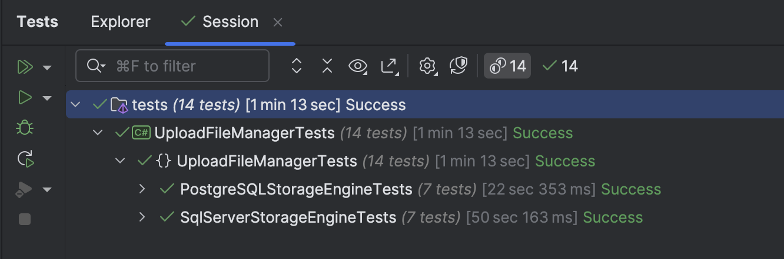

This is Part 14 of a series on Designing, Building & Packaging A Scalable, Testable .NET Open Source Component.

- [Designing, Building & Packaging A Scalable, Testable .NET Open Source Component - Part 1 - Introduction]()
- [Designing, Building & Packaging A Scalable, Testable .NET Open Source Component - Part 2 - Basic Requirements]()
- [Designing, Building & Packaging A Scalable, Testable .NET Open Source Component - Part 3 - Project Setup]()
- [Designing, Building & Packaging A Scalable, Testable .NET Open Source Component - Part 4 - Types & Contracts]()
- [Designing, Building & Packaging A Scalable, Testable .NET Open Source Component - Part 5 - Component Implementation]()
- [Designing, Building & Packaging A Scalable, Testable .NET Open Source Component - Part 6 - Mocking & Behaviour Tests]()
- [Designing, Building & Packaging A Scalable, Testable .NET Open Source Component - Part 7 - Sequence Verification With Moq]()
- [Designing, Building & Packaging A Scalable, Testable .NET Open Source Component - Part 8 - Compressor Implementation]()
- [Designing, Building & Packaging A Scalable, Testable .NET Open Source Component - Part 9 - Encryptor Implementation]()
- [Designing, Building & Packaging A Scalable, Testable .NET Open Source Component - Part 10 - In Memory Storage]()
- [Designing, Building & Packaging A Scalable, Testable .NET Open Source Component - Part 11 - SQL Server Storage]()
- [Designing, Building & Packaging A Scalable, Testable .NET Open Source Component - Part 12 - PostgreSQL Storage]()
- [Designing, Building & Packaging A Scalable, Testable .NET Open Source Component - Part 13 - Database Configuration]()
- **Designing, Building & Packaging A Scalable, Testable .NET Open Source Component - Part 14 - Virtualizing Infrastructure (This Post)**
- [Designing, Building & Packaging A Scalable, Testable .NET Open Source Component - Part 15 - Test Organization]()
- [Designing, Building & Packaging A Scalable, Testable .NET Open Source Component - Part 16 - Large File Consideration]()
- [Designing, Building & Packaging A Scalable, Testable .NET Open Source Component - Part 17 - Large File Consideration On PostgreSQL]()
- [Designing, Building & Packaging A Scalable, Testable .NET Open Source Component - Part 18 - Azure Blob Storage]()

In our last post, we looked at considerations around setting up our databases ([SQL Server](https://www.microsoft.com/en-us/sql-server) or [PostgreSQL](https://www.postgresql.org/)).

In this post, we will look at how to **improve our tests**.

Initially, our integration tests for the storage engines looked like this:

```c#
public SqlServerStorageEngineTests()
{
  //
  // Snipped out code
  //

  // Create the storage engine
  var storageEngine =
  new SqlServerStorageEngine("data source=localhost;uid=sa;pwd=YourStrongPassword123;Database=FileStore;TrustServerCertificate=True;");
  //
  // Snipped out code
  //
}
```

You can see we are pointing at an **actual** database to test.

What if we could **virtualize** the database such that at the point of testing, we spin one up, run the tests, and upon completion trash it altogether, leaving our actual database untouched?

We can.

We make use of a package called [TestContainers](https://testcontainers.com/), and two implementations - [Testcontainers.PostgreSql](https://dotnet.testcontainers.org/modules/postgres/) and [Testcontainers.MsSql](https://dotnet.testcontainers.org/modules/mssql/), which we add to our test projects.

First we install the packages

```bash
dotnet add package Testcontainers.MsSql
dotnet add paclage Testcontainers.PostgreSql
```

Next we update our tests as follows:

1. Implement the `IAsyncLifetime` interface
2. Implement the `InitializeAsync` method
3. Implement the `DisposeAsync` method

The **SQL Server** implementation will look like this:

```c#
public class SqlServerStorageEngineTests : IAsyncLifetime
{
  const string databaseName = "FileStore";
  private UploadFileManager _manager;

  // Instance of the database
  private readonly MsSqlContainer _db = new MsSqlBuilder()
      .WithImage("mcr.microsoft.com/mssql/server:2022-latest")
      .Build();

  private async Task InitializeDatabaseAsync()
  {
      var queryText = await File.ReadAllTextAsync("SqlServerSetup.sql");
      // Execute
      await using (var cn = new SqlConnection(_db.GetConnectionString()))
      {
          await cn.ExecuteAsync(queryText);
      }
  }

  public async Task InitializeAsync()
  {
      // Start the database
      await _db.StartAsync();

      // After starting, create the database manually
      await using var connection = new SqlConnection(_db.GetConnectionString());
      await connection.OpenAsync();

      const string sql = $"""
                          IF NOT EXISTS (SELECT name FROM sys.databases WHERE name = '{databaseName}')
                          BEGIN
                              CREATE DATABASE [{databaseName}];
                          END
                          """;

      await connection.ExecuteAsync(sql);

      // Initialize the database
      await InitializeDatabaseAsync();

      // Create a file compressor
      var compressor = new GZipCompressor();

      //
      // Create an encryptor
      //

      // Create Aes object
      var aes = Aes.Create();
      // Create the encryptor
      var encryptor = new AesFileEncryptor(aes.Key, aes.IV);

      // Create the storage engine
      var storageEngine =
          new SqlServerStorageEngine(_db.GetConnectionString());

      // Create the time provider
      var timeProvider = new FakeTimeProvider();
      timeProvider.SetUtcNow(new DateTimeOffset(2025, 1, 1, 0, 0, 0, TimeSpan.Zero));

      // Create the file manager
      _manager = new UploadFileManager(storageEngine, encryptor, compressor, timeProvider);
  }

  public Task DisposeAsync()
  {
      return _db.DisposeAsync().AsTask();
  }

//
// Actual tests here
//
}
```

And the **PostgreSQL** one will look like this

```c#
public class PostgreSQLStorageEngineTests : IAsyncLifetime
{
  private UploadFileManager _manager;

  // Instance of the database
  private readonly PostgreSqlContainer _db = new PostgreSqlBuilder()
      .WithImage("postgres:17-alpine")
      .WithDatabase("FileStore")
      .Build();

  private async Task InitializeDatabaseAsync()
  {
      var queryText = await File.ReadAllTextAsync("PostgreSQLSetup.sql");
      // Execute
      await using (var cn = new NpgsqlConnection(_db.GetConnectionString()))
      {
          await cn.ExecuteAsync(queryText);
      }
  }

  public async Task InitializeAsync()
  {
      // Start the database
      await _db.StartAsync();

      // Initialize the database
      await InitializeDatabaseAsync();

      // Create a file compressor
      var compressor = new GZipCompressor();

      //
      // Create an encryptor
      //

      // Create Aes object
      var aes = Aes.Create();
      // Create the encryptor
      var encryptor = new AesFileEncryptor(aes.Key, aes.IV);

      // Create the storage engine
      var storageEngine =
          new PosgrgreSQLStorageEngine(_db.GetConnectionString());

      // Create the time provider
      var timeProvider = new FakeTimeProvider();
      timeProvider.SetUtcNow(new DateTimeOffset(2025, 1, 1, 0, 0, 0, TimeSpan.Zero));

      // Create the file manager
      _manager = new UploadFileManager(storageEngine, encryptor, compressor, timeProvider);
  }

  public Task DisposeAsync()
  {
      return _db.DisposeAsync().AsTask();
  }
  
  //
  // Actual tests here
  //
}
```

What is happening is the following:

The following section will pull down an image of the specified **PostgreSQL**  image

```c#
// Instance of the database
private readonly PostgreSqlContainer _db = new PostgreSqlBuilder()
  .WithImage("postgres:17-alpine")
  .WithDatabase("FileStore")
  .Build();
```

Then this part will start the container and wait for it to spin up.

```c#
// Start the database
await _db.StartAsync();
```

Then we will run any setup required for our database, including creating the database, tables and indexes.

Then our tests will run.

Upon completion of the tests and during unit test teardown, the following will run:

```c#
public Task DisposeAsync()
{
  return _db.DisposeAsync().AsTask();
}
```

This will shut down and destroy the container.

The tests should run correctly.



However, there is a problem - **every** test spins up its **own instance** of the database.

There are times when you want that, in which case our code is ok.

However, in our case we want a **single instance of the database container** spun up across all tests.

We can solve this using [shared fixtures](https://xunit.net/docs/shared-context).

Let us start with **SQL Server**.

The first step is to **refactor** the container setup into a **separate class**. This class will expose the **container** as a public property - `Container`.

```c#
public class SqlServerContainerFixture : IAsyncLifetime
{
    private const string DatabaseName = "FileStore";

    // Instance of the database
    public readonly MsSqlContainer Container = new MsSqlBuilder()
        .WithImage("mcr.microsoft.com/mssql/server:2022-latest")
        .Build();

    private async Task InitializeDatabaseAsync()
    {
        var queryText = await File.ReadAllTextAsync("SqlServerSetup.sql");
        // Execute
        await using (var cn = new SqlConnection(Container.GetConnectionString()))
        {
            await cn.ExecuteAsync(queryText);
        }
    }

    public async Task InitializeAsync()
    {
        // Start the database
        await Container.StartAsync();

        // After starting, create the database manually
        await using var connection = new SqlConnection(Container.GetConnectionString());
        await connection.OpenAsync();

        const string sql = $"""
                            IF NOT EXISTS (SELECT name FROM sys.databases WHERE name = '{DatabaseName}')
                            BEGIN
                                CREATE DATABASE [{DatabaseName}];
                            END
                            """;

        await connection.ExecuteAsync(sql);

        // Initialize the database
        await InitializeDatabaseAsync();
    }

    public Task DisposeAsync()
    {
        return Container.DisposeAsync().AsTask();
    }
}
```

Next, we create a **collection**. This is used to decorate our test class to inform it about the shared `fixture`.

```c#
[CollectionDefinition("SQL Server Collection")]
public class SqlServerCollection : ICollectionFixture<SqlServerContainerFixture>;
```

Finally, we refactor our test to **inject** the `fixture`, `SqlServerContainerFixture`. Note we have decorated the test class with the `Collection` attribute.

```c#
[Collection("SQL Server Collection")]
public class SqlServerStorageEngineTests
{
    private readonly UploadFileManager _manager;

    public SqlServerStorageEngineTests(SqlServerContainerFixture fixture)
    {
        // Create a file compressor
        var compressor = new GZipCompressor();

        //
        // Create an encryptor
        //

        // Create Aes object
        var aes = Aes.Create();
        // Create the encryptor
        var encryptor = new AesFileEncryptor(aes.Key, aes.IV);

        // Create the storage engine
        var storageEngine =
            new SqlServerStorageEngine(fixture.Container.GetConnectionString());

        // Create the time provider
        var timeProvider = new FakeTimeProvider();
        timeProvider.SetUtcNow(new DateTimeOffset(2025, 1, 1, 0, 0, 0, TimeSpan.Zero));

        // Create the file manager
        _manager = new UploadFileManager(storageEngine, encryptor, compressor, timeProvider);
    }
    //
    // Actual tests here
    //
}
```

We then do the same for the **PostgreSQL** tests.

First, the `fixture`:

```c#
public sealed class PostgreSQLContainerFixture : IAsyncLifetime
{
    // Instance of the database
    public readonly PostgreSqlContainer Container = new PostgreSqlBuilder()
        .WithImage("postgres:17-alpine")
        .WithDatabase("FileStore")
        .Build();

    private async Task InitializeDatabaseAsync()
    {
        var queryText = await File.ReadAllTextAsync("PostgreSQLSetup.sql");
        // Execute
        await using (var cn = new NpgsqlConnection(Container.GetConnectionString()))
        {
            await cn.ExecuteAsync(queryText);
        }
    }

    public async Task InitializeAsync()
    {
        // Start the database
        await Container.StartAsync();

        // Initialize the database
        await InitializeDatabaseAsync();
    }

    public Task DisposeAsync()
    {
        return Container.DisposeAsync().AsTask();
    }

```

Then the `collection`:

```c#
[CollectionDefinition("PostgreSQL Collection")]
public class PostgreSQLCollection : ICollectionFixture<PostgreSQLContainerFixture>;
```

And finally the refactoring of the test class:

```c#
[Collection("PostgreSQL Collection")]
public class PostgreSQLStorageEngineTests
{
    private readonly UploadFileManager _manager;

    public PostgreSQLStorageEngineTests(PostgreSQLContainerFixture fixture)
    {
        var compressor = new GZipCompressor();

        //
        // Create an encryptor
        //

        // Create Aes object
        var aes = Aes.Create();
        // Create the encryptor
        var encryptor = new AesFileEncryptor(aes.Key, aes.IV);

        // Create the storage engine
        var storageEngine =
            new PosgrgreSQLStorageEngine(fixture.Container.GetConnectionString());

        // Create the time provider
        var timeProvider = new FakeTimeProvider();
        timeProvider.SetUtcNow(new DateTimeOffset(2025, 1, 1, 0, 0, 0, TimeSpan.Zero));

        // Create the file manager
        _manager = new UploadFileManager(storageEngine, encryptor, compressor, timeProvider);
    }
    //
    // Actual tests here
    //
}
```

If we re-run our tests, you will notice that they run much faster now, given they share the same instance of the database container.

### TLDR

**We can leverage `fixtures` to share context between tests, increasing their performance.**

The code is in my [GitHub](https://github.com/conradakunga/UploadFileManager).

Happy hacking!
