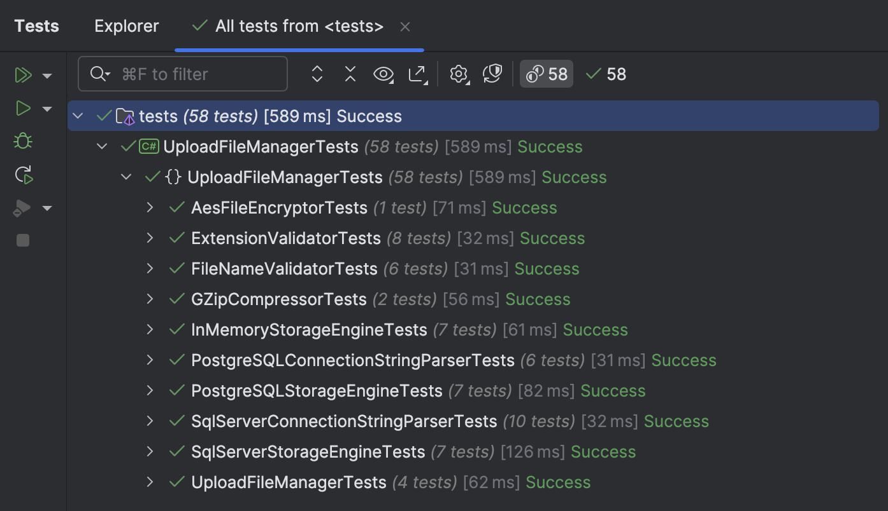
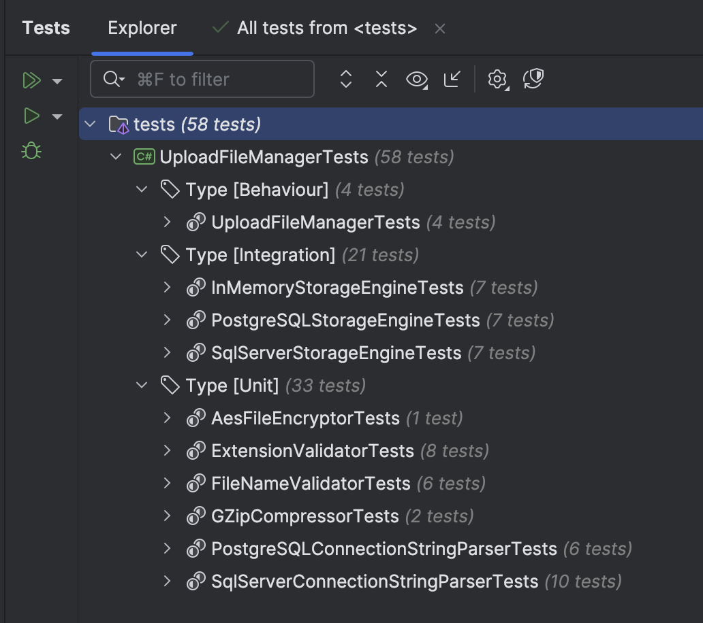
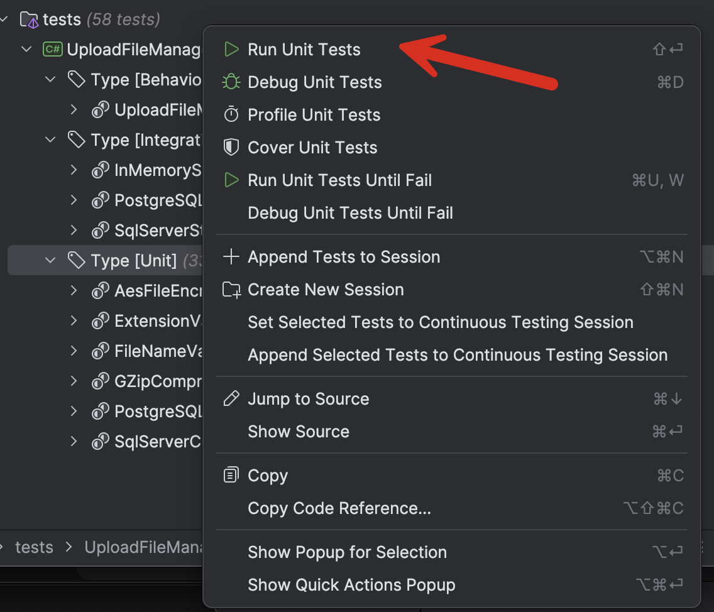

This is Part 15 of a series on Designing, Building & Packaging A Scalable, Testable .NET Open Source Component.

- [Designing, Building & Packaging A Scalable, Testable .NET Open Source Component - Part 1 - Introduction]()
- [Designing, Building & Packaging A Scalable, Testable .NET Open Source Component - Part 2 - Basic Requirements]()
- [Designing, Building & Packaging A Scalable, Testable .NET Open Source Component - Part 3 - Project Setup]()
- [Designing, Building & Packaging A Scalable, Testable .NET Open Source Component - Part 4 - Types & Contracts]()
- [Designing, Building & Packaging A Scalable, Testable .NET Open Source Component - Part 5 - Component Implementation]()
- [Designing, Building & Packaging A Scalable, Testable .NET Open Source Component - Part 6 - Mocking & Behaviour Tests]()
- [Designing, Building & Packaging A Scalable, Testable .NET Open Source Component - Part 7 - Sequence Verification With Moq]()
- [Designing, Building & Packaging A Scalable, Testable .NET Open Source Component - Part 8 - Compressor Implementation]()
- [Designing, Building & Packaging A Scalable, Testable .NET Open Source Component - Part 9 - Encryptor Implementation]()
- [Designing, Building & Packaging A Scalable, Testable .NET Open Source Component - Part 10 - In Memory Storage]()
- [Designing, Building & Packaging A Scalable, Testable .NET Open Source Component - Part 11 - SQL Server Storage]()
- [Designing, Building & Packaging A Scalable, Testable .NET Open Source Component - Part 12 - PostgreSQL Storage]()
- [Designing, Building & Packaging A Scalable, Testable .NET Open Source Component - Part 13 - Database Configuration]()
- [Designing, Building & Packaging A Scalable, Testable .NET Open Source Component - Part 14 - Virtualizing Infrastructure]()
- **Designing, Building & Packaging A Scalable, Testable .NET Open Source Component - Part 15 - Test Organization (This Post)**
- [Designing, Building & Packaging A Scalable, Testable .NET Open Source Component - Part 16 - Large File Consideration]()
- [Designing, Building & Packaging A Scalable, Testable .NET Open Source Component - Part 17 - Large File Consideration On PostgreSQL]()
- [Designing, Building & Packaging A Scalable, Testable .NET Open Source Component - Part 18 - Azure Blob Storage]()

In our last post, we looked at how to virtualize infrastructure such as database engines ([SQL Server](https://www.microsoft.com/en-us/sql-server) and [PostgreSQL](https://www.postgresql.org/)).

In this post, we will look at how to better organize our tests.

Currently, if you look at the **test runner**, all the tests look like this:



This is a mix of **unit** tests, **integration** tests and **behaviour** tests.

Wouldn't it be nice if they could be **categorized** as such?

This is possible using the `Trait` attribute.

We can decorate each test class as appropriate.

For the [unit tests](https://en.wikipedia.org/wiki/Unit_testing):

```c#
[Trait("Type", "Unit")]
public class AesFileEncryptorTests
```

The `behavior` tests:

```c#
[Trait("Type", "Behaviour")]
public class UploadFileManagerTests
```

The integration tests:

```c#
[Trait("Type", "Integration")]
public class PostgreSQLStorageEngineTests
```

The test runner will now look like this (depending on your IDE of choice)



This makes it easier to **visualize** and **run** the tests. For example, if you want to run only the `unit` tests, you can **right click** that node and run them all collectively:



### TLDR

**`Traits` allow for the organization of tests to make the testing experience smoother.**

The code is in my [GitHub](https://github.com/conradakunga/UploadFileManager).

Happy hacking!
