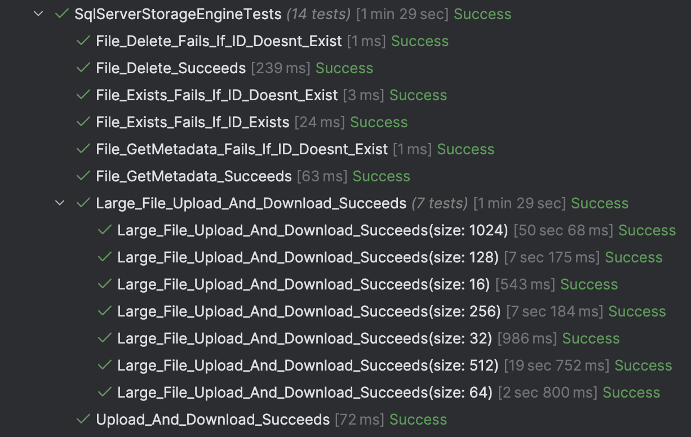

This is Part 16 of a series on Designing, Building & Packaging A Scalable, Testable .NET Open Source Component.

- [Designing, Building & Packaging A Scalable, Testable .NET Open Source Component - Part 1 - Introduction]()
- [Designing, Building & Packaging A Scalable, Testable .NET Open Source Component - Part 2 - Basic Requirements]()
- [Designing, Building & Packaging A Scalable, Testable .NET Open Source Component - Part 3 - Project Setup]()
- [Designing, Building & Packaging A Scalable, Testable .NET Open Source Component - Part 4 - Types & Contracts]()
- [Designing, Building & Packaging A Scalable, Testable .NET Open Source Component - Part 5 - Component Implementation]()
- [Designing, Building & Packaging A Scalable, Testable .NET Open Source Component - Part 6 - Mocking & Behaviour Tests]()
- [Designing, Building & Packaging A Scalable, Testable .NET Open Source Component - Part 7 - Sequence Verification With Moq]()
- [Designing, Building & Packaging A Scalable, Testable .NET Open Source Component - Part 8 - Compressor Implementation]()
- [Designing, Building & Packaging A Scalable, Testable .NET Open Source Component - Part 9 - Encryptor Implementation]()
- [Designing, Building & Packaging A Scalable, Testable .NET Open Source Component - Part 10 - In Memory Storage]()
- [Designing, Building & Packaging A Scalable, Testable .NET Open Source Component - Part 11 - SQL Server Storage]()
- [Designing, Building & Packaging A Scalable, Testable .NET Open Source Component - Part 12 - PostgreSQL Storage]()
- [Designing, Building & Packaging A Scalable, Testable .NET Open Source Component - Part 13 - Database Configuration]()
- [Designing, Building & Packaging A Scalable, Testable .NET Open Source Component - Part 14 - Virtualizing Infrastructure]()
- **Designing, Building & Packaging A Scalable, Testable .NET Open Source Component - Part 15 - Test Organization (This Post)**
- [Designing, Building & Packaging A Scalable, Testable .NET Open Source Component - Part 16 - Large File Consideration]()
- [Designing, Building & Packaging A Scalable, Testable .NET Open Source Component - Part 17 - Large File Consideration On PostgreSQL]()
- [Designing, Building & Packaging A Scalable, Testable .NET Open Source Component - Part 18 - Azure Blob Storage]()
- [Designing, Building & Packaging A Scalable, Testable .NET Open Source Component - Part 19 - Testing Azure Blob Storage Locally]()
- [Designing, Building & Packaging A Scalable, Testable .NET Open Source Component - Part 20 - Amazon S3 Storage]()

Our [last post]() looked at organizing tests.

This post we shall turn our attention to an issue we have kept under the carpet - **dealing with large files**.

Currently, our (passing) tests work with relatively **small** files.

```c#
private static MemoryStream GetFile()
{
  var faker = new Faker();
  var dataToStore = faker.Lorem.Sentences(20);
  var dataToStoreStream = new MemoryStream(Encoding.UTF8.GetBytes(dataToStore));
  return dataToStoreStream;
}
```

This is about **1,000 bytes** (between 800 and 1100).

At which point we must ask ourselves - **what constitutes a large file?**

For purposes of our component, a large file is one that is **greater than 5 MB.**

Let us go on to further set an **upper limit** for our files. Let us use 1 GB -  perhaps someone is uploading a DVD image, or a dump of some sort.

This present some challenges on our database code, specifically **storage** and **retrieval**.

Let us examine the impact on **each** of our storage engines.

### SQL Server Storage

The persistence code currently looks like this:

```c#
// Create and initialize command
var param = new DynamicParameters();
param.Add("FileID", metaData.FileId, DbType.Guid);
param.Add("Name", metaData.Name, DbType.String, size: 500);
param.Add("Extension", metaData.Extension, DbType.String, size: 10);
param.Add("DateUploaded", metaData.DateUploaded, DbType.DateTime2);
param.Add("OriginalSize", metaData.OriginalSize, DbType.Int32);
param.Add("PersistedSize", metaData.PersistedSize, DbType.Int32);
param.Add("CompressionAlgorithm", metaData.CompressionAlgorithm, DbType.Byte);
param.Add("EncryptionAlgorithm", metaData.EncryptionAlgorithm, DbType.Byte);
param.Add("Hash", metaData.Hash, dbType: DbType.Binary, size: 32);
param.Add("Data", data, DbType.Binary, size: -1);
var command = new CommandDefinition(sql, param, cancellationToken: cancellationToken);
await using (var cn = new SqlConnection(_connectionString))
{
    await cn.ExecuteAsync(command);
}
```

This works perfectly with **small** streams. If, however, we submitted a very **large stream**, [Dapper](https://github.com/DapperLib/Dapper) would present a slight **challenge**. Currently, it does not deal with [streams](https://learn.microsoft.com/en-us/dotnet/api/system.io.stream?view=net-9.0) - it converts everything to a `byte` array once and then puts that into the database.

We want the code to use the `stream`, so that the data can be written in **chunks**.

To do this, we need to the following:

1. Update our code to use the underlying SQL Server ADO.NET provider.
2. Allow a **timeout** to be passed (when the file is large and the connection is slow)

We start by updating our `IStorageEngine` interface to add a property to store the Timeout, as we do not want to hard code this, or make it a constant.:

```c#
public interface IStorageEngine
{
  /// <summary>
  /// How long to wait before a timeout (in minutes)
  /// </summary>
  int TimeoutInMinutes { get; }

  //
  // Snip the rest
  // 
}
```

Next we update our `IStorageEngine` implementations.

For the `InMemoryStorage` engine, the concept of a timeout is irrelevant, so we simply return a 0.

```c#
public class InMemoryStorageEngine : IStorageEngine
{
    // In-memory store for files and metadata
    private readonly ConcurrentDictionary<Guid, (FileMetadata MetaData, MemoryStream Stream)> _files;

    /// <inheritdoc />
    public int TimeoutInMinutes => 0;

    //
    // Snip the rest
    // 
}
```

For the `SQLServerStorageEngine`, we pass the timeout in the **constructor**

```c#
public sealed class SqlServerStorageEngine : IStorageEngine
{
    /// <inheritdoc />
    public int TimeoutInMinutes { get; }

    private readonly string _connectionString;

    /// <summary>
    /// Constructor, taking the connection string
    /// </summary>
    /// <param name="connectionString"></param>
    /// <param name="timeoutInMinutes"></param>
    public SqlServerStorageEngine(string connectionString, int timeoutInMinutes)
    {
        TimeoutInMinutes = timeoutInMinutes;
        _connectionString = connectionString;
        // Parse the connection string
        var parser = new SqlServerConnectionStringParser(connectionString);
        if (string.IsNullOrEmpty(parser.Database))
            throw new ArgumentException($"{nameof(parser.Database)} cannot be null or empty");
    }
  
  	//
  	// Snip the rest
  	// 
}
```

Then the code for the `StoreFileAsync`:

```c#
public async Task<FileMetadata> StoreFileAsync(FileMetadata metaData, Stream data,
CancellationToken cancellationToken = default)
{
  // Query to fetch file metadata
  const string sql = """
                     INSERT INTO Files (
                                FileID, Name, Extension, DateUploaded,
                                OriginalSize, PersistedSize, CompressionAlgorithm,
                                EncryptionAlgorithm, Hash, Data
                            ) VALUES (
                                @FileID, @Name, @Extension, @DateUploaded,
                                @OriginalSize, @PersistedSize, @CompressionAlgorithm,
                                @EncryptionAlgorithm, @Hash, @Data
                            )
                     """;
  data.Position = 0;

  // Set up command
  await using var cn = new SqlConnection(_connectionString);
  await cn.OpenAsync(cancellationToken);

  await using var cmd = new SqlCommand(sql, cn);
  cmd.CommandTimeout = (int)TimeSpan.FromMinutes(TimeoutInMinutes).TotalSeconds;

  cmd.Parameters.Add(new SqlParameter("@FileID", SqlDbType.UniqueIdentifier) { Value = metaData.FileId });
  cmd.Parameters.Add(new SqlParameter("@Name", SqlDbType.NVarChar, 500) { Value = metaData.Name });
  cmd.Parameters.Add(new SqlParameter("@Extension", SqlDbType.NVarChar, 10) { Value = metaData.Extension });
  cmd.Parameters.Add(
      new SqlParameter("@DateUploaded", SqlDbType.DateTimeOffset) { Value = metaData.DateUploaded });
  cmd.Parameters.Add(new SqlParameter("@OriginalSize", SqlDbType.Int) { Value = metaData.OriginalSize });
  cmd.Parameters.Add(new SqlParameter("@PersistedSize", SqlDbType.Int) { Value = metaData.PersistedSize });
  cmd.Parameters.Add(new SqlParameter("@CompressionAlgorithm", SqlDbType.TinyInt)
      { Value = metaData.CompressionAlgorithm });
  cmd.Parameters.Add(new SqlParameter("@EncryptionAlgorithm", SqlDbType.TinyInt)
      { Value = metaData.EncryptionAlgorithm });
  cmd.Parameters.Add(new SqlParameter("@Hash", SqlDbType.Binary, 32) { Value = metaData.Hash });

  var dataParam = new SqlParameter("@Data", SqlDbType.VarBinary, -1)
  {
      Value = data,
      Direction = ParameterDirection.Input
  };
  cmd.Parameters.Add(dataParam);

  // Execute
  await cmd.ExecuteNonQueryAsync(cancellationToken);

  return metaData;
}
```

Finally, the code for the `GetFileAsync` that we also rewrite to allow for streaming.

```c#
/// <inheritdoc />
public async Task<Stream> GetFileAsync(Guid fileId, CancellationToken cancellationToken = default)
{
    const string sql = "SELECT Data FROM Files WHERE FileId = @FileId";

    await using (var cn = new SqlConnection(_connectionString))
    {
        await cn.OpenAsync(cancellationToken);

        await using (var cmd = new SqlCommand(sql, cn))
        {
            // Increase the timout in case of large files
            cmd.CommandTimeout = (int)TimeSpan.FromMinutes(TimeoutInMinutes).TotalSeconds;
            cmd.Parameters.AddWithValue("@FileId", fileId);

            await using (var reader =
                         await cmd.ExecuteReaderAsync(CommandBehavior.SequentialAccess, cancellationToken))
            {
                if (await reader.ReadAsync(cancellationToken))
                {
                    var memoryStream = new MemoryStream();

                    await using (var dataStream = reader.GetStream(0))
                        await dataStream.CopyToAsync(memoryStream, Constants.DefaultBufferSize, cancellationToken);

                    memoryStream.Position = 0;

                    return memoryStream;
                }
            }
        }
    }

    throw new FileNotFoundException($"The file '{fileId}' was not found");
}
```

To make sure everything is working, we add some **test cases** for large file support:

```c#
[Theory]
[InlineData(16)]
[InlineData(32)]
[InlineData(64)]
[InlineData(128)]
[InlineData(256)]
[InlineData(512)]
[InlineData(1_024)]
public async Task Large_File_Upload_And_Download_Succeeds(int size)
{
    // Compute the file size in bytes
    var fileSizeInBytes = 1L * size * 1_024 * 1_024;
    // Create a buffer
    const int bufferSize = 1024 * 1024;

    byte[] buffer = new byte[bufferSize];
    new Random().NextBytes(buffer);

    // Write to a temporary file
    var filePath = Path.GetTempFileName();
    await using (FileStream fs = new FileStream(filePath, FileMode.Create, FileAccess.Write, FileShare.None))
    {
        long bytesWritten = 0;
        while (bytesWritten < fileSizeInBytes)
        {
            long bytesToWrite = Math.Min(bufferSize, fileSizeInBytes - bytesWritten);
            await fs.WriteAsync(buffer.AsMemory(0, (int)bytesToWrite));
            bytesWritten += bytesToWrite;
        }
    }

    // Read the file
    await using (var input = File.OpenRead(filePath))
    {
        // Upload the file
        var uploadMetadata = await Upload(input);
        // Download the file
        await using (var download = await _manager.DownloadFileAsync(uploadMetadata.FileId))
        {
            download.Position = 0;
            // Get the Hash
            var sha = SHA256.Create();
            var currentHash = await sha.ComputeHashAsync(download);
            currentHash.Should().BeEquivalentTo(uploadMetadata.Hash);
        }
    }

    File.Delete(filePath);
}
```

Here we are testing for 16 MB, 32 MB, 64 MB, 128 MB, 256 MB, 512 MB, and 1 GB

```c#
[Theory]
[InlineData(16)]
[InlineData(32)]
[InlineData(64)]
[InlineData(128)]
[InlineData(256)]
[InlineData(512)]
[InlineData(1_024)]
public async Task Large_File_Upload_And_Download_Succeeds(int size)
{
    // Compute the file size in bytes
    var fileSizeInBytes = 1L * size * 1_024 * 1_024;
    // Create a buffer
    const int bufferSize = 1024 * 1024;

    byte[] buffer = new byte[bufferSize];
    new Random().NextBytes(buffer);

    // Write to a temporary file
    var filePath = Path.GetTempFileName();
    await using (FileStream fs = new FileStream(filePath, FileMode.Create, FileAccess.Write, FileShare.None))
    {
        long bytesWritten = 0;
        while (bytesWritten < fileSizeInBytes)
        {
            long bytesToWrite = Math.Min(bufferSize, fileSizeInBytes - bytesWritten);
            await fs.WriteAsync(buffer.AsMemory(0, (int)bytesToWrite));
            bytesWritten += bytesToWrite;
        }
    }

    // Read the file
    await using (var input = File.OpenRead(filePath))
    {
        // Upload the file
        var uploadMetadata = await Upload(input);
        // Download the file
        await using (var download = await _manager.DownloadFileAsync(uploadMetadata.FileId))
        {
            download.Position = 0;
            // Get the Hash
            var sha = SHA256.Create();
            var currentHash = await sha.ComputeHashAsync(download);
            currentHash.Should().BeEquivalentTo(uploadMetadata.Hash);
        }
    }

    File.Delete(filePath);
}
```

### PostgreSQL

Similarly, we can make the same changes for our **PostgreSQL**

Inject the timeout in the **constructor**:

```c#
public sealed class PosgrgreSQLStorageEngine : IStorageEngine
{
    /// <inheritdoc/> 
    public int TimeoutInMinutes { get; }

    private readonly string _connectionString;

    /// <summary>
    /// Constructor, taking the connection string
    /// </summary>
    /// <param name="connectionString"></param>
    /// <param name="timeoutInMinutes"></param>
    public PosgrgreSQLStorageEngine(string connectionString, int timeoutInMinutes)
    {
        TimeoutInMinutes = timeoutInMinutes;
        _connectionString = connectionString;
        // Parse the connection string for a database
        var parser = new PostgreSQLConnectionStringParser(connectionString);
        if (string.IsNullOrEmpty(parser.Database))
            throw new ArgumentException($"{nameof(parser.Database)} cannot be null or empty");
    }
    //
    // Snip the rest
    //  
}
```

Update the `StoreFileAsync`

```c#
 /// <inheritdoc />
public async Task<FileMetadata> StoreFileAsync(FileMetadata metaData, Stream data,
    CancellationToken cancellationToken = default)
{
    // Query to fetch file metadata
    const string sql = """
                       INSERT INTO Files (
                                  FileID, Name, Extension, DateUploaded,
                                  OriginalSize, PersistedSize, CompressionAlgorithm,
                                  EncryptionAlgorithm, Hash, Data
                              ) VALUES (
                                  @FileID, @Name, @Extension, @DateUploaded,
                                  @OriginalSize, @PersistedSize, @CompressionAlgorithm,
                                  @EncryptionAlgorithm, @Hash, @Data
                              )
                       """;
    await using var cn = new NpgsqlConnection(_connectionString);
    await cn.OpenAsync(cancellationToken);

    await using var cmd = new NpgsqlCommand(sql, cn);
    cmd.CommandTimeout = (int)TimeSpan.FromMinutes(TimeoutInMinutes).TotalSeconds;

    // Add normal parameters
    cmd.Parameters.AddWithValue("@FileId", NpgsqlDbType.Uuid, metaData.FileId);
    cmd.Parameters.AddWithValue("@Name", NpgsqlDbType.Varchar, metaData.Name);
    cmd.Parameters.AddWithValue("@Extension", NpgsqlDbType.Varchar, metaData.Extension);
    cmd.Parameters.AddWithValue("@DateUploaded", NpgsqlDbType.TimestampTz, metaData.DateUploaded);
    cmd.Parameters.AddWithValue("@OriginalSize", NpgsqlDbType.Integer, metaData.OriginalSize);
    cmd.Parameters.AddWithValue("@PersistedSize", NpgsqlDbType.Integer, metaData.PersistedSize);
    cmd.Parameters.AddWithValue("@CompressionAlgorithm", NpgsqlDbType.Smallint,
        (byte)metaData.CompressionAlgorithm);
    cmd.Parameters.AddWithValue("@EncryptionAlgorithm", NpgsqlDbType.Smallint,
        (byte)metaData.EncryptionAlgorithm);
    cmd.Parameters.AddWithValue("@Hash", NpgsqlDbType.Bytea, metaData.Hash);

    // Stream parameter
    data.Position = 0;
    var dataParam = new NpgsqlParameter("Data", NpgsqlDbType.Bytea)
    {
        Value = data,
        Size = -1
    };
    cmd.Parameters.Add(dataParam);

    await cmd.ExecuteNonQueryAsync(cancellationToken);

    return metaData;
}

```

Finally, the code for `GetFileAsync`

```c#
/// <inheritdoc />
public async Task<Stream> GetFileAsync(Guid fileId, CancellationToken cancellationToken = default)
{
  // Query to fetch file
  const string sql = "SELECT Data FROM Files where FileId = @FileId";

  await using (var cn = new NpgsqlConnection(_connectionString))
  {
      await cn.OpenAsync(cancellationToken);

      await using (var cmd = new NpgsqlCommand(sql, cn))
      {
          // Increase the timout in case of large files
          cmd.CommandTimeout = (int)TimeSpan.FromMinutes(5).TotalSeconds;
          cmd.Parameters.AddWithValue("FileID", fileId);

          await using (var reader =
                       await cmd.ExecuteReaderAsync(CommandBehavior.SequentialAccess, cancellationToken))
          {
              if (await reader.ReadAsync(cancellationToken))
              {
                  var memoryStream = new MemoryStream();
                  await using (var dataStream =
                               await reader.GetStreamAsync(0, cancellationToken).ConfigureAwait(false))
                      await dataStream.CopyToAsync(memoryStream, Constants.DefaultBufferSize, cancellationToken);

                  memoryStream.Position = 0;

                  return memoryStream;
              }
          }
      }
  }

  throw new FileNotFoundException($"The file '{fileId}' was not found");
}
```

To make sure all this is working, we also test for files from 16MB to 1GB.

```c#
[Theory]
[InlineData(16)]
[InlineData(32)]
[InlineData(64)]
[InlineData(128)]
[InlineData(256)]
[InlineData(512)]
[InlineData(1_024)]
public async Task Large_File_Upload_And_Download_Succeeds(int size)
{
    // Compute the file size in bytes
    var fileSizeInBytes = 1L * size * 1_024 * 1_024;
    // Create a buffer
    const int bufferSize = 1024 * 1024;

    byte[] buffer = new byte[bufferSize];
    new Random().NextBytes(buffer);

    // Write to a temporary file
    var filePath = Path.GetTempFileName();
    await using (FileStream fs = new FileStream(filePath, FileMode.Create, FileAccess.Write, FileShare.None))
    {
        long bytesWritten = 0;
        while (bytesWritten < fileSizeInBytes)
        {
            long bytesToWrite = Math.Min(bufferSize, fileSizeInBytes - bytesWritten);
            await fs.WriteAsync(buffer.AsMemory(0, (int)bytesToWrite));
            bytesWritten += bytesToWrite;
        }
    }

    // Read the file
    await using (var input = File.OpenRead(filePath))
    {
        // Upload the file
        var uploadMetadata = await Upload(input);
        // Download the file
        await using (var download = await _manager.DownloadFileAsync(uploadMetadata.FileId))
        {
            download.Position = 0;
            // Get the Hash
            var sha = SHA256.Create();
            var currentHash = await sha.ComputeHashAsync(download);
            currentHash.Should().BeEquivalentTo(uploadMetadata.Hash);
        }
    }

    File.Delete(filePath);
}
```

Let us now run our tests:

For **SQL Server**, all is well:



For **PostgreSQL**, however, the **1GB file failed**


In our [next post](), we will look at how to tackle this.

### TLDR

**In this post, we improved our `SQLServerStorageEngine` and our `PostgreSQLStorageEngine` to support persistence of large files, and tests to verify functionality.**

The code is in my [GitHub](https://github.com/conradakunga/UploadFileManager).

Happy hacking!
