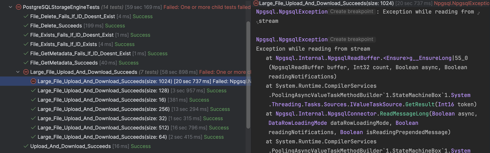
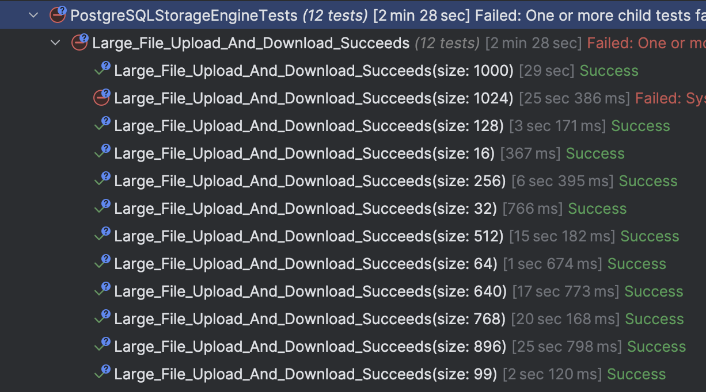
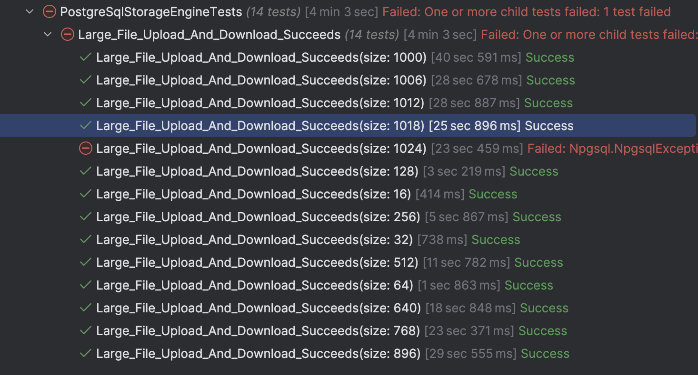
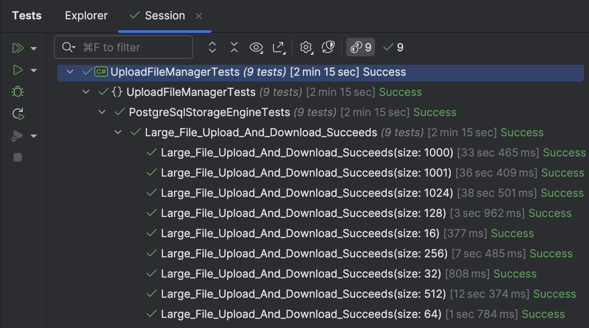

This is Part 17 of a series on Designing, Building & Packaging A Scalable, Testable .NET Open Source Component.

- [Designing, Building & Packaging A Scalable, Testable .NET Open Source Component - Part 1 - Introduction]()
- [Designing, Building & Packaging A Scalable, Testable .NET Open Source Component - Part 2 - Basic Requirements]()
- [Designing, Building & Packaging A Scalable, Testable .NET Open Source Component - Part 3 - Project Setup]()
- [Designing, Building & Packaging A Scalable, Testable .NET Open Source Component - Part 4 - Types & Contracts]()
- [Designing, Building & Packaging A Scalable, Testable .NET Open Source Component - Part 5 - Component Implementation]()
- [Designing, Building & Packaging A Scalable, Testable .NET Open Source Component - Part 6 - Mocking & Behaviour Tests]()
- [Designing, Building & Packaging A Scalable, Testable .NET Open Source Component - Part 7 - Sequence Verification With Moq]()
- [Designing, Building & Packaging A Scalable, Testable .NET Open Source Component - Part 8 - Compressor Implementation]()
- [Designing, Building & Packaging A Scalable, Testable .NET Open Source Component - Part 9 - Encryptor Implementation]()
- [Designing, Building & Packaging A Scalable, Testable .NET Open Source Component - Part 10 - In Memory Storage]()
- [Designing, Building & Packaging A Scalable, Testable .NET Open Source Component - Part 11 - SQL Server Storage]()
- [Designing, Building & Packaging A Scalable, Testable .NET Open Source Component - Part 12 - PostgreSQL Storage]()
- [Designing, Building & Packaging A Scalable, Testable .NET Open Source Component - Part 13 - Database Configuration]()
- [Designing, Building & Packaging A Scalable, Testable .NET Open Source Component - Part 14 - Virtualizing Infrastructure]()
- [Designing, Building & Packaging A Scalable, Testable .NET Open Source Component - Part 15 - Test Organization]()
- [Designing, Building & Packaging A Scalable, Testable .NET Open Source Component - Part 16 - Large File Consideration]()
- **Designing, Building & Packaging A Scalable, Testable .NET Open Source Component - Part 17 - Large File Consideration On PostgreSQL (This Post)**
- [Designing, Building & Packaging A Scalable, Testable .NET Open Source Component - Part 18 - Azure Blob Storage]()

In our [last post](), we made some optimizations around supporting **large files**, and ran into a problem with [PostgreSQL](https://www.postgresql.org/).

This test was failing.



This means there is a threshold past which **PostgreSQL** cannot process the storage of the `byte` array.

In this post, we will look at how to resolve this.

From our tests, we know that the threshold is somewhere between `512` MB and `1024` MB.

Let us introduce some intermediate test values to try and isolate the threshold, starting from `512` and adding `128` MB intervals.

We update the **PostgreSQL** tests as follows:

```c#
[Theory]
[InlineData(16)]
[InlineData(32)]
[InlineData(64)]
[InlineData(128)]
[InlineData(256)]
[InlineData(512)]
[InlineData(640)]
[InlineData(768)]
[InlineData(896)]
[InlineData(1_024)]
public async Task Large_File_Upload_And_Download_Succeeds(int size)
{
  //
  // Snip tests
  //
}
```

If we run these tests, we get the following results:



From this, the threshold is somewhere between `1,000` and `1,024`.

We can narrow it down further for academic interest.

We can add these file sizes to the tests:

```c#
[InlineData(1_000)]
[InlineData(1_006)]
[InlineData(1_012)]
[InlineData(1_018)]
[InlineData(1_024)]
public async Task Large_File_Upload_And_Download_Succeeds(int size)
{
  //
  // Snip tests
  //
}
```

If we run these tests:



It seems the magic number is just under `1,024` MB

Let us then decide on the maximum safe size - `1,000` MB.

Anything larger than that is not safe for `byte` array storage.

So what do we do with files bugger than that? We have two options:

1. Discard them (no support)
2. Implement [large object storage](https://www.postgresql.org/docs/current/largeobjects.html).

For parity with SQL Server, let us take the latter route.

We need to make a number of changes:

1. Update our files table to support large object storage
2. Update our `PosgtreSqlStorageEngine`  to examine payloads and decide whether to use a byte array or large object storage for storage or retrieval.


### Large Object Storage Table Support

For this functionality, **PostgreSQL** stores the data internally in a table called `pg_largeobjects` and returns an identifier,  typed `oid`. We will add a column to our files table to support this.

I also considered making a **separate table for this scenario**, but for now, this approach is **simpler**.

It will now look like this:

```sql
create table files
(
    fileid               uuid                     not null
        primary key,
    name                 varchar(500)             not null,
    extension            varchar(10)              not null,
    dateuploaded         timestamp with time zone not null,
    originalsize         integer                  not null,
    persistedsize        integer                  not null,
    compressionalgorithm smallint                 not null,
    encryptionalgorithm  smallint                 not null,
    hash                 bytea                    not null,
    data                 bytea                    not null,
    loid                 oid
);
```

### PostgreSqlStorageEngine Support

The first thing to do is to define a constant to determine the threshold for large objects.

```c#
 public const long PostgreSQLLargeObjectThreshold = 1_000 * 1_024 * 1_024;
```

Next we update our `StoreFileAsync` and split it into two branches - one for normal files and one for large files.

```c#
/// <inheritdoc />
public async Task<FileMetadata> StoreFileAsync(FileMetadata metaData, Stream data,
    CancellationToken cancellationToken = default)
{
    // Check the stream size
    if (data.Length > Constants.PostgreSQLLargeObjectThreshold)
    {
        // This branch is for streams LARGER than the threshold
        await using (var cn = new NpgsqlConnection(_connectionString))
        {
            await cn.OpenAsync(cancellationToken);
            var trans = await cn.BeginTransactionAsync(cancellationToken);
#pragma warning disable CS0618 // Type or member is obsolete
            var loManager = new NpgsqlLargeObjectManager(cn);
#pragma warning restore CS0618 // Type or member is obsolete

            // Create a new large object OID
            var oid = loManager.Create();

            // Open the LOB stream for writing
            await using (var loStream = await loManager.OpenReadWriteAsync(oid, cancellationToken))
            {
                // Copy your data stream into the large object stream
                data.Position = 0;
                var buffer = new byte[Constants.DefaultBufferSize];
                int bytesRead;

                while ((bytesRead = await data.ReadAsync(buffer, 0, buffer.Length, cancellationToken)) > 0)
                {
                    await loStream.WriteAsync(buffer.AsMemory(0, bytesRead), cancellationToken);
                }

                await loStream.FlushAsync(cancellationToken);
            }

            // Query to insert file metadata
            const string sql = """
                               INSERT INTO Files (
                                          FileID, Name, Extension, DateUploaded,
                                          OriginalSize, PersistedSize, CompressionAlgorithm,
                                          EncryptionAlgorithm, Hash, Data, Loid 
                                      ) VALUES (
                                          @FileID, @Name, @Extension, @DateUploaded,
                                          @OriginalSize, @PersistedSize, @CompressionAlgorithm,
                                          @EncryptionAlgorithm, @Hash, @Data, @Loid
                                      )
                               """;

            var cmd = new NpgsqlCommand(sql, cn, trans);
            cmd.CommandTimeout = (int)TimeSpan.FromMinutes(TimeoutInMinutes).TotalSeconds;

            // Add normal parameters
            cmd.Parameters.AddWithValue("@FileId", NpgsqlDbType.Uuid, metaData.FileId);
            cmd.Parameters.AddWithValue("@Name", NpgsqlDbType.Varchar, metaData.Name);
            cmd.Parameters.AddWithValue("@Extension", NpgsqlDbType.Varchar, metaData.Extension);
            cmd.Parameters.AddWithValue("@DateUploaded", NpgsqlDbType.TimestampTz, metaData.DateUploaded);
            cmd.Parameters.AddWithValue("@OriginalSize", NpgsqlDbType.Integer, metaData.OriginalSize);
            cmd.Parameters.AddWithValue("@PersistedSize", NpgsqlDbType.Integer, metaData.PersistedSize);
            cmd.Parameters.AddWithValue("@CompressionAlgorithm", NpgsqlDbType.Smallint,
                (byte)metaData.CompressionAlgorithm);
            cmd.Parameters.AddWithValue("@EncryptionAlgorithm", NpgsqlDbType.Smallint,
                (byte)metaData.EncryptionAlgorithm);
            cmd.Parameters.AddWithValue("@Hash", NpgsqlDbType.Bytea, metaData.Hash);
            cmd.Parameters.AddWithValue("@Data", NpgsqlDbType.Bytea,
                new MemoryStream(Constants.PostgreSQLLargeObjectMaker));
            cmd.Parameters.AddWithValue("@Loid", NpgsqlDbType.Oid, oid);

            await cmd.ExecuteNonQueryAsync(cancellationToken);

            await trans.CommitAsync(cancellationToken);
        }
    }
    else
    {
        // This branch is for streams equal to or less than the threshold

        // Query to insert file metadata
        const string sql = """
                           INSERT INTO Files (
                                      FileID, Name, Extension, DateUploaded,
                                      OriginalSize, PersistedSize, CompressionAlgorithm,
                                      EncryptionAlgorithm, Hash, Data
                                  ) VALUES (
                                      @FileID, @Name, @Extension, @DateUploaded,
                                      @OriginalSize, @PersistedSize, @CompressionAlgorithm,
                                      @EncryptionAlgorithm, @Hash, @Data
                                  )
                           """;
        await using var cn = new NpgsqlConnection(_connectionString);
        await cn.OpenAsync(cancellationToken);

        var cmd = new NpgsqlCommand(sql, cn);
        cmd.CommandTimeout = (int)TimeSpan.FromMinutes(TimeoutInMinutes).TotalSeconds;

        // Add normal parameters
        cmd.Parameters.AddWithValue("@FileId", NpgsqlDbType.Uuid, metaData.FileId);
        cmd.Parameters.AddWithValue("@Name", NpgsqlDbType.Varchar, metaData.Name);
        cmd.Parameters.AddWithValue("@Extension", NpgsqlDbType.Varchar, metaData.Extension);
        cmd.Parameters.AddWithValue("@DateUploaded", NpgsqlDbType.TimestampTz, metaData.DateUploaded);
        cmd.Parameters.AddWithValue("@OriginalSize", NpgsqlDbType.Integer, metaData.OriginalSize);
        cmd.Parameters.AddWithValue("@PersistedSize", NpgsqlDbType.Integer, metaData.PersistedSize);
        cmd.Parameters.AddWithValue("@CompressionAlgorithm", NpgsqlDbType.Smallint,
            (byte)metaData.CompressionAlgorithm);
        cmd.Parameters.AddWithValue("@EncryptionAlgorithm", NpgsqlDbType.Smallint,
            (byte)metaData.EncryptionAlgorithm);
        cmd.Parameters.AddWithValue("@Hash", NpgsqlDbType.Bytea, metaData.Hash);

        // Stream parameter
        data.Position = 0;
        var dataParam = new NpgsqlParameter("@Data", NpgsqlDbType.Bytea)
        {
            Value = data,
            Size = -1
        };
        cmd.Parameters.Add(dataParam);

        await cmd.ExecuteNonQueryAsync(cancellationToken);
    }

    return metaData;
}
```

A couple of things to note about this code:

1. If the data size is **greater** than the **threshold**, we use the `NpgsqlLargeObjectManager` object to create and store the data in the large object storage.
2. The ID we get back, we persist in the `files` table.
3. In the data column, we persist a magic value - the `byre` array `[0, 0, 0]`
4. Manipulating the large objects storage requires the use of a [transaction](https://www.postgresql.org/docs/current/tutorial-transactions.html).

Next, the logic to retrieve files, 

```c#
/// <inheritdoc />
public async Task<Stream> GetFileAsync(Guid fileId, CancellationToken cancellationToken = default)
{
    // Get local metadata
    var sql = "Select loid from Files where FileId = @FileId";
    uint? oid = null;
    await using (var cn = new NpgsqlConnection(_connectionString))
    {
        oid = await cn.QuerySingleOrDefaultAsync<uint?>(sql, new { FileId = fileId });
    }

    if (oid.HasValue)
    {
        await using (var cn = new NpgsqlConnection(_connectionString))
        {
            await cn.OpenAsync(cancellationToken);
            await using (var trans = await cn.BeginTransactionAsync(cancellationToken))
            {
                // Fetch and return the lob
#pragma warning disable CS0618 // Type or member is obsolete
                var loManager = new NpgsqlLargeObjectManager(cn);
#pragma warning restore CS0618 // Type or member is obsolete
                uint id = oid.Value;
                await using (var stream = await loManager.OpenReadAsync(id, cancellationToken))
                {
                    var memoryStream = new MemoryStream();
                    var buffer = new byte[Constants.DefaultBufferSize];

                    int bytesRead;

                    while ((bytesRead = await stream.ReadAsync(buffer, cancellationToken)) > 0)
                    {
                        await memoryStream.WriteAsync(buffer.AsMemory(0, bytesRead), cancellationToken);
                    }

                    // Close the large object stream
                    stream.Close();

                    await trans.CommitAsync(cancellationToken);

                    // Reset the position
                    memoryStream.Position = 0;

                    return memoryStream;
                }
            }
        }
    }

    // If we are here, there was no OID. Query to fetch file
    sql = "SELECT Data FROM Files where FileId = @FileId";
    await using (var cn = new NpgsqlConnection(_connectionString))
    {
        await using (var cmd = new NpgsqlCommand(sql, cn))
        {
            await cn.OpenAsync(cancellationToken);

            // Increase the timout in case of large files
            cmd.CommandTimeout = (int)TimeSpan.FromMinutes(TimeoutInMinutes).TotalSeconds;
            cmd.Parameters.AddWithValue("FileID", fileId);

            await using (var reader =
                         await cmd.ExecuteReaderAsync(CommandBehavior.SequentialAccess, cancellationToken))
            {
                if (await reader.ReadAsync(cancellationToken))
                {
                    var memoryStream = new MemoryStream();
                    await using (var dataStream =
                                 await reader.GetStreamAsync(0, cancellationToken).ConfigureAwait(false))
                        await dataStream.CopyToAsync(memoryStream, Constants.DefaultBufferSize,
                            cancellationToken);

                    memoryStream.Position = 0;

                    return memoryStream;
                }
            }
        }
    }

    // If we are here, could not get the file data
    throw new FileNotFoundException($"The file '{fileId}' was not found");
}
```

A couple of things about this code:

1. I start by checking for a **large object ID** for the corresponding `FileID`. If there is, I use the `NpgsqlLargeObjectManager` to retrieve the data from storage.
2. If there isn't, I retrieve the data from the files table.
3. When using the `NpgsqlLargeObjectManager`, you must retrieve the data in a transaction and close the stream when you are done. The stream returned is a `NpgsqlLargeObjectStream,` which we use to write to a [MemoryStream](https://learn.microsoft.com/en-us/dotnet/api/system.io.memorystream?view=net-9.0).

If we run our tests now, they should all pass.



Thus, our `PostgreSqlStorageEngine` now supports arbitrarily large files.

In our [next post](), we will implement Azure Blob storage.

### TLDR

**In this post, we implemented large object storage to allow PostgreSQL to store arbitrarily large files.**

The code is in my GitHub.

Happy hacking!
