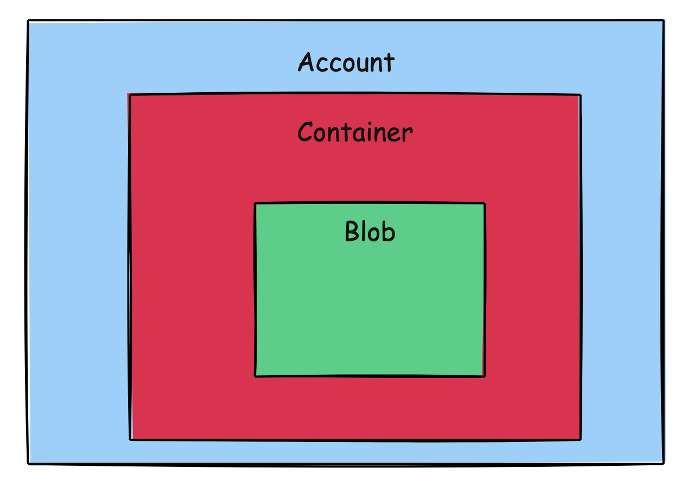

This is Part 18 of a series on Designing, Building & Packaging A Scalable, Testable .NET Open Source Component.

- [Designing, Building & Packaging A Scalable, Testable .NET Open Source Component - Part 1 - Introduction]()
- [Designing, Building & Packaging A Scalable, Testable .NET Open Source Component - Part 2 - Basic Requirements]()
- [Designing, Building & Packaging A Scalable, Testable .NET Open Source Component - Part 3 - Project Setup]()
- [Designing, Building & Packaging A Scalable, Testable .NET Open Source Component - Part 4 - Types & Contracts]()
- [Designing, Building & Packaging A Scalable, Testable .NET Open Source Component - Part 5 - Component Implementation]()
- [Designing, Building & Packaging A Scalable, Testable .NET Open Source Component - Part 6 - Mocking & Behaviour Tests]()
- [Designing, Building & Packaging A Scalable, Testable .NET Open Source Component - Part 7 - Sequence Verification With Moq]()
- [Designing, Building & Packaging A Scalable, Testable .NET Open Source Component - Part 8 - Compressor Implementation]()
- [Designing, Building & Packaging A Scalable, Testable .NET Open Source Component - Part 9 - Encryptor Implementation]()
- [Designing, Building & Packaging A Scalable, Testable .NET Open Source Component - Part 10 - In Memory Storage]()
- [Designing, Building & Packaging A Scalable, Testable .NET Open Source Component - Part 11 - SQL Server Storage]()
- [Designing, Building & Packaging A Scalable, Testable .NET Open Source Component - Part 12 - PostgreSQL Storage]()
- [Designing, Building & Packaging A Scalable, Testable .NET Open Source Component - Part 13 - Database Configuration]()
- [Designing, Building & Packaging A Scalable, Testable .NET Open Source Component - Part 14 - Virtualizing Infrastructure]()
- [Designing, Building & Packaging A Scalable, Testable .NET Open Source Component - Part 15 - Test Organization]()
- [Designing, Building & Packaging A Scalable, Testable .NET Open Source Component - Part 16 - Large File Consideration]()
- [Designing, Building & Packaging A Scalable, Testable .NET Open Source Component - Part 17 - Large File Consideration On PostgreSQL]()
- **Designing, Building & Packaging A Scalable, Testable .NET Open Source Component - Part 18 - Azure Blob Storage (This Post)**
- [Designing, Building & Packaging A Scalable, Testable .NET Open Source Component - Part 19 - Testing Azure Blob Storage Locally]()
- [Designing, Building & Packaging A Scalable, Testable .NET Open Source Component - Part 20 - Amazon S3 Storage]()
- [Designing, Building & Packaging A Scalable, Testable .NET Open Source Component - Part 21 - Testing Amazon S3 Storage Locally]() 
- [Designing, Building & Packaging A Scalable, Testable .NET Open Source Component - Part 22 - Refactoring Azure Storage Engine For Initializationinitialization]()
- [Designing, Building & Packaging A Scalable, Testable .NET Open Source Component - Part 23 - Refactoring Amazon Storage Engine For Initialization]()

**UPDATED to add Initialization method**

In our [last post](), we looked at implementing [large object storage](https://www.postgresql.org/docs/current/largeobjects.html) to give our `PostgreSQLStorageEngine` parity with the `SQLServerStorageEngine`.

In this post, we will implement a storage engine for [Azure Blob Storage](https://azure.microsoft.com/en-us/products/storage/blobs).

The first step is understanding how blob storage works. There are three main concepts.

1. Account
2. Container
3. Blob



### Account

At the top level is the account that hosts all the services. This is accessed and manipulated using the [BlobServiceClient](https://learn.microsoft.com/en-us/dotnet/api/azure.storage.blobs.blobserviceclient?view=azure-dotnet).

### Container

This level is the equivalent of a folder containing all the files. It is accessed and manipulated using the [BlobContainerClient](https://learn.microsoft.com/en-us/dotnet/api/azure.storage.blobs.blobcontainerclient?view=azure-dotnet).

### Blob

This level is where the actual files are stored. This is accessed and manipulated using the [BlobClient](https://learn.microsoft.com/en-us/dotnet/api/azure.storage.blobs.blobclient?view=azure-dotnet).

In our design, we will have two containers - one will store the `FileMetadata`, and the other will contain the actual binary **data**.

Next, we shall begin the implementation.

To begin with, we need a way to pass some settings to [Azure](https://azure.microsoft.com/en-us/). We will create a class to store these settings:

```c#
public class AzureSettings
{
    [Required] public string AccountName { get; set; } = null!;
    [Required] public string DataContainerName { get; set; } = null!;
    [Required] public string MetadataContainerName { get; set; } = null!;
}
```

Here we have indicated that all the settings are required.

Next, we will implement the `AzureBlobStorageEngine`.

```c#
public class AzureBlobStorageEngine : IStorageEngine
{
  private readonly BlobContainerClient _dataContainerClient;
  private readonly BlobContainerClient _metadataContainerClient;

  /// <inheritdoc />
  public int TimeoutInMinutes { get; }

  public AzureBlobStorageEngine(int timeoutInMinutes, string account,
      string dataContainerName, string metadataContainerName)
  {
      TimeoutInMinutes = timeoutInMinutes;

      // Create a service client
      var blobServiceClient = new BlobServiceClient(
          new Uri($"https://{account}.blob.core.windows.net"),
          new DefaultAzureCredential());
}
    
```

We next implement an `Initialization` method that will **create our buckets if they don't already exist**. This method will be run once, perhaps at startup.

```c#
/// <summary>
/// Initialize the engine
/// </summary>
/// <param name="accountName"></param>
/// <param name="accountKey"></param>
/// <param name="azureLocation"></param>
/// <param name="dataContainerName"></param>
/// <param name="metadataContainerName"></param>
/// <param name="cancellationToken"></param>
public async Task InitializeAsync(string accountName, string accountKey, string azureLocation,
    string dataContainerName, string metadataContainerName, CancellationToken cancellationToken = default)
{
    // Create a service client
    var blobServiceClient = new BlobServiceClient(
        new Uri($"{azureLocation}/{accountName}/"),
        new StorageSharedKeyCredential(accountName, accountKey));

    // Get our container clients
    var dataContainerClient = blobServiceClient.GetBlobContainerClient(dataContainerName);
    var metadataContainerClient = blobServiceClient.GetBlobContainerClient(metadataContainerName);

    // Ensure they exist
    if (!await dataContainerClient.ExistsAsync(cancellationToken))
        await dataContainerClient.CreateIfNotExistsAsync(cancellationToken: cancellationToken);
    if (!await metadataContainerClient.ExistsAsync(cancellationToken))
        await metadataContainerClient.CreateIfNotExistsAsync(cancellationToken: cancellationToken);
}
```


We then go on to implement the various methods of the `IStorageEngine` interface.

First, `StoreFileAsync`:

```c#
/// <inheritdoc />
public async Task<FileMetadata> StoreFileAsync(FileMetadata metaData, Stream data,
    CancellationToken cancellationToken = default)
{
    // Get the clients
    var dataClient = _dataContainerClient.GetBlobClient(metaData.FileId.ToString());
    var metadataClient = _metadataContainerClient.GetBlobClient(metaData.FileId.ToString());

    // Upload data in parallel
    await Task.WhenAll(
        metadataClient.UploadAsync(JsonSerializer.Serialize(metaData), cancellationToken),
        dataClient.UploadAsync(data, cancellationToken));

    return metaData;
}
```

Next, `GetMetadataAsync`:

```c#
/// <inheritdoc />
public async Task<FileMetadata> GetMetadataAsync(Guid fileId, CancellationToken cancellationToken = default)
{
    // Get the client
    var metadataClient = _metadataContainerClient.GetBlobClient(fileId.ToString());

    // Retrieve the metadata
    var result = await metadataClient.DownloadContentAsync(cancellationToken: cancellationToken);
    if (result != null && result.HasValue)
    {
        return JsonSerializer.Deserialize<FileMetadata>(result.Value!.Content!.ToString())!;
    }

    throw new FileNotFoundException($"File {fileId} not found");
}

```

Next, `GetFileAsync`:

```c#
/// <inheritdoc />
public async Task<Stream> GetFileAsync(Guid fileId, CancellationToken cancellationToken = default)
{
  // Get the client
  var dataClient = _dataContainerClient.GetBlobClient(fileId.ToString());

  // Download the blob as a stream
  var response = await dataClient.DownloadStreamingAsync(cancellationToken: cancellationToken);

  // Download into a memory stream
  await using (var stream = response.Value.Content)
  {
      var memoryStream = new MemoryStream();
      await stream.CopyToAsync(memoryStream, cancellationToken);
      return memoryStream;
  }
}
```

Next, `DeleteFileAsync`:

```c#
/// <inheritdoc />
public async Task DeleteFileAsync(Guid fileId, CancellationToken cancellationToken = default)
{
  // Get the clients
  var dataClient = _dataContainerClient.GetBlobClient(fileId.ToString());
  var metadataClient = _metadataContainerClient.GetBlobClient(fileId.ToString());

  // Delete in parallel
  await Task.WhenAll(
      metadataClient.DeleteAsync(cancellationToken: cancellationToken),
      dataClient.DeleteAsync(cancellationToken: cancellationToken));
}
```

Finally, `FileExistsAsync`:

```c#
  /// <inheritdoc />
    public async Task<bool> FileExistsAsync(Guid fileId, CancellationToken cancellationToken = default)
    {
        // Get the client
        var dataClient = _dataContainerClient.GetBlobClient(fileId.ToString());
        // Check for existence
        return await dataClient.ExistsAsync(cancellationToken);
    }
```

Our [next post]() will look at how to test this locally.

### TLDR

**In this post, we implemented a storage engine for Azure Blob Storage.**

The code is in my [GitHub](https://github.com/conradakunga/UploadFileManager).

Happy hacking!
