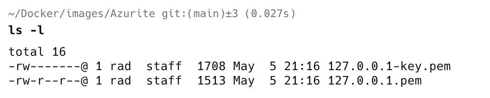

This is Part 19 of a series on Designing, Building & Packaging A Scalable, Testable .NET Open Source Component.

- [Designing, Building & Packaging A Scalable, Testable .NET Open Source Component - Part 1 - Introduction]()
- [Designing, Building & Packaging A Scalable, Testable .NET Open Source Component - Part 2 - Basic Requirements]()
- [Designing, Building & Packaging A Scalable, Testable .NET Open Source Component - Part 3 - Project Setup]()
- [Designing, Building & Packaging A Scalable, Testable .NET Open Source Component - Part 4 - Types & Contracts]()
- [Designing, Building & Packaging A Scalable, Testable .NET Open Source Component - Part 5 - Component Implementation]()
- [Designing, Building & Packaging A Scalable, Testable .NET Open Source Component - Part 6 - Mocking & Behaviour Tests]()
- [Designing, Building & Packaging A Scalable, Testable .NET Open Source Component - Part 7 - Sequence Verification With Moq]()
- [Designing, Building & Packaging A Scalable, Testable .NET Open Source Component - Part 8 - Compressor Implementation]()
- [Designing, Building & Packaging A Scalable, Testable .NET Open Source Component - Part 9 - Encryptor Implementation]()
- [Designing, Building & Packaging A Scalable, Testable .NET Open Source Component - Part 10 - In Memory Storage]()
- [Designing, Building & Packaging A Scalable, Testable .NET Open Source Component - Part 11 - SQL Server Storage]()
- [Designing, Building & Packaging A Scalable, Testable .NET Open Source Component - Part 12 - PostgreSQL Storage]()
- [Designing, Building & Packaging A Scalable, Testable .NET Open Source Component - Part 13 - Database Configuration]()
- [Designing, Building & Packaging A Scalable, Testable .NET Open Source Component - Part 14 - Virtualizing Infrastructure]()
- [Designing, Building & Packaging A Scalable, Testable .NET Open Source Component - Part 15 - Test Organization]()
- [Designing, Building & Packaging A Scalable, Testable .NET Open Source Component - Part 16 - Large File Consideration]()
- [Designing, Building & Packaging A Scalable, Testable .NET Open Source Component - Part 17 - Large File Consideration On PostgreSQL]()
- [Designing, Building & Packaging A Scalable, Testable .NET Open Source Component - Part 18 - Azure Blob Storage]()
- **Designing, Building & Packaging A Scalable, Testable .NET Open Source Component - Part 19 - Testing Azure Blob Storage Locally (This Post)**

In our [last post](), we implemented a storage engine for [Azure Blob Storage](https://azure.microsoft.com/en-us/products/storage/blobs).

In this post we will look at how to test locally.

Testing locally here means how do we test **without** connecting to the actual [Azure](https://azure.microsoft.com/en-us/) infrastructure. As part of integration testing we will ultimately need to do this, but given that moving data in and out of Azure costs actually money, it may not be desirable to do this frequently.

Luckily, Microsoft has availed a [docker](https://www.docker.com/) [container](https://hub.docker.com/r/microsoft/azure-storage-azurite) that encapsulates **Azure** functionality that we can use for this purpose.

The first order of business is to download the container.

```bash
docker pull mcr.microsoft.com/azure-storage/azurite
```

Next we will need to so some **configuration**, specifically to allow **Azurite** to run with [https](https://en.wikipedia.org/wiki/HTTPS).

For this we will require two tools:

1. [mkcert](https://github.com/FiloSottile/mkcert)
2. [nss](https://firefox-source-docs.mozilla.org/security/nss/index.html) Network security services.

You can install this using your preferred package manager - [homebrew](https://brew.sh/) on [OSX](https://en.wikipedia.org/wiki/MacOS) and [Chocolatey](https://chocolatey.org/) or [Winget](https://learn.microsoft.com/en-us/windows/package-manager/winget/) on Windows

```bash
brew install nss
brew install mkcert
```

With these tools installed, we can now start on the configuration.

Create a folder where you will store two files we are about to generate - the certificates.

```bash
mkdir Azurite
```

Change to this folder.

```bash
cd Azurite
```

From this folder, run the following command to create locally-trusted development TLS certificates by installing a **local Certificate Authority (CA)** in your system and browser trust stores.

```bash
mkcert -install
```

You should see the following output:


Next is to generate a certificate file and a key file

```bash
mkcert 127.0.0.1
```

You should see the following output:


If you list the files in that directory you should see the following:



Now, from this directory, we start our container with the following command:

```c#
docker run -p 10000:10000 -v $(pwd):/workspace  mcr.microsoft.com/azure-storage/azurite azurite --blobHost 0.0.0.0  --cert /workspace/127.0.0.1.pem --key /workspace/127.0.0.1-key.pem
```

This does a couple of things:

1.  `-p 10000:10000` Maps port 10000 on the host to the container
2. `-v $(pwd):/workspace` Maps the volume /workspace in the container to the current location
3. `--blobHost 0.0.0.0` allows access to the service by the host (required by docker)

You should see the following on successful start.


Our next order of business to update our `AzureSettings` class.

We need to provide an `AccountKey` for authentication and authorization, as well as an `AzureLocation`, so we can point our component to the emulator.

```c#
public class AzureSettings
{
    [Required] public string AccountName { get; set; } = null!;
    [Required] public string AccountKey { get; set; } = null!;
    [Required] public string AzureLocation { get; set; } = null!;
    [Required] public string DataContainerName { get; set; } = null!;
    [Required] public string MetadataContainerName { get; set; } = null!;
}
```

Next we need to update our `AzureBlobStorageEngine` **constructor** to factor in our new settings:

```c#
public AzureBlobStorageEngine(int timeoutInMinutes, string accountName, string accountKey, string azureLocation,
        string dataContainerName, string metadataContainerName)
    {
        TimeoutInMinutes = timeoutInMinutes;

        // Create a service client
        var blobServiceClient = new BlobServiceClient(
            new Uri($"{azureLocation}/{accountName}/"),
            new StorageSharedKeyCredential(accountName, accountKey));

        // Get our container clients
        _dataContainerClient = blobServiceClient.GetBlobContainerClient(dataContainerName);
        _metadataContainerClient = blobServiceClient.GetBlobContainerClient(metadataContainerName);

        // Ensure they exist
        if (!_dataContainerClient.Exists())
            _dataContainerClient.CreateIfNotExists();
        if (!_metadataContainerClient.Exists())
            _metadataContainerClient.CreateIfNotExists();
    }
```

Finally we implement our tests:

```c#
[Trait("Type", "Integration")]
public class AzureBlobStorageEngineTests
{
    private readonly UploadFileManager _manager;

    public AzureBlobStorageEngineTests()
    {
        // Create a file compressor
        var compressor = new GZipCompressor();
        //
        // Create an encryptor
        //

        // Create Aes object
        var aes = Aes.Create();
        // Create the encryptor
        var encryptor = new AesFileEncryptor(aes.Key, aes.IV);

        // Create the storage engine
        var storageEngine = new AzureBlobStorageEngine(0, "devstoreaccount1",
            "Eby8vdM02xNOcqFlqUwJPLlmEtlCDXJ1OUzFT50uSRZ6IFsuFq2UVErCz4I6tq/K1SZFPTOtr/KBHBeksoGMGw==",
            "https://127.0.0.1:10000", "data", "metadata");

        // Create the time provider
        var timeProvider = new FakeTimeProvider();
        timeProvider.SetUtcNow(new DateTimeOffset(2025, 1, 1, 0, 0, 0, TimeSpan.Zero));

        // Create the file manager
        _manager = new UploadFileManager(storageEngine, encryptor, compressor, timeProvider);
    }

    private static MemoryStream GetFile()
    {
        var faker = new Faker();
        var dataToStore = faker.Lorem.Sentences(20);
        var dataToStoreStream = new MemoryStream(Encoding.UTF8.GetBytes(dataToStore));
        return dataToStoreStream;
    }

    private async Task<FileMetadata> Upload(MemoryStream data)
    {
        return await _manager.UploadFileAsync("Test.txt", ".txt", data, CancellationToken.None);
    }

    [Fact]
    public async Task Upload_And_Download_Succeeds()
    {
        // Get the data
        var data = GetFile();
        // Upload a file
        var uploadMetadata = await Upload(data);
        // Check the metadata
        uploadMetadata.Should().NotBeNull();
        uploadMetadata.FileId.Should().NotBeEmpty();
        // Download the file
        var download = await _manager.DownloadFileAsync(uploadMetadata.FileId);
        download.GetBytes().Should().BeEquivalentTo(data.GetBytes());
    }

    [Fact]
    public async Task File_Exists_Fails_If_ID_Doesnt_Exist()
    {
        // Check if the file exists
        var result = await _manager.FileExistsAsync(Guid.Empty);
        result.Should().BeFalse();
    }

    [Fact]
    public async Task File_Exists_Fails_If_ID_Exists()
    {
        // Get the data
        var data = GetFile();
        // Upload a file
        var uploadMetadata = await Upload(data);
        // Check if the file exists by ID
        var result = await _manager.FileExistsAsync(uploadMetadata.FileId);
        result.Should().BeTrue();
    }

    [Fact]
    public async Task File_Delete_Succeeds()
    {
        // Get the data
        var data = GetFile();
        // Upload a file
        var uploadMetadata = await Upload(data);
        // Check if the file exists
        var result = await _manager.FileExistsAsync(uploadMetadata.FileId);
        result.Should().BeTrue();
        // Delete the file
        await _manager.DeleteFileAsync(uploadMetadata.FileId);
        // Check again if the file exists
        result = await _manager.FileExistsAsync(uploadMetadata.FileId);
        result.Should().BeFalse();
    }

    [Fact]
    public async Task File_GetMetadata_Succeeds()
    {
        // Get the data
        var data = GetFile();
        // Upload a file
        var uploadMetadata = await Upload(data);
        // Get the metadata from the ID
        var storedMetadata = await _manager.FetchMetadataAsync(uploadMetadata.FileId);
        storedMetadata.Should().NotBeNull();
        storedMetadata.Should().BeEquivalentTo(uploadMetadata);
    }

    [Fact]
    public async Task File_GetMetadata_Fails_If_ID_Doesnt_Exist()
    {
        // Fetch metadata for non-existent ID
        var ex = await Record.ExceptionAsync(() => _manager.FetchMetadataAsync(Guid.Empty));
        ex.Should().BeOfType<FileNotFoundException>();
    }

    [Fact]
    public async Task File_Delete_Fails_If_ID_Doesnt_Exist()
    {
        // Delete a non-existent file id
        var ex = await Record.ExceptionAsync(() => _manager.DeleteFileAsync(Guid.Empty));
        ex.Should().BeOfType<FileNotFoundException>();
    }
}
```

If we run our test, they should pass:


And if you look at the continer logs, you should see requests and responses being written to the console.


Now we can effectively test our component locally.

### TLDR

**In this post we learned how to setup and configure `Azurite` for local testing of `Azure`.**

The code is in my GitHub.

Happy hacking!
