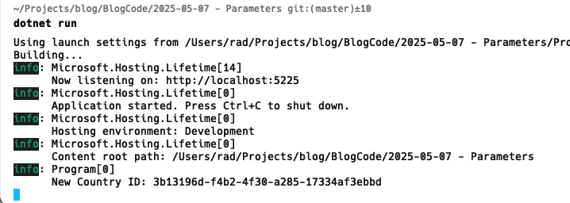
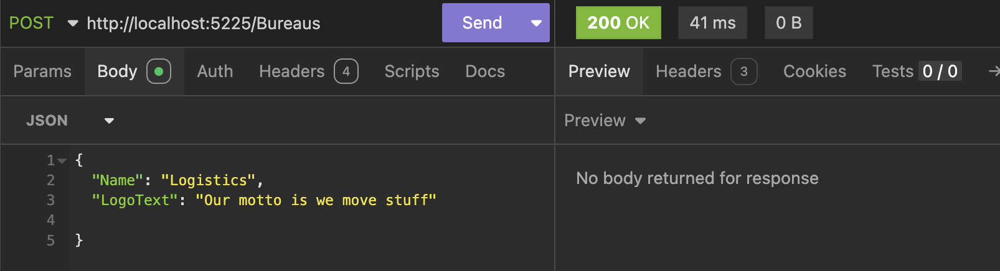
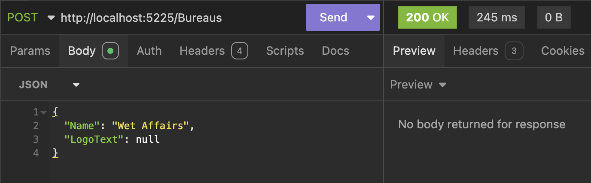

This is Part 16 of a series on using `Dapper` to simplify data access with `ADO.NET`

* [Simpler .NET Data Access With Dapper - Part 1]()
* [Dapper Part 2 - Querying The Database]()
* [Dapper Part 3 - Executing Queries]()
* [Dapper Part 4 - Passing Data To And From The Database]()
* [Dapper Part 5 - Passing Data In Bulk To The Database]()
* [Dapper Part 6 - Returning Multiple Sets Of Results]()
* [Dapper Part 7 - Adding DateOnly & TimeOnly Support]()
* [Dapper Part 8 - Controlling Database Timeouts]()
* [Dapper Part 9 - Using Dynamic Types]()
* [Dapper Part 10 - Handling Cancellations]()
* [Dapper Part 11 - Using Inheritance]()
* [Dapper Part 12 - Alternative Bulk Insert Technique]()
* [Dapper Part 13 - Using Transactions]()
* [Dapper Part 14 - Multithreading]()
* [Dapper Part 15 - Using The IN Clause]()
* **Dapper Part 16 - Consideration When Passing Parameters (This Post)**

In a [previous post](), I talked about passing data to `Dapper`.

In particular, I gave the following example:

```c#
app.MapPost("/Login", (SqliteConnection cn, ILogger<Program> logger, LoginRequest request) =>
{
    var param = new DynamicParameters();
    // Create the Username parameter, specifying all the details
    param.Add("Username", request.Username, DbType.String, ParameterDirection.Input, 100);
    // Crete the password parameter
    param.Add("Password", request.Password);
    // Set the command query text
    var query = "SELECT 1 FROM USERS WHERE Username=@Username AND Password=@Password";
    // Execute the query
    var status = cn.QuerySingleOrDefault<int>(query, param);
    // Check the returned number
    if (status == 1)
    {
        // We are now logged in
        logger.LogInformation("User logged in successfully");
        return Results.Ok();
    }

    logger.LogError("Login Failed");
    // Return a 401
    return Results.Unauthorized();
});
```

and then I said the following:

> The *Username* here has all its parameters **explicitly** set.
>
> You generally do not need to do this - **the name and the value are usually enough**. The database engine will figure out the rest.

Now this is **normally** true, but there are times when you need to be **explicit** about the **type**.

We shall demonstrate this using the following table:

```sql
create table Countries
(
    CountryID uniqueidentifier primary key,
    Name      nvarchar(200) not null unique
)
```

The scenarios are these:

1. **Output** parameters
2. **Input** parameters where the type is not [coercible](https://learn.microsoft.com/en-us/sql/relational-databases/native-client/features/using-user-defined-types?view=sql-server-ver15) from `varchar`

### Output Parameters

Suppose we had this procedure that returned the primary key of a newly inserted `Country`.

```c#
create or alter proc [Countries.Insert] @Name nvarchar(250), @CountryID uniqueidentifier output
as
begin
    declare @NewID uniqueidentifier = newid()
    insert Countries(CountryID, Name) values (@NewID, @Name)
end
go
```

We then create two types, our `Country` and a `CountryCreateRequest` data transfer object.

```c#
public sealed record Country
{
    public Guid CountryID { get; set; }
    public string Name { get; set; } = null!;
}
```

And

```c#
public sealed record CreateCountryRequest
{
    public string Name { get; set; } = null!;
}
```

We would invoke this procedure from an endpoint as follows:

```c#
app.MapPost("/Countries", async (SqlConnection cn, ILogger<Program> logger, CreateCountryRequest request) =>
{
    var param = new DynamicParameters();
    param.Add("Name", request.Name);
    param.Add("CountryID", dbType: DbType.Int32, direction: ParameterDirection.Output);

    var result = await cn.ExecuteAsync("[Countries.Insert]", param);

    // Fetch the new ID
    var id = param.Get<int>("CountryID");
    logger.LogInformation("New Country ID: {ID}", id);

    if (result > 0)
        return Results.Ok();
    return Results.StatusCode(StatusCodes.Status304NotModified);
});
```

If we look at the logs, you will see the following:



If you **omit** the type, such that your code is like this:

```c#
  var param = new DynamicParameters();
    param.Add("Name", request.Name);
    param.Add("CountryID", direction: ParameterDirection.Output);

    var result = await cn.ExecuteAsync("[Countries.Insert]", param);
```

 you will get the following exception:

```plaintext
fail: Microsoft.AspNetCore.Diagnostics.DeveloperExceptionPageMiddleware[1]
      An unhandled exception has occurred while executing the request.
      System.InvalidOperationException: String[1]: the Size property has an invalid size of 0.
```

### Non-coercible From VarChar Types

Let us take a case where we need to maintain `Bureau` entities consisting of an `ID`, `Name` and `Logo`.

The table will look like this:

```sql
create table Bureaus
(
    BureauID int identity primary key,
    Name     nvarchar(250) not null unique,
    Logo     varbinary(MAX)
)
```

The procedure will look like this:

```c#
create or alter proc [Bureaus.Insert] @Name nvarchar(250), @Logo varbinary(MAX), @BureauID int output
as
begin
    insert Bureaus(Name, Logo) values (@Name, @Logo)
    set @BureauID = ident_current('Bureaus')
end
```

The `Bureau` type will look like this:

```c#
public sealed class Bureau
{
    public int BureauID { get; set; }
    public string Name { get; set; } = null!;
    public byte[]? Logo { get; set; }
}
```

And the create DTO will look like this:

```c#
public sealed record CreateBureauRequest
{
    public string Name { get; set; } = null!;
    public string LogoText { get; set; }
}
```

How this work is that the `LogoText` of the `CreateBureauRequest` will be used to generate a **Logo**, which will then be stored in the database.

For this we will require a library, [SkiaSharp](https://www.nuget.org/packages/SkiaSharp/)

The endpoint will look like this:

```c#
app.MapPost("/Bureaus", async (SqlConnection cn, CreateBureauRequest request) =>
{
    // Generate a logo from the logo text

    // Create bitmap
    using var bitmap = new SKBitmap(500, 100);
    // Create canvas from bitmap
    using var canvas = new SKCanvas(bitmap);
    // Set the background colour
    canvas.Clear(SKColors.White);
    // Create a font - use the default
    var font = new SKFont
    {
        Typeface = SKTypeface.Default,
        Size = 35
    };
    // Create and configure paint object
    using var paint = new SKPaint();
    paint.Color = SKColors.Red;
    paint.IsAntialias = true;
    // Draw the text
    canvas.DrawText(request.LogoText, 20, 50, font, paint);
    // Get an image
    using var image = SKImage.FromBitmap(bitmap);
    // Encode the image as a PNG at full quality
    using var data = image.Encode(SKEncodedImageFormat.Png, 100);
    // Get the bytes
    var imageData = data.ToArray();

    // Set the parameters
    var param = new DynamicParameters();
    param.Add("Name", request.Name);
    param.Add("BureauID", dbType: DbType.Int32, direction: ParameterDirection.Output);
    param.Add("Logo", imageData, dbType: DbType.Binary);

    var result = await cn.ExecuteAsync("[Bureaus.Insert]", param);

    if (result > 0)
        return Results.Ok();
    return Results.StatusCode(StatusCodes.Status304NotModified);
});
```

Next we start the app and make a request:



If we look in the database, we should see the data:


Given we have defined that the `Logo` is **nullable**, let us test that scenario, but remove the code that specifies the type.

If we change the code from this:

```c#
param.Add("Logo", imageData, dbType: DbType.Binary);
```

To this:

```c#
param.Add("Logo", imageData);
```

And then request this payload:

```json
{
	"Name": "Wet Affairs",
	"LogoText": null
}
```

The following exception will be thrown:

```plaintext
fail: Microsoft.AspNetCore.Diagnostics.DeveloperExceptionPageMiddleware[1]
      An unhandled exception has occurred while executing the request.
      Microsoft.Data.SqlClient.SqlException (0x80131904): Implicit conversion from data type nvarchar to varbinary(max) is not allowed. Use the CONVERT function to run this query.
```

We can see here that the server is treating the data as a `varchar`.

The fix for this is to **specify the type**.

```c#
param.Add("Logo", imageData, dbType: DbType.Binary);
```

If we re-run this:



To avoid surprises, and for maximum clarity, it is advisable to specify the types of parameters when executing queries.

### TLDR

**It is probably advisable to always specify at least the type (and maybe the size) of parameters when submitting queries to the database.**

The code is in my [GitHub](https://github.com/conradakunga/BlogCode/tree/master/2025-05-07%20-%20Parameters).

Happy hacking!
