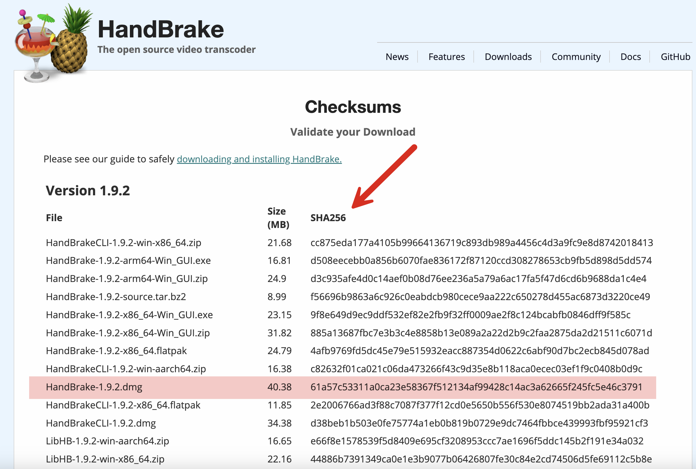

In some [past]() [posts]() I have covered how to verify checksums using [PowerShell](https://learn.microsoft.com/en-us/powershell/)

Suppose you needed to **compute this yourself**, perhaps in your code to **verify** downloaded data against some provided [checksums](https://en.wikipedia.org/wiki/Checksum)?

This is pretty easy to do.

Let us use the same example as before, the [Handbrake](https://handbrake.fr/) utility.

The checksums are provided, for each download, [here](https://handbrake.fr/checksums.php).



I am using [macOS](https://en.wikipedia.org/wiki/MacOS) on a [MacBook](https://www.apple.com/ke/macbook-pro/), so I have highlighted the **checksum** I am interested in corresponding to my download.

It is important to also take note of the **algorithm** used, which in this case is [SHA256](https://en.wikipedia.org/wiki/SHA-2).

I can then proceed to **download** the file to my machine.

When it comes to the hashing, there are two ways to go about it:

1. Using the [SHA265](https://www.movable-type.co.uk/scripts/sha256.html) class
2. Using the [CryptographyOperations](https://learn.microsoft.com/en-us/dotnet/api/system.security.cryptography.cryptographicoperations?view=net-9.0) class

### SHA256

The code for this is as follows:

```c#
using System.Security.Cryptography;
using Serilog;

// Setup Serilog
Log.Logger = new LoggerConfiguration()
    .MinimumLevel.Debug()
    .WriteTo.Console().CreateLogger();

using (var sha = SHA256.Create())
{
    // Compute the hash
    var hash = await sha.ComputeHashAsync(File.OpenRead("/Users/rad/Downloads/HandBrake-1.9.2.dmg"));
    // Get the checksum
    var rawChecksum = BitConverter.ToString(hash);
    // Log raw hash
    Log.Debug("Raw Checksum: {RawChecksum}", rawChecksum);
    // Clean up and convert the casing
    var checksum = rawChecksum.Replace("-", "").ToLower();
    // Log final hash
    Log.Debug("Final Checksum: {Checksum}", checksum);
    Console.WriteLine(checksum);
}
```

If you run this, you will see the following output:

```plaintext
[21:50:40 DBG] Raw Checksum: 61-A5-7C-53-31-1A-0C-A2-3E-58-36-7F-51-21-34-AF-99-42-8C-14-AC-3A-62-66-5F-24-5F-C5-E4-6C-37-91
[21:50:40 DBG] Final Checksum: 61a57c53311a0ca23e58367f512134af99428c14ac3a62665f245fc5e46c3791
61a57c53311a0ca23e58367f512134af99428c14ac3a62665f245fc5e46c3791
```

The cleanup of the raw hash involves removing all the `-` symbols and **lowercasing** the rest.

This value, you will note, matches exactly with that on the site.

### CryptographyOperations

The more modern way of doing this, [introduced in .NET 9](), is using the `CryptographyOperations` class.

The **only code that changes** is where the hashing takes place, which now looks like this:

```c#
// Compute the hash
var hash = await CryptographicOperations.HashDataAsync(HashAlgorithmName.SHA256,
    File.OpenRead("/Users/rad/Downloads/HandBrake-1.9.2.dmg"));
```

### TLDR

**You can generate and validate checksums in your code using the `CryptographicOperations` class for any of the commonly used algorithms.**

The code is in my GitHub.

Happy hacking!
