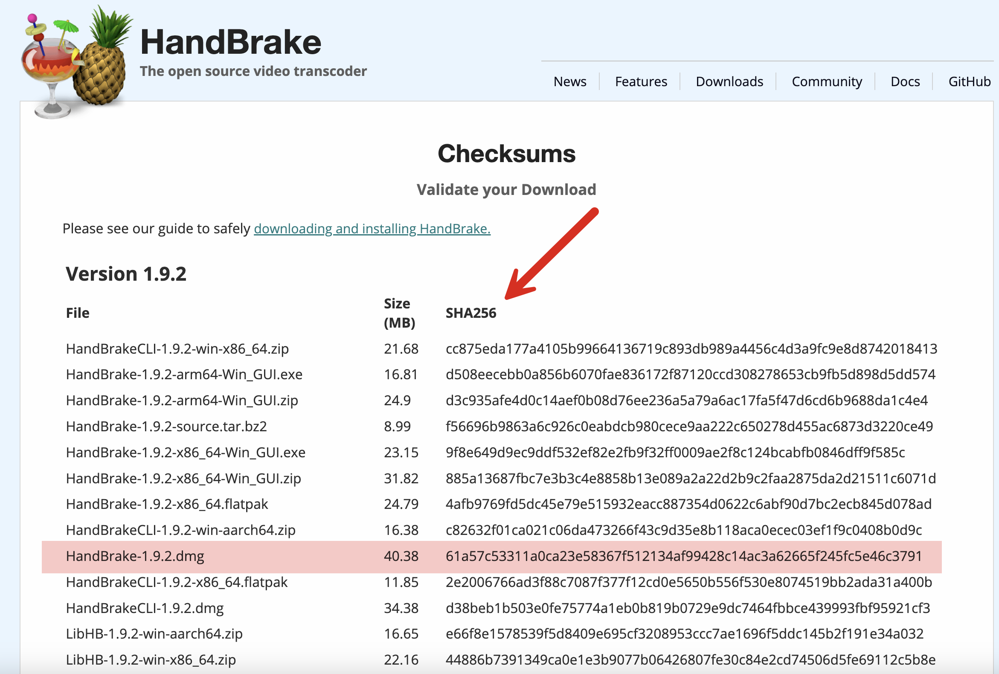
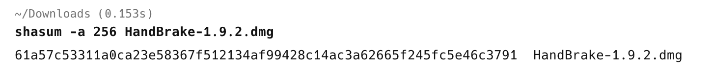
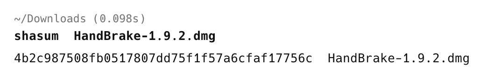

In a [previous post](), I discussed verifying file hashes using [PowerShell](https://learn.microsoft.com/en-us/powershell/). `PowerShell` is cross-platform, which means it will work on any operating system that supports it, particularly the usual suspects—[Windows](https://www.microsoft.com/en-us/windows?r=1), [Linux](https://en.wikipedia.org/wiki/Linux), and [macOS](https://en.wikipedia.org/wiki/MacOS).

However, what are your options if you **don't** have access to `PowerShell`?

The default shells on Linux and macOS support this via the [shasum](https://linux.die.net/man/1/shasum) command.

Let us again use our example, the utility [HandBrake](https://handbrake.fr/).



To verify the `SHA-265` checksum, we would do it as follows:

```bash
shasum -a 256 HandBrake-1.9.2.dmg
```

The `-a` allows you to specify the algorithm to use.

You should get the following output:



The available options are:

| Parameter | Algorithm |
| --------- | --------- |
| 1         | SHA-1     |
| 224       | SHA-224   |
| 256       | SHA-265   |
| 384       | SHA-384   |
| 512       | SHA-512   |

If you don't specify an algorithm, `SHA-1`, the **default**, will be used.



### TLDR

**The `shasum` command allows for the generation of checksums using various algorithms on *bash* and *zsh* shells**

Happy hacking!
