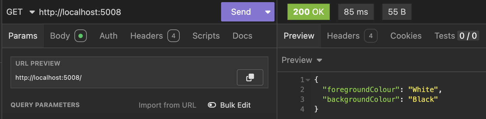
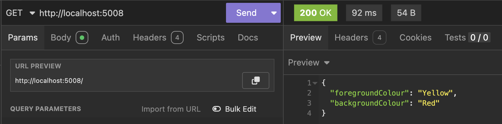
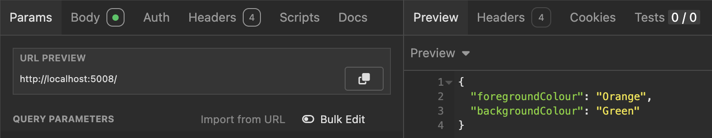
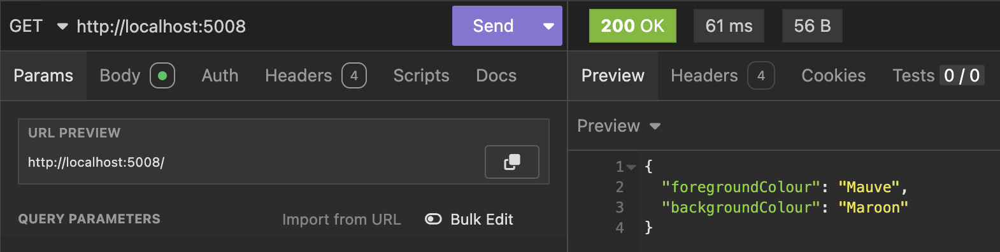

In the post [Loading & Using Application Settings In .NET](), we looked at how to **load** and **utilize** application settings in a .NET application such as a **WebAPI**, **background service** or even a **console** application.

In this post we will look at the **flexibility** the configuration infrastructure exposes for us to leverage.

Let us use a simple example. We wish to allow configuration of a **WebAPI** using the following `SystemSettings` object.

```c#
public class SystemSettings
{
    public string ForegroundColour { get; set; }
    public string BackgroundColour { get; set; }
}
```

These would be setup in the `appsettings.json` as follows:

```json
{
  "Logging": {
    "LogLevel": {
      "Default": "Information",
      "Microsoft.AspNetCore": "Warning"
    }
  },
  "AllowedHosts": "*",
  "SystemSettings": {
    "ForegroundColour": "White",
    "BackgroundColour": "Black"
  }
}
```

We configure our **dependency injection** to load the settings as follows:

```c#
var builder = WebApplication.CreateBuilder(args);
builder.Services.AddOptions<SystemSettings>()
    .Bind(builder.Configuration.GetSection(nameof(SystemSettings)));

var app = builder.Build();
```

Finally, we write a simple API to load and output the current settings:

```C#
app.MapGet("/", (IOptions<SystemSettings> options) =>
{
    var settings = options.Value;
    return settings;
});
```

If we run this endpoint, we will see the following:



In the course of development, it is common practice to have different environments - typically `Development`, `Staging` and `Production`.

The file `appsettings.json` is **always loaded first**, and its settings are exposed to **all** the environments.

If we wanted the settings to be different for our `Development` environment, we would modify the `appsettings.Development.json` and in that file specify what we want to **override**.

For example, I want **Yellow** to be the foreground colour and **Red** to be the background color for my development environment.

Update the `appsettings.Development.json` as follows:

```json
{
  "Logging": {
    "LogLevel": {
      "Default": "Information",
      "Microsoft.AspNetCore": "Warning"
    }
  },
  "SystemSettings": {
    "ForegroundColour": "Yellow",
    "BackgroundColour": "Red"
  }
}
```

This will return the following:



It is important to get into the practice of only updating the `appsettings.Development.json` to **only change the options you want to override**.

In other words, if I **only** want to change the foreground colour, rather than do this:

```json
{
  "Logging": {
    "LogLevel": {
      "Default": "Information",
      "Microsoft.AspNetCore": "Warning"
    }
  },
  "SystemSettings": {
    "ForegroundColour": "Yellow",
    "BackgroundColour": "Black"
  }
}
```

I should do this:

```json
{
  "Logging": {
    "LogLevel": {
      "Default": "Information",
      "Microsoft.AspNetCore": "Warning"
    }
  },
  "SystemSettings": {
    "ForegroundColour": "Yellow"
  }
}
```

You can also use the configuration infrastructure to add **your own json file** to the configuration.

Let us imagine that the settings file was delivered through some other mechanism, such as being generated by tool, into a file - `companysettings.json`.

```c#
{
  "SystemSettings": {
    "ForegroundColour": "Orange",
    "BackgroundColour": "Green"
  }
}

```

We would load this as follows:

```c#
var builder = WebApplication.CreateBuilder(args);

// Load our company settings, that are mandatory
builder.Configuration.AddJsonFile("companysettings.json", optional: false);

// Configure options DI
builder.Services.AddOptions<SystemSettings>()
    .Bind(builder.Configuration.GetSection(nameof(SystemSettings)));

var app = builder.Build();
```

The parameter `optional` is used to control what happens if the file is missing. Here we are indicting it is mandatory.

This will return the following:



If the file is not found, the application will throw an **exception**.

```plaintext
Unhandled exception. System.IO.FileNotFoundException: The configuration file 'companysettings.json' was not found and is not optional. The expected physical path was '/Users/rad/Projects/blog/BlogCode/ApplicationSettings/companysettings.json'.
```

You can make use of this information to solve a very common problem that affects a team of developer working on a common project that requires infrastructure such as **database connection strings,** that will **differ from developer to developer** depending on their machine setups and configurations..

Suppose, for this example, every developer on the project wanted to use their own **custom colours**.

We can utilize the information that it is possible to get the **machine name** at [runtime](https://learn.microsoft.com/en-us/dotnet/api/system.environment.machinename?view=net-9.0) using the `Environment.MachineName` property, and therefore craft the filename at runtime.

Our program will now look like this:

```c#
var builder = WebApplication.CreateBuilder(args);

// Load our company settings, that are mandatory
builder.Configuration.AddJsonFile("companysettings.json", optional: false);
// Load optional developer-specific settings
builder.Configuration.AddJsonFile($"appsettings.{Environment.MachineName}.json", optional: true);

// Configure options DI
builder.Services.AddOptions<SystemSettings>()
    .Bind(builder.Configuration.GetSection(nameof(SystemSettings)));

var app = builder.Build();
```

We have explicitly said that this file is **optional**, so a developer **does not have to** override the settings by creating a file .

We then create a file with the corresponding name.

Given my machine is named `Ciara`, I the settings file is called `appsettings.Ciara.json`.

It will look like this:

```json
{
  "SystemSettings": {
    "ForegroundColour": "Mauve",
    "BackgroundColour": "Maroon"
  }
}

```

If we run this endpoint it will return the following:



In this way we can take advantage of the options pattern  to handle very complex scenarios when it comes to overriding settings.

To ensure developer settings are not considered for enviroments such as `Staging` and `Production`, we can improve our code to explicly check for that:

```c#
if (builder.Environment.IsDevelopment())
{
    // Load optional developer-specific settings
    builder.Configuration.AddJsonFile($"appsettings.{Environment.MachineName}.json", optional: true);
}
```


### TLDR

**The .NET options pattern allows for overriding of options specified in a file that allows for considerable flexibility.**

The code is in my [GitHub](https://github.com/conradakunga/BlogCode/tree/master/2025-05-09%20-%20Layered%20Settings).

Happy hacking!
