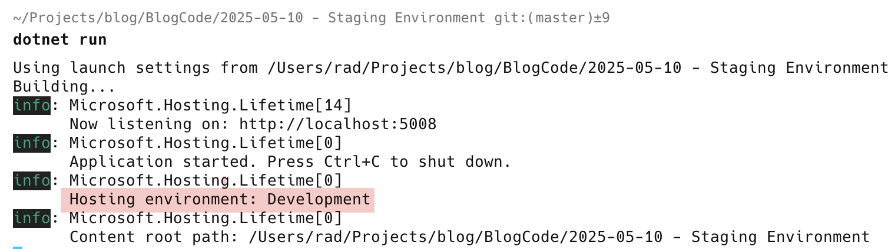
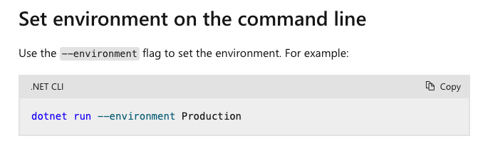
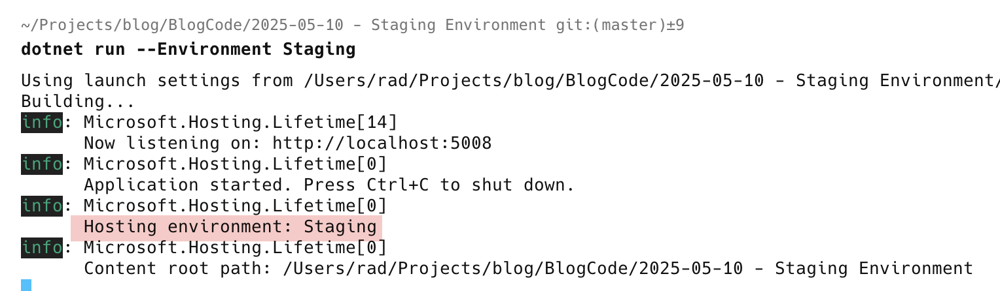
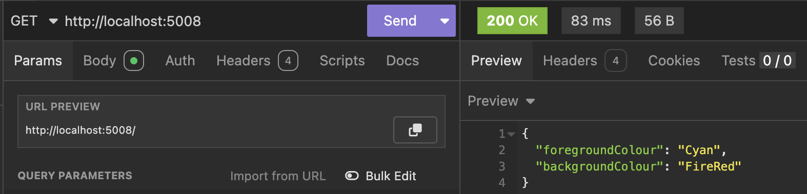

In our [last post](), we looked at the flexibility offered by the .NET configuration infrastructure.

In this case we will tackle a common problem - **you want to see how your application will behave in different environments** while it is still under development. In other words, you want to **simulate** other environments.

Remember, by default, if you don't do anything, `dotnet run` sets the environment to be  `Development`.



If you want to change it, pass the command like parameter `--Environment` and set the value you want. The parameter, at least for **macOS**, is **case sensitive** - you must specify `--Environment` as shown.

The [documentation](https://learn.microsoft.com/en-us/aspnet/core/fundamentals/environments?view=aspnetcore-9.0) (at last as of today 11 May 2025) is **incorrect** as it says `--environment`.



So if we have an options file `appsettings.Staging.json` that looks like this:

```json
{
  "SystemSettings": {
    "ForegroundColour": "Cyan",
    "BackgroundColour": "FireRed"
  }
}
```

If we run our app like this:

```bash
dotnet run --Environment Staging
```

We should see the appropriate environment printed:



We need to make one more change for everything to work.

Custom json files always override those loaded by the system, one of which is appsettings.Staging.json.

To avoid the developer settings being a consideration for `Staging` and `Production`, we can update our code to **only load developer settings if the environment is `Development`**.

```c#
// Check if we are running in development
if (builder.Environment.IsDevelopment())
{
    // Load optional developer-specific settings
    builder.Configuration.AddJsonFile($"appsettings.{Environment.MachineName}.json", optional: true);
}
```

If we run our endpoint we should now see the correct results.



### TLDR

**You can set the environment an application is running under by passing the command line environment `--Environment`**

The code is in my [GitHub](https://github.com/conradakunga/BlogCode/tree/master/2025-05-10%20-%20Staging%20Environment).

Happy hacking!
