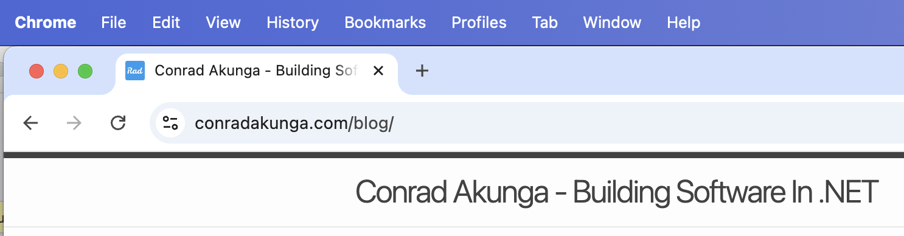
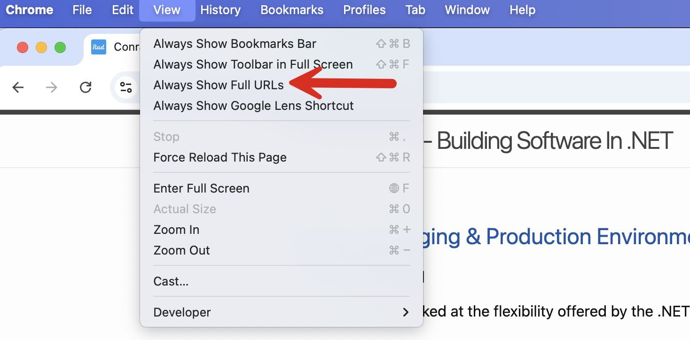
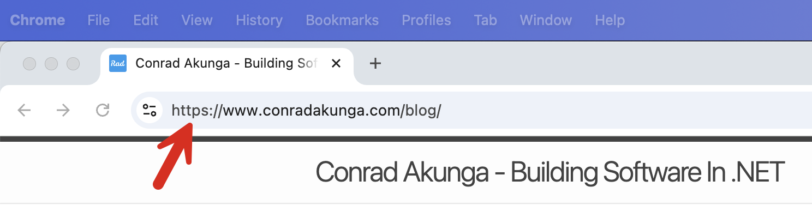

In a [previous post](), I talked about the surprise that [Google Chrome](https://www.google.com/chrome/) has when you view, copy, and paste a URL.

To recap, the issue is this:

Generally,  the URL in the URL bar will look like this:



If, however, you **copy and paste** that URL, it will appear like this:

```plaintext
https://www.conradakunga.com/blog/
```

Which is a **surprise** - what you copied is not what you pasted.

It turns out that it is possible to change this default behavior.

In the View menu, there is a setting `Always Show Full URLs`



At which point, the URL bar changes:



Now, I'm not sure if this has always been there, but it's nice to know!

Happy hacking!
