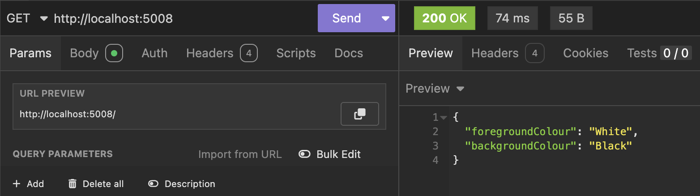
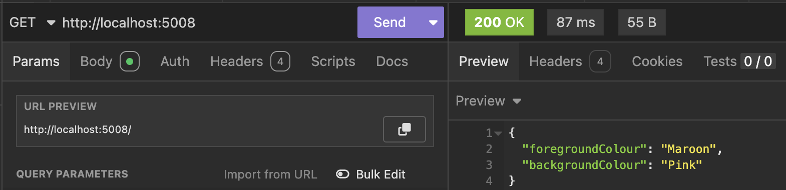

In a previous post, [Flexible Leveraging Of appsettings.json In .NET Applications](), we talked about how to use the .NET configuration infrastructure via the **options pattern** to set and load setting.

In a subsequent post, [Setting The Staging & Production Environments During Development](), we talked about how to **set the environment** of an application so as to determine the settings to be loaded.

In this post, we will look at how to **override the settings** in the `json` files via the **command line**.

As a recap, the test application has the following settings:

```json
{
  "Logging": {
    "LogLevel": {
      "Default": "Information",
      "Microsoft.AspNetCore": "Warning"
    }
  },
  "AllowedHosts": "*",
  "SystemSettings": {
    "ForegroundColour": "White",
    "BackgroundColour": "Black"
  }
}
```

And we have the following web API:

```c#
using ApplicationSettings.Properties;
using Microsoft.Extensions.Options;

var builder = WebApplication.CreateBuilder(args);

// Configure options DI
builder.Services.AddOptions<SystemSettings>()
    .Bind(builder.Configuration.GetSection(nameof(SystemSettings)));

var app = builder.Build();

app.MapGet("/", (IOptions<SystemSettings> options) =>
{
    var settings = options.Value;
    return settings;
});

app.Run();
```

If we run this, we get the following result:



It is possible to override this at **runtime**, by passing the required settings as **parameters via the command line**.

You do this as follows:

```bash
dotnet run --SystemSettings:ForegroundColour=Maroon --SystemSettings:BackgroundColour=Pink
```

Here we are setting the `ForegroundColour` and `BackgroundColour` at the command line.

Of note is that for **hierarchical settings**, we denote the hierarchy with the colon `:` , as shown above.

This should result in the following:



### TLDR

**You can override settings in `appsettings.json` by passing new ones via command line.**

The code is in my GitHub.

Happy hacking!
