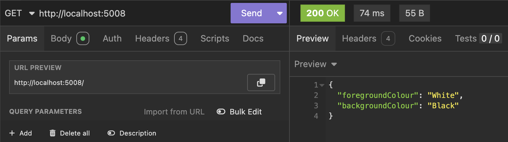
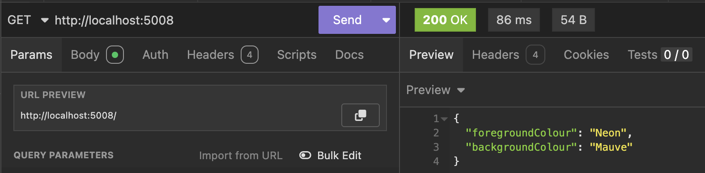

In a **previous** post, [Flexible Leveraging Of appsettings.json In .NET Applications](), we talked about how to use the .NET configuration infrastructure via the **options pattern** to set and load setting.

In a **subsequent** post, [Setting The Staging & Production Environments During Development](), we talked about how to **set the environment** of an application so as to determine the settings to be loaded.

In the **last** post, [Overriding appsettings.json Via Command Line](), we looked at overriding settings via the **command line**.

In this post, we will look at how to **override the settings** in the `json` files via [environment variables](https://medium.com/chingu/an-introduction-to-environment-variables-and-how-to-use-them-f602f66d15fa).

As a recap, the test application has the following settings:

```json
{
  "Logging": {
    "LogLevel": {
      "Default": "Information",
      "Microsoft.AspNetCore": "Warning"
    }
  },
  "AllowedHosts": "*",
  "SystemSettings": {
    "ForegroundColour": "White",
    "BackgroundColour": "Black"
  }
}
```

And we have the following web API:

```c#
using ApplicationSettings.Properties;
using Microsoft.Extensions.Options;

var builder = WebApplication.CreateBuilder(args);

// Configure options DI
builder.Services.AddOptions<SystemSettings>()
    .Bind(builder.Configuration.GetSection(nameof(SystemSettings)));

var app = builder.Build();

app.MapGet("/", (IOptions<SystemSettings> options) =>
{
    var settings = options.Value;
    return settings;
});

app.Run();
```

If we run this, we get the following result:



It is possible to override this at **runtime**, by passing the required settings as **parameters via environment variables**.

Depending on your environment, there are various ways to pass environment variables:

1. [Bash](https://en.wikipedia.org/wiki/Bash_(Unix_shell)) (Unix / Linux / macOS)
2. [PowerShell](https://learn.microsoft.com/en-us/powershell/) (Unix / Linux / macOS / Windows)
3. [Cmd](https://www.ninjaone.com/blog/how-to-use-windows-command-prompt/) (Windows)

### Bash

For `bash`, you can set the variables as follows:

```bash
export SystemSettings__ForegroundColour=Neon
export SystemSettings__BackgroundColour=Mauve
```

### PowerShell

For `PowerShell`:

```powershell
$env:SystemSettings__ForegroundColour = "Neon"
$env:SystemSettings__BackgroundColour = "Mauve"
```

### Cmd

For `Cmd`:

```bash
set SystemSettings__ForegroundColour=Neon
set SystemSettings__BackgroundColour=Mauve
```

Once you have set the variables, run the application as normal.

```bash
dotnet run
```

Here we are setting the `ForegroundColour` and `BackgroundColour` at the command line.

Of note is that for **hierarchical settings**, we denote the hierarchy with the colon `__` , as shown above.

This should result in the following:



### TLDR

**You can override settings in `appsettings.json` by passing new ones via command line.**

The code is in my [GitHub](https://github.com/conradakunga/BlogCode/tree/master/2025-05-13%20-%20Command%20Line%20Override).

Happy hacking!
