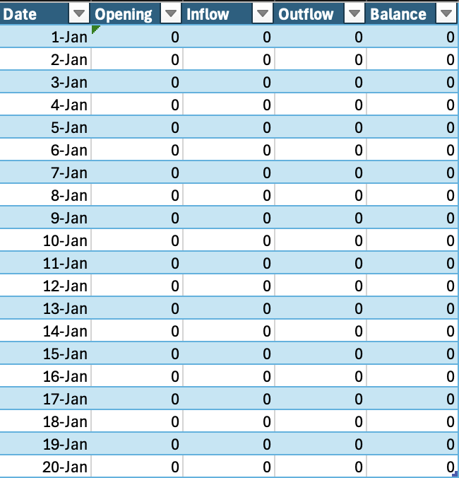
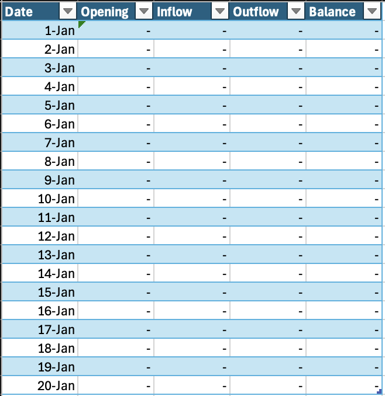

When building a data-driven application, you will typically display data in a grid like this:



If there are a lot of zeros, this looks noisy, to which you might want a different, less noisy way to display zeros.

Given that zeros typically reflect a lack of change, an option is to use a dash.



The [format string](https://learn.microsoft.com/en-us/dotnet/standard/base-types/standard-numeric-format-strings) for this would be as follows:

```c#
#;(#);-
```

The first `#` before the ; is for **positive** values; then **negative** values, and finally **zero** values.

If you want to show thousand separators:

```c#
#,0;(#,0);-
```

Some may find the dash too noisy, and prefer **nothing** at all.

In which case, you would try the following:

```c#
#;(#);
```

Note here that there is **nothing** after the semicolon.

This, you will find, actually returns this:


Not putting anything after the semicolon communicates that **you want the default display for a zero** to be used.

You therefore need to supply **something**.

A simple solution is to provide a space.

```c#
#;(#); 
```

This is technically cheating, but it is good enough for most scenarios.

If you really want to have absolutely nothing in that cell, perhaps the grid is being exported, then you need to do some extra work and have some logic that controls the **formatting**.

This will depend on the technology you are using for the grid, and most of them support some sort of conditional logic.

The algorithm would be as follows:

```c#
value == 0 ? "" : $"{value:#;(#)}"
```

### TLDR

**When displaying numbers that are zeros using a formatting string, you need to be extra careful to get the required results.**

Happy hacking!
