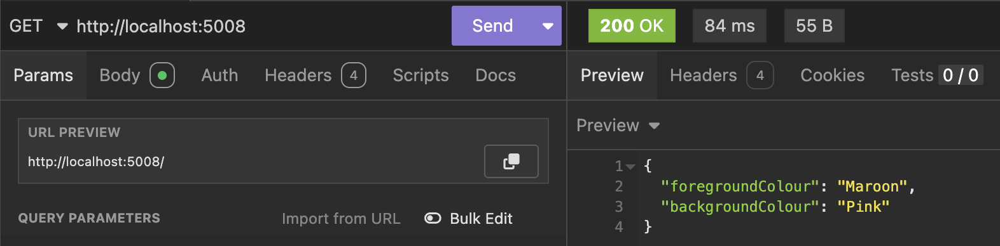

The post [Flexible Leveraging of appsettings.json in .NET Applications]() examined how to utilize `appsettings.json` files for storing and loading settings under various conditions.

The post [Setting the Staging & Production Environments During Development]() examined how to leverage the active **environment** to control settings.

The post [Overriding appsettings.json via Command Line]() looked at how to override settings via **command line arguments**.

And finally, the post [Overriding appsettings.json via Environment Variables]() looked at how to override settings via **environment variables**.

The question arises - what if you use **all of these at once**? Which will take **precedence**?

For the files, it will depend on how you have written your code.

If you don't do anything at all in the startup, the precedence will be as follows:

1. `appsettings.json`
2. `appsettings.{Environment}.json`

If your startup is like this:

```c#
using ApplicationSettings.Properties;
using Microsoft.Extensions.Options;

var builder = WebApplication.CreateBuilder(args);

// Check if we are running in development
if (builder.Environment.IsDevelopment())
{
    // Load optional developer-specific settings
    builder.Configuration.AddJsonFile($"appsettings.{Environment.MachineName}.json", optional: true);
}

// Configure options DI
builder.Services.AddOptions<SystemSettings>()
    .Bind(builder.Configuration.GetSection(nameof(SystemSettings)));

var app = builder.Build();

app.MapGet("/", (IOptions<SystemSettings> options) =>
{
    var settings = options.Value;
    return settings;
});

app.Run();
```

The precedence will be as follows:

### Development Environment

1. `appsettings.json`
2. `appsettings.Development.json`
3. `appsettings.{Machine Name}.json`

### Staging / Production Environment

1. `appsettings.json`
2. `appsettings.{Environment}.json`

We can verify this empirically.

Our `appsettings.json` is as follows:

```json
{
  "Logging": {
    "LogLevel": {
      "Default": "Information",
      "Microsoft.AspNetCore": "Warning"
    }
  },
  "AllowedHosts": "*",
  "SystemSettings": {
    "ForegroundColour": "White",
    "BackgroundColour": "Black"
  }
}
```

In the terminal, we set the **environment variables** as follows:

```bash
export SystemSettings__ForegroundColour=Neon
export SystemSettings__BackgroundColour=Mauve
```

And finally, we run our application like this:

```bash
dotnet run --SystemSettings:ForegroundColour=Maroon --SystemSettings:BackgroundColour=Pink
```

You will see the following:



The order is thus as follows:

1. `appsettings.json` (and all its descendants)
2. **Environment Variables**
3. **Command Line Arguments**

### TLDR

**Settings are loaded in the following order: `appsettings.json`, then *environment variables*, and finally *command-line arguments*.**

The code is in my [GitHub](https://github.com/conradakunga/BlogCode/tree/master/2025-05-16%20-%20Precedence).

Happy hacking!
