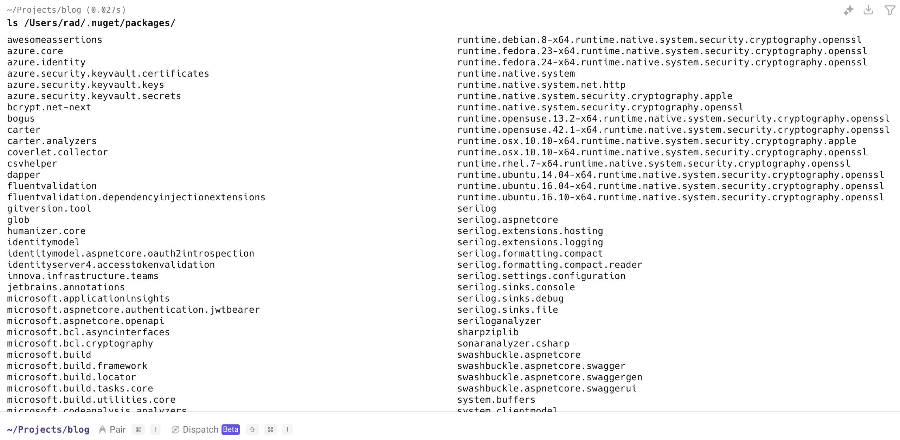
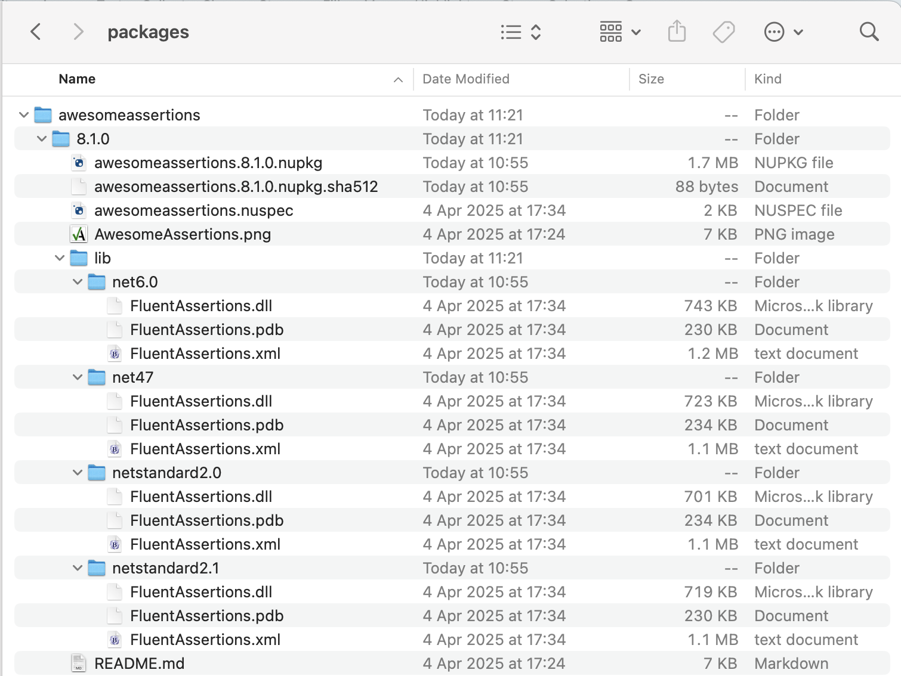
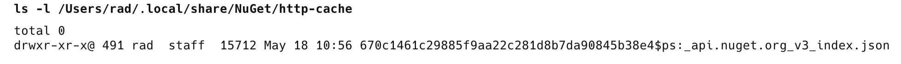
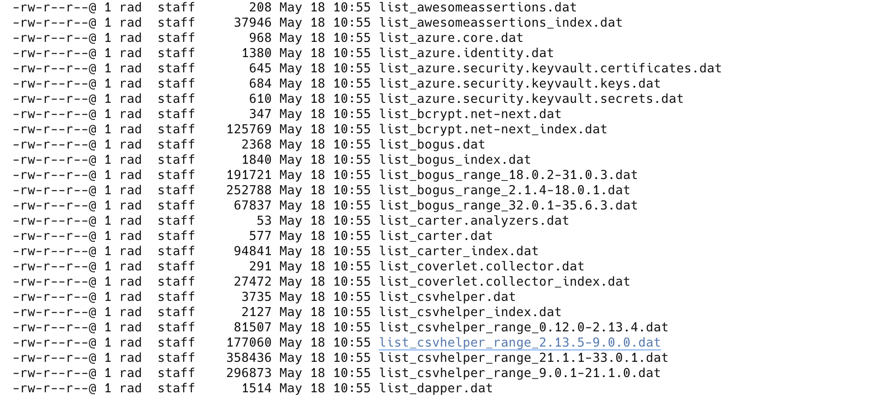
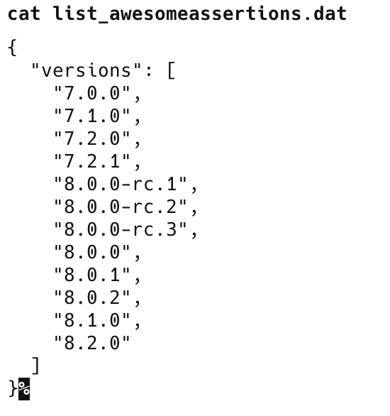
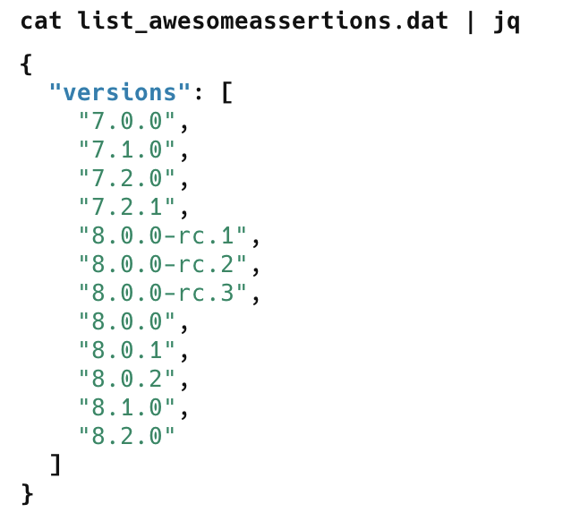

In the context of [NuGet](https://learn.microsoft.com/en-us/nuget/) packages, what happens when you run `dotnet add package`?

It depends.

If the package that you are adding has been added to **another** project on your machine, the package will be retrieved from a **cache** and then added as a reference to your project.

If it's a package you are installing for the **first time**, it will be **downloaded** from whichever source (probably nuget) and then added as a reference to your project.

Have you ever wondered **where** these caches are, and how you can **view their contents**?

The caches are just normal **directories** on your machine, and can be viewed by running the following command:

```bash
dotnet nuget locals all --list
```

On my MacBook running [macOS](https://en.wikipedia.org/wiki/MacOS), it prints the following:

```plaintext
http-cache: /Users/rad/.local/share/NuGet/http-cache
global-packages: /Users/rad/.nuget/packages/
temp: /var/folders/q8/cdslzt2s6p1djnhp_y3ksc280000gn/T/NuGetScratch
plugins-cache: /Users/rad/.local/share/NuGet/plugin-cache
```

As you can see, there are https://en.wikipedia.org/wiki/MacOS main folders:

1. Global **packages** cache
2. **Http** cache
3. **Temp** cache
4. **Plugins** cache

### Global Packages Cache

This is the location where the **actual nuget packages** (*.nupkg*) are stored after download.

Each package is stored in a **folder** with the corresponding name.

You can view the contents directly by running the following command:

```bash
ls /Users/rad/.nuget/packages/
```

This returns the following: a list of **folders**:



If you view one of the folders, it will have this structure:



The structure consists of the following:

The top level is the **version** of the package, into which goes the following:

1. **.nupkg** itself
2. A **hash** of the package
3. A **[nuspec](https://learn.microsoft.com/en-us/nuget/reference/nuspec)** file
4. A **logo** (if provided)
5. A **readme** (if provided)
6. A **lib** folder

The lib folder contains the actual **DLLs** themselves, packaged into **folders** according to the **[target](https://learn.microsoft.com/en-us/dotnet/standard/frameworks)**.

### HTTP Cache

This is the location where nuget maintains some **metadata** about the downloaded packages.

You can view it using the following command:

```bash
ls -l /Users/rad/.local/share/NuGet/http-cache
```

In this folder, you will find a generated folder that you can then expand.



It contains a number of files with the `.dat` extension. 



These `.dat` files are `JSON` files that you can view directly.

To view the first one, I can run:

```bash
cat list_awesomeassertions.dat
```



To pretty-print it, you can pipe this to the [jq](https://jqlang.org/) utility:



### Plugin Cache

This folder is used to store the following:

- Invocation **results**
- Executable **paths**
- Credential **tokens** (for authenticated sources)

### Temp Cache

This cache stores  **intermediate or temporary files** during operations like **restore**, **install** and **pack**.

Over time, these caches can grow significantly, and you might want to clear them.

This is generally not an issue, as they will be repopulated whenever you perform a package **installation** or **restore**. However, you may run into problems if one (or more) of your nuget sources is **unavailable**.

There are two ways to clear them:

1. **Manually** (by deleting the contents of the folders)
2. Using the [NuGet](https://learn.microsoft.com/en-us/dotnet/core/tools/dotnet-nuget-locals) tools for this purpose

The following commands are available:

To clear the global cache:

```bash
dotnet nuget locals global-packages --clear
```

To clear the HTTP cache:

```bash
dotnet nuget locals http-cache --clear
```

To clear the temp cache:

```bash
dotnet nuget locals temp --clear
```

There isn't a `dotnet` command to clear the plugins cache directly.

To clear all the caches (including plugins):

```bash
dotnet nuget locals all --clear
```

### TLDR

**.NET utilizes several caches to enhance the performance of package installation. It also has tools to aid in the management of these caches.**

Happy hacking!
