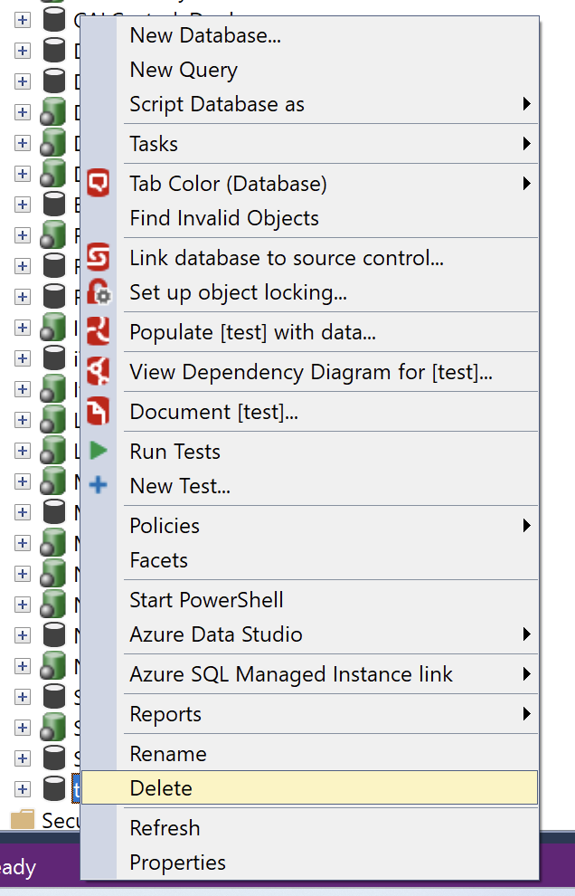
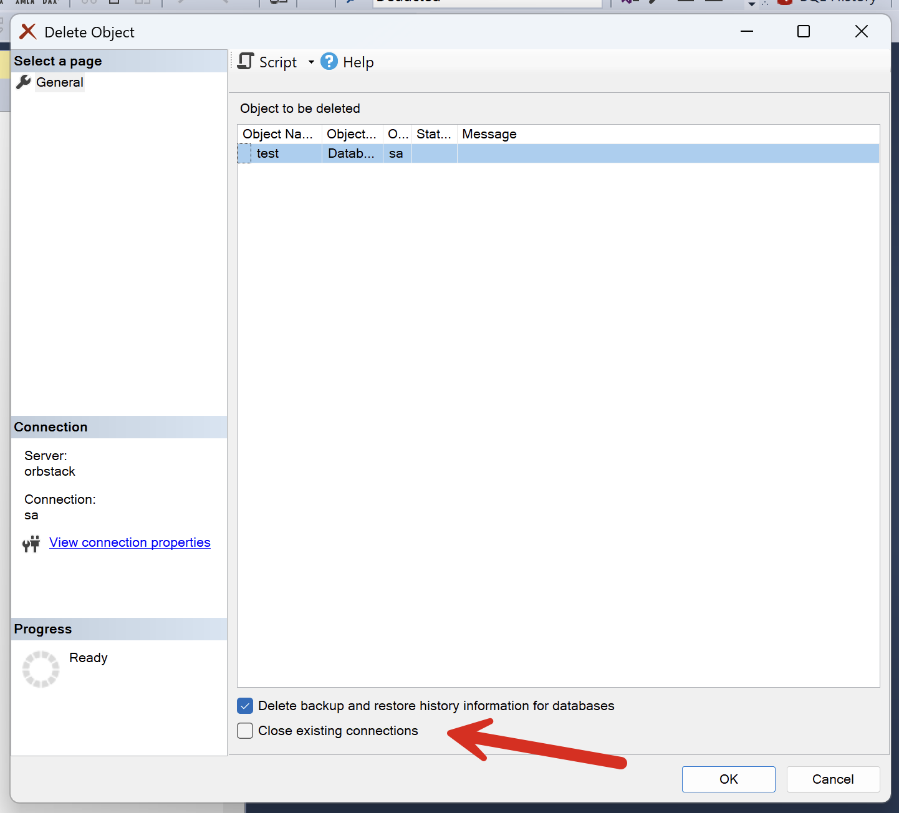
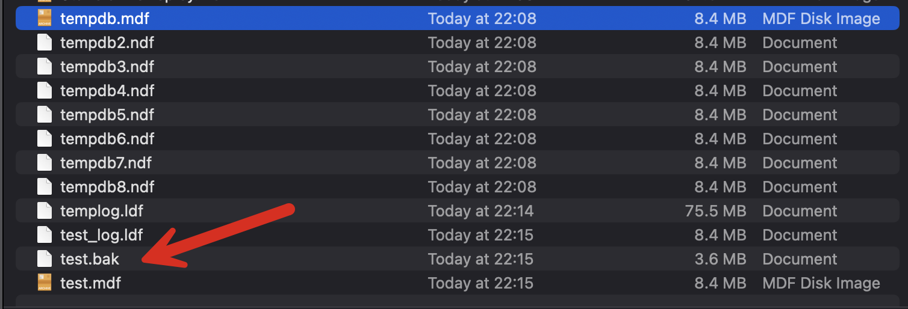
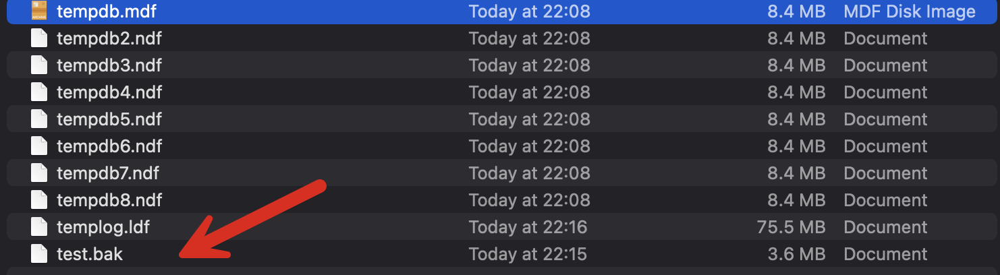

I recently performed **maintenance** on my development database server.

This required **dropping** some databases.

This is straightforward using [SSMS](https://learn.microsoft.com/en-us/ssms/sql-server-management-studio-ssms).

Clicking **Delete** presents this dialog:

Despite having used this dialog dozens of times over the years, today I actually wondered what checking this button does.

As it so happens, this database had a backup on disk.

So I wondered what would happen to this file if I went ahead and performed the delete after checking that selection.

Turns out ...

**NOTHING**.

"Backup and restore information" does not, in fact, refer to your backup files. It refers to the **internal information SQL Server stores** in is [msdb](https://learn.microsoft.com/en-us/sql/relational-databases/databases/msdb-database?view=sql-server-ver16) database.

From the [SQL Server documentation](https://learn.microsoft.com/en-us/ssms/object/delete-objects?f1url=%3FappId%3DDev15IDEF1%26l%3DEN-US%26k%3Dk(sql13.swb.deleteobjects.f1)%26rd%3Dtrue):

> **Delete backup and restore history information for databases**
> Only appears when a database is deleted, this check box causes the backup and restore history for the subject database to be deleted from the **msdb** database.

### TLDR

**When deleting a database, "Backup and restore information"  does not refer to your backups!**

Happy hacking!
