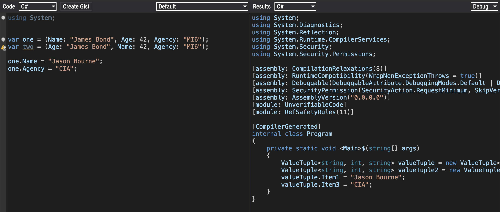

The `Tuple` was introduced in the [.NET Framework 4](https://en.wikipedia.org/wiki/.NET_Framework_version_history#.NET_Framework_4.0), and was basically a way to stitch a bunch of properties together.

Suppose we wanted to put together a `Spy`, consisting of a **name** and their **age**.

We'd do it like this:

```c#
var spy = Tuple.Create("James Bond", 45);

Console.Write($"The name is {spy.Item1} and the value is  {spy.Item2}");
```

The new `Tuple` created would have two **typed** properties - `Item1`, `string` and `Item2`, `int`.

At this point you might ask, how many "properties" can you create?

Eight.

```c#
var items = Tuple.Create(1, 2, 3, 4, 5, 6, 7, 8);
```

But there is a twist - whereas items 1 through 7 are integers, 8 is another `Tuple`, that has **one** property. It is not even named `Item8` - it is named `Rest`.

You access it as follows:

```c#
var items = Tuple.Create(1, 2, 3, 4, 5, 6, 7, 8);

Console.WriteLine($"The last item is {items.Rest.Item1}");
```

If you want to create **9** items, create the first **7** as normal but **the eighth is going to be a `Tuple` with two elements**.

In other words, **you can create as many items as you want** if you keep this in mind.

Of course you should be rethinking your type design if you ever find yourself doing this regularly.

In C# 7 there was a further improvement - `ValueTuples`.

This allowed you to do this:

```c#
var spy = (Name: "James Bond", Age: 42);

Console.Write($"The name is {spy.Name} and the value is {spy.Age}");
```

It might surprise you to know that behind the scenes, our old friends `Item1` and Item2 are still there, so this code will also work:

```c#
Console.WriteLine($"The name is {spy.Item1} and the value is {spy.Item2}");
```

You might also be interested to know that the names are **optional**. You can also do this:

```c#
var otherSpy = ("James Bond", 42);
```

Naturally, you will have to refer to the properties as `Item1` and `Item2`.

You can also **mix and match named and unnamed properties**. 

This is also valid:

```c#
var someOtherSpy = (Name: "James Bond", 42);
```

**Does the 8 element constraint still hold**?

Indeed.

```c#
var items = (1, 2, 3, 4, 5, 6, 7, 8);

Console.WriteLine($"The last item is {items.Rest.Item1}");
```

So what is the difference between the `Tuple` and `ValueTuple`?

1. `Tuple` is **immutable**. You cannot change the properties after creation. `ValueTuple` isn't - **you can change** the properties.
2. `Tuple` is a [class](https://learn.microsoft.com/en-us/dotnet/csharp/fundamentals/types/classes), `ValueTuple` is a [struct](https://learn.microsoft.com/en-us/dotnet/csharp/language-reference/builtin-types/struct).
3. `ValueTuple` tends to be lightweight, and therefore has better performance.

For these reasons, you probably want to use the ValueTuple.

It has some additional benefits like this:

```c#
var first = (Name: "James Bond", Age: 42);
var second = (Name: "James Bond", Age: 42);
Console.WriteLine(first == second);
```

This prints the following:

```plaintext
True
```

Since it a `struct`, equality is based on the **equality of the properties**.

For a `Tuple`:

```c#
var first = Tuple.Create("James Bond", 42);
var second = Tuple.Create("James Bond", 42);
Console.WriteLine(first == second);
```

This prints the following:

```plaintext
False
```

Remember that a `Tuple` is a `class`, and **equality** refers to [reference](https://learn.microsoft.com/en-us/dotnet/csharp/programming-guide/statements-expressions-operators/equality-comparisons).

Now, here is a something you might find surprising:

Let us create two `ValueTuple` types and deliberately **swap their property names**:

```c#
var one = (Name: "James Bond", Age: 42);
var two = (Age: "James Bond", Name: 42);
Console.WriteLine($"Are they equal? {one == two}");
```

This returns `True`!

It seems **the name of the property does not matter**!

What's going on?

We can turn to our old friend [SharpLab](https://sharplab.io/) for some answers.

The following code:

```c#
var tupleSample = Tuple.Create("James Bond", 42);
var valueTuple = ("James Bond", 42);
```

Generates the following [lowered](https://steven-giesel.com/blogPost/69dc05d1-9c8a-4002-9d0a-faf4d2375bce) code:

```c#
 Tuple<string, int> tuple = Tuple.Create("James Bond", 42);
 ValueTuple<string, int> valueTuple = new ValueTuple<string, int>("James Bond", 42);
```

You can see that the underlying types are different - `Tuple` and `ValueTuple`.

Let us then take our example:

```c#
var one = (Name: "James Bond", Age: 42);
var two = (Age: "James Bond", Name: 42);
```

This is **lowered** as follows:

```c#
ValueTuple<string, int> valueTuple = new ValueTuple<string, int>("James Bond", 42);
ValueTuple<string, int> valueTuple2 = new ValueTuple<string, int>("James Bond", 42);
```

Note that the **property names do not appear anywhere in the generated code** for the `ValueTuple`, meaning they are i**gnored completely by the runtime**.

Which begs the question how then does the compiler know what are the available properties for each `ValueTuple`?

Let us change one property:

```c#
var one = (Name: "James Bond", Age: 42);
var two = (Age: "James Bond", Name: 42);

one.Name = "Jason Bourne";
```

This is the resulting code:

```c#
ValueTuple<string, int> valueTuple = new ValueTuple<string, int>("James Bond", 42);
ValueTuple<string, int> valueTuple2 = new ValueTuple<string, int>("James Bond", 42);
valueTuple.Item1 = "Jason Bourne";
```

Interesting. 

Let us add an additional property:

```c#
var one = (Name: "James Bond", Age: 42, Agency: "MI6");
var two = (Age: "James Bond", Name: 42, Agency: "MI6");

one.Name = "Jason Bourne";
one.Agency = "CIA";
```

The lowered code is as follows:

```c#
ValueTuple<string, int, string> valueTuple = new ValueTuple<string, int, string>("James Bond", 42, "MI6");
ValueTuple<string, int, string> valueTuple2 = new ValueTuple<string, int, string>("James Bond", 42, "MI6");
valueTuple.Item1 = "Jason Bourne";
valueTuple.Item3 = "CIA";
```



**It seems that the compiler ignores the property name and uses the generic names for each property behind the scenes.**

### TLDR

**`ValueTuples` can be very powerful and convenient in every day use, especially compared to `Tuples`. Be however wary of the fact that they are *mutable* and the compiler *ignores property names*.**

Happy hacking!
