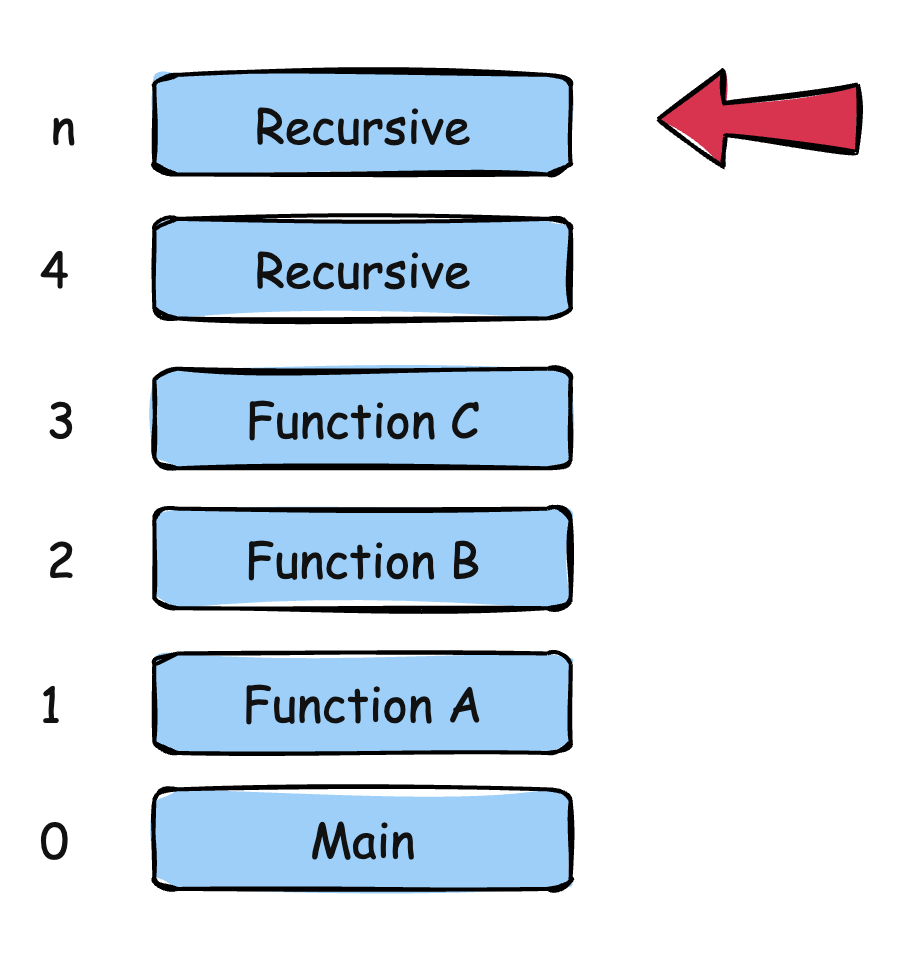

in .NET, there is a construct called an [Exception](https://learn.microsoft.com/en-us/dotnet/csharp/fundamentals/exceptions/). This mechanism is used to handle exceptional situations during program execution, usually some sort of **invalid state** either with your **algorithm** or with the **environment** as a whole.

For example, if you tried to divide by zero:

```c#
var numerator = 10;
var denominator = 0;
var result = numerator / denominator;
```

This program will return the following:

```plaintext
Unhandled exception. System.DivideByZeroException: Attempted to divide by zero.
   at Program.<Main>$(String[] args) in /Users/rad/Projects/blog/BlogCode/ExceptionHandling/Program.cs:line 3

Process finished with exit code 134.
```

.NET allows you to handle this situation using an exception handler, where you wrap any code that might throw an exception in a [try-catch block](https://learn.microsoft.com/en-us/dotnet/csharp/language-reference/statements/exception-handling-statements).

```c#
try
{
  var numerator = 10;
  var denominator = 0;
  var result = numerator / denominator;
}
catch (Exception e)
{
  Console.WriteLine("You attempted to divide by zero. Please try again.");
}
```

Running this code will return the following:

```plaintext
You attempted to divide by zero. Please try again.
```

The code above is **not correct** because it assumes the only exception that can be thrown is a `DivideByZero` exception.

It is better to write it like this:

```c#
try
{
    var numerator = 10;
    var denominator = 0;
    var result = numerator / denominator;
}
catch (DivideByZeroException)
{
    Console.WriteLine("You attempted to divide by zero. Please try again.");
}
catch (Exception ex)
{
    Console.WriteLine($"Some other exception occured: {ex.Message}");
}
```

Here we have logic that handles a [DivideByZero](https://learn.microsoft.com/en-us/dotnet/api/system.dividebyzeroexception?view=net-9.0), and different logic that handles any other exception.

All exceptions derive from [System.Exception](https://learn.microsoft.com/en-us/dotnet/api/system.exception?view=net-9.0).

You would assume that you can wrap all your programs with a try-catch and never have to worry about anything.

**You would be wrong**.

Some exceptions **cannot be caugh**t.

Take, for example, this code:

```c#
// Call the recursive method
Recursive();

// A recursive method that calls itself
void Recursive()
{
    Recursive();
}
```

If you run this code you will get something like this:

```plaintext
Stack overflow.
Repeated 522779 times:
--------------------------------
   at Program.<<Main>$>g__Recursive|0_0()
--------------------------------
   at Program.<Main>$(System.String[])

Process finished with exit code 134.

```

This code has thrown a [StackOverflow](https://learn.microsoft.com/en-us/dotnet/api/system.stackoverflowexception?view=net-9.0) exception.

Now, let's try to wrap our code in a `try-catch` block.

```c#
try
{
    // Call the recursive method
    Recursive();
}
catch (StackOverflowException e)
{
    Console.WriteLine("Stack overflow");
}
catch (Exception)
{
    Console.WriteLine("Unexpected exception");
}
```

The program still terminates, with the same error.

The exception is not caught at all, and the runtime terminates the program.

Why?

Every time you launch a program, it is allocated a [stack](https://en.wikipedia.org/wiki/Call_stack) by the runtime. This stack is what allows the program to keep track of **what** functions are called, and where to **return** after the function exits.

So if your program looks like this:

```c#
var result = Add(1, 3);

int Add(int first, int second)
{
    return first + second;
}
```

When you launch it, the stack will look like this:


When the `Add` function is called, this is pushed into the stack and the pointer is updated.


When `Add` completes and returns, it is popped from the stack and the pointer is reset, taking us back to the original position.


Now, let us examine our recursive function call program.

Given we are calling the function **recursively**, this will happen:


The size of the stack is not finite ([and is about 1MB](https://website-development.ch/blog/stack-heap-memory)), and therefore, at some point, the stack will be full.

The reason you cannot catch this exception is that **since the stack is full, the runtime has no idea where to return**.

You might wonder why not just return to the top of the stack, position 0.

Because you cannot assume that it is the source of the problem.

The state could have been this:



In any case, returning the user to the program start would be quite jarring. What of the work the program had done?

### TLDR

**The `StackOverflow` exception cannot be caught and handled.**

The code is in my [GitHub](https://github.com/conradakunga/BlogCode/tree/master/2025-05-23%20-%20Un-catchable%20Exceptions).

Happy hacking!
