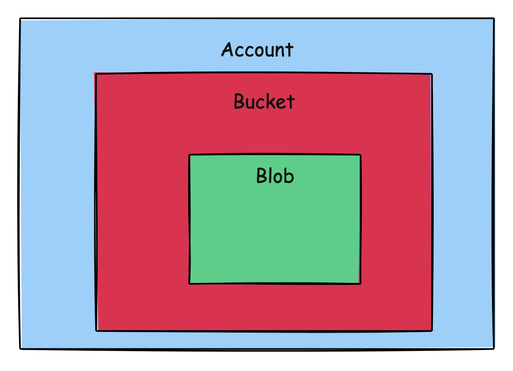

This is Part 20 of a series on Designing, Building & Packaging A Scalable, Testable .NET Open Source Component.

- [Designing, Building & Packaging A Scalable, Testable .NET Open Source Component - Part 1 - Introduction]()
- [Designing, Building & Packaging A Scalable, Testable .NET Open Source Component - Part 2 - Basic Requirements]()
- [Designing, Building & Packaging A Scalable, Testable .NET Open Source Component - Part 3 - Project Setup]()
- [Designing, Building & Packaging A Scalable, Testable .NET Open Source Component - Part 4 - Types & Contracts]()
- [Designing, Building & Packaging A Scalable, Testable .NET Open Source Component - Part 5 - Component Implementation]()
- [Designing, Building & Packaging A Scalable, Testable .NET Open Source Component - Part 6 - Mocking & Behaviour Tests]()
- [Designing, Building & Packaging A Scalable, Testable .NET Open Source Component - Part 7 - Sequence Verification With Moq]()
- [Designing, Building & Packaging A Scalable, Testable .NET Open Source Component - Part 8 - Compressor Implementation]()
- [Designing, Building & Packaging A Scalable, Testable .NET Open Source Component - Part 9 - Encryptor Implementation]()
- [Designing, Building & Packaging A Scalable, Testable .NET Open Source Component - Part 10 - In Memory Storage]()
- [Designing, Building & Packaging A Scalable, Testable .NET Open Source Component - Part 11 - SQL Server Storage]()
- [Designing, Building & Packaging A Scalable, Testable .NET Open Source Component - Part 12 - PostgreSQL Storage]()
- [Designing, Building & Packaging A Scalable, Testable .NET Open Source Component - Part 13 - Database Configuration]()
- [Designing, Building & Packaging A Scalable, Testable .NET Open Source Component - Part 14 - Virtualizing Infrastructure]()
- [Designing, Building & Packaging A Scalable, Testable .NET Open Source Component - Part 15 - Test Organization]()
- [Designing, Building & Packaging A Scalable, Testable .NET Open Source Component - Part 16 - Large File Consideration]()
- [Designing, Building & Packaging A Scalable, Testable .NET Open Source Component - Part 17 - Large File Consideration On PostgreSQL]()
- [Designing, Building & Packaging A Scalable, Testable .NET Open Source Component - Part 18 - Azure Blob Storage]()
- [Designing, Building & Packaging A Scalable, Testable .NET Open Source Component - Part 19 - Testing Azure Blob Storage Locally]()
- **Designing, Building & Packaging A Scalable, Testable .NET Open Source Component - Part 20 - Amazon S3 Storage (This post)**

In the last post in the series, we looked at how to test Azure Blob storage locally.

In this post, we will implement storage on Amazon S3 - the `AmazonS3StorageEngine`.

The first step is understanding the Amazon product we will use for storage - [Amazon Simple Storage Service](https://aws.amazon.com/s3/), known as S3.

The main concepts we will deal with are:

1. Account
2. Bucket

### Account

This is the top level. It is accessed and manipulated using the AmazonS3Client.

### Bucket

This level is the equivalent of a directory.

An account can have more than one [bucket](https://www.techtarget.com/searchaws/definition/AWS-bucket). Objects are stored in the `buckets`.



This is accessed and manipulated using three objects:

1. [AmazonS3Client](https://docs.aws.amazon.com/sdkfornet/v3/apidocs/items/S3/TS3Client.html), that interfaces at a lower level,
2. [TransferUtility](https://docs.aws.amazon.com/sdkfornet/v3/apidocs/items/S3/TTransferUtility.html), a higher level interface with convenience methods for dealing with uploads and downloads
3. [AmazonS3Util](https://docs.aws.amazon.com/sdkfornet/v3/apidocs/items/S3/TS3Util.html) for bucket verifications

Similar to our `AzureBlobStorageEngine`, we will have **two** buckets - one to store the **file data**, and another to store the **file metadata**.

We will begin by implementing a class to store some preliminary settings (likely to change to factor in additional AWS concerns like authentication)

```c#
public class AmazonSettings
{
    [Required] public string AccountName { get; set; } = null!;
    [Required] public string DataContainerName { get; set; } = null!;
    [Required] public string MetadataContainerName { get; set; } = null!;
}
```

Next we begin to implement the `AmazonS3StroageEngine`.

```c#
public sealed class AmazonS3StorageEngine : IStorageEngine
{
    private readonly string _dataContainerName;
    private readonly string _metadataContainerName;
    private readonly TransferUtility _utility;
    private readonly AmazonS3Client _client;

    public AmazonS3StorageEngine(string username, string password, string amazonLocation, string dataContainerName,
        string metadataContainerName)
    {
      	// Configuration for the amazon s3 client
        var config = new AmazonS3Config
        {
            ServiceURL = amazonLocation,
            ForcePathStyle = true
        };
        
        _dataContainerName = dataContainerName;
        _metadataContainerName = metadataContainerName;
        _client = new AmazonS3Client(username, password, config);
        _utility = new TransferUtility(_client);
    }
}
```

We next need to implement an `Initialization` method that will **create our buckets if they don't already exist**. This will be run **once**, perhaps at **startup** so that the `AmazonS3StorageEngine` will always find the buckets when it needs them.

```c#
public async Task InitializeAsync(CancellationToken cancellationToken = default)
{
    // Check if the metadata bucket exists
    if (!await AmazonS3Util.DoesS3BucketExistV2Async(_client, _metadataContainerName))
    {
        var request = new PutBucketRequest
        {
            BucketName = _metadataContainerName,
            UseClientRegion = true
        };

        await _client.PutBucketAsync(request, cancellationToken);
    }

    // Check if the data bucket exists
    if (!await AmazonS3Util.DoesS3BucketExistV2Async(_client, _dataContainerName))
    {
        var request = new PutBucketRequest
        {
            BucketName = _dataContainerName,
            UseClientRegion = true
        };

        await _client.PutBucketAsync(request, cancellationToken);
    }
}
```

We then go on to implement the various methods of the `IStorageEngine` interface.

First, a method that checks if a given fileID exists in a specified container:

```c#
private async Task<bool> FileExistsAsync(Guid fileId, string containerName,
    CancellationToken cancellationToken = default)
{
    try
    {
        await _client.GetObjectMetadataAsync(containerName, fileId.ToString(), cancellationToken);
        return true;
    }
    catch (AmazonS3Exception ex)
    {
        if (ex.StatusCode == HttpStatusCode.NotFound)
        {
            throw new FileNotFoundException($"File {fileId} not found");
        }

        return false;
    }
}
```

Next, `StoreFileAsync`:

```c#
/// <inheritdoc />
public async Task<FileMetadata> StoreFileAsync(FileMetadata metaData, Stream data,
    CancellationToken cancellationToken = default)
{
    // Upload the data and the metadata in parallel
    await Task.WhenAll(
        _utility.UploadAsync(new MemoryStream(Encoding.UTF8.GetBytes(JsonSerializer.Serialize(metaData))),
            _metadataContainerName, metaData.FileId.ToString(), cancellationToken),
        _utility.UploadAsync(data, _dataContainerName, metaData.FileId.ToString(), cancellationToken)
    );
    return metaData;
}
```

Next, `GetMetadataAsync`:

```c#
/// <inheritdoc />
public async Task<FileMetadata> GetMetadataAsync(Guid fileId, CancellationToken cancellationToken = default)
{
    //Verify file exists
    if (!await FileExistsAsync(fileId, _metadataContainerName, cancellationToken))
        throw new FileNotFoundException($"File {fileId} not found");

    // Create a request
    var request = new GetObjectRequest
    {
        BucketName = _metadataContainerName,
        Key = fileId.ToString()
    };

    // Retrieve the data
    using var response = await _client.GetObjectAsync(request, cancellationToken);
    await using var responseStream = response.ResponseStream;
    var memoryStream = new MemoryStream();
    await responseStream.CopyToAsync(memoryStream, cancellationToken);

    // Reset position
    memoryStream.Position = 0;
    using var reader = new StreamReader(memoryStream);
    var content = await reader.ReadToEndAsync(cancellationToken);
    return JsonSerializer.Deserialize<FileMetadata>(content) ?? throw new FileNotFoundException();
}
```

Next, `GetFileAsync`:

```c#
/// <inheritdoc />
public async Task<Stream> GetFileAsync(Guid fileId, CancellationToken cancellationToken = default)
{
    //Verify file exists
    if (!await FileExistsAsync(fileId, _dataContainerName, cancellationToken))
        throw new FileNotFoundException($"File {fileId} not found");

    // Create a request
    var request = new GetObjectRequest
    {
        BucketName = _dataContainerName,
        Key = fileId.ToString()
    };

    // Retrieve the data
    using var response = await _client.GetObjectAsync(request, cancellationToken);
    await using var responseStream = response.ResponseStream;
    var memoryStream = new MemoryStream();
    await responseStream.CopyToAsync(memoryStream, cancellationToken);
    // Reset position
    memoryStream.Position = 0;
    return memoryStream;
}
```

Next, `DeleteFileAsync`:

```c#
/// <inheritdoc />
public async Task<bool> FileExistsAsync(Guid fileId, CancellationToken cancellationToken = default)
{
    return await FileExistsAsync(fileId, _dataContainerName, cancellationToken);
}
```

In our next post, we will look at how to test this locally.

### TLDR

**In this post, we implemented a storage engine for Amazon S3, `AmazonS3StorageEngine`**

The code is in my GitHub.

Happy hacking!
