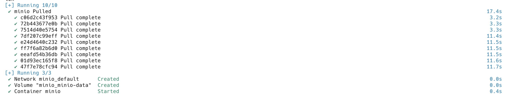
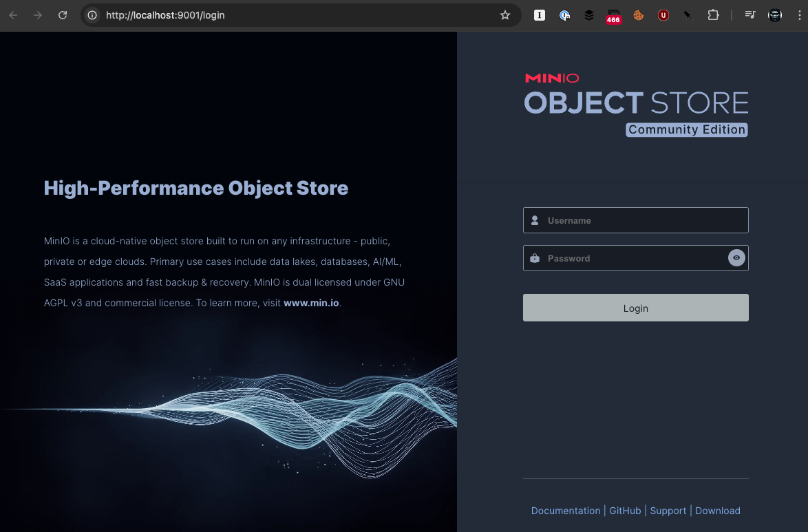
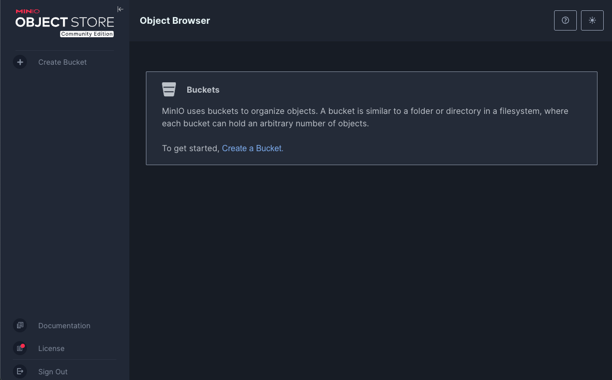
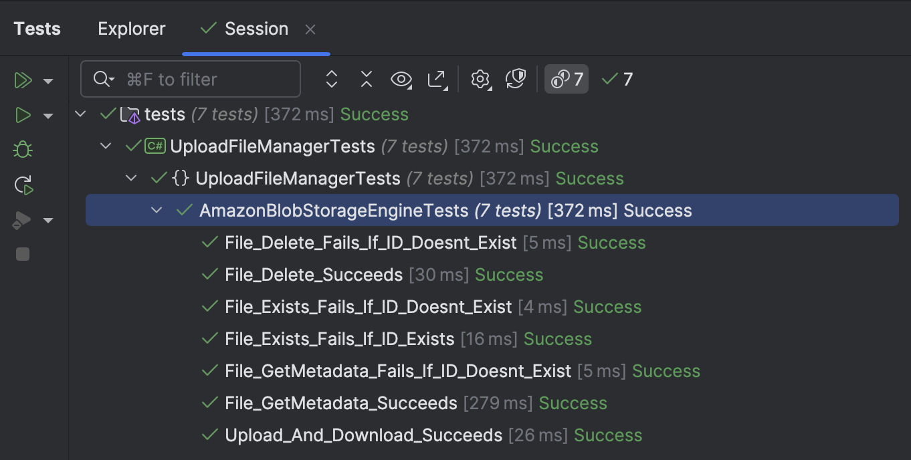
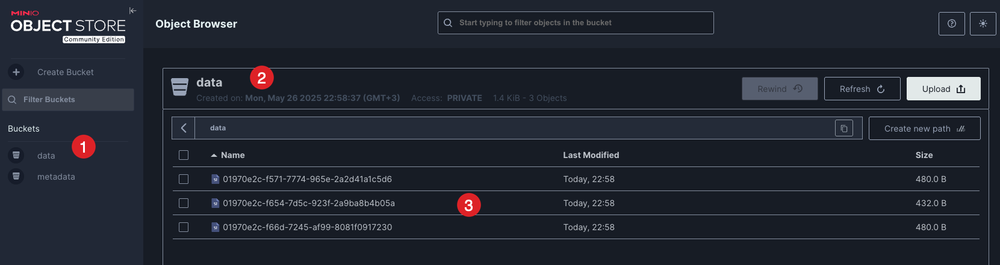

This is Part 21 of a series on Designing, Building & Packaging A Scalable, Testable .NET Open Source Component.

- [Designing, Building & Packaging A Scalable, Testable .NET Open Source Component - Part 1 - Introduction]()
- [Designing, Building & Packaging A Scalable, Testable .NET Open Source Component - Part 2 - Basic Requirements]()
- [Designing, Building & Packaging A Scalable, Testable .NET Open Source Component - Part 3 - Project Setup]()
- [Designing, Building & Packaging A Scalable, Testable .NET Open Source Component - Part 4 - Types & Contracts]()
- [Designing, Building & Packaging A Scalable, Testable .NET Open Source Component - Part 5 - Component Implementation]()
- [Designing, Building & Packaging A Scalable, Testable .NET Open Source Component - Part 6 - Mocking & Behaviour Tests]()
- [Designing, Building & Packaging A Scalable, Testable .NET Open Source Component - Part 7 - Sequence Verification With Moq]()
- [Designing, Building & Packaging A Scalable, Testable .NET Open Source Component - Part 8 - Compressor Implementation]()
- [Designing, Building & Packaging A Scalable, Testable .NET Open Source Component - Part 9 - Encryptor Implementation]()
- [Designing, Building & Packaging A Scalable, Testable .NET Open Source Component - Part 10 - In Memory Storage]()
- [Designing, Building & Packaging A Scalable, Testable .NET Open Source Component - Part 11 - SQL Server Storage]()
- [Designing, Building & Packaging A Scalable, Testable .NET Open Source Component - Part 12 - PostgreSQL Storage]()
- [Designing, Building & Packaging A Scalable, Testable .NET Open Source Component - Part 13 - Database Configuration]()
- [Designing, Building & Packaging A Scalable, Testable .NET Open Source Component - Part 14 - Virtualizing Infrastructure]()
- [Designing, Building & Packaging A Scalable, Testable .NET Open Source Component - Part 15 - Test Organization]()
- [Designing, Building & Packaging A Scalable, Testable .NET Open Source Component - Part 16 - Large File Consideration]()
- [Designing, Building & Packaging A Scalable, Testable .NET Open Source Component - Part 17 - Large File Consideration On PostgreSQL]()
- [Designing, Building & Packaging A Scalable, Testable .NET Open Source Component - Part 18 - Azure Blob Storage]()
- [Designing, Building & Packaging A Scalable, Testable .NET Open Source Component - Part 19 - Testing Azure Blob Storage Locally]()
- [Designing, Building & Packaging A Scalable, Testable .NET Open Source Component - Part 20 - Amazon S3 Storage]()
- **Designing, Building & Packaging A Scalable, Testable .NET Open Source Component - Part 21 - Testing Amazon S3 Storage Locally (This post)**

In our last post, we implemented the `AmazonS3Storage` engine - a storage engine for [Amazon](https://aws.amazon.com/) [S3](https://aws.amazon.com/s3/).

Testing locally here means how do we test **without** connecting to the actual [Amazon](https://aws.amazon.com/s3/) infrastructure. As part of integration testing, we will ultimately need to do this, but given that moving data in and out of Amazon costs actually money, it may not be desirable to do this frequently.

This is possible using the tool [Minio](https://min.io/)

This is available, like Azuite, as a Docker image.

We can start by creating a `docker-compose.yaml` file to configure our settings.

```yaml
services:
  minio:
    image: quay.io/minio/minio
    container_name: minio
    ports:
      - "9000:9000"   # S3 API endpoint
      - "9001:9001"   # Web console
    environment:
      MINIO_ROOT_USER: admin
      MINIO_ROOT_PASSWORD: password123
    volumes:
      - minio-data:/data
    command: server /data --console-address ":9001"
    restart: unless-stopped

volumes:
  minio-data:
```

We can then spin it up from the folder containing the `yaml` file.

```bash
docker-compose up -d --build
```

You should see the following:



Once the container is started, we can access the `Minio` admin console. The URL is http://localhost:9001/

You will see the following screen:



The **username** and **password** are as specified in the `docker-compose.yaml`:

```plaintext
username: admin
password: password123
```

Once you accept the license agreement, you will see the following screen:



Notice that there are **no buckets**.

Going back to the `AmazonS3StorageEngine`, there is this method:

```c#
public async Task InitializeAsync(CancellationToken cancellationToken = default)
{
    // Check if the metadata bucket exists
    if (!await AmazonS3Util.DoesS3BucketExistV2Async(_client, _metadataContainerName))
    {
        var request = new PutBucketRequest
        {
            BucketName = _metadataContainerName,
            UseClientRegion = true
        };

        await _client.PutBucketAsync(request, cancellationToken);
    }

    // Check if the data bucket exists
    if (!await AmazonS3Util.DoesS3BucketExistV2Async(_client, _dataContainerName))
    {
        var request = new PutBucketRequest
        {
            BucketName = _dataContainerName,
            UseClientRegion = true
        };

        await _client.PutBucketAsync(request, cancellationToken);
    }
}
```

This method is [async](https://learn.microsoft.com/en-us/dotnet/csharp/asynchronous-programming/) because the methods it calls internally are `async`, and therefore it **cannot be called in the constructor**.

Our **initial** solution is to call `InitializeAsync` in the respective methods, **which we will refactor as there is a better way of doing it**.

So in all our methods in the contract specified by the `IStorageEngine` interface, we add these lines:

```c#
// Initialize
await InitializeAsync(cancellationToken);
```

Next, we refactor the method that checks for bucket existence from this:

```c#
private async Task<bool> FileExistsAsync(Guid fileId, string containerName,
    CancellationToken cancellationToken = default)
{
    try
    {
        await _client.GetObjectMetadataAsync(containerName, fileId.ToString(), cancellationToken);
        return true;
    }
    catch (AmazonS3Exception ex)
    {
        if (ex.StatusCode == HttpStatusCode.NotFound)
        {
            throw new FileNotFoundException($"File {fileId} not found");
        }
        return false;
    }
```

To this:

```c#
private async Task<bool> FileExistsAsync(Guid fileId, string containerName,
    CancellationToken cancellationToken = default)
{
    try
    {
        await _client.GetObjectMetadataAsync(containerName, fileId.ToString(), cancellationToken);
        return true;
    }
    catch (AmazonS3Exception ex)
    {
        if (ex.StatusCode == HttpStatusCode.NotFound)
        {
            return false;
        }

        throw;
    }
}
```

This is because throwing an **exception** when the file is not found is a **bug** - it should return `false`.

Finally, we implement our **tests**:

```c#
[Trait("Type", "Integration")]
public class AmazonBlobStorageEngineTests
{
  private readonly UploadFileManager _manager;

  public AmazonBlobStorageEngineTests()
  {
      // Create a file compressor
      var compressor = new GZipCompressor();
      //
      // Create an encryptor
      //

      // Create Aes object
      var aes = Aes.Create();
      // Create the encryptor
      var encryptor = new AesFileEncryptor(aes.Key, aes.IV);

      // Create the storage engine
      var storageEngine =
          new AmazonS3StorageEngine("admin", "password123", "http://localhost:9000", "data", "metadata");

      // Create the time provider
      var timeProvider = new FakeTimeProvider();
      timeProvider.SetUtcNow(new DateTimeOffset(2025, 1, 1, 0, 0, 0, TimeSpan.Zero));

      // Create the file manager
      _manager = new UploadFileManager(storageEngine, encryptor, compressor, timeProvider);
  }

  private static MemoryStream GetFile()
  {
      var faker = new Faker();
      var dataToStore = faker.Lorem.Sentences(20);
      var dataToStoreStream = new MemoryStream(Encoding.UTF8.GetBytes(dataToStore));
      return dataToStoreStream;
  }

  private async Task<FileMetadata> Upload(MemoryStream data)
  {
      return await _manager.UploadFileAsync("Test.txt", ".txt", data, CancellationToken.None);
  }

  [Fact]
  public async Task Upload_And_Download_Succeeds()
  {
      // Get the data
      var data = GetFile();
      // Upload a file
      var uploadMetadata = await Upload(data);
      // Check the metadata
      uploadMetadata.Should().NotBeNull();
      uploadMetadata.FileId.Should().NotBeEmpty();
      // Download the file
      var download = await _manager.DownloadFileAsync(uploadMetadata.FileId);
      download.GetBytes().Should().BeEquivalentTo(data.GetBytes());
  }

  [Fact]
  public async Task File_Exists_Fails_If_ID_Doesnt_Exist()
  {
      // Check if the file exists
      var result = await _manager.FileExistsAsync(Guid.Empty);
      result.Should().BeFalse();
  }

  [Fact]
  public async Task File_Exists_Fails_If_ID_Exists()
  {
      // Get the data
      var data = GetFile();
      // Upload a file
      var uploadMetadata = await Upload(data);
      // Check if the file exists by ID
      var result = await _manager.FileExistsAsync(uploadMetadata.FileId);
      result.Should().BeTrue();
  }

  [Fact]
  public async Task File_Delete_Succeeds()
  {
      // Get the data
      var data = GetFile();
      // Upload a file
      var uploadMetadata = await Upload(data);
      // Check if the file exists
      var result = await _manager.FileExistsAsync(uploadMetadata.FileId);
      result.Should().BeTrue();
      // Delete the file
      await _manager.DeleteFileAsync(uploadMetadata.FileId);
      // Check again if the file exists
      result = await _manager.FileExistsAsync(uploadMetadata.FileId);
      result.Should().BeFalse();
  }

  [Fact]
  public async Task File_GetMetadata_Succeeds()
  {
      // Get the data
      var data = GetFile();
      // Upload a file
      var uploadMetadata = await Upload(data);
      // Get the metadata from the ID
      var storedMetadata = await _manager.FetchMetadataAsync(uploadMetadata.FileId);
      storedMetadata.Should().NotBeNull();
      storedMetadata.Should().BeEquivalentTo(uploadMetadata);
  }

  [Fact]
  public async Task File_GetMetadata_Fails_If_ID_Doesnt_Exist()
  {
      // Fetch metadata for non-existent ID
      var ex = await Record.ExceptionAsync(() => _manager.FetchMetadataAsync(Guid.Empty));
      ex.Should().BeOfType<FileNotFoundException>();
  }

  [Fact]
  public async Task File_Delete_Fails_If_ID_Doesnt_Exist()
  {
      // Delete a non-existent file id
      var ex = await Record.ExceptionAsync(() => _manager.DeleteFileAsync(Guid.Empty));
      ex.Should().BeOfType<FileNotFoundException>();
  }
}
```

If we run our tests, they should all pass.



And if we look at our **Minio** admin console:



We can see:

1. **Listing** of the created buckets
2. The **active** bucket
3. The **files** in the bucket

Thus, we can effectively test our component locally for **Amazon**.

**Note, however, we have not yet tested against the actual Amazon storage, which will likely require some modifications to our configuration of the client, as well as authentication.**

In our next post, we shall look at some additional improvements to prepare our component for use by an external application.

### TLDR

**In this post, we learned how to set up and configure `Minio` for local testing of `Amazon` storage.**

The code is in my GitHub.

Happy hacking!
