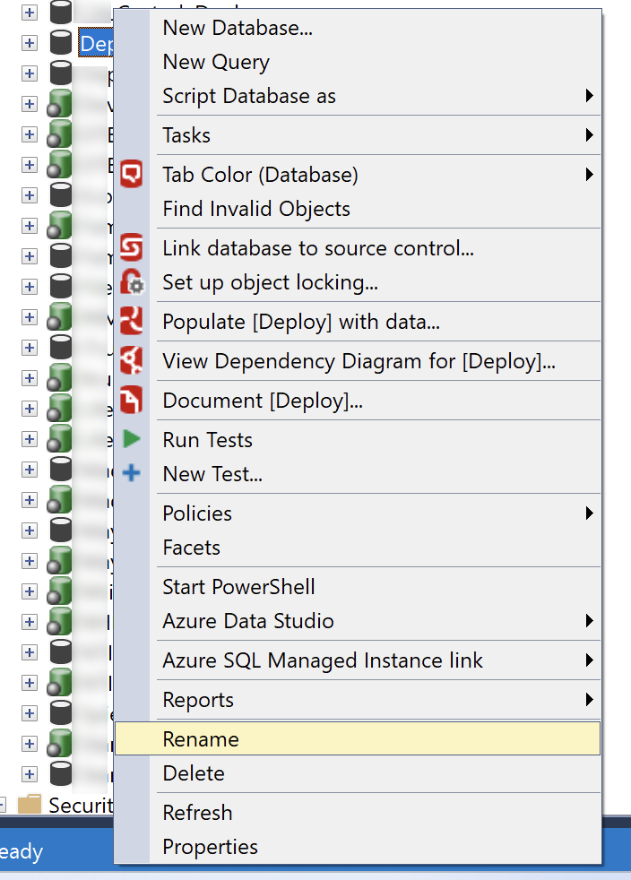
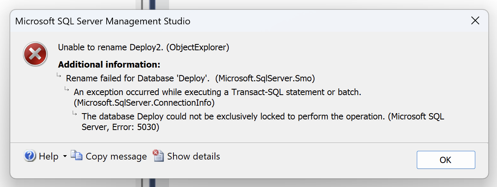
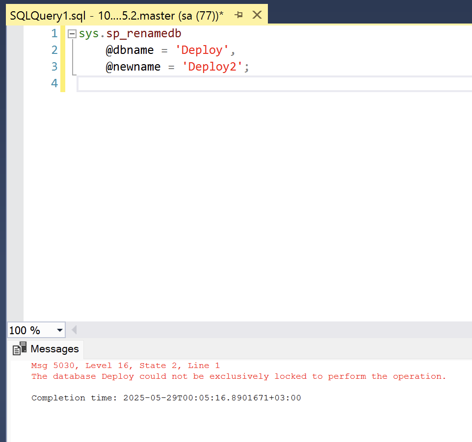
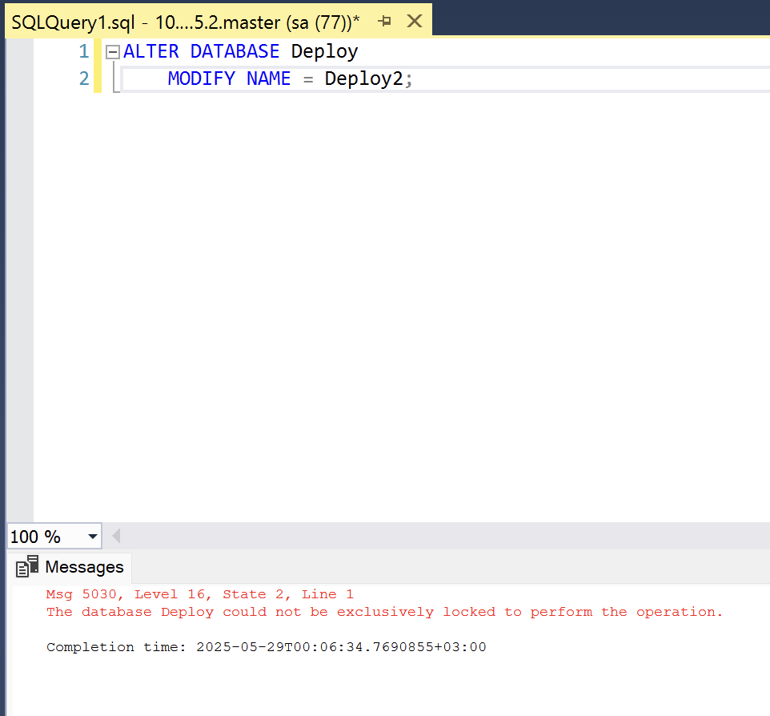

If you need to rename a SQL Server database, there are 3 ways you can do so:

1. [SQL Server Management Studio](https://learn.microsoft.com/en-us/ssms/sql-server-management-studio-ssms)
2. The [sp_renamedb](https://learn.microsoft.com/en-us/sql/relational-databases/system-stored-procedures/sp-renamedb-transact-sql?view=sql-server-ver17) stored procedure
3. The [ALTER DATABASE](https://learn.microsoft.com/en-us/sql/t-sql/statements/alter-database-transact-sql?view=sql-server-ver17&tabs=sqlpool) command

### SQL Server Management Studio

If you have access to SSMS, you can rename the database by right clicking the database and choosing **Rename** from the menu.



### sp_renamedb Procedure

You can also use the procedure `sp_renamedb` as follows:

```sql
sys.sp_renamedb
    @dbname = 'Deploy',
    @newname = 'Deploy2';
```

However, in the documentation it says the following:

> This feature will be removed in a future version of SQL Server. Avoid using this feature in new development work, and plan to modify applications that currently use this feature. Use `ALTER DATABASE MODIFY NAME` instead. For more information, see [ALTER DATABASE](https://learn.microsoft.com/en-us/sql/t-sql/statements/alter-database-transact-sql?view=sql-server-ver17).

So, probably best to stop using this one.

### ALTER DATABASE Command

You can also use the ALTER DATABASE command as follows:

```sql
ALTER DATABASE Deploy
    MODIFY NAME = Deploy2;
```

This seems to be the recommended way.

Now, if you try any of these techniques, all of them will probably fail.

SSMS will fail like this:



`sp_renamedb` will fail like this:



ALTER DATABASE will fail like this:



The error is the same:

```plaintext
The database Deploy could not be exclusively locked to perform the operation.
```

The fix for this is to first run the following command:

```sql
ALTER DATABASE Deploy
    SET
        SINGLE_USER
    WITH ROLLBACK IMMEDIATE;
```

This places the database into [single user mode](https://learn.microsoft.com/en-us/sql/relational-databases/databases/set-a-database-to-single-user-mode?view=sql-server-ver17), which is what you need for maintenance tasks, and will disconnect all currently connected users.

You can now rename the database using any of the techniques.

When you are done you can bring the database back to multi-user mode.

```sql
ALTER DATABASE Deploy2
    SET
        MULTI_USER;
```

Using the `ALTER DATABASE` technique, the complete script is as follows:

```sql
ALTER DATABASE Deploy
    SET
        SINGLE_USER
    WITH ROLLBACK IMMEDIATE;

ALTER DATABASE Deploy
    MODIFY NAME = Deploy2;

ALTER DATABASE Deploy2
    SET
        MULTI_USER;
```

The engine will output something like this:

```plaintext
Nonqualified transactions are being rolled back. Estimated rollback completion: 0%.
Nonqualified transactions are being rolled back. Estimated rollback completion: 100%.
The database name 'Deploy2' has been set.

Completion time: 2025-05-29T00:07:45.6467405+03:00
```

### TLDR

**There are 3 ways to rename a SQL Server database (but one of them will be deprecated). For whichever you use, place the database into single-user mode first.**

Happy hacking!
