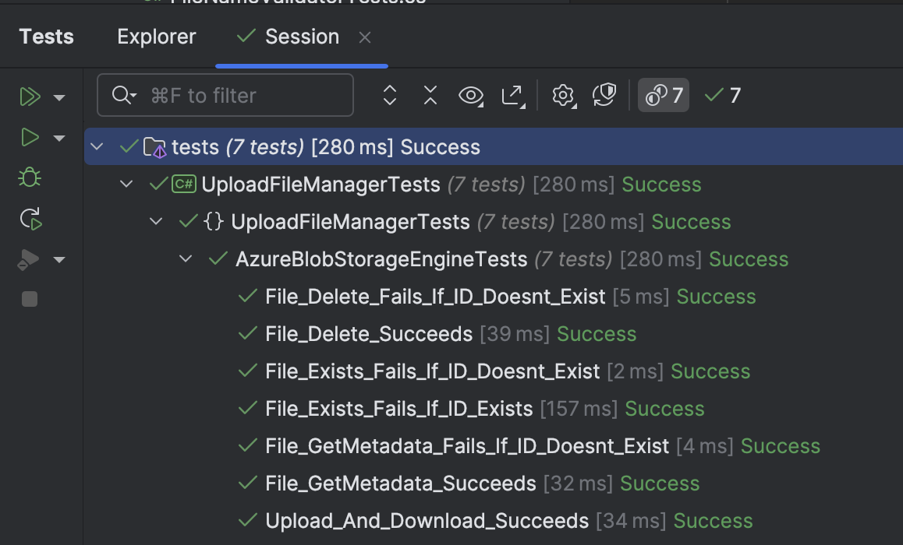

This is Part 22 of a series on Designing, Building & Packaging A Scalable, Testable .NET Open Source Component.

- [Designing, Building & Packaging A Scalable, Testable .NET Open Source Component - Part 1 - Introduction]()
- [Designing, Building & Packaging A Scalable, Testable .NET Open Source Component - Part 2 - Basic Requirements]()
- [Designing, Building & Packaging A Scalable, Testable .NET Open Source Component - Part 3 - Project Setup]()
- [Designing, Building & Packaging A Scalable, Testable .NET Open Source Component - Part 4 - Types & Contracts]()
- [Designing, Building & Packaging A Scalable, Testable .NET Open Source Component - Part 5 - Component Implementation]()
- [Designing, Building & Packaging A Scalable, Testable .NET Open Source Component - Part 6 - Mocking & Behaviour Tests]()
- [Designing, Building & Packaging A Scalable, Testable .NET Open Source Component - Part 7 - Sequence Verification With Moq]()
- [Designing, Building & Packaging A Scalable, Testable .NET Open Source Component - Part 8 - Compressor Implementation]()
- [Designing, Building & Packaging A Scalable, Testable .NET Open Source Component - Part 9 - Encryptor Implementation]()
- [Designing, Building & Packaging A Scalable, Testable .NET Open Source Component - Part 10 - In Memory Storage]()
- [Designing, Building & Packaging A Scalable, Testable .NET Open Source Component - Part 11 - SQL Server Storage]()
- [Designing, Building & Packaging A Scalable, Testable .NET Open Source Component - Part 12 - PostgreSQL Storage]()
- [Designing, Building & Packaging A Scalable, Testable .NET Open Source Component - Part 13 - Database Configuration]()
- [Designing, Building & Packaging A Scalable, Testable .NET Open Source Component - Part 14 - Virtualizing Infrastructure]()
- [Designing, Building & Packaging A Scalable, Testable .NET Open Source Component - Part 15 - Test Organization]()
- [Designing, Building & Packaging A Scalable, Testable .NET Open Source Component - Part 16 - Large File Consideration]()
- [Designing, Building & Packaging A Scalable, Testable .NET Open Source Component - Part 17 - Large File Consideration On PostgreSQL]()
- [Designing, Building & Packaging A Scalable, Testable .NET Open Source Component - Part 18 - Azure Blob Storage]()
- [Designing, Building & Packaging A Scalable, Testable .NET Open Source Component - Part 19 - Testing Azure Blob Storage Locally]()
- [Designing, Building & Packaging A Scalable, Testable .NET Open Source Component - Part 20 - Amazon S3 Storage]()
- [Designing, Building & Packaging A Scalable, Testable .NET Open Source Component - Part 21 - Testing Amazon S3 Storage Locally]()
- **Designing, Building & Packaging A Scalable, Testable .NET Open Source Component - Part 22 - Refactoring For Proper Initialization (This Post)**

In our [previous post]() in the series, we looked at how to test [Amazon Storage](https://aws.amazon.com/) locally.

In this post, we will look at an issue we tackled in the previous post around async methods and how to **initialize** the `AzureStorageEngine` correctly.

### Azure

In the AzureStorageEngine, the constructor looks like this:

```c#
public AzureBlobStorageEngine(int timeoutInMinutes, string accountName, string accountKey, string azureLocation,
    string dataContainerName, string metadataContainerName)
{
    _accountName = accountName;
    _accountKey = accountKey;
    _azureLocation = azureLocation;
    _dataContainerName = dataContainerName;
    _metadataContainerName = metadataContainerName;
    TimeoutInMinutes = timeoutInMinutes;

    // Create a service client
    var blobServiceClient = new BlobServiceClient(
        new Uri($"{azureLocation}/{accountName}/"),
        new StorageSharedKeyCredential(accountName, accountKey));

    // Get our container clients
    _dataContainerClient = blobServiceClient.GetBlobContainerClient(dataContainerName);
    _metadataContainerClient = blobServiceClient.GetBlobContainerClient(metadataContainerName);
}
```

We then have an `Initialize` method that looks like this:

```c#
public async Task InitializeAsync(string accountName, string accountKey, string azureLocation,
    string dataContainerName, string metadataContainerName, CancellationToken cancellationToken = default)
{
    // Create a service client
    var blobServiceClient = new BlobServiceClient(
        new Uri($"{azureLocation}/{accountName}/"),
        new StorageSharedKeyCredential(accountName, accountKey));

    // Get our container clients
    var dataContainerClient = blobServiceClient.GetBlobContainerClient(dataContainerName);
    var metadataContainerClient = blobServiceClient.GetBlobContainerClient(metadataContainerName);

    // Ensure they exist
    if (!await dataContainerClient.ExistsAsync(cancellationToken))
        await dataContainerClient.CreateIfNotExistsAsync(cancellationToken: cancellationToken);
    if (!await metadataContainerClient.ExistsAsync(cancellationToken))
        await metadataContainerClient.CreateIfNotExistsAsync(cancellationToken: cancellationToken);
}
```

In an ideal world, we would have this code in the constructor.

However, [as we have seen](), this is not possible because there are several invocations of asynchronous methods, making `InitializeAsync` itself `async`.

There are three possible solutions to this problem:

1. The object that uses the `AzureBlobStorageEngine` must remember to initialize it. This is not a good solution, as any solution that requires someone to remember to do something is doomed.
2. Call `InitializeAsync` in every method, which is what we have currently done.
3. Rewrite the code to have the **initialization** part of its construction, which is what we will do.

The first step is to make the constructor private.

```c#
private AzureBlobStorageEngine(int timeoutInMinutes, string accountName, string accountKey, string azureLocation,
    string dataContainerName, string metadataContainerName)
{
    TimeoutInMinutes = timeoutInMinutes;

    // Create a service client
    var blobServiceClient = new BlobServiceClient(
        new Uri($"{azureLocation}/{accountName}/"),
        new StorageSharedKeyCredential(accountName, accountKey));

    // Get our container clients
    _dataContainerClient = blobServiceClient.GetBlobContainerClient(dataContainerName);
    _metadataContainerClient = blobServiceClient.GetBlobContainerClient(metadataContainerName);
}
```

Next, we make the `InitializeAsync` static and refactor it to construct and return an `AzureBlobStorageEngine` object. We also need to pass it all the parameters required to call the constructor.

```c#
public static async Task<AzureBlobStorageEngine> InitializeAsync(int timeoutInMinutes, string accountName,
        string accountKey,
        string azureLocation,
        string dataContainerName, string metadataContainerName, CancellationToken cancellationToken = default)
    {
        var engine = new AzureBlobStorageEngine(timeoutInMinutes, accountName, accountKey, azureLocation,
            dataContainerName, metadataContainerName);

        // Create a service client
        var blobServiceClient = new BlobServiceClient(
            new Uri($"{azureLocation}/{accountName}/"),
            new StorageSharedKeyCredential(accountName, accountKey));

        // Get our container clients
        var dataContainerClient = blobServiceClient.GetBlobContainerClient(dataContainerName);
        var metadataContainerClient = blobServiceClient.GetBlobContainerClient(metadataContainerName);

        // Ensure they exist
        if (!await dataContainerClient.ExistsAsync(cancellationToken))
            await dataContainerClient.CreateIfNotExistsAsync(cancellationToken: cancellationToken);
        if (!await metadataContainerClient.ExistsAsync(cancellationToken))
            await metadataContainerClient.CreateIfNotExistsAsync(cancellationToken: cancellationToken);

        return engine;
    }
```

You might have noticed that there is some element of **repetition** here, mostly around creating and initializing a separate `BlobServiceClient` to do some of the work.

I could have avoided this by exposing the internal client as a property, but I **deliberately chose not to do so, as I want the state within the object to be completely internal**.

Finally, I can refactor the methods that are currently like this:

```c#
/// <inheritdoc />
public async Task<FileMetadata> StoreFileAsync(FileMetadata metaData, Stream data,
    CancellationToken cancellationToken = default)
{
    // Get the clients
    var dataClient = _dataContainerClient.GetBlobClient(metaData.FileId.ToString());
    var metadataClient = _metadataContainerClient.GetBlobClient(metaData.FileId.ToString());

    // Upload data in parallel
    await Task.WhenAll(
        metadataClient.UploadAsync(new MemoryStream(Encoding.UTF8.GetBytes(JsonSerializer.Serialize(metaData))),
            cancellationToken),
        dataClient.UploadAsync(data, cancellationToken));

    data.Position = 0;

    return metaData;
}

/// <inheritdoc />
public async Task<FileMetadata> GetMetadataAsync(Guid fileId, CancellationToken cancellationToken = default)
{
    // Get the client
    var metadataClient = _metadataContainerClient.GetBlobClient(fileId.ToString());

    if (!await metadataClient.ExistsAsync(cancellationToken))
    {
        throw new FileNotFoundException($"File {fileId} not found");
    }

    // Retrieve the metadata
    var result = await metadataClient.DownloadContentAsync(cancellationToken: cancellationToken);
    if (result != null && result.HasValue)
    {
        return JsonSerializer.Deserialize<FileMetadata>(result.Value.Content.ToString())!;
    }

    throw new FileNotFoundException($"File {fileId} not found");
}

/// <inheritdoc />
public async Task<Stream> GetFileAsync(Guid fileId, CancellationToken cancellationToken = default)
{
    // Get the client
    var dataClient = _dataContainerClient.GetBlobClient(fileId.ToString());

    if (!await FileExistsAsync(fileId, cancellationToken))
    {
        throw new FileNotFoundException($"File {fileId} not found");
    }

    // Download the blob as a stream
    var response = await dataClient.DownloadStreamingAsync(cancellationToken: cancellationToken);

    // Download into a memory stream
    await using (var stream = response.Value.Content)
    {
        var memoryStream = new MemoryStream();
        // Copy to memory stream
        await stream.CopyToAsync(memoryStream, cancellationToken);
        // Reset position
        memoryStream.Position = 0;
        return memoryStream;
    }
}

/// <inheritdoc />
public async Task DeleteFileAsync(Guid fileId, CancellationToken cancellationToken = default)
{
    // Get the clients
    var dataClient = _dataContainerClient.GetBlobClient(fileId.ToString());
    var metadataClient = _metadataContainerClient.GetBlobClient(fileId.ToString());

    if (!await FileExistsAsync(fileId, cancellationToken))
    {
        throw new FileNotFoundException($"File {fileId} not found");
    }

    // Delete in parallel
    await Task.WhenAll(
        metadataClient.DeleteAsync(cancellationToken: cancellationToken),
        dataClient.DeleteAsync(cancellationToken: cancellationToken));
}

/// <inheritdoc />
public async Task<bool> FileExistsAsync(Guid fileId, CancellationToken cancellationToken = default)
{
    // Get the client
    var dataClient = _dataContainerClient.GetBlobClient(fileId.ToString());
    // Check for existence
    return await dataClient.ExistsAsync(cancellationToken);
}
```

All the calls to `InitializeAsync` can be removed, since we can be sure that if the object has been created successfully, all the relevant state, including the `Clients`.

The code now looks like this:

```c#
/// <inheritdoc />
public async Task<FileMetadata> StoreFileAsync(FileMetadata metaData, Stream data,
    CancellationToken cancellationToken = default)
{
    // Get the clients
    var dataClient = _dataContainerClient.GetBlobClient(metaData.FileId.ToString());
    var metadataClient = _metadataContainerClient.GetBlobClient(metaData.FileId.ToString());

    // Upload data in parallel
    await Task.WhenAll(
        metadataClient.UploadAsync(new MemoryStream(Encoding.UTF8.GetBytes(JsonSerializer.Serialize(metaData))),
            cancellationToken),
        dataClient.UploadAsync(data, cancellationToken));

    data.Position = 0;

    return metaData;
}

/// <inheritdoc />
public async Task<FileMetadata> GetMetadataAsync(Guid fileId, CancellationToken cancellationToken = default)
{
    // Get the client
    var metadataClient = _metadataContainerClient.GetBlobClient(fileId.ToString());

    if (!await metadataClient.ExistsAsync(cancellationToken))
    {
        throw new FileNotFoundException($"File {fileId} not found");
    }

    // Retrieve the metadata
    var result = await metadataClient.DownloadContentAsync(cancellationToken: cancellationToken);
    if (result != null && result.HasValue)
    {
        return JsonSerializer.Deserialize<FileMetadata>(result.Value.Content.ToString())!;
    }

    throw new FileNotFoundException($"File {fileId} not found");
}

/// <inheritdoc />
public async Task<Stream> GetFileAsync(Guid fileId, CancellationToken cancellationToken = default)
{
    // Get the client
    var dataClient = _dataContainerClient.GetBlobClient(fileId.ToString());

    if (!await FileExistsAsync(fileId, cancellationToken))
    {
        throw new FileNotFoundException($"File {fileId} not found");
    }

    // Download the blob as a stream
    var response = await dataClient.DownloadStreamingAsync(cancellationToken: cancellationToken);

    // Download into a memory stream
    await using (var stream = response.Value.Content)
    {
        var memoryStream = new MemoryStream();
        // Copy to memory stream
        await stream.CopyToAsync(memoryStream, cancellationToken);
        // Reset position
        memoryStream.Position = 0;
        return memoryStream;
    }
}

/// <inheritdoc />
public async Task DeleteFileAsync(Guid fileId, CancellationToken cancellationToken = default)
{
    // Get the clients
    var dataClient = _dataContainerClient.GetBlobClient(fileId.ToString());
    var metadataClient = _metadataContainerClient.GetBlobClient(fileId.ToString());

    if (!await FileExistsAsync(fileId, cancellationToken))
    {
        throw new FileNotFoundException($"File {fileId} not found");
    }

    // Delete in parallel
    await Task.WhenAll(
        metadataClient.DeleteAsync(cancellationToken: cancellationToken),
        dataClient.DeleteAsync(cancellationToken: cancellationToken));
}

/// <inheritdoc />
public async Task<bool> FileExistsAsync(Guid fileId, CancellationToken cancellationToken = default)
{
    // Get the client
    var dataClient = _dataContainerClient.GetBlobClient(fileId.ToString());
    // Check for existence
    return await dataClient.ExistsAsync(cancellationToken);
}
```

Much cleaner.

Our tests, of course, still pass.



### TLDR

**We have refactored the `AzureBlobStorageEngine` to ensure that it is initialized correctly upon object creation.**

The code is in my [GitHub](https://github.com/conradakunga/UploadFileManager/).

Happy hacking!
