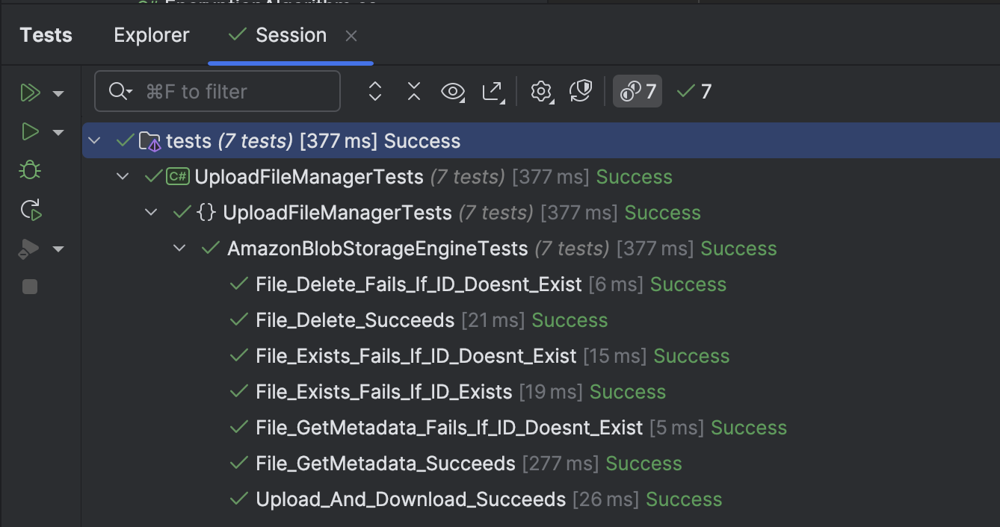

This is Part 23 of a series on Designing, Building & Packaging A Scalable, Testable .NET Open Source Component.

- [Designing, Building & Packaging A Scalable, Testable .NET Open Source Component - Part 1 - Introduction]()
- [Designing, Building & Packaging A Scalable, Testable .NET Open Source Component - Part 2 - Basic Requirements]()
- [Designing, Building & Packaging A Scalable, Testable .NET Open Source Component - Part 3 - Project Setup]()
- [Designing, Building & Packaging A Scalable, Testable .NET Open Source Component - Part 4 - Types & Contracts]()
- [Designing, Building & Packaging A Scalable, Testable .NET Open Source Component - Part 5 - Component Implementation]()
- [Designing, Building & Packaging A Scalable, Testable .NET Open Source Component - Part 6 - Mocking & Behaviour Tests]()
- [Designing, Building & Packaging A Scalable, Testable .NET Open Source Component - Part 7 - Sequence Verification With Moq]()
- [Designing, Building & Packaging A Scalable, Testable .NET Open Source Component - Part 8 - Compressor Implementation]()
- [Designing, Building & Packaging A Scalable, Testable .NET Open Source Component - Part 9 - Encryptor Implementation]()
- [Designing, Building & Packaging A Scalable, Testable .NET Open Source Component - Part 10 - In Memory Storage]()
- [Designing, Building & Packaging A Scalable, Testable .NET Open Source Component - Part 11 - SQL Server Storage]()
- [Designing, Building & Packaging A Scalable, Testable .NET Open Source Component - Part 12 - PostgreSQL Storage]()
- [Designing, Building & Packaging A Scalable, Testable .NET Open Source Component - Part 13 - Database Configuration]()
- [Designing, Building & Packaging A Scalable, Testable .NET Open Source Component - Part 14 - Virtualizing Infrastructure]()
- [Designing, Building & Packaging A Scalable, Testable .NET Open Source Component - Part 15 - Test Organization]()
- [Designing, Building & Packaging A Scalable, Testable .NET Open Source Component - Part 16 - Large File Consideration]()
- [Designing, Building & Packaging A Scalable, Testable .NET Open Source Component - Part 17 - Large File Consideration On PostgreSQL]()
- [Designing, Building & Packaging A Scalable, Testable .NET Open Source Component - Part 18 - Azure Blob Storage]()
- [Designing, Building & Packaging A Scalable, Testable .NET Open Source Component - Part 19 - Testing Azure Blob Storage Locally]()
- [Designing, Building & Packaging A Scalable, Testable .NET Open Source Component - Part 20 - Amazon S3 Storage]()
- [Designing, Building & Packaging A Scalable, Testable .NET Open Source Component - Part 21 - Testing Amazon S3 Storage Locally]()
- [Designing, Building & Packaging A Scalable, Testable .NET Open Source Component - Part 22 - Refactoring Azure Storage Engine For Initialization]()
- **Designing, Building & Packaging A Scalable, Testable .NET Open Source Component - Part 23 - Refactoring Amazon Storage Engine For Initialization (This Post)**
- [Designing, Building & Packaging A Scalable, Testable .NET Open Source Component - Part 24 - Google Cloud Storage]()

Our [last post in the series]() looked at how to refactor the `AzureBlobStorageEngine` to perform asynchronous initialization.

This post will examine the refactoring required to enable the `AmazonS3StorageEngine` to utilize asynchronous initialization.

The `constructor` for the `Amazon3StorageEngine` currently looks like this:

```c#
public AmazonS3StorageEngine(string username, string password, string amazonLocation, string dataContainerName,
    string metadataContainerName)
{
    // Configuration for the amazon s3 client
    var config = new AmazonS3Config
    {
        ServiceURL = amazonLocation,
        ForcePathStyle = true
    };

    _dataContainerName = dataContainerName;
    _metadataContainerName = metadataContainerName;
    _client = new AmazonS3Client(username, password, config);
    _utility = new TransferUtility(_client);
}
```

We then have a `InitializeAsync` method that looks like this:

```c#
public static async Task<AmazonS3StorageEngine> InitializeAsync(string username, string password,
    string amazonLocation,
    string dataContainerName,
    string metadataContainerName, CancellationToken cancellationToken = default)
{
    var engine = new AmazonS3StorageEngine(username, password, amazonLocation, dataContainerName,
        metadataContainerName);

    // Configuration for the amazon s3 client
    var config = new AmazonS3Config
    {
        ServiceURL = amazonLocation,
        ForcePathStyle = true
    };

    var client = new AmazonS3Client(username, password, config);
    // Check if the metadata bucket exists
    if (!await AmazonS3Util.DoesS3BucketExistV2Async(client, metadataContainerName))
    {
        var request = new PutBucketRequest
        {
            BucketName = metadataContainerName,
            UseClientRegion = true
        };

        await client.PutBucketAsync(request, cancellationToken);
    }

    // Check if the data bucket exists
    if (!await AmazonS3Util.DoesS3BucketExistV2Async(client, dataContainerName))
    {
        var request = new PutBucketRequest
        {
            BucketName = dataContainerName,
            UseClientRegion = true
        };

        await client.PutBucketAsync(request, cancellationToken);
    }

    return engine;
}
```

As before, our first step is to make the `constructor` **private**, so that we control the initialization of the object.

```c#
private AmazonS3StorageEngine(string username, string password, string amazonLocation, string dataContainerName,
    string metadataContainerName)
{
    // Configuration for the amazon s3 client
    var config = new AmazonS3Config
    {
        ServiceURL = amazonLocation,
        ForcePathStyle = true
    };

    _dataContainerName = dataContainerName;
    _metadataContainerName = metadataContainerName;
    _client = new AmazonS3Client(username, password, config);
    _utility = new TransferUtility(_client);
}
```

Next, we make the `InitializeAsync` static and refactor it to construct and return an `AmazonS3StorageEngine` object. We also need to pass all the parameters required to call the constructor.

```c#
public static async Task<AmazonS3StorageEngine> InitializeAsync(string username, string password,
    string amazonLocation,
    string dataContainerName,
    string metadataContainerName, CancellationToken cancellationToken = default)
{
    var engine = new AmazonS3StorageEngine(username, password, amazonLocation, dataContainerName,
        metadataContainerName);

    // Configuration for the amazon s3 client
    var config = new AmazonS3Config
    {
        ServiceURL = amazonLocation,
        ForcePathStyle = true
    };

    var client = new AmazonS3Client(username, password, config);
    // Check if the metadata bucket exists
    if (!await AmazonS3Util.DoesS3BucketExistV2Async(client, metadataContainerName))
    {
        var request = new PutBucketRequest
        {
            BucketName = metadataContainerName,
            UseClientRegion = true
        };

        await client.PutBucketAsync(request, cancellationToken);
    }

    // Check if the data bucket exists
    if (!await AmazonS3Util.DoesS3BucketExistV2Async(client, dataContainerName))
    {
        var request = new PutBucketRequest
        {
            BucketName = dataContainerName,
            UseClientRegion = true
        };

        await client.PutBucketAsync(request, cancellationToken);
    }

    return engine;
}
```

Again, we have some repetition here - we are creating another `AmazonS3Client`, but this one is **specifically to perform initialization work**, as well as its necessary configuration.

The last step is the methods that all currently call `InitializeAsync`:

```c#
/// <inheritdoc />
public async Task<FileMetadata> StoreFileAsync(FileMetadata metaData, Stream data,
    CancellationToken cancellationToken = default)
{
    // Initialize
    await InitializeAsync(cancellationToken);

    // Upload the data and the metadata in parallel
    await Task.WhenAll(
        _utility.UploadAsync(new MemoryStream(Encoding.UTF8.GetBytes(JsonSerializer.Serialize(metaData))),
            _metadataContainerName, metaData.FileId.ToString(), cancellationToken),
        _utility.UploadAsync(data, _dataContainerName, metaData.FileId.ToString(), cancellationToken)
    );
    return metaData;
}

/// <inheritdoc />
public async Task<FileMetadata> GetMetadataAsync(Guid fileId, CancellationToken cancellationToken = default)
{
    // Initialize
    await InitializeAsync(cancellationToken);

    //Verify file exists
    if (!await FileExistsAsync(fileId, _metadataContainerName, cancellationToken))
        throw new FileNotFoundException($"File {fileId} not found");

    // Create a request
    var request = new GetObjectRequest
    {
        BucketName = _metadataContainerName,
        Key = fileId.ToString()
    };

    // Retrieve the data
    using var response = await _client.GetObjectAsync(request, cancellationToken);
    await using var responseStream = response.ResponseStream;
    var memoryStream = new MemoryStream();
    await responseStream.CopyToAsync(memoryStream, cancellationToken);

    // Reset position
    memoryStream.Position = 0;
    using var reader = new StreamReader(memoryStream);
    var content = await reader.ReadToEndAsync(cancellationToken);
    return JsonSerializer.Deserialize<FileMetadata>(content) ?? throw new FileNotFoundException();
}

/// <inheritdoc />
public async Task<Stream> GetFileAsync(Guid fileId, CancellationToken cancellationToken = default)
{
    // Initialize
    await InitializeAsync(cancellationToken);

    //Verify file exists
    if (!await FileExistsAsync(fileId, _dataContainerName, cancellationToken))
        throw new FileNotFoundException($"File {fileId} not found");

    // Create a request
    var request = new GetObjectRequest
    {
        BucketName = _dataContainerName,
        Key = fileId.ToString()
    };

    // Retrieve the data
    using var response = await _client.GetObjectAsync(request, cancellationToken);
    await using var responseStream = response.ResponseStream;
    var memoryStream = new MemoryStream();
    await responseStream.CopyToAsync(memoryStream, cancellationToken);
    // Reset position
    memoryStream.Position = 0;
    return memoryStream;
}

/// <inheritdoc />
public async Task DeleteFileAsync(Guid fileId, CancellationToken cancellationToken = default)
{
    // Initialize
    await InitializeAsync(cancellationToken);

    //Verify file exists
    if (!await FileExistsAsync(fileId, _dataContainerName, cancellationToken))
        throw new FileNotFoundException($"File {fileId} not found");

    // Delete metadata and data in parallel
    await Task.WhenAll(
        _client.DeleteObjectAsync(_metadataContainerName, fileId.ToString(), cancellationToken),
        _client.DeleteObjectAsync(_dataContainerName, fileId.ToString(), cancellationToken));
}

/// <inheritdoc />
public async Task<bool> FileExistsAsync(Guid fileId, CancellationToken cancellationToken = default)
{
    // Initialize
    await InitializeAsync(cancellationToken);

    return await FileExistsAsync(fileId, _dataContainerName, cancellationToken);
}

private async Task<bool> FileExistsAsync(Guid fileId, string containerName,
    CancellationToken cancellationToken = default)
{
    try
    {
        await _client.GetObjectMetadataAsync(containerName, fileId.ToString(), cancellationToken);
        return true;
    }
    catch (AmazonS3Exception ex)
    {
        if (ex.StatusCode == HttpStatusCode.NotFound)
        {
            return false;
        }

        throw;
    }
}
```

We can **remove all those calls**, so that they now look like this:

```c#
/// <inheritdoc />
public async Task<FileMetadata> StoreFileAsync(FileMetadata metaData, Stream data,
    CancellationToken cancellationToken = default)
{
    // Upload the data and the metadata in parallel
    await Task.WhenAll(
        _utility.UploadAsync(new MemoryStream(Encoding.UTF8.GetBytes(JsonSerializer.Serialize(metaData))),
            _metadataContainerName, metaData.FileId.ToString(), cancellationToken),
        _utility.UploadAsync(data, _dataContainerName, metaData.FileId.ToString(), cancellationToken)
    );
    return metaData;
}

/// <inheritdoc />
public async Task<FileMetadata> GetMetadataAsync(Guid fileId, CancellationToken cancellationToken = default)
{
    //Verify file exists
    if (!await FileExistsAsync(fileId, _metadataContainerName, cancellationToken))
        throw new FileNotFoundException($"File {fileId} not found");

    // Create a request
    var request = new GetObjectRequest
    {
        BucketName = _metadataContainerName,
        Key = fileId.ToString()
    };

    // Retrieve the data
    using var response = await _client.GetObjectAsync(request, cancellationToken);
    await using var responseStream = response.ResponseStream;
    var memoryStream = new MemoryStream();
    await responseStream.CopyToAsync(memoryStream, cancellationToken);

    // Reset position
    memoryStream.Position = 0;
    using var reader = new StreamReader(memoryStream);
    var content = await reader.ReadToEndAsync(cancellationToken);
    return JsonSerializer.Deserialize<FileMetadata>(content) ?? throw new FileNotFoundException();
}

/// <inheritdoc />
public async Task<Stream> GetFileAsync(Guid fileId, CancellationToken cancellationToken = default)
{
    //Verify file exists
    if (!await FileExistsAsync(fileId, _dataContainerName, cancellationToken))
        throw new FileNotFoundException($"File {fileId} not found");

    // Create a request
    var request = new GetObjectRequest
    {
        BucketName = _dataContainerName,
        Key = fileId.ToString()
    };

    // Retrieve the data
    using var response = await _client.GetObjectAsync(request, cancellationToken);
    await using var responseStream = response.ResponseStream;
    var memoryStream = new MemoryStream();
    await responseStream.CopyToAsync(memoryStream, cancellationToken);
    // Reset position
    memoryStream.Position = 0;
    return memoryStream;
}

/// <inheritdoc />
public async Task DeleteFileAsync(Guid fileId, CancellationToken cancellationToken = default)
{
    //Verify file exists
    if (!await FileExistsAsync(fileId, _dataContainerName, cancellationToken))
        throw new FileNotFoundException($"File {fileId} not found");

    // Delete metadata and data in parallel
    await Task.WhenAll(
        _client.DeleteObjectAsync(_metadataContainerName, fileId.ToString(), cancellationToken),
        _client.DeleteObjectAsync(_dataContainerName, fileId.ToString(), cancellationToken));
}

/// <inheritdoc />
public async Task<bool> FileExistsAsync(Guid fileId, CancellationToken cancellationToken = default)
{
    return await FileExistsAsync(fileId, _dataContainerName, cancellationToken);
}

private async Task<bool> FileExistsAsync(Guid fileId, string containerName,
    CancellationToken cancellationToken = default)
{
    try
    {
        await _client.GetObjectMetadataAsync(containerName, fileId.ToString(), cancellationToken);
        return true;
    }
    catch (AmazonS3Exception ex)
    {
        if (ex.StatusCode == HttpStatusCode.NotFound)
        {
            return false;
        }

        throw;
    }
}
```

Again, we derive the benefit that we are sure that once we receive the created `AmazonS3StorageEngine`, it has been **correctly configured** in terms of setting up all the necessary `bucket` objects.

Our tests, we can confirm, still pass.



### TLDR

**We have refactored the `AmazonS3StorageEngine` to ensure that it is initialized correctly upon object creation.**

The code is in my [GitHub](https://github.com/conradakunga/UploadFileManager/).

Happy hacking!
