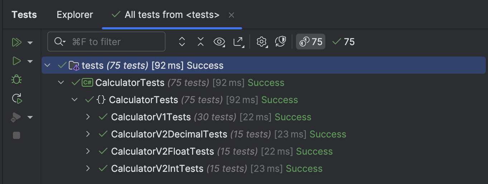

Suppose we wanted to implement a simple library that exposed the functions of a **calculator**.

You would start with an [interface](https://learn.microsoft.com/en-us/dotnet/csharp/language-reference/keywords/interface) that defines the contract, the `ICalculator`.

```c#
public interface ICalculator
{
    int Add(int a, int b);
    int Subtract(int a, int b);
    int Divide(int a, int b);
    int Multiply(int a, int b);
}
```

Next, we [implement](https://learn.microsoft.com/en-us/dotnet/csharp/programming-guide/interfaces/explicit-interface-implementation) the interface.

```c#
public sealed class Calculator : ICalculator
{
    public int Add(int a, int b)
    {
        return a + b;
    }

    public int Subtract(int a, int b)
    {
        return a - b;
    }

    public int Divide(int a, int b)
    {
        return a / b;
    }

    public int Multiply(int a, int b)
    {
        return a * b;
    }
}
```

Finally, some tests.

```c#
private readonly Calculator.Calculator _calc;

public CalculatorTests()
{
    _calc = new Calculator.Calculator();
}

[Theory]
[InlineData(0, 0, 0)]
[InlineData(1, 1, 2)]
[InlineData(-1, -1, -2)]
[InlineData(3, 1, 4)]
public void AddIntTests(decimal first, decimal second, decimal result)
{
    _calc.Add(first, second).Should().Be(result);
}

[Theory]
[InlineData(0, 0, 0)]
[InlineData(1, 1, 0)]
[InlineData(-1, -1, 0)]
[InlineData(3, -1, 4)]
public void SubtractTests(int first, int second, int result)
{
    _calc.Subtract(first, second).Should().Be(result);
}

[Theory]
[InlineData(0, 0, 0)]
[InlineData(1, 1, 1)]
[InlineData(-1, -1, 1)]
[InlineData(3, -1, -3)]
public void MultiplyTests(int first, int second, int result)
{
    _calc.Multiply(first, second).Should().Be(result);
}

[Theory]
[InlineData(1, 1, 1)]
[InlineData(-1, -1, 1)]
[InlineData(3, -1, -3)]
public void DivideTests(int first, int second, int result)
{
    _calc.Divide(first, second).Should().Be(result);
}
```

So far, so good.

But we have an immediate problem with this - our calculator can only perform operations with the `int` type.

This is especially a problem with **division**.

The solution to this is to add [overloaded](https://www.w3schools.com/cs/cs_method_overloading.php) methods to our interface that operate with the `decimal`.

```c#
public interface ICalculator
{
    // Integer operations
    int Add(int a, int b);
    int Subtract(int a, int b);
    int Divide(int a, int b);
    int Multiply(int a, int b);

    // Decimal operations
    decimal Add(decimal a, decimal b);
    decimal Subtract(decimal a, decimal b);
    decimal Divide(decimal a, decimal b);
    decimal Multiply(decimal a, decimal b);
}
```

And provide implementations of the same:

```c#
public decimal Add(decimal a, decimal b)
{
    return a + b;
}


public decimal Subtract(decimal a, decimal b)
{
    return a - b;
}


public decimal Divide(decimal a, decimal b)
{
    return a / b;
}


public decimal Multiply(decimal a, decimal b)
{
    return a * b;
}
```

But what of other types?

- `byte`
- `sbyte`
- `short`
- `ushort`
- `uint`
- `long`
- `ulong`
- `float`
- `double`

It will quickly become **tiresome to define interfaces and implementations for all of these**, especially given that the logic for all is identical.

There are a number of solutions to this problem:

1. Use [dynamic types](https://learn.microsoft.com/en-us/dotnet/csharp/advanced-topics/interop/using-type-dynamic). The problem with this solution is that you lose all the benefits of [strong typing](https://en.wikipedia.org/wiki/Strong_and_weak_typing).
2. Define the methods on a type that is a superset of the rest, perhaps the `decimal`. The problem with this solution is that all types have some **subtle and distinct differences**. For example, `float` and `double` are [approximate](https://learn.microsoft.com/en-us/dotnet/csharp/language-reference/builtin-types/floating-point-numeric-types) types.

From C# 11, there is a perfect solution to this problem: the [generic math](https://learn.microsoft.com/en-us/dotnet/standard/generics/math) interface, and in particular, the [INumber](https://learn.microsoft.com/en-us/dotnet/api/system.numerics.inumber-1?view=net-9.0) interface.

Some **refactoring** was performed on the basic types to enable them to implement several generic interfaces.

We can start by rewriting our `ICalculator` interface as follows:

```c#
public interface ICalculator<T> where T : INumber<T>
{
    T Add(T a, T b);
    T Subtract(T a, T b);
    T Divide(T a, T b);
    T Multiply(T a, T b);
}
```

Note that our generic constraint states that this code should only work with types that implement the gereric `INumber<T>` interface.

Our calculator itself would be implemented as follows:

```c#
public sealed class Calculator<T> : ICalculator<T> where T : INumber<T>
{
    public T Add(T a, T b)
    {
        return a + b;
    }

    public T Subtract(T a, T b)
    {
        return a - b;
    }

    public T Divide(T a, T b)
    {
        return a / b;
    }

    public T Multiply(T a, T b)
    {
        return a * b;
    }
}
```

Note that **the logic is the same, regardless of the type**.

So, **how** do we use this?

We declare the type when **constructing** the calculator.

For example, to create a `decimal` calculator, we do it as follows:

```c#
var calc = new Calculator<decimal>();
```

You can see this in action in the tests:

```c#
[Theory]
[InlineData(0, 0, 0)]
[InlineData(1, 1, 2)]
[InlineData(-1, -1, -2)]
[InlineData(3, 1, 4)]
public void AddTests(decimal first, decimal second, decimal result)
{
    _calc.Add(first, second).Should().Be(result);
}
```

Thus, the `INumber<T>` generic interface is a powerful and flexible way to implement additional logic that supplements the already available functionality in the base numeric types.

Our tests should pass after running.



The same technique can be used to provide implementations of **overloads** for [operators](https://www.w3schools.com/cs/cs_operators.php).

### TLDR

**The `INumber<T>` generic interface makes it much simpler to implement logic targeting base numeric types.**

The code is in my [GitHub](https://github.com/conradakunga/BlogCode/tree/master/2025-06-02-%20Generic%20Math).

Happy hacking!
