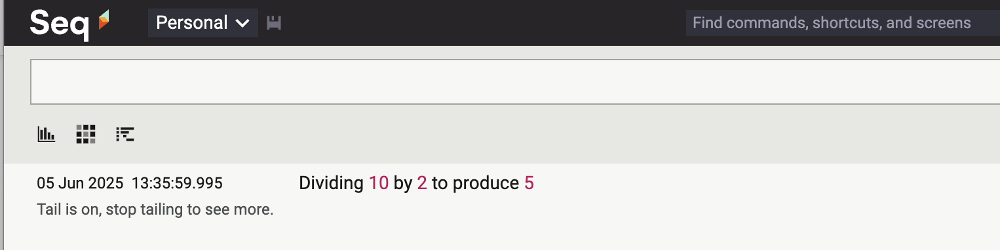
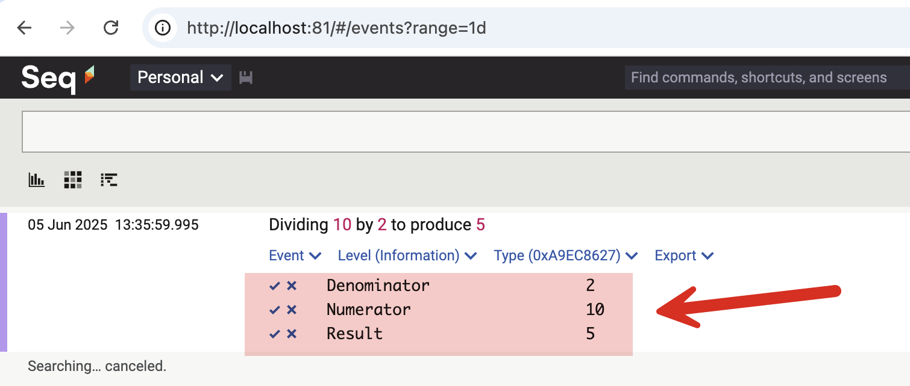
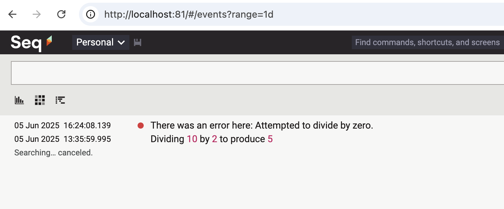
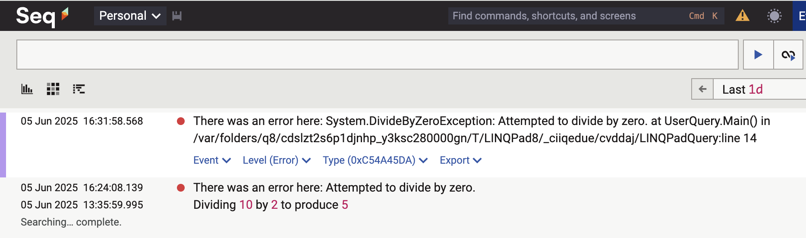
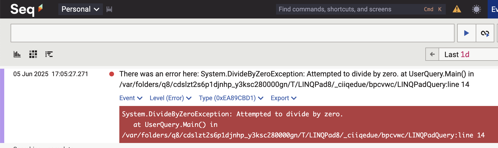
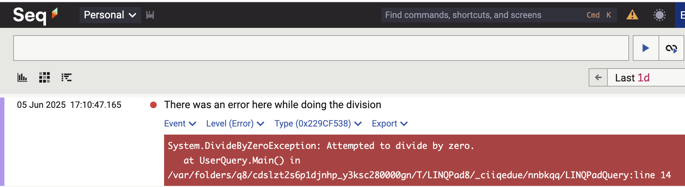

If you are not using [structured logging](https://sematext.com/glossary/structured-logging/), you absolutely should.

My tool of choice is [Serilog](https://serilog.net/) as the logging library, [Seq](https://datalust.co/seq) as the storage engine in development, and [ElasticSearch](https://www.elastic.co/elasticsearch) / [Kibana](https://www.elastic.co/kibana) as the storage engine in production.

Serilog operates with the concept of [Sinks](https://github.com/serilog/serilog/wiki/provided-sinks) - where to write the data to.

To write the data to `Seq`, install the following package:

```bash
dotnet add package Serilog.Sinks.Seq
```

To write data to `ElasticSearch`, install the following package:

```bash
dotnet add package Elastic.Serilog.Sinks
```

Seq, the application that actually receives and stores the logs, is best deployed as a [docker](https://www.docker.com/) container.

You can either use the command like like so:

```bash
docker run --name seq -d --restart unless-stopped -e ACCEPT_EULA=Y -p 5341:81 datalust/seq
```

Or you can use the following [docker-compose.yaml](https://docs.divio.com/reference/docker-docker-compose/) file

```yaml
services:
  seq:
    image: datalust/seq:preview
    container_name: seq
    restart: unless-stopped
    environment:
      - ACCEPT_EULA=Y
      - TZ=Africa/Nairobi
    ports:
      - 81:80
      - 5341:5341      
```

For this post, I will use `Seq` but the same principle applies to `ElasticSearch`.

In your code you would then write your code as follows:

```c#
// Configure logging to Seq
Log.Logger = new LoggerConfiguration()
  .WriteTo.Seq("http://localhost:5341")
  .CreateLogger();

var a = 10;
var b = 2;

// Write logs to Seq
var result = a / b;
Log.Information("Dividing {Numerator} by {Denominator} to produce {Result}", a, b, result);
Console.WriteLine($"The result is {result}");
```

You can then navigate to Seq on http://localhost:81/ to view the logs:



The **value** of structured logging becomes apparent when you expand this:



A common issue is how to log exceptions.

If new to `Serilog` and structured logging, you would probably do this:

```c#
// Configure logging to Seq
Log.Logger = new LoggerConfiguration()
  .WriteTo.Seq("http://localhost:5341")
  .CreateLogger();

var a = 10;
var b = 0;

try
{
  // Write logs to Seq
  var result = a / b;
  Log.Information("Dividing {Numerator} by {Denominator} to produce {Result}", a, b, result);
  Console.WriteLine($"The result is {result}");
}
catch (Exception ex)
{
  Log.Error($"There was an error here: {ex.Message}");
}
```

This will log as follows:



Much as this has captured that it is an exception, this is not complete as it loses a lot of context around the error, including the stack-trace, location, etc.

You might be tempted to do this:

`````c#
try
{
  // Write logs to Seq
  var result = a / b;
  Log.Information("Dividing {Numerator} by {Denominator} to produce {Result}", a, b, result);
  Console.WriteLine($"The result is {result}");
}
catch (Exception ex)
{
	Log.Error($"There was an error here: {ex}");
}
`````

Which is to log the exception message - ToString() will be called here.

This will result in the following being logged:



Much as the stack trace is kinda there, this is done wrong.

The proper way to log is to use the overload that allows you to pass the exception.

```c#
Log.Error(ex, "Your error message");
```

Often (and I have been a culprit of this) you will write (or read) code like this:

```c#
try
{
  // Write logs to Seq
  var result = a / b;
  Log.Information("Dividing {Numerator} by {Denominator} to produce {Result}", a, b, result);
  Console.WriteLine($"The result is {result}");
}
catch (Exception ex)
{
	Log.Error(ex, $"There was an error here: {ex}");
}
```

This will log the following:



You can see here that the bottom section has the stack trace details in red. But **we are repeating the stack trace in the error message**.

Thus instead of doing this:

```c#
catch (Exception ex)
{
	Log.Error(ex, $"There was an error here: {ex}");
}
```

We should do this:

```c#
catch (Exception ex)
{
	Log.Error(ex, $"There was an error here while doing the division");
}
```

What is the difference? **We are not repeating the stack trace, and are providing searchable context to the error message**.

This will look like this:



Context here would generally be **what was being carried out  when the exception was raised**.

There is **no value in duplicating the exception details** - those are already logged together with the actual exception.

### TLDR

**It is noisy repeating the exception details in the error message. Log the exception, and pass meaningful context.**

Happy hacking!
