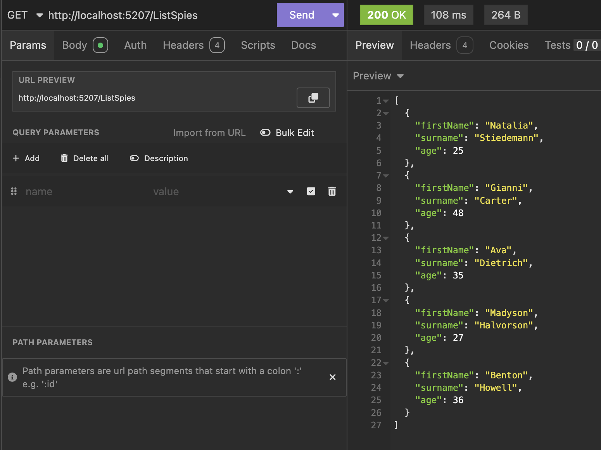

A very common use case when consuming APIs is [deserializing](https://developer.mozilla.org/en-US/docs/Glossary/Deserialization) [JSON](https://www.json.org/json-en.html) into objects.

Let us take our favourite type, the `Spy`.

Let us create a class library to contain this:

```bash
dotnet new classlib -o SpyLogic
```

Within this we create a class with our type.

```c#
public sealed record Spy
{
    public required string FirstName { get; init; }
    public required string Surname { get; init; }
    public required byte Age { get; init; }
}
```

Next are going to build a simple API that returns 5 `Spy` objects.

```bash
dotnet new web -o SpyServer
```

Next, within the current folder, we create a solution file.

```bash
dotnet new sln
```

We then add the two projects to this solution.

```bash
dotnet sln add SpyServer/
dotnet sln add SpyLogic/
```

Next, we navigate to the `SpyServer` folder.

```bash
cd SpyServer
```

From this folder, we add a project reference to the `SpyLogic` project

```bash
dotnet add Reference ../SpyLogic/
```

Next we add the [Bogus](https://github.com/bchavez/Bogus) library to generate our data.

```bash
dotnet add package Bogus
```

Finally, we write our endpoint.

```c#
using Bogus;
using SpyLogic;

var builder = WebApplication.CreateBuilder(args);
var app = builder.Build();

app.MapGet("/ListSpies", () =>
{
    // Create and configure our faker
    var spyFaker = new Faker<Spy>();
    spyFaker.RuleFor(x => x.FirstName, (faker) => faker.Name.FirstName());
    spyFaker.RuleFor(x => x.Surname, (faker) => faker.Name.LastName());
    spyFaker.RuleFor(x => x.Age, (faker) => faker.Random.Byte(25, 50));

    // Generate a list of 5 spies
    return spyFaker.Generate(5);
});

app.Run();
```

We can test this using [Insomnia](https://insomnia.rest/), or your favourite `http` client.



Next, from the root folder, we create  a console application.

```bash
dotnet new console -o SpyClient
```

From inside this new folder, we add a reference to the `SpyLogic` project

```bash
dotnet add Reference ../SpyLogic/
```

Finally, we write a simple client to retrieve and display these `Spy` objects.

There are 3 ways to achieve this using the [HttpClient](https://learn.microsoft.com/en-us/dotnet/api/system.net.http.httpclient?view=net-9.0) object

1. [GetStringAsync](https://learn.microsoft.com/en-us/dotnet/api/system.net.http.httpclient.getstringasync?view=net-9.0) (or [GetStreamAsync](https://learn.microsoft.com/en-us/dotnet/api/system.net.http.httpclient.getstreamasync?view=net-9.0), which is very similar)
2. [GetFromJsonAsync](https://learn.microsoft.com/en-us/dotnet/api/system.net.http.json.httpclientjsonextensions.getfromjsonasync?view=net-9.0)
3. [GetAsync](https://learn.microsoft.com/en-us/dotnet/api/system.net.http.httpclient.getasync?view=net-9.0)

### GetStringAsync

This method requires you to do the following

1. Make a **request**
2. Capture the `string` **response**
3. Create an instance of [JsonSerializerOptions](https://learn.microsoft.com/en-us/dotnet/api/system.text.json.jsonserializeroptions?view=net-9.0) for [web](https://learn.microsoft.com/en-us/dotnet/api/system.text.json.jsonserializeroptions.web?view=net-9.0)
4. [Deserialize](https://learn.microsoft.com/en-us/dotnet/standard/serialization/system-text-json/deserialization) the response

```c#
// Fetch a response from the end point
var response = await client.GetStringAsync("http://localhost:5207/ListSpies");
// Configure our json serializer
var options = JsonSerializerOptions.Web;
// Deserialize the response
var spies = JsonSerializer.Deserialize<Spy[]>(response, options);
foreach (var spy in spies)
{
    Console.WriteLine($"Firstname: {spy.FirstName}, Surname: {spy.Surname}, Age: {spy.Age}");
}
```

If we run it, we should get the following:

```plaintext
Firstname: Cloyd, Surname: Fahey, Age: 30
Firstname: Cathy, Surname: Waelchi, Age: 47
Firstname: Reba, Surname: Kohler, Age: 36
Firstname: Kevon, Surname: Willms, Age: 44
Firstname: Maci, Surname: Fadel, Age: 27
```

Which looks ok.

### GetFromJsonAsync

This is the second, and **preferred** way to achieve this.

Rather than doing all the ground work above, you write a single line:

```c#
// Fetch and deserialize spies
var spies = await client.GetFromJsonAsync<Spy[]>("http://localhost:5207/ListSpies");
foreach (var spy in spies)
{
    Console.WriteLine($"Firstname: {spy.FirstName}, Surname: {spy.Surname}, Age: {spy.Age}");
}
```

This is much simpler.

### GetAsync

This is the third, and lowest level technique.

```c#
// Fetch a response from the end point
HttpResponseMessage response = await client.GetAsync("http://localhost:5207/ListSpies");
// Fetch the actual response content
var responseString = await response.Content.ReadAsStringAsync();
// Configure our json serializer
var options = JsonSerializerOptions.Web;
// Deserialize the response
var spies = JsonSerializer.Deserialize<Spy[]>(responseString, options);
foreach (var spy in spies)
{
    Console.WriteLine($"Firstname: {spy.FirstName}, Surname: {spy.Surname}, Age: {spy.Age}");
}

```

Unlike the previous approaches, you have to do a lot of the **heavy lifting yourself**.

1. Retrieve a [HttpResponseMessage](https://learn.microsoft.com/en-us/dotnet/api/system.net.http.httpresponsemessage?view=net-9.0) from the request
2. Read the response **content** into a `string`
3. Setup [JsonSerializerOptions](https://learn.microsoft.com/en-us/dotnet/api/system.text.json.jsonserializeroptions?view=net-9.0)
4. Deserialize

So those are the three options.

The differences come into play **when there is a problem on the server**.

Let us introduce a second endpoint that does just that:

```c#
app.MapGet("/ListSpiesError", () => { throw new DivideByZeroException(); });
```

We then update our client to call this endpoint for each of the 3 techniques.

```c#
var response = await client.GetStringAsync("http://localhost:5207/listSpiesError");
var spies = await client.GetFromJsonAsync<Spy[]>("http://localhost:5207/listSpiesError");
var response = await client.GetFromJsonAsync<Spy[]>("http://localhost:5207/listSpiesError");
```

The results will be as follows:

### GetStringAsync

This will return the following, an [exception](https://learn.microsoft.com/en-us/dotnet/api/system.exception?view=net-9.0).

```plaintext
/Users/rad/Projects/blog/BlogCode/ObjectDeserialization/SpyClient/bin/Debug/net9.0/SpyClient
Unhandled exception. System.Net.Http.HttpRequestException: Response status code does not indicate success: 500 (Internal Server Error).
   at System.Net.Http.HttpResponseMessage.EnsureSuccessStatusCode()
   at System.Net.Http.HttpClient.GetStringAsyncCore(HttpRequestMessage request, CancellationToken cancellationToken)
   at Program.<Main>$(String[] args) in /Users/rad/Projects/blog/BlogCode/ObjectDeserialization/SpyClient/Program.cs:line 11
   at Program.<Main>(String[] args)

Process finished with exit code 134.

```

The `HttpClient` will throw an exception for every response that is not a [Success](https://learn.microsoft.com/en-us/dotnet/api/system.net.http.httpresponsemessage.ensuresuccessstatuscode?view=net-9.0) response, i.e. in the 2xx range.

We can address this by wrapping the code in a [try-catch-block](https://learn.microsoft.com/en-us/dotnet/csharp/language-reference/statements/exception-handling-statements).

```c#
try
{
    // Fetch a response from the end point
    var response = await client.GetStringAsync(url);
    // Configure our json serializer
    var options = JsonSerializerOptions.Web;
    // Deserialize the response
    var spies = JsonSerializer.Deserialize<Spy[]>(response, options);
    foreach (var spy in spies)
    {
        Console.WriteLine($"Firstname: {spy.FirstName}, Surname: {spy.Surname}, Age: {spy.Age}");
    }
}
catch (Exception ex)
{
    Console.WriteLine($"There was an error: {ex.Message}");
}
```

If we run this, we can capture the exception and react.

```plaintext
There was an error: Response status code does not indicate success: 500 (Internal Server Error).
```

### GetFromJsonAsync

Just like before, this code also throws an `exception`, for **non success status codes**.

```plaintext
Unhandled exception. System.Net.Http.HttpRequestException: Response status code does not indicate success: 500 (Internal Server Error).
   at System.Net.Http.HttpResponseMessage.EnsureSuccessStatusCode()
   at System.Net.Http.Json.HttpClientJsonExtensions.<FromJsonAsyncCore>g__Core|12_0[TValue,TJsonOptions](HttpClient client, Task`1 responseTask, Boolean usingResponseHeadersRead, CancellationTokenSource linkedCTS, Func`4 deserializeMethod, TJsonOptions jsonOptions, CancellationToken cancellationToken)
   at Program.<Main>$(String[] args) in /Users/rad/Projects/blog/BlogCode/ObjectDeserialization/SpyClient/Program.cs:line 29
   at Program.<Main>(String[] args)
```

And, just like before, we can address this with a **try-catch block**.

```c#
try
{
    // Fetch and deserialize spies
    var spies = await client.GetFromJsonAsync<Spy[]>(url);
    foreach (var spy in spies)
    {
        Console.WriteLine($"Firstname: {spy.FirstName}, Surname: {spy.Surname}, Age: {spy.Age}");
    }
}
catch (Exception ex)
{
    Console.WriteLine($"There was an error: {ex.Message}");
}
```

### GetAsync

This one is the most [interesting](https://learn.microsoft.com/en-us/dotnet/csharp/language-reference/statements/exception-handling-statements).

The following `exception` is thrown:

```c#
Unhandled exception. System.Text.Json.JsonException: The JSON value could not be converted to SpyLogic.Spy[]. Path: $ | LineNumber: 0 | BytePositionInLine: 50.
   at System.Text.Json.ThrowHelper.ThrowJsonException_DeserializeUnableToConvertValue(Type propertyType)
   at System.Text.Json.Serialization.JsonCollectionConverter`2.OnTryRead(Utf8JsonReader& reader, Type typeToConvert, JsonSerializerOptions options, ReadStack& state, TCollection& value)
   at System.Text.Json.Serialization.JsonConverter`1.TryRead(Utf8JsonReader& reader, Type typeToConvert, JsonSerializerOptions options, ReadStack& state, T& value, Boolean& isPopulatedValue)
   at System.Text.Json.Serialization.JsonConverter`1.ReadCore(Utf8JsonReader& reader, T& value, JsonSerializerOptions options, ReadStack& state)
   at System.Text.Json.Serialization.Metadata.JsonTypeInfo`1.Deserialize(Utf8JsonReader& reader, ReadStack& state)
   at System.Text.Json.JsonSerializer.ReadFromSpan[TValue](ReadOnlySpan`1 utf8Json, JsonTypeInfo`1 jsonTypeInfo, Nullable`1 actualByteCount)
   at System.Text.Json.JsonSerializer.ReadFromSpan[TValue](ReadOnlySpan`1 json, JsonTypeInfo`1 jsonTypeInfo)
   at Program.<Main>$(String[] args) in /Users/rad/Projects/blog/BlogCode/ObjectDeserialization/SpyClient/Program.cs:line 53
   at Program.<Main>(String[] args)

Process finished with exit code 134.
```

This is because the client code is **attempting to serialize whatever came back from the server**.  The `HttpClient` **did not throw an exception despite the fact that the response was a [500 server error](https://developer.mozilla.org/en-US/docs/Web/HTTP/Reference/Status/500)**.

You have two options:

1. Tell the `HttpClient` to **throw an exception** if a non-success response returns.
2. **Check** the status yourself

You configure the `request` as follows:

```c#
HttpResponseMessage response = await client.GetAsync("http://localhost:5207/ListSpiesError");
response.EnsureSuccessStatusCode();
```

The more flexible option is to **check yourself,** and write code accordingly for the **success** and **failure** branches.

```c#
// Fetch a response from the end point
HttpResponseMessage response = await client.GetAsync("http://localhost:5207/ListSpiesError");
// Check if the response was a success
if (response.IsSuccessStatusCode)
{
    // Fetch the actual response
    var responseString = await response.Content.ReadAsStringAsync();
    // Configure our json serializer
    var options = JsonSerializerOptions.Web;
    // Deserialize the response
    var spies = JsonSerializer.Deserialize<Spy[]>(responseString, options);
    foreach (var spy in spies)
    {
        Console.WriteLine($"Firstname: {spy.FirstName}, Surname: {spy.Surname}, Age: {spy.Age}");
    }
}
else
{
    // Fetch the actual problem
    var problemString = await response.Content.ReadAsStringAsync();
    Console.WriteLine($"Received unsuccessful status code: {response.StatusCode}, the issue being {problemString}");
}
```

The magic is happening here

```c#
response.IsSuccessStatusCode
```

This allows us to write code for the two branches for our logic - success and failure.

You can be even more flexible as you have very granular control as you can write code to cater for whatever status codes you are expecting.

```c#
// Fetch a response from the end point
HttpResponseMessage response = await client.GetAsync("http://localhost:5207/ListSpiesError");
// Check if the response was a success
switch (response.StatusCode)
{
    case HttpStatusCode.OK:
        // Fetch the actual response
        var responseString = await response.Content.ReadAsStringAsync();
        // Configure our json serializer
        var options = JsonSerializerOptions.Web;
        // Deserialize the response
        var spies = JsonSerializer.Deserialize<Spy[]>(responseString, options);
        foreach (var spy in spies)
        {
            Console.WriteLine($"Firstname: {spy.FirstName}, Surname: {spy.Surname}, Age: {spy.Age}");
        }

        break;
    case HttpStatusCode.InternalServerError:
        // Fetch the actual problem
        var problemString = await response.Content.ReadAsStringAsync();
        Console.WriteLine(
            $"There was an error on the server, the issue being {problemString}");
        break;

    // Add more status codes and their processing blocks here
    default:
        Console.WriteLine(
            $"Received status code: {response.StatusCode}");
        break;
}
```

Thus we can see that `GetAsync` is not only the most **flexible**, it has the additional bonus that it allows you to **access and read the response body**, regardless if the response was a success or a failure. In the case of a failure, **the error details would probably be in the body and thus it is useful to be able to read the content and display the error details to the users**. 

**This is not possible with `GetFromJsonAsync` and `GetFromStringAsync`**

### TLDR

**When fetching `JSON` for the server, use `GetFromJsonAsync` for the most part. If you need more flexibility such as reacting to different error codes or you want to be able to access the body even when the request failed, use `GetAsync`.**

The code is in my GitHub.

Happy hacking!
