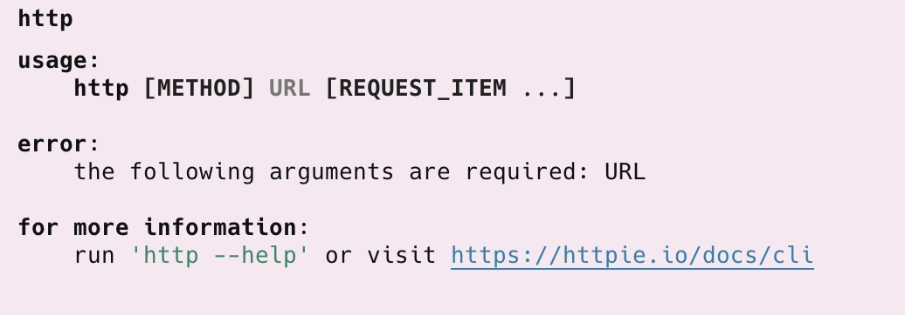

Recently, I upgraded my [Homebrew](https://brew.sh/) installation of [Httpie](https://httpie.io/).

I began to get the following error:

```plaintext
zsh: command not found: http
```

I tried the usual technique of **uninstalling** and **reinstalling**.

```bash
brew uninstall httpie
```

And then:

```bash
brew install httpie
```

But this did not work either.

Same error.

The solution is to **re-link**.

```bash
brew link httpie
```

This will print the following:

```plaintext
Linking /opt/homebrew/Cellar/httpie/3.2.4_2... 8 symlinks created
```

If we now try the command:



### TLDR

**Re-linking can be used to fix some Homebrew issues.**

Happy hacking! 
