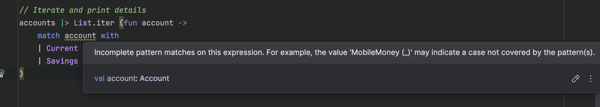

Suppose we wish to model the following in F#:

1. A `CurrentAccount` - this has:
    1. Account number
    2. Balance
2. A `SavingsAccount` - this has:
    1. Account number
    2. Balance
    3. InterestRate
    4. Minimum Balance
3. A `MobileMoneyAccount` - this has:
    1. Mobile number
    2. Balance

We would do it as follows:

```F#
type CurrentAccount = {
    AccountNumber: string
    Balance: decimal
}

type SavingsAccount = {
    AccountNumber: string
    Balance: decimal
    InterestRate: decimal
    MinimumBalance: decimal
}

type MobileMoneyAccount = {
    MobilePhoneNumber: string
    Balance: decimal
}
```

Let us then proceed to create a collection of our **accounts**:

```F#
let accounts = [myCurrentAccount, mySavingsAccount, myMobileMoneyAccount]
```

Now comes the problem - **iterate through each of the accounts and print their details.**

Two solutions present themselves:

1. Treat each element as an `object` and cast repeatedly until you get the right type.
2. Introduce a base `interface`, and cast to this.

There is a third, more natural, and elegant solution, courtesy of [functional programming](https://www.geeksforgeeks.org/functional-programming-paradigm/): discriminated unions.

The premise is as follows:

1. `MobileMoneyAccount`, `SavingsAccount`, and `CurrentAccount` are ultimately types of `Account`.
2. An `Account` can thus be defined as **either** of these.
3. The types that an `Account` can contain **do not have to have anything in common**, unlike [inheritance.](https://en.wikipedia.org/wiki/Inheritance_(object-oriented_programming))

We define it as follows:

```F#
type Account =
    | Current of CurrentAccount
    | Savings of SavingsAccount
    | MobileMoney of MobileMoneyAccount
```

We are saying that **either** of these can represent an `Account`.

And, since they do not need to have anything in common, we can **safely** do this (if we wanted to).

```F#
type Account =
    | Current of CurrentAccount
    | Savings of SavingsAccount
    | MobileMoney of MobileMoneyAccount
    | Number of string
    | PIN of int
```

But back to our original solution:

```F#
type Account =
    | Current of CurrentAccount
    | Savings of SavingsAccount
    | MobileMoney of MobileMoneyAccount
```

We then define a list of Account, populating it with our accounts:

```F#
// Create a list of Account
let accounts : Account list = [
    Current myCurrentAccount
    Savings mySavingsAccount
    MobileMoney myMobileMoneyAccount
]
```

If we needed to iterate through our collection, we can now safely do so and use **pattern matching** (via `match`) to execute our logic conditionally:

```F#
// Iterate and print details
accounts |> List.iter (fun account ->
    match account with
    | Current acc -> printfn "Current Account: %s, Balance: %s" acc.AccountNumber (acc.Balance.ToString("#,0"))
    | Savings acc -> printfn "Savings Account: %s, Rate: %M%%, Balance: %s" acc.AccountNumber acc.InterestRate (acc.Balance.ToString("#,0"))
    | MobileMoney acc -> printfn "Mobile Money Account: Phone Number: %s, Balance: %s" acc.MobilePhoneNumber (acc.Balance.ToString("#,0"))
)
```

This will print the following:

```plaintext
Current Account: 23423434, Balance: 10,000
Savings Account: 23424234234, Rate: 10%, Balance: 10,000
Mobile Money Account: Phone Number: +257721212313, Balance: 10,000
```

Note that in the code, the [match](https://learn.microsoft.com/en-us/dotnet/fsharp/language-reference/match-expressions) forces you to handle each of the possible options.

If we try to delete the code handling `MobileMoneyAccount`, the compiler will complain:



This means **you must provide logic for all branches**, eliminating a whole swathe of **logic errors**.

### TLDR

**Discriminated unions allow you to write code that allows you to define complex types that can be made up of alternative types.**

The code is in my GitHub.

Happy hacking!
