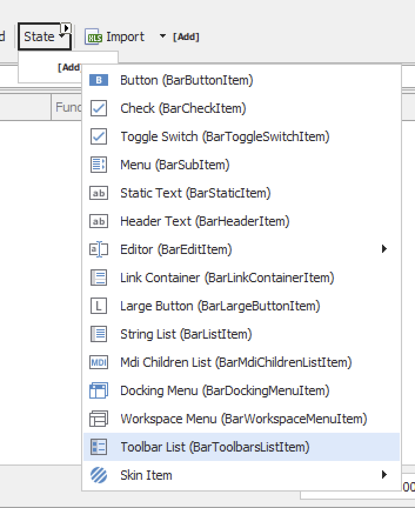

[DevExpress](https://www.devexpress.com/) exposes its UI elements (buttons, menus, etc.) using the [XtraBars](https://docs.devexpress.com/WindowsForms/DevExpress.XtraBars) library.

Menus in particular are a complex issue because menus can contain any of the following items:



Many of these elements are **top-level** containers, like the `Button` ([BarButtonItem](https://docs.devexpress.com/WindowsForms/DevExpress.XtraBars.BarButtonItem)) or the `StaticText` ([BarStaticItem](https://docs.devexpress.com/WindowsForms/DevExpress.XtraBars.BarStaticItem)).

Some can be elements containing other items, for example, the `Menu` ([BarSubItem](https://docs.devexpress.com/WindowsForms/DevExpress.XtraBars.BarSubItem)), which in turn can contain any of the pictured elements.


If you have (programmatically or otherwise) added elements to a menu, you might need to `iterate` through the elements and perform some logic.

This can get quite tricky because the object mode is not what you would expect.

First of all, you need to know if the item you want to iterate through is a top-level container. 

For example, this menu is populated at runtime with elements, and we want to **iterate** through each of these menu items and remove their **handler**.


The items in a top-level container (like a menu) are stored in a collection called the [BarItemLinkCollection](https://docs.devexpress.com/WindowsForms/DevExpress.XtraBars.BarItemLinkCollection) in a property called [ItemLinks.](https://docs.devexpress.com/WindowsForms/DevExpress.XtraBars.BarCustomContainerItem.ItemLinks)

We thus loop through them like this in VB.NET:

```vb
  For Each link As BarItemLink In mnuState.ItemLinks
      'Your code here
  Next
```

This is the equivalent code in C#:

```c#
foreach (BarItemLink link in mnuState.ItemLinks)
{
    // Your code here
}
```

You still need to do a bit of work here, because the `link` variable here is of type [BarItemLink](https://docs.devexpress.com/WindowsForms/DevExpress.XtraBars.BarItemLink).

This means you need to cast it to what you are expecting (or check at runtime first).

Given that I am expecting this to be a `BarButtonItem`, I will need to cast the `link` object.

Here is the code in VB.NET:

```vb
For Each link As BarItemLink In mnuState.ItemLinks
	RemoveHandler DirectCast(link.Item, BarButtonItem).ItemClick, AddressOf MyHandlerHere
Next
```

And the equivalent in C#:

```c#
foreach (BarItemLink link in mnuState.ItemLinks)
{
    if (link.Item is BarButtonItem barButton)
    {
        barButton.ItemClick -= MyHandlerHere;
    }
}
```

### TLDR

**Iteration through DevExpress `XtraBar` elements requires knowledge of the underlying object model.**

Happy hacking!
