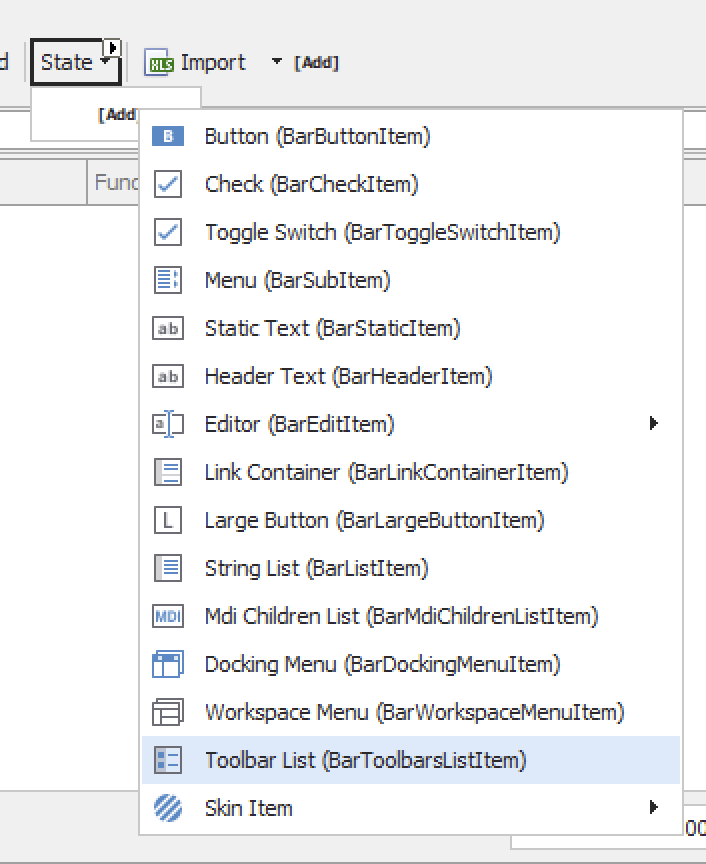

[DevExpress](https://www.devexpress.com/) exposes its UI elements (buttons, menus, etc.) using the [XtraBars](https://docs.devexpress.com/WindowsForms/DevExpress.XtraBars) library.

In the previous post, [Looping Through DevExpress Menu Bar Menu Items](), we talked about how to loop through the elements of a menu.

In this post, we will discuss how to add menu items to a menu **programmatically**.

To recap, a menu can contain any of the following items:



Typically, what you would add is a normal menu item, specifically a [BarButtonItem](https://docs.devexpress.com/WindowsForms/DevExpress.XtraBars.BarButtonItem).

Let us start with a collection of the menu item elements we wish to add.

Here is the code in VB.NET

```vb
Dim menuItems as String() = {"File", "Edit", "Tools", "Help"}
```

And the same in C#

```c#
string[] menuItems = ["File", "Edit", "Tools", "Help"];
```

We then loop through the collection and create our `BarButtonItems`

Here is the code in VB.NET

```vb
For Each item In menuItems
  Dim barItem = New BarButtonItem(bm, item)
  mnuState.AddItem(barItem)
Next
```

And the equivalent in C#

```c#
foreach (var item in menuItems)
{
  var barItem = new BarButtonItem(bm, item);
  mnuState.AddItem(barItem);
}
```

This takes care of the UI elements, but the menus currently **do nothing**.

We need to add **handlers** that will process the actual logic.

A good idea is to store some **custom information** in the newly created `BarButtonItem` that we can access later to assist in our logic. A good place to store this is in the Tag property of the newly created menu item.

Here is the final code in VB.NET

```vb
For Each item In menuItems
  Dim barItem = New BarButtonItem(bm, item)
  'Store the item string in the tag, that we can access later
  barItem.Tag = item
  mnuState.AddItem(barItem)
  AddHandler barItem.ItemClick, AddressOf MyHandlerHere
Next
```

And the same in C#

```c#
foreach (var item in menuItems)
{
  var barItem = new BarButtonItem(bm, item);
  // Store the item for later use
  barItem.Tag = item; 
  mnuState.AddItem(barItem);
  barItem.ItemClick += MyHandlerHere;
}
```

### TLDR

**Using the DevExpress library, you can programmatically create menu items and assign them handlers at runtime.**

Happy hacking!
